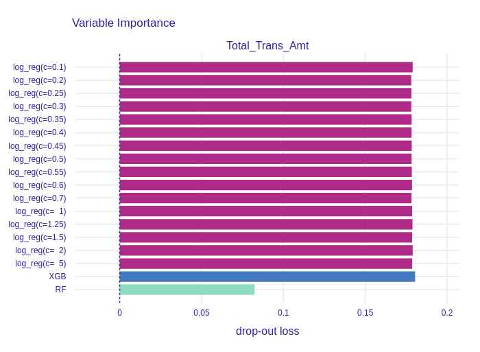
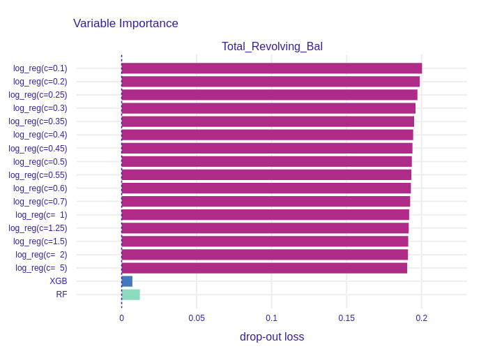
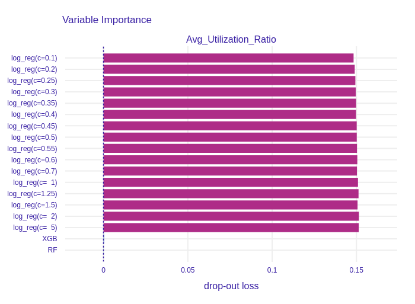

---
output:
  pdf_document: default
  html_document: default
---

## Explaining Credit Card Customers churns{#xai1-explainable-cards}

*Authors: Katarzyna Solawa, Przemysław Chojecki, Bartosz Sawicki (Warsaw University of Technology)*

### Global explanations

In this section we describe our discoveries made by using explenatory methods globally.

#### Permutational Feature Importance

We calculated permutational feature importance for XGBoost model, Random Forest model and a group of logistic regression models. The regression models were created with L1 regularization and different `C` coefficient was applied among the group. This coefficient is an inverse of a penalty term in L1 regularization, which means the smaller it is, the more weights shrinkage we expect. We examined if such shrinkage is noticeable in Permutational Feature Importance method. Then, we compared PFI obtained from different models.

##### Logistic Regression Models

```{r pfi-log-reg-total-ct-chng, out.width="700", fig.align="center", echo=FALSE, fig.cap='Permutational Feature Impotance of `Total_Ct_Chng_Q4_Q1` for the group of logistic regression models'}

knitr::include_graphics('images/1-1-pfi-log-reg-group-total-ct-chng.png')
```

The variable with the highest (among the group of logistic regressions) drop-out loss is shown in \@ref(fig:pfi-log-reg-total-ct-chng). The drop-out increases with the increase of `C` coefficient. The feature is more important for models with low regularization parameter, therefore it was shrinked by the Lasso.

```{r pfi-log-reg-total-bal, out.width="700", fig.align="center", echo=FALSE, fig.cap='Permutational Feature Impotance of `Total_Revolving_Bal` for the group of logistic regression models'}

knitr::include_graphics('images/1-1-pfi-log-reg-group-total-revolving-bal.png')
```

\@ref(fig:pfi-log-reg-total-bal) presents a variable importance plot of `Total_Revolving_Bal` feature, which has the second highest drop-out loss. It was not regularized, because drop-out loss decreases with the increase of `C`. It is the only column, which has this property.

```{r pfi-log-reg-gender, out.width="700", fig.align="center", echo=FALSE, fig.cap='Permutational Feature Impotance of `Gender` for the group of logistic regression models'}

knitr::include_graphics('images/1-1-pfi-log-reg-group-gender.png')
```

```{r pfi-log-reg-utilization, out.width="700", fig.align="center", echo=FALSE, fig.cap='Permutational Feature Impotance of `Avg_Utilization_Ratio` for the group of logistic regression models'}

knitr::include_graphics('images/1-1-pfi-log-reg-group-utilization.png')
```

On the other plots, such as \@ref(fig:pfi-log-reg-gender) and \@ref(fig:pfi-log-reg-utilization), the shrinkage made by L1 regularization is clearly visable. Models with high regularization parameter, and accordingly low `C` parameter, have smaller drop-out losses, which indicates lower importance of features.

Drop-out loss increases proportionally to `C` parameter in nearly all of 21 columns. This shows that the effects of Lasso regularization can be observed in variable importance plots of logistic regression models.

##### XGBoost and Random Forest models

In \@ref(fig:pfi-xgb-rf) we can observe that the most important column for both models is `Total_Trans_Amt`. This outcome can be logically explained: customers who do not use their credit card to execute many valuable transactions probably do not need that service, consequently resign. However, the drop-out loss for that column for the XGBoost is over 2 times higher than for the Random Forest, which means that the prior model bases its prediction on this column more than the latter model. Furthermore, more features are important for the XGBoost than for the Random Forest. We suppose this is a result of the models different training processes. New iterations (trees) in XGB are based on observations that were previously predicted incorrectly, thus new columns are taken into consideration to represent the differences between the observations. On the other hand, the Random Forest model selects the subset of the features randomly in each tree.

```{r pfi-xgb-rf, out.width="700", fig.align="center", echo=FALSE, fig.cap='Top 9 most important features in XGBoost and RandomForest feature importance comparison'}

knitr::include_graphics('images/1-1-permutational-feature-xgb-rf.png')
```

##### Models comparison

We compared the permutational feature importance of the group of logistic regression models, XGBoost model and Random Forest model. We can see in \@ref(fig:pfi-all-total-trans) the drop-out loss in XGBoost is similar to drop-out in logistic regression models.

```{r pfi-all-total-trans, out.width="700", fig.align="center", echo=FALSE, fig.cap='Permutational Feature Impotance of `Total_Trans_Amt` for all models'}


```

If we compare the importance of `Total_Revolving_Bal` in \@ref(fig:pfi-all-total-bal), we see a huge difference between tree based models and regression models. The drop-out loss for the first ones is around 20 times lower than for the latter.
```{r pfi-all-total-bal, out.width="700", fig.align="center", echo=FALSE, fig.cap='Permutational Feature Impotance of `Total_Revolving_Bal` for all models'}


```

```{r pfi-all-gender, out.width="700", fig.align="center", echo=FALSE, fig.cap='Permutational Feature Impotance of `Gender` for all models'}

knitr::include_graphics('images/1-1-pfi-all-models-gender.png')
```

```{r pfi-all-utilization, out.width="700", fig.align="center", echo=FALSE, fig.cap='Permutational Feature Impotance of `Avg_Utilization_Ratio` for all models'}


```
We can also examine some of the less important features such as `Gender` (see \@ref(fig:pfi-all-gender) ) and `Avg_Utilization_Ratio` (see \@ref(fig:pfi-all-utilization)). In comparison to regression models importance of these variables in XGBoost and Random forest is neglectable. Therefore, we conclude that although the effects of L1 regularization in logistic regression are observable, tree-based models such as XGBoost and Random Forest select the most important features more restrictively.

#### PDP profiles

We created Partial Dependence Plots of all variables in the dataset for XGBoost, Random Forest and Logistic Regression with L1 models. Many of the plots turned out to be a horizontal line located on the level of the mean prediction of the models. An example of such a variable is shown in \@ref(fig:pdp-chosen), predictions of models does not change with the change of `Gender`. However, features that have high importance do have more complex plots. One can observe prediction varying with the change of `Total_Trans_Amt`, `Total_Revolving_Bal` or `Total_Ct_Chng_Q4_Q1`.


```{r pdp-chosen, out.width="700", fig.align="center", echo=FALSE, fig.cap='Partial Dependence Plots of chosen features'}

knitr::include_graphics('images/1-1-pdp-chosen-vars.png')
```

What we find interesting in \@ref(fig:pdp-chosen) is an unobserved earlier effect of the `Contacts_Count_12_mon` variable. The plot is steady for values 1-5 and raises rapidly when the feature takes the value of 6. We examined this case and figured out, that only approx. 0.58% of all observations have value 6 in `Contacts_Count_12_mon` column. What is more, all of them describe attrited customers. We concluded there are two possible solutions:

1. The dataset is not balanced for this feature.
2. Indeed, the 6th contact with the bank representative is a breakthrough in the relationship with the customer.

#### ALE profiles 

```{r ale-chosen, out.width="700", fig.align="center", echo=FALSE, fig.cap='Accumulated-local Profiles Plots of chosen features'}

knitr::include_graphics('images/1-1-ale-chosen-vars.png')
```

Accumulated-local Profiles for XGBoost, Random Forest and Logistic Regression with L1 were calculated. The results for chosen variables are shown in \@ref(fig:ale-chosen). ALE plots seem to be very similar to PDP profiles. It may suggest there are no interactions between variables in the models. To examine that we plotted both PDP and ALE profiles in \@ref(fig:ale-pdp-chosen-xgb), \@ref(fig:ale-pdp-chosen-rf). We skip these plots for Logistic Regression because, by definition, there are no variables interactions in this class of models. ALE and PDP plots are parallel thus models detected no interactions between features and they are additive.

```{r ale-pdp-chosen-xgb, out.width="700", fig.align="center", echo=FALSE, fig.cap='Accumulated-local Profiles and Partial Dependence Profiles Plots of chosen features for XGBoost'}

knitr::include_graphics('images/1-1-ale-pdp-xgb.png')
```

```{r ale-pdp-chosen-rf, out.width="700", fig.align="center", echo=FALSE, fig.cap='Accumulated-local Profiles and Partial Dependence Profiles Plots of chosen features for Random Forest'}

knitr::include_graphics('images/1-1-ale-pdp-rf.png')
```


