---
output:
  pdf_document: default
  html_document: default
---

## Explaining Credit Card Customers churns{#xai1-explainable-cards}

*Authors:  Przemysław Chojecki, Bartosz Sawicki, Katarzyna Solawa (Warsaw University of Technology)*

### Introduction and Motivation

eXplainable Artificial Intelligence has become popular in recent years. Both the academia and buisness are interested in development in this field. Therefore, a lot of software packages enabling in-depth model analysis have been deployed. One of them is Dalex [@dalex]. We will use this Python package to explain Credit Card Customers attrition. We will base our work on Credit Card customers [@1-1-credit-card-dataset] dataset. Additionally to explaining factors that make customers churn, we want to compare black-box models and white-box model using XAI methods. We intend to examine if there is a trade-off between accuracy and explainability, how it is stated in [@1-1-white-box-black-box]. We want to check if feature importance in L1 regularized Logistic Regression varies with a change in regularization strength. Similar study comparing feature importance measures was made [@1-1-l1-reg-random-forest]. We extend that comparison and include XGBoost model.

### Methodology

#### Dataset

We will deliver our analysis on the data about resignation from using the credit card. The original collection contains information about 10 127 of the bank's customers. The goal of this data was to predict whether the customer decides to discontinue using a credit card. This data set consists of 19 predictors:

* `Customer_Age` - Customer's Age in Years
* `Gender` - Gender of a Customer
* `Dependent_count` - Number of people dependant to a customer
* `Education_Level` - Educational qualification of the account holder 
* `Marital_Status` - Customer's Marital Status
* `Income_Category` - Customer's Annual Income Category
* `Card_Category` - Type of Card (Blue, Silver, Gold, Platinum)
* `Months_on_book` - Number of months the account exists
* `Total_Relationship_Count` - Number of bank products held by the customer
* `Months_Inactive_12_mon` - Number of months with no transfers in the last 12 months
* `Contacts_Count_12_mon` - Number of times the account holder contacted the bank in the last 12 months (phone, mail, visit in facility)
* `Credit_Limit` - The maximum amount of credit that a Card owner can take
* `Total_Revolving_Bal` - Total amount of credit that a Card owner did not pay at the end of the billing cycle
* `Avg_Open_To_Buy` - Average of 12 months of the maximum possible amount of cash available to the account holder to spend
* `Total_Amt_Chng_Q4_Q1` - Change in Transaction Amount between last and first quarter of the year
* `Total_Trans_Amt` - Sum of all Transaction Amounts in last 12 months
* `Total_Trans_Ct` - Number of all Transaction Amounts in last 12 months
* `Total_Ct_Chng_Q4_Q1` - Change in number of Transactions between last and first quarter of the year
* `Avg_Utilization_Ratio` - Average use of possible credit in the last 12 months 

The target variable in the set is `Attrition_Flag`, which determines whether the customer did close its Credit Cards service. 16% of customers in Dataset decided to stop using their Cards. The other 84% will continue to be the bank's customers.

```{r 1-1-targetCounts, out.width="700", fig.align="center", echo=FALSE, fig.cap="Numbers of customers who decided to closed their Credit Cards service"}

knitr::include_graphics('images/1-1-target-count.png')
```


##### Data preparation

We have observed some of the columns had a giant correlation with others. Namely, `Months_on_book`, `Total_Trans_Ct` and `Credit_Limit` each had another column which it was correlated with (Pearson correlation over $0.75$). That's why we decided to drop those columns from models.

Some of the data had missing values. For every such case, we imputed the missing values with a median and made a new column informing whether there was a missing value or not.

For the categorial columns with order (like `Card_Category`: *Blue* < *Silver* < *Gold* < *Platinum*), we encoded it with growing numbers.

For other categorical columns, we applied one-hot encoding.

#### Machine learning

To find the differences between tree-based models and a white-box these algorithms were selected:

* *XGBoost*
* *Random forest*
* *Logistic Regression* with *L1* penalty

The first two are commonly used, black-box, tree-based models. The last is a well known generalized linear model for classification.

Tree-based models tend to be overfitting. What is more, they tend to choose 4 or 5 columns to be deeply dependent on and almost completely ignore the rest. That is why the Logistic Regression analyzed in this article was modified with the L1 penalty. This modification makes a model "select" some of the predictors to predict from and the rest is ignored. It is possible to adjust the strength of a penalty with a `C` parameter. The smaller the `C`, the fewer columns are selected to be proper predictors for a model. Number of Logistic Regression models were trained and the model with the highest accuracy score was selected to be described in all parts, except Permutational Feature Importance. In that part we use numerous Logistic Regression models with different regularization strenght.

#### Assumptions of Logistic Regression

A Logistic Regression model is derived from assumptions on data. Those assumptions can be summarised by a sentence: "Probability of being in a certain class is a logit function of a linear combination of predictors". The exact assumption states: 

A data has $n$ predictors. Let $x\in \mathbb{R}^n$ be a value of those predictors and $p(x)$ be a probalility that the target value is $1$ provided those values of predictors. Then there exist $\beta_0\in\mathbb{R}$ and $\beta\in\mathbb{R}^n$ that $$\log(\frac{p(x)}{1-p(x)}) = \beta_0 + \sum_{i=1}^{n}(\beta_i \cdot x_i)$$

The Logistic Regression model finds the best fitting values of $\beta_0$ and $\beta$.

In practice, this assumption states, that the best fitting line to the data shown in Figure \@ref(fig:LogReg-assumption) is well fitted and that the points arrange around it.

```{r LogReg-assumption, out.width="700", fig.align="center", echo=FALSE, fig.cap='Figures showing the assumptions of Logistic Regression on some of the columns of the data'}

knitr::include_graphics('images/1-1-LogReg-assumption.png')

```

Appropriate graphs of all of the variables can be examined on this article's [GitHub repository](https://github.com/PrzeChoj/BarteKasiAdam). Those graphs look similar to the five shown in \@ref(fig:LogReg-assumption), which are:

* `Total_Ct_Chng_Q4_Q1` - satisfies the assumption;
* `Customer_Age` - looks like a data-blob;
* `Total_Trans_Amt` - provides a more complicated dependency than a straight line;
* `Marital_Married` - a binary column, therefore it is hard to conclude if it is well fitted or not;
* `Contacts_Count_12_mon` - multilabel discrete column, but rightly fitted.

We concluded some of the columns may be slightly inappropriate to model linearly, but overall the Assumptions of Logistic Regression are mostly satisfied.

#### Methods of Explainable Artificial Intelligence

In the article, we used some Explainable Artificial Intelligence (XAI) methods to explain models. Those methods are:

1. Local methods:
* Break Down
* Shapley Values
* Ceteris Paribus

2. Global methods:
* Permutational Feature Importance
* Partial Dependence Profiles (PDP)
* Accumulated Local Effects (ALE)

### Local explanations

In this section we describe our discoveries made by using explanatory methods locally. For analysis were used three types of observations: misclassified, correctly classified and uncertainly classified.

#### Logistic Regression Model

##### Misclassified
The customer resigned, but the Logistic Regression (LR) model predicted his resignation only with a probability of 31%.

```{r log-reg-wrong-breakdown, out.width="700", fig.align="center", echo=FALSE, fig.cap='Break Down decomposition of obervation misclassified by LR model'}
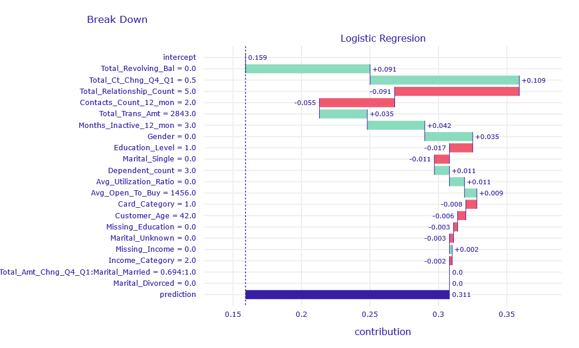
```

According to Break Down, the variables `Total_Revolving_Bal` = 0 and `Total_Ct_Chng_Q4_Q1` = 0.5 had the greatest contribution to the correct prediction. This means that the client did not leave an unpaid overdraft and in the fourth quarter made two time less transactions as in the first.

```{r log-reg-wrong-cp, out.width="700", fig.align="center", echo=FALSE, fig.cap='Ceteris Paribus Profiles of obervation misclassified by LR model'}
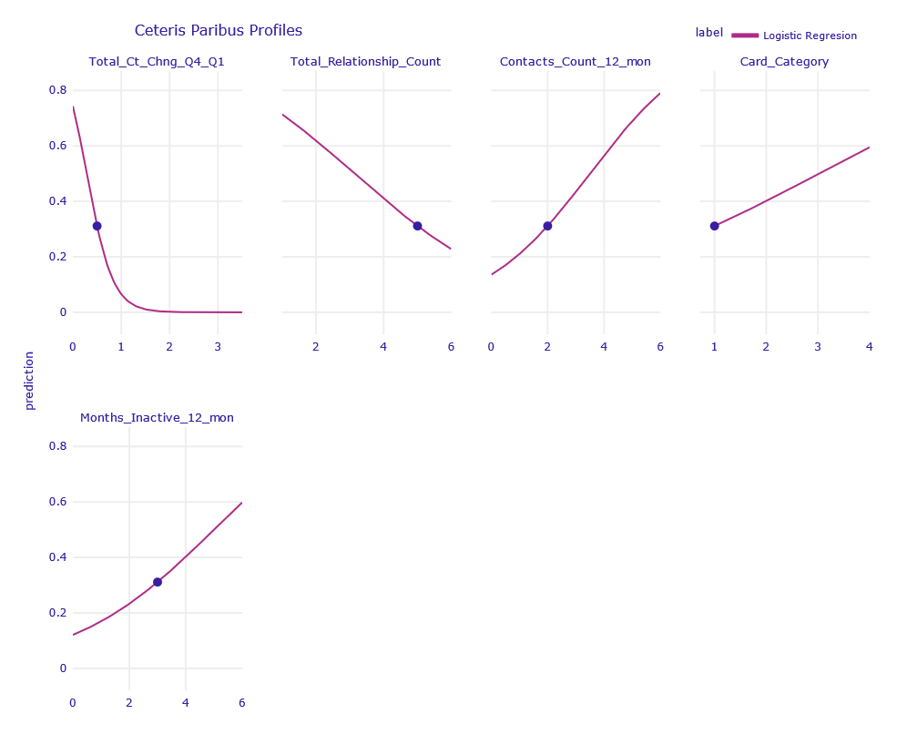
```
According to Ceteris Paribus, the biggest changes in prediction were caused by the variables `Total_Revolving_Bal`, `Total_Ct_Chng_Q4_Q1`, `Total_Relationship_Count`, `Contacts_Count_12_mon`, `Card_Category` and `Months_Inactive_12_mon`.


##### Correctly classified

The Logistic Regression model predicted that the client would churn with a probability of almost 0%. 
```{r log-reg-good-shapley, out.width="700", fig.align="center", echo=FALSE, fig.cap='Shapley Values decompositon of obervation correctly classified by LR model'}
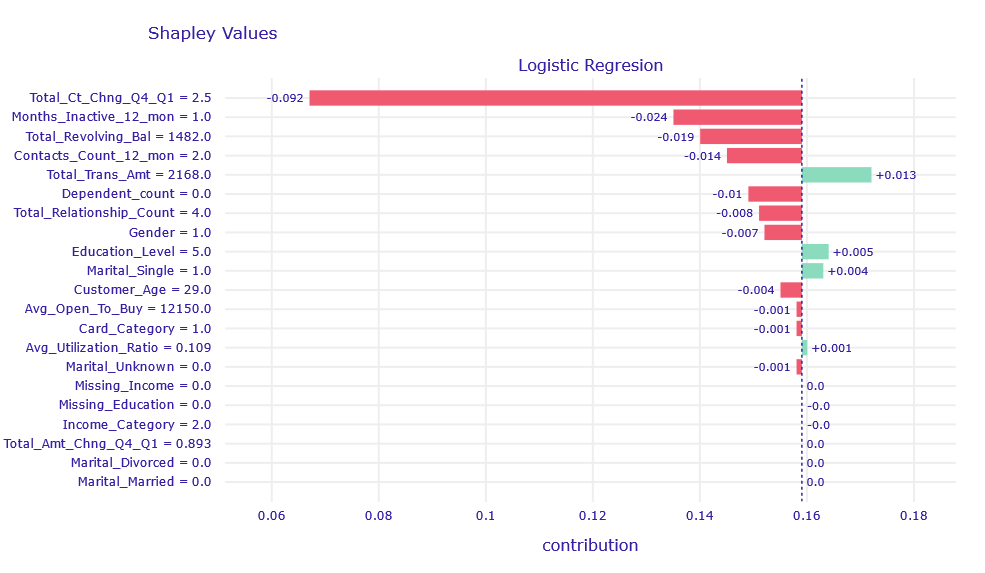
```

According to Shapley Values, the variable `Total_Ct_Chng_Q4_Q1` = 2.5 has the highest contribution. This means that the client carries out 2.5 times more transactions. 

```{r log-reg-good-cp, out.width="700", fig.align="center", echo=FALSE, fig.cap='Ceteris Paribus Profiles of obervation correctly classified by LR model'}
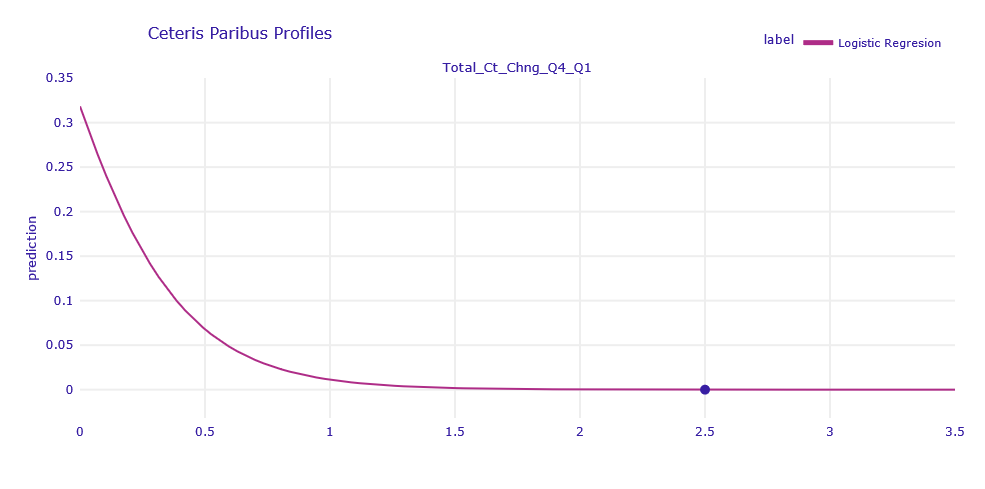
```

The Ceteris Paribus profiles shows that this is the only variable that can change the prediction for this observation. To increase the churn prediction, `Total_Ct_Chng_Q4_Q1` would need to be less than 1. 


##### Uncertain classified

The selected customer did not resign from the service, but the model prediction was uncertain with a result of 54%. 

```{r log-reg-uc-breakdown, out.width="700", fig.align="center", echo=FALSE, fig.cap='Break Down decomposition of obervation uncertain classified by LR model'}
knitr::include_graphics('images/1-1-log-reg-uc-breakdown.png')
```

According to Break Down variables of the largest contribution are `Total_Revolving_Bal` and `Total_Relationship_Count`. Customer has no unpaid loans at the end of the months, and have few relationships with a bank. There is no important sings of churn but at the same time there is no important sings of being interested in bank services, so it is hard for LR model to make correct prediction.

```{r log-reg-uc-cp, out.width="700", fig.align="center", echo=FALSE, fig.cap='Ceteris Paribus Profiles of obervation uncertain classified by LR model'}
knitr::include_graphics('images/1-1-log-reg-uc-cp.png')
```

Using Ceteris Paribus profiles, we can see that a slight change of one of the variables: `Total_Revolving_Bal`, `Total_Relationship_Count`, `Contacts_Count_12_mon`, `Months_Inactive_12_mon`, `Total_Trans_Amt` , `Total_Ct_Chng_Q4_Q1` is enough for the prediction to be more decisive. 


#### XGBoost and Random Forest model

##### Misclassified

The customer terminated the services, but both XGBoost (XGB) and Random Forest (RF) got it wrong. They predicted chances of churn of 0.5% and 4%.

```{r xgb-wrong-shapley, out.width="700",fig.show='hold', fig.align="center", echo=FALSE, fig.cap='Shapley values decompositon of obervation misclassified classified by XGB and RF model'}
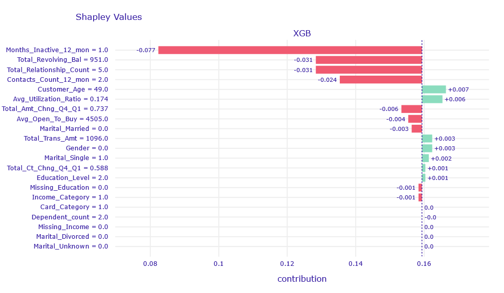
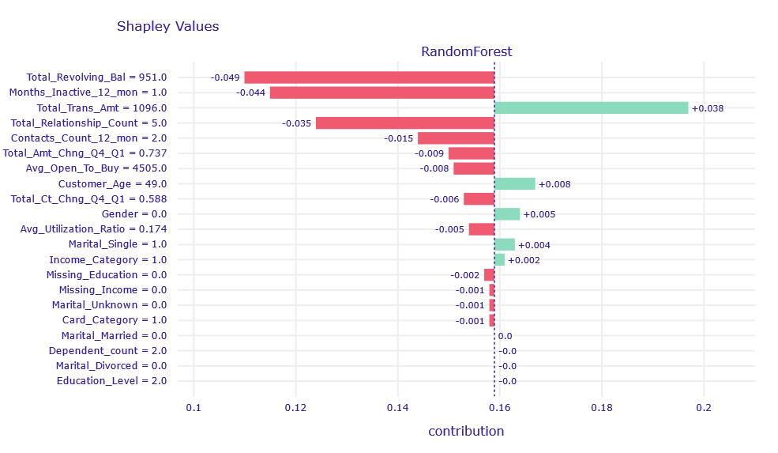
```

The `Total_Trans_Amt` column affects the result in the right direction, but its contribution is obscured by `Total_Revolving_Bal`, `Months_Inactive_12_mon`,`Total_Relationship_Count`, and `Contacts_Count_12_mon`. 

```{r xgb-rf-wrong-cp, out.width="700", fig.align="center", echo=FALSE, fig.cap='Ceteris Paribus Profiles of obervation misclassified classified by XGB and RF model'}
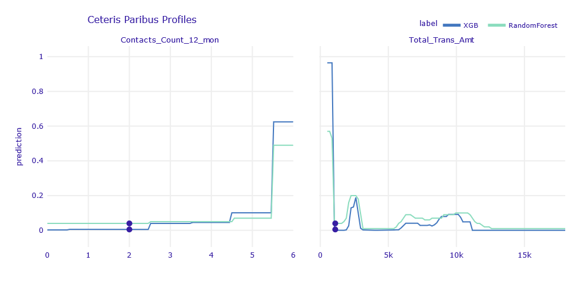
```

According to Ceteris Paribus, in order for the result of the models to agree with the label, one of the following events would have to occur:

- `Contact_Count_12_mon` = 6

- `Total_Trans_Amt` < 850
     
##### Correctly classified

The client continues to use the service, and both XGBoost and Random Forest were fully convinced that this would be the case (about 0% churn prediction).

```{r xgb-good-breakdown, out.width="700",fig.show='hold', fig.align="center", echo=FALSE, fig.cap='Break Down decompositon of obervation correctly classified by XGB and RF model'}
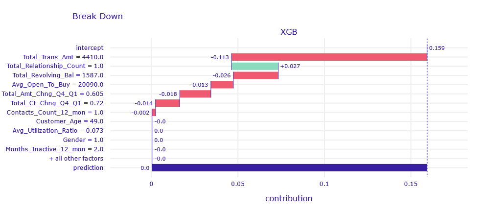
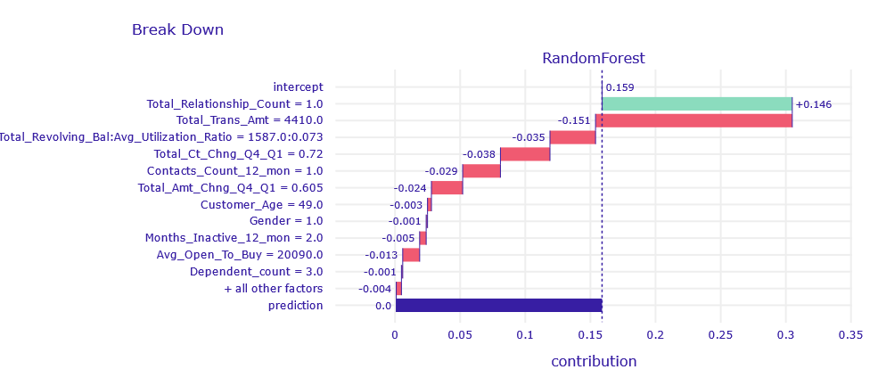
```

Looking at the Break Down , we suspect that due to `Total_Realtionship_Count` = 1 the bank is afraid that it is not holding the client tightly enough and that the client is considering leaving. Despite this, the models returned a good prediction caused by a large amount of money circulating in the customer's account and large loans not repaid on time .


##### Uncertain classified

The customer resigned from the service. Both models will slightly lean towards customer resignation (52-53%), but this is a very uncertain prediction. 
```{r xgb-uc-breakdown, out.width="700",fig.show='hold', fig.align="center", echo=FALSE, fig.cap='Break Down decompositon of obervation uncertain classified by XGB and RF model'}
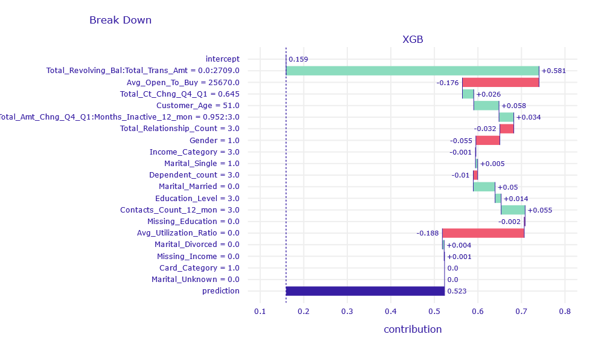
knitr::include_graphics('images/1-1-rf-uc-breakdown.png')
```

Similar to the previous observations, the variables `Total_Revolving_Bal` and `Total_Trans_Amt` have the largest contribution.

```{r xgb-rf-uc-cp, out.width="700", fig.align="center", echo=FALSE, fig.cap='Ceteris Paribus Profiles of obervation uncertain classified by XGB and RF model'}
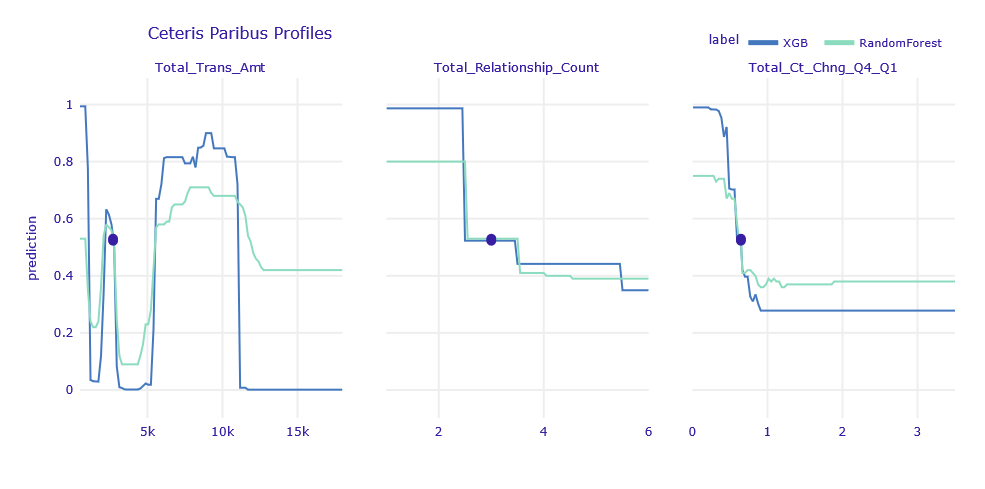
```

According to the Ceteris Paribus profiles, as for the LR observations, there are a few variables for which small changes can significantly improve the predictions.

### Global explanations

In this section we describe our discoveries made by using explenatory methods globally.

#### Permutational Feature Importance

We calculated Permutational Feature Importance for XGBoost model, Random Forest model and a group of Logistic Regression models. The Regression models were created with L1 regularization and different `C` coefficient was applied among the group. This coefficient is an inverse of a penalty term in L1 regularization, which means the smaller it is, the more weights shrinkage we expect. We examined if such shrinkage is noticeable in Permutational Feature Importance (PFI) method. Then, we compared PFI obtained from different models.

##### Logistic Regression Models

```{r pfi-log-reg-total-ct-chng, out.width="700", fig.align="center", echo=FALSE, fig.cap='Permutational Feature Impotance of `Total_Ct_Chng_Q4_Q1` for the group of Logistic Regression models. This variable represents the change in number of transactions between Quarter 4 and Quarter 1. Its importance decreases when L1 regularization incerases.'}

knitr::include_graphics('images/1-1-pfi-log-reg-group-total-ct-chng.png')
```

The variable with the highest (among the group of Logistic Regressions) drop-out loss is shown in Figure \@ref(fig:pfi-log-reg-total-ct-chng). The drop-out increases with the increase of `C` coefficient. The feature is more important for models with low regularization parameter, therefore it was shrinked by the Lasso.

```{r pfi-log-reg-total-bal, out.width="700", fig.align="center", echo=FALSE, fig.cap='Permutational Feature Impotance of `Total_Revolving_Bal` for the group of Logistic Regression models. It is more important for models with high regularization.'}

knitr::include_graphics('images/1-1-pfi-log-reg-group-total-revolving-bal.png')
```

Figure \@ref(fig:pfi-log-reg-total-bal) presents a variable importance plot of `Total_Revolving_Bal` (Total amount of credit that a Card owner did not pay at the end of the billing cycle) feature, which has the second highest drop-out loss. It was not regularized, because drop-out loss decreases with the increase of `C`. It is the only column, which has this property.

```{r pfi-log-reg-gender, out.width="700", fig.align="center", echo=FALSE, fig.cap='Permutational Feature Impotance of `Gender` (Gender of a Customer) for the group of Logistic Regression models. This variable was clearly regularized by L1 regresssion. Importance increases with a decrease of regularization strength.'}

knitr::include_graphics('images/1-1-pfi-log-reg-group-gender.png')
```

```{r pfi-log-reg-utilization, out.width="700", fig.align="center", echo=FALSE, fig.cap='Permutational Feature Impotance of `Avg_Utilization_Ratio`, which stands for an average use of possible credit in the last 12 months, for the group of Logistic Regression models. The stronger regularization gets, the less importatn this variable is.'}

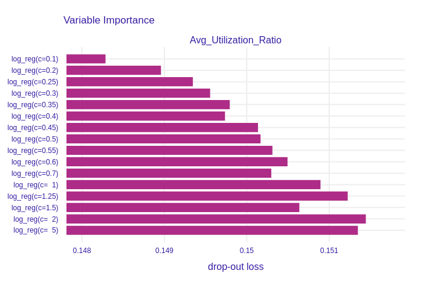
```

On the other plots, such as Figure \@ref(fig:pfi-log-reg-gender) and Figure \@ref(fig:pfi-log-reg-utilization), the shrinkage made by L1 regularization is clearly visable. Models with high regularization parameter, and accordingly low `C` parameter, have smaller drop-out losses, which indicates lower importance of features.

Drop-out loss increases proportionally to `C` parameter in nearly all of the columns. This shows that the effects of Lasso regularization can be observed in Permutational Feature Importance plots of Logistic Regression models.

Despite all of the plots in this section are barplots, bars do not start in 0. We believe it is not a problem, because trend is more important than absolute values. Nevertheless, we would like to draw Reader's attention to that fact.

##### XGBoost and Random Forest models

In Figure \@ref(fig:pfi-xgb-rf) we can observe that the most important column for both models is `Total_Trans_Amt` (sum of all transactions' amount in last 12 months). This outcome can be logically explained: customers who do not use their credit card to execute many valuable transactions probably do not need that service, consequently resign. However, the drop-out loss for that column for the XGBoost is over 2 times higher than for the Random Forest, which means that the prior model bases its prediction on this column more than the latter model. Furthermore, more features are important for the XGBoost than for the Random Forest. We suppose this is a result of the models different training processes. New iterations (trees) in XGB are based on observations that were previously predicted incorrectly, thus new columns are taken into consideration to represent the differences between the observations. On the other hand, the Random Forest model selects the subset of the features randomly in each tree.

```{r pfi-xgb-rf, out.width="700", fig.align="center", echo=FALSE, fig.cap='Top 9 most important features in XGBoost (XGB) and Random Forest (RF) feature importance comparison. XGBoost has more important variables than Random Forest, but the importance of `Total_Trans_Amt` is over 2 times higher.'}

knitr::include_graphics('images/1-1-permutational-feature-xgb-rf.png')
```

##### Models comparison

We compared the Permutational Feature Importance of the group of Logistic Regression models, XGBoost model and Random Forest model. We can see in Figure \@ref(fig:pfi-all) the drop-out loss for `Total_Trans_Amt` in XGBoost is similar to drop-out in Logistic Regression models.

```{r pfi-all, out.width="800", fig.align="center", echo=FALSE, fig.cap='Permutational Feature Impotance of 4 chosen variables for all models. Tree-based models generally have lower feature importance than Regression models. Effects of L1 regularization are neglectable in comparison to differences between models.'}

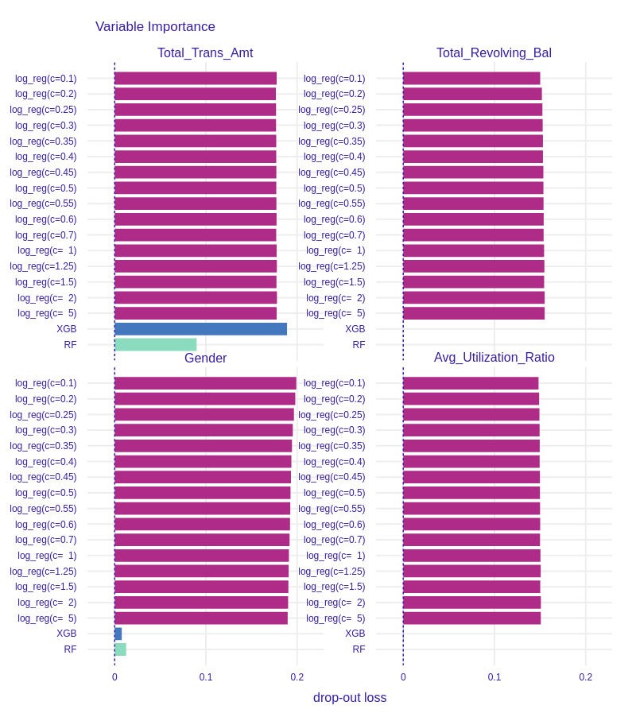
```


If we compare the importance of `Total_Revolving_Bal` in Figure \@ref(fig:pfi-all), we see a huge difference between tree based models and Regression models. The drop-out loss for the first ones is around 20 times lower than for the latter.

We can also examine some of the less important features such as `Gender` (see Figure \@ref(fig:pfi-all) ) and `Avg_Utilization_Ratio` (see Figure \@ref(fig:pfi-all)). In comparison to Regression models importance of these variables in XGBoost and Random Forest is neglectable. Therefore, we conclude that although the effects of L1 regularization in Logistic Regression are observable, tree-based models such as XGBoost and Random Forest select the most important features more restrictively.

#### PDP profiles

We created Partial Dependence Plots of all variables in the dataset for XGBoost, Random Forest and Logistic Regression with L1 models. Many of the plots turned out to be a horizontal line located on the level of the mean prediction of the models. An example of such a variable is shown in Figure  \@ref(fig:pdp-chosen), predictions of models does not change with the change of `Gender`. However, features that have high importance do have more complex plots. One can observe prediction varying with the change of `Total_Trans_Amt`, `Total_Revolving_Bal` or `Total_Ct_Chng_Q4_Q1`.


```{r pdp-chosen, out.width="700", fig.align="center", echo=FALSE, fig.cap="Partial Dependence Plots of chosen features. Changing some variables does not affect the models' predictions (example of such a variable is `Gender`). There are 4 features (`Total_Trans_Amt`, `Total_Revolving_Bal`, `Total_Ct_Chng_Q4_Q1`, `Contacts_Count_12_mon`), which after beeing changed may influence the prediction."}

knitr::include_graphics('images/1-1-pdp-chosen-vars.png')
```

What we find interesting in Figure \@ref(fig:pdp-chosen) is an unobserved in PFI effect of the `Contacts_Count_12_mon` variable. The plot is steady for values 1-5 and raises rapidly when the feature takes the value of 6. We examined this case and figured out, that only approx. 0.58% of all observations have value 6 in `Contacts_Count_12_mon` column (see distribution of this variable in Figure \@ref(fig:distplots)). What is more, all of them describe attrited customers. We concluded there are two possible solutions:

1. The dataset is not balanced for this feature.
2. Indeed, the 6th contact with the bank representative is a breakthrough in the relationship with the customer.

```{r distplots, out.width="700", fig.align="center", echo=FALSE, fig.cap='Having calculated PDP, it is useful to compare the results with variables distribution. '}

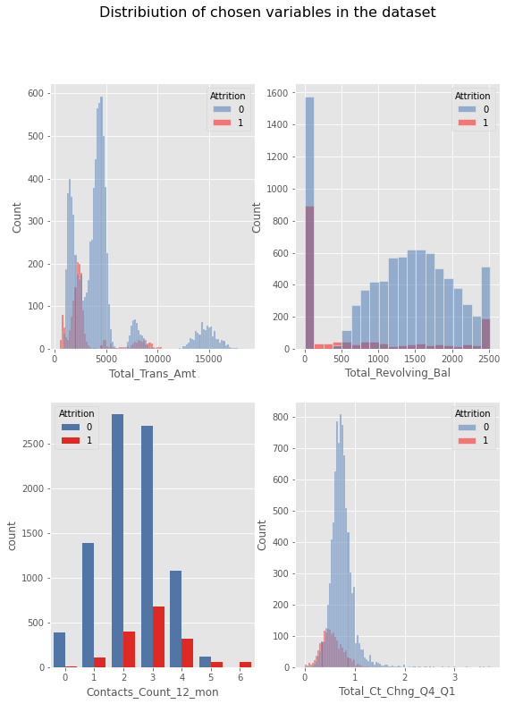
```

We compared PDP and features distributions (see Figure \@ref(fig:distplots)). We can observe numerous attrited customers have `Total_Trans_Amt` between 2000 and 3000. It explains why there is an increase in prediction in this area of PDP plot for this variable.

Customers who did not churn have usually do not have `Total_Revolving_Bal` between 100 and 400. That is why prediction incresase for low values of `Total_Revolving_Bal`.

#### ALE profiles 

```{r ale-chosen, out.width="700", fig.align="center", echo=FALSE, fig.cap='Accumulated-local Profiles Plots of chosen features. ALE plots seem to be parallel to PDP plots. This may indicate additive models.'}

knitr::include_graphics('images/1-1-ale-chosen-vars.png')
```

Accumulated-local Profiles for XGBoost, Random Forest and Logistic Regression with L1 were calculated. The results for chosen variables are shown in Figure \@ref(fig:ale-chosen). ALE plots seem to be very similar to PDP profiles. It may suggest there are no interactions between variables in the models. To examine that we plotted both PDP and ALE profiles in Figure \@ref(fig:ale-pdp-chosen-xgb), Figure \@ref(fig:ale-pdp-chosen-rf). We skip these plots for Logistic Regression because, by definition, there are no variables interactions in this class of models. ALE and PDP plots are parallel thus models detected no interactions between features and they can be additive.

```{r ale-pdp-chosen-xgb, out.width="700", fig.align="center", echo=FALSE, fig.cap='Accumulated-local Profiles and Partial Dependence Profiles Plots of chosen features for XGBoost. Parallel lines indicate that this model can be additive.'}

knitr::include_graphics('images/1-1-ale-pdp-xgb.png')
```

```{r ale-pdp-chosen-rf, out.width="700", fig.align="center", echo=FALSE, fig.cap='Accumulated-local Profiles and Partial Dependence Profiles Plots of chosen features for Random Forest. Parallel lines indicate that this model can be additive.'}

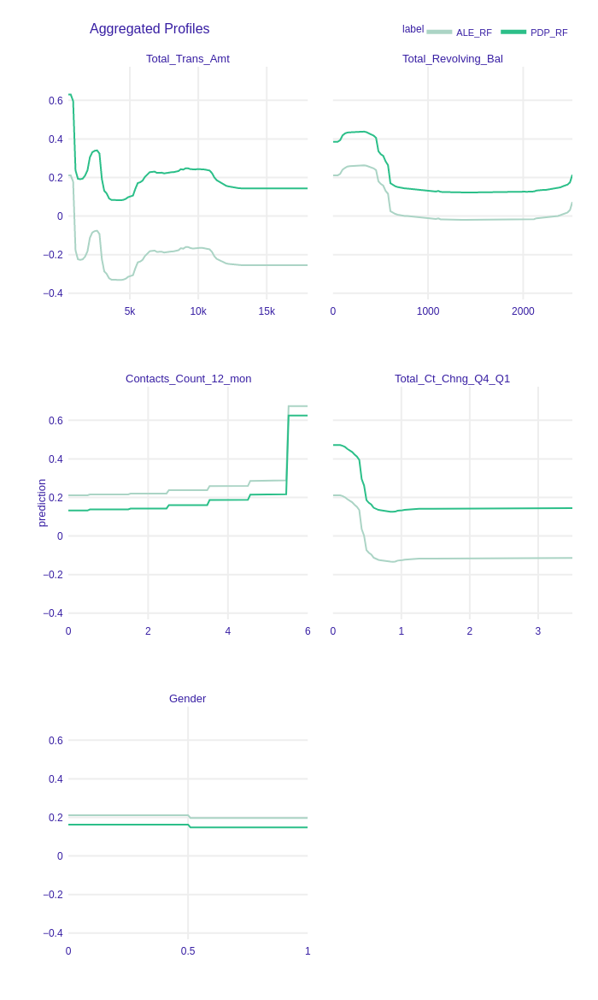
```

### Summary

In the article we analyzed the dataset and models trained on it. We explored the differences between the black-box, tree-based models and an explainable Logistic Regression. Various XAI methods were used for the comparison of the ML models. Local explanations showed that the misclassified observations are outliers. Therefore, the misclassification of those is not strange. Moreover, some of the observations are hard to classify by models, but a slight change of some of the predictors would make a prediction more confident. Global explanations of models gave us insight into how the models work. This lead to conclusions about the differences between those models. Firstly, tree-based models make their's predictions on 5 or 6 values while a Logistic Regression (despite being modified with L1 penalty) uses more predictors. Secondly, tree-based models were overfitted on some of the columns. Lastly, with Logistic Regression it is impossible to model more complicated relationship in data because this method assumes linearity.