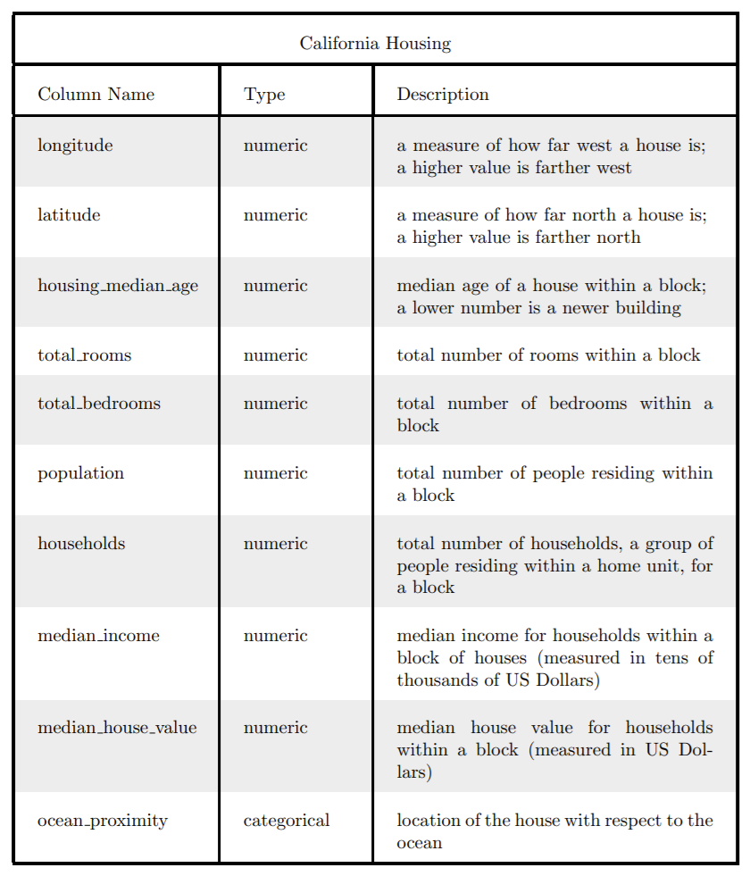
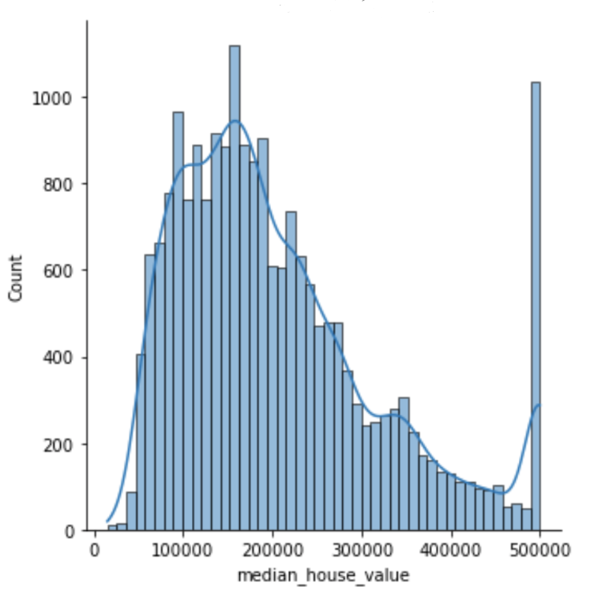
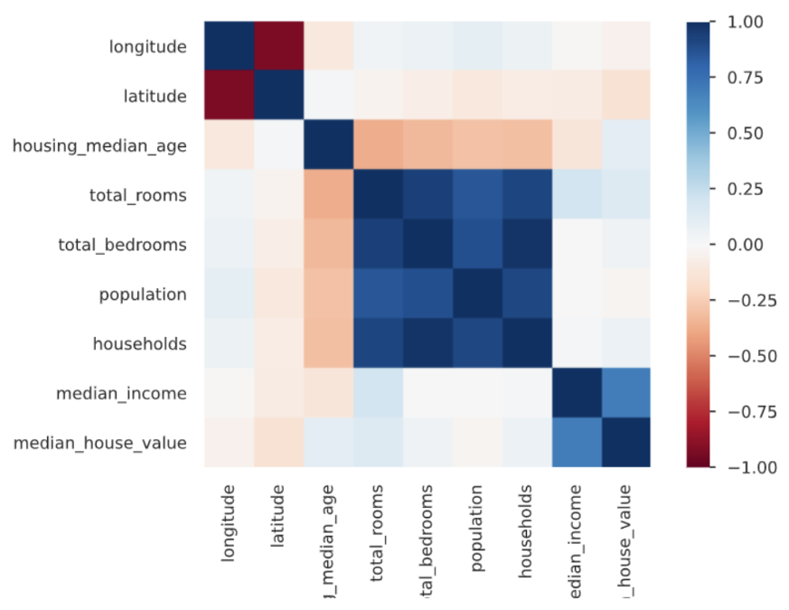
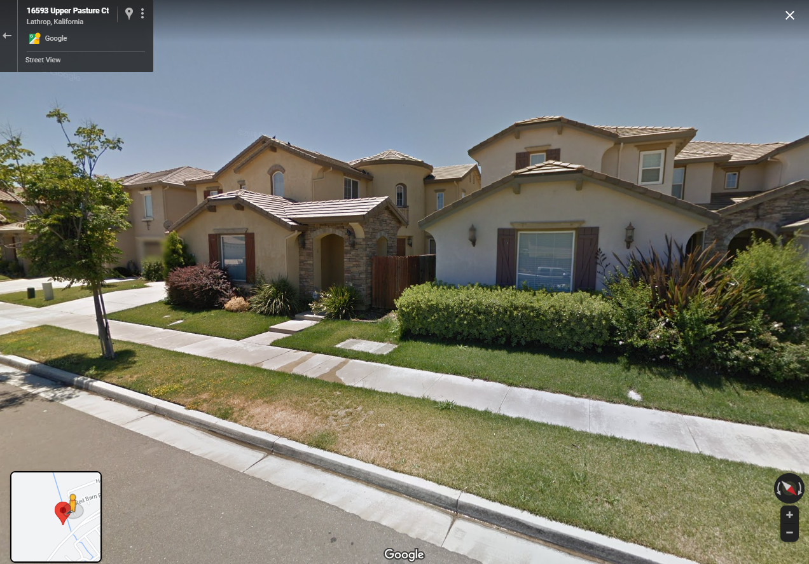
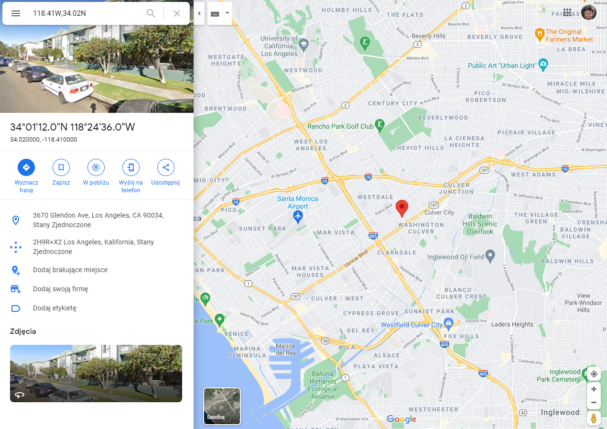
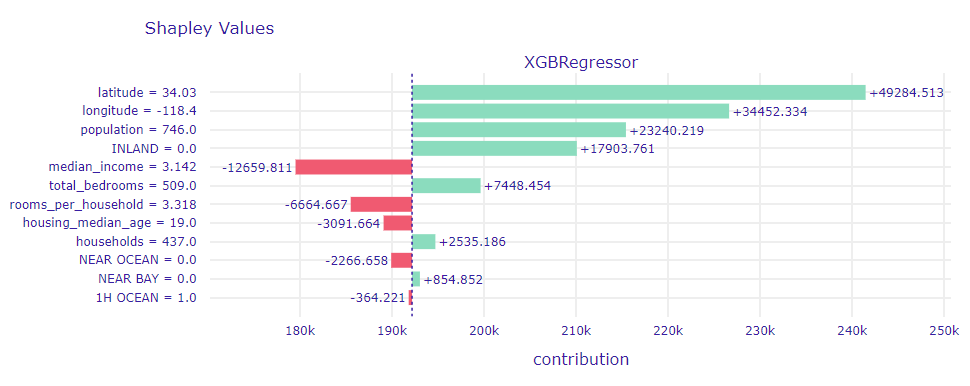
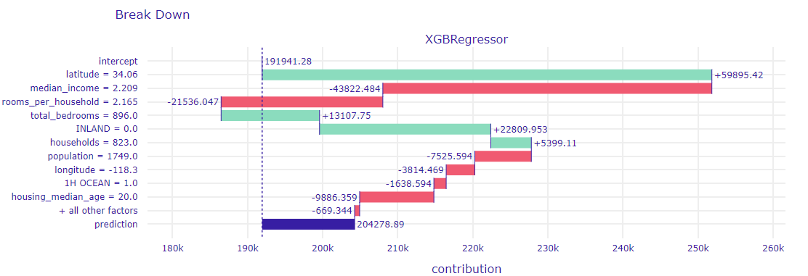
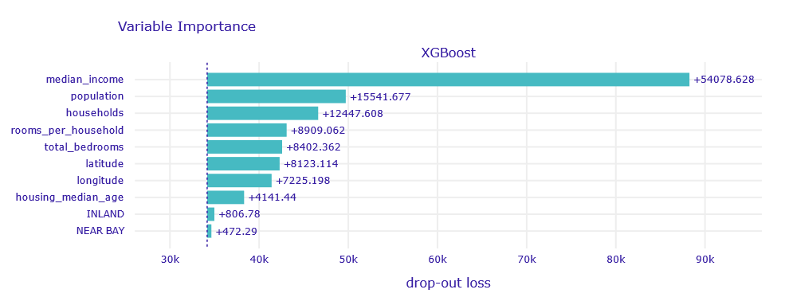
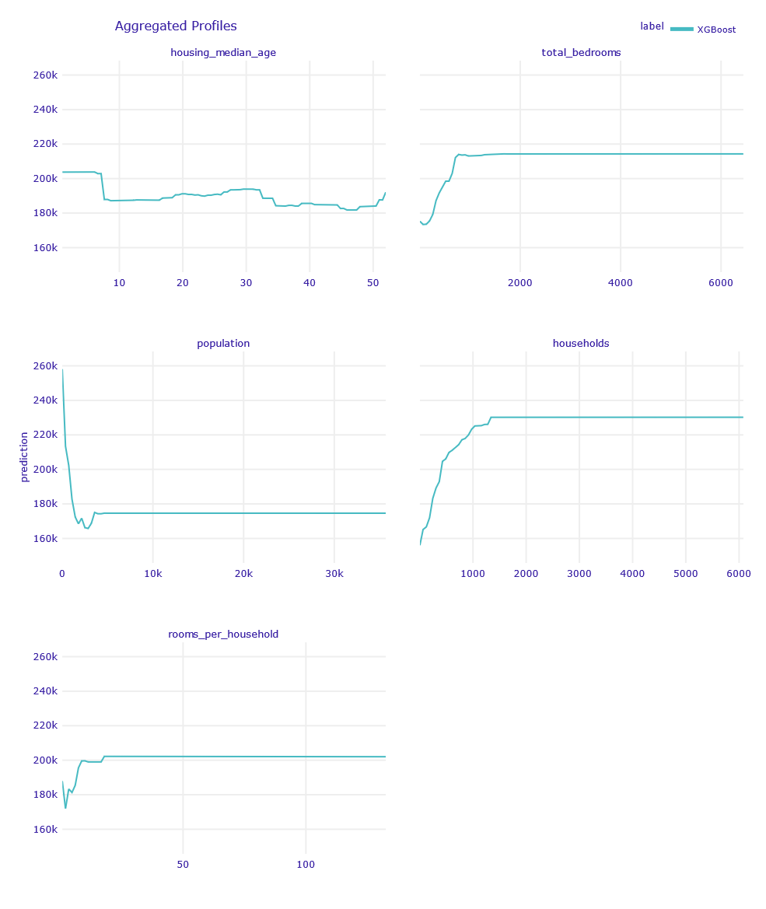

## XAI in real estate pricing: A case study

*Authors: Sebastian Deręgowski, Maciej Gryszkiewicz, Paweł Morgen (Warsaw University of Technology)*

### Abstract

Real estate market is a very complex structure. In order to properly predict a price of a given property, many various factors need to be taken into account. This case study focuses on usage of explainable artificial intelligence (XAI) methods in making a prediction of California households’ prices. For this purpose, XGBoost regression model of supervised machine learning had been used and developed. In addition to high efficiency of predictions, many detailed factors had been studied and explained, such as high correlation between price and median income of household or impact of geographic location of given estate. The achieved results certainly contribute to a better understanding of the market.

### Introduction

Real estate plays a key role in past and present economy. In 2011 it was valued in total \$25 trillion in the US only, \$16 trillion of that figure comes from residential households. To compare, at the and of that year the capitalisation of US stock market was around \$18 trillion. In its prices are interested both ordinary people, who treat real estate as basic good, and investors, who view the real estate as asset. 

The task of determining a relationship between dependent factors and final price is non-trivial and requires a vast, domain-specific knowledge. However, machine learning (ML) methods allow to surpass this requirement by determining the interaction in data themselves and leaving only the task of data selection and learning supervision to the human user. 

This comes with a cost, though: the most efficient ML models are of the so-called *black box* family and they are complex beyond human understastanding. If they are to be fair, trusted and fully usable, their decision process has to be brought closer to the human user. 

This article describes research performing a case study based on the actual US Census data from California from 1990. An ML model tasked with predicting real estate value is developed and then its decisions are made as clear as possible, using various XAI methods.

### Related Work

#### Characteristic of real estate market

The real estate market is not a typical one, as is pointed out in the introduction of [@1-2-forecasting]. It is extremely heterogenous - goods offered vary between themselves in location, state and other physical attributes. It is also nonliquid, since transactions are costly and irreversible. This makes the task of forecasting a price of a given house particularly difficult. Instead, certain indicators of the price are predicted, the simplest one of them being the median house value.

#### Determinants of real estate value
The factors influencing the real estate prices can be linked with four phenonena [@1-2-german_determinants]:

* Future expected revenue,
* Accessibility,
* Hedonic factors,
* State of global and local  economy.

In an asset pricing approach **expected revenue** plays a key role. Here factors such as forecasted future rent, upkeep cost and taxes are taken into account. A second approach focuses on **accessibility**. It takes into account affordability and sustainability of house prices. It brings, among others, the montlhy income of potential owners into equation. **Hedonic** factors are object-specific and neighbourhood-specific characteristics, which contribute to the real estate value. Their examples are local population, housing density and infrastracture accessibility (such as public transportation, healthcare or education facilities). Finally, the state of global **economy** contributes to the price, and the state itself is measured by indicators like GDP, inflation rate, unemployment rate and construction activity.

#### Machine Learning uses

Machine learning has been used in numerous scientific papers regarding house prices prediction allowing us to take inspiration from some of them. One of these papers titled "Model Research on Forecast of Second-Hand House Price in Chengdu Based on XGBoost Algorithm" [@1-2-maciej1] presents problem very alike to ours. As the title implies authors are trying to predict prices of houses in China using machine learning algorithms and data that are similar to what we are dealing with in California-Housing data frame. For us, the main takeaway from said article were conclusions about XGBoost algorithm. First of all, authors point out that it is robust and to great extent immune to overfitting phenomena. They also perform comparison between three different models from which XGBoost is definitely the most effective. This article in approachable way shown us how powerful XGBoost is and pointed out the importance of hyperparameters tuning. 

Often machine learning algorithms are paired with more complex neural networks. this allows for even better, more accurate predictions. One of the example of said practice can be "House Price Prediction Using Machine Learning and Neural Networks" paper [@1-2-maciej4]. In this article authors use output of three ML algorithms, namely Linear Regression, Forest Regression and Boosted Regression, as an input for neural network that makes the final prediction. Although the article lacks actual results and comparison to other models, it presented us with an interesting idea and convinced us that there is room for improvement after we have built enough knowledge of neural networks.

Even more comprehensive and complex model is presented in "Deep Learning with XGBoost for Real Estate Appraisal" paper [@1-2-maciej3]. Apart from basic attributes such as size or number of bedrooms authors have incorporated ability for the model to process images of house to better estimate its price. Although their approach was much more sophisticated than ours it further reassured us that machine learning, and XGBoost model in particular, will be a superb tool for our task of predicting California's houses' prices.

All in all machine learning models with application in regression tasks around houses' prices prediction appear in countless papers so we had vast possibilities in terms of drawing inspiration from others' work.

### Methodology

#### Data description

For this project we used the `housing` dataset which we acquired from Kaggle repository. This is a modified version of dataset provided by StatLib. It has been extracted from 1990 US census. Each row represents a single house in California area and contains information about its location and details about bloc it is situated in. Our target variable for this regression task is `median_house_value`. We present the structure of said dataset in detail in the table below.

```{r 1-2-data-table, fig.align="center", echo=FALSE, fig.cap='Housing data frame details'}

```

`Housing` consists of 20640 records and missing values appears only in `total_bedrooms` column. There are total of 207 rows with missing values in `total_bedrooms` field, which makes up for approximately 1% of all records. Our data will evolve over the course of next sections, however whenever we implement any changes to dataset we will clarify them fully.

#### Exploratory Data Analysis

In order to better understand data we were working with, we conducted exploratory data analysis, which mainly consisted of visualizations. The very first step of our EDA was figuring out if we have to deal with any missing values. As stated in *Data description* section, we have 207 rows with missing values in `total_bedrooms` field. We decided to impute these fields using median of *total_bedrooms* from all non-missing rows.

```{r 1-2-missing-values, fig.align="center", echo=FALSE, fig.cap='housing.info() function output'}
knitr::include_graphics('images/1-2-missing_values.png')
```

After that, we drew a target variable distribution plot. It proved invaluable, as it shown us that the target value had most likely been capped at \$500.000. Every house with price greater than $500.000 had been given a $500.001 price tag. As it was not possible to recreate actual price of these estates we decided to remove corresponding rows. This way, we ended up removing 965 rows from the original data frame.

```{r 1-2-target-dist, fig.align="center", echo=FALSE, fig.cap='Target variable distribution'}

```

Next we took a closer look at our only categorical variable, `ocean_proximity`. What we wanted to see is what are the 5 categories and how many records each of them contains. Simple diagram (Fig. 3) made us realize that  `ISLAND` category consists of only 5 rows. We made a decision to remove these rows. 

```{r 1-2-ocean-proximity, fig.align="center", echo=FALSE, fig.cap='Ocean proximity categories'}
knitr::include_graphics('images/1-2-ocean_proximity_categories.png')
```

Then, in order to discover correlations between different variables we constructed diagram in the form of matrix. It made us aware off high correlations between some of the factors, problems connected with this will be discussed more in details later on.

```{r 1-2-correlation-matrix, fig.align="center", echo=FALSE, fig.cap='Correlation matrix'}

```

Finally we superimposed houses locations on California's map. On the first map we plotted all of the houses while on the second map we plotted only houses with `median_house_value` over $490.000. This allowed us to find two clusters of the most expensive estates around San Francisco and Los Angeles.

```{r 1-2-map-all, fig.align="center", echo=FALSE, fig.cap='Map of all houses'}
knitr::include_graphics('images/1-2-map_all.png')
```
```{r 1-2-map-expensive, fig.align="center", echo=FALSE, fig.cap='Map of houses worth more than $490.000'}
knitr::include_graphics('images/1-2-map_expensive.png')
```

EDA turned out to be invaluable, it pointed out numerous interesting facts but also made us aware of some underlying problems with data frame such as missing values.
It is also worth noting that our EDA consisted of more visualizations, however it felt more natural to skip those which did not provide any valuable insight.

#### Data validity

Data accessible to us sets the boundaries of our research. It contains characteristics of households in California at one, specific point in time, so incorporating global economic indicators makes no sense. Many desirable predictors, such as number of bathrooms in a household or the exact state of local infrastracture are simply not available. In this paper we focus on **accessibility** and **hedonic factors**.

The presence of exact location is vital to the credibility of this research. Factors connected with household location, which could have influence on final price, are numerous. Leaving some of them out could lead to selection bias present in the results of our work [@1-2-forecasting]. Thankfully, any factors connected with location - such as the local unemployment or state of infrastracture - are tied with geographical coordinates and are present in our data, although implicitly.

#### Model

In order to choose our prediction tool we have prepared 6 different regression models. We decided to compare results of Linear Regression, Random Forest, Support Vector Regression (SVR), Gradient Boosting, Multilayer Perceptron (MLP) and finally XGBoost Regressor.  Each of these models had been individually tuned mainly using GridSearchCV. After models had been tuned we proceeded to comparing models in an effort to find the best one. We used root mean squared error (RMSE) as our main metric to sort models by their performance. Additionally, in order to maximize objectivity of this metric we used 5-fold cross-validation and calculated the average RMSE along with RMSE standard deviation. The achieved results are rather unambiguous as XGBoost is characterized by the lowest mean RMSE and the lowest standard deviation of RMSE. This was to be expected taking into consideration related works performed around similar problems. After taking into consideration RMSE results and explainability of the models we decided to use XGBoost as our primary prediction tool. The final values for its hyperparameters are: `eta (learning rate) = 0.15, max_depth = 6, n_estimators = 150, gamma = 0, min_child_weight = 1` (any unmentioned parameter has been left with default value).

### Results

After successful training of the aformentioned model, we employed XAI methods of local and global explanation in order to get a firmer grasp over model's decision process.

#### Local explanations

At this stage of our work, we were particulary interested in observations that were somehow unusual or characteristic. In order to study them, we used prediction decomposition methods (LIME, Break Down, Shapley Values or Ceteris Paribus).

##### Most missed predictions
The first record that caught our attention was the one with the most inaccurate prediction. Observation No. 18563, as it is in question, was worth \$450,000. Our model priced it at just \$121,105. A Shapley Values plot for this observation (\@ref(fig:shapley-values-18563)) threw some light at the matter:

```{r shapley-values-18563, out.width="700", fig.align="center", echo=FALSE, fig.cap='Shapley Values for observation No. 18563'}
knitr::include_graphics('images/1-2-shapley_values_18563.png')
```

`population` variable has the biggest impact on price in this case, it has increased the median price by nearly \$70,000. This result was quite puzzling, since this variable was not considered as majorly significant impact on the predictions. Even more suprising was the fact that the variable `median_income`, which in most cases decided about the prices of an apartment almost by itself (with high efficiency), turned out to be grossly mistaken.

In order to explore it in more detail, the area where this flat was located and visualised using Google Maps service.

```{r street-view-18563, out.width="700", fig.align="center", echo=FALSE, fig.cap='Street View for observation No. 18563'}
knitr::include_graphics('images/1-2-street_view_18563.png')
```

Although the property itself is located near a state road, there is nothing more that would let us convince that this flat is worth its high price, even when taking the 30 years gap between the data collection time and present time into account. In this case, a wrong prediction of the model was not surprising.

The second most misguided prediction (No. 15804) also significantly lowers the actual price of the flat (\$147,083 to \$475,000). If we have a look at a plot below (\@ref(fig:shapley-values-15804)) we can note that it is similar to previous one.

```{r shapley-values-15804, out.width="700", fig.align="center", echo=FALSE, fig.cap='Shapley Values for observation No. 15804'}
knitr::include_graphics('images/1-2-shapley_values_15804.png')
```

Again, the most important variable is `population`, which correctly attempts to increase the price of the home. Again, the value of the flat is underestimated by tagging the property with the `INLAND` category. This time however the `median_income` variable has very little impact on the prediction.

Checking the view of the area in Google Maps (\@ref(fig:street-view-18563)) once again clarifies the situation. Here we can see an estate of luxurious villas. If the area was similar 30 years ago, it could indeed be worth \$475,000. However, it is quite unusual for such a rich estate to be constructed in that kind of location, so again the underestimation is not a surprise.

```{r street-view-15804, out.width="700", fig.align="center", echo=FALSE, fig.cap='Street View for observation No. 15804'}

```

Next in line, we looked at the observation for which our model overestimates the real value of the apartment the most. Observation No. 5168, as it is in question, turned out to be located in Los Angeles, 10 minutes far from the beach, in a rather rich-looking housing estate. Considering this, it is not surprising that our model valued this property at \$302,868 while it was really worth only \$55,000.

```{r street-view-5168, out.width="700", fig.align="center", echo=FALSE, fig.cap='Street View for observation No. 5168'}
knitr::include_graphics('images/1-2-street_view_5168.png')
```

```{r location-5168, out.width="700", fig.align="center", echo=FALSE, fig.cap='Location of observation No. 5168 in Los Angeles'}

```

If we take a closer look at the Shapley Values decomposition plot for this prediction (\@ref(fig:shapley-values-5168)), we can notice that this time the two most important variables turned out to be `latitude` and `londitude`. 

```{r shapley-values-5168, out.width="700", fig.align="center", echo=FALSE, fig.cap='Street View for observation No. 5168'}

```

As we can see, our model has learned that apartments located close to or in Los Angeles itself are usually worth much more than those outside of the city. Only a low value of the `median_income` variable could suggest that the apartment is not as expensive as it might seem (in fact, it is not expensive at all), but still there were more hints that it is rather a luxurious property.

##### Same area, different price

At the end of our work on local explanations, we looked at two examples of houses, which, despite their proximity, turn out to be significantly different in terms of their price. Our focus is in the Los Angeles area, and our observations are the ones numbered 4526 and 4537 (\@ref(fig:location-4526-4537)). To the nearest hundredths of a degree they are in the same place, this is the Korean district of Los Angeles, near one of UCLA campuses (figure below). Still the price difference is as high as \$400,000.

```{r location-4526-4537, out.width="700", fig.align="center", echo=FALSE, fig.cap='Location of observation No. 4526 and 4537 in Los Angeles'}

```

In order to explore these results, Break Down decompositions for these observations were created(\@ref(fig:break-down-4537) and \@ref(fig:break-down-4526)). The model did not fully detect the difference between the households. The cheaper was overestimated (\$205,000 instead of \$75,000), and the more expensive was underestimated (\$320,000 instead of \$475,000). Nevertheless, the impact of individual variables can be observed. The key differences are the `households` and `rooms_per_household` variables. Interestingly, the model behaved differently for the `longitude` variable - its contribution is negative for the cheaper one, and positive for the more expensive one.
 
```{r break-down-4537, out.width="700", fig.align="center", echo=FALSE, fig.cap='Break Down for observation No. 4537'}
knitr::include_graphics('images/1-2-break_down_4537.png')
```

```{r break-down-4526, out.width="700", fig.align="center", echo=FALSE, fig.cap='Break Down for observation No. 4526'}

```

#### Global explanations

At this stage, an the analysis of the impact of entire variables on a trained model was performed. Global explanation methods (permutation significance, utility and partial dependency profile (PDP)) were used to study them.

#### Importance of variables

The permutational significance method was used to determine which variables actually contributed to the performance of the trained model (\@ref(fig:importance)). We have observed that the most significant variable is `median_income`.

```{r importance, out.width="700", fig.align="center", echo=FALSE, fig.cap='Variables importance'}

```

*Real estate is about location, location, location.* One of our first interests was the influence of location on the value of an apartment. The PDP for the `longitude` and `latitude` variables is shown in the figure below (\@ref(fig:lat-long-pdp)).

```{r lat-long-pdp, out.width="700", fig.align="center", echo=FALSE, fig.cap='PDP for longitude and latitude variables'}
knitr::include_graphics('images/1-2-lat_long_pdp.png')
```

Properties to the west (shorter longitude) and south (lower latitude) are preferred. The first result is quite intuitive - to the west it is closer to the ocean, there are large agglomerations located there. The second is less expected - perhaps related to a warmer climate or better economic indicators.

Let's take a closer look at the dependencies (see: \@ref(fig:latlong-map)).

We see a large drop in the value around 122&deg;20'W (San Francisco area), then similar values up to a slow decline from 118&deg;20'W to 117&deg;20'W (Los Angeles and San Diego).

As for the width, the location of these cities is again very important - we see a decrease between 33&deg;30'N and 34&deg;30'N (San Diego, Los Angeles) and a huge decrease between 37&deg;30'N and 38&deg;N (San Fransisco).

We can see that the places of declines in the charts can be translated into the location of large agglomerations, but this does not explain the trend. Local growth, and not global decline, would be expected.

```{r latlong-map, out.width="700", fig.align="center", echo=FALSE, fig.cap='Map of California'}
knitr::include_graphics('images/1-2-latlong_map.jpg')
```

Next in line we were interested in the most important variable for the model - `median_income`. Its influence on the model is shown in the figure below (\@ref(fig:median-income-pdp)).

```{r median-income-pdp, out.width="700", fig.align="center", echo=FALSE, fig.cap='PDP for median_income variable'}
knitr::include_graphics('images/1-2-median_income_pdp.png')
```

It was no suprise that residents' earnings have a considerable impact on the price of an apartment. It is worth noting to what extent does the `median_income` variable influence the final result of the prediction. For the lowest-income households, the model will predict a property value of around \$133,000, while for the most affluent households, the prediction will be around \$353,000. So it is more than 2.5 times increase in the expected price. Moreover, the relationship is not completely linear - from a certain point, the increase in earnings does not translate into an increase in the price of the apartment.

In the next step, we checked how other, less significant variables influence the model response (\@ref(fig:rest-pdp)).

Although the graphs look very varied, the ranges of values on the vertical axis are small, as is the overall importance of these variables. For instance, `population` variable has the largest range of values, from \$177,000 to \$226,000. This range is inferior to ones observed in previous variables.

Nevertheless, some interesting dependencies on the basis of the plots can be learned.

From the plot for `housing_median_age`, a general trend that older properties tend to be a bit more expensive can be observed.

The `total_bedrooms` plot shows that houses in blocks with a very low combined total of bedrooms are noticeably cheaper.

The `population` variable distinguishes houses in households with a very low total population. These houses are usually more expensive. In turn, the `households` plot shows that a significantly low number of houses in the block reduces the predicted house price. This is in apparent opposition to the conclusions of the `population` variable. However, it should be noted that those considerations apply only when the values of the remaining variables are the same. If the number of houses increases, the amount of space per capita decreases and the price goes down. On the other hand, when the number of households increases with a dedicated population, the amount of space per inhabitant increases and the price goes up. This apparent abberation is explored in next section further.

`rooms_per_household` variable has a small impact on house prices, but a decline is noticeable for houses with a low average number of rooms.

```{r rest-pdp, out.width="700", fig.align="center", echo=FALSE, fig.cap='PDP for other continuous variables'}

```

#### Doubts about household and population variables

During the EDA, we found a correlation between `households` and `population` variables. This could have a negative impact on the interpretability of the PDP plotss and the meaningfulness of the information they convey. To verify that, we performed the following procedure:

* The `population` variable was divided into 5 intervals so that a similar number of observations fell into each interval,
* A PDP curve was determined for each interval,
* Differences between the determined curves were observed. 

If there were no differences, interactions in the model between variables would be non-existent and their correlation would only account for results noted on PDPs.

The results of the verification in the figure below (\@ref(fig:pop-vs-house)).

```{r pop-vs-house, out.width="700", fig.align="center", echo=FALSE, fig.cap='Importance of population variable wrt. household variable'}
knitr::include_graphics('images/1-2-pop_vs_house.png')
```

We observed a different appearance of profiles for large values of `households` than for small ones. Hence, we concluded that there are interactions between these variables in the model, so the conclusions presented in the previous section are valid.

### Summary and conclusions

Over the course of this case study, after basic EDA and training of an exemplary ML model, various XAI methods were used to make the process of real estate pricing clearer. Local explanation of odd outcomes gave detailed reasons for which the model gave incorrect results. When compared with intuition and with actual photos of the households, it was clear, that these observations were unusual and the model did as expected. Global explanations allowed us to get a sense of the relationship between individual variables and the median house value. We conclude, that the methods employed made the decisions made more transparent and believe, that these methods have high potential of use in other fields.
