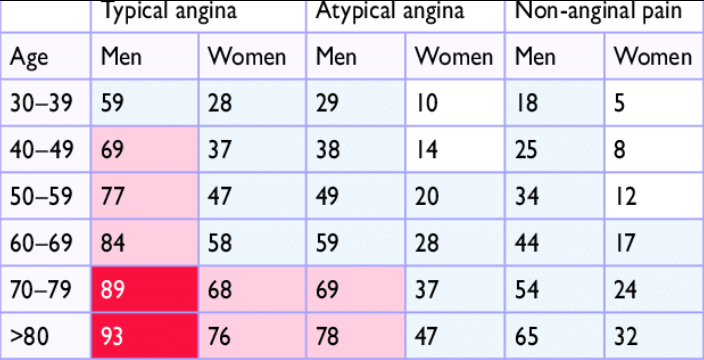
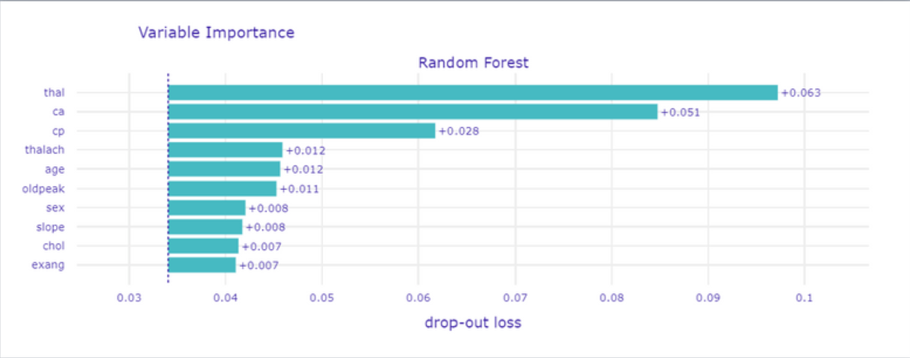
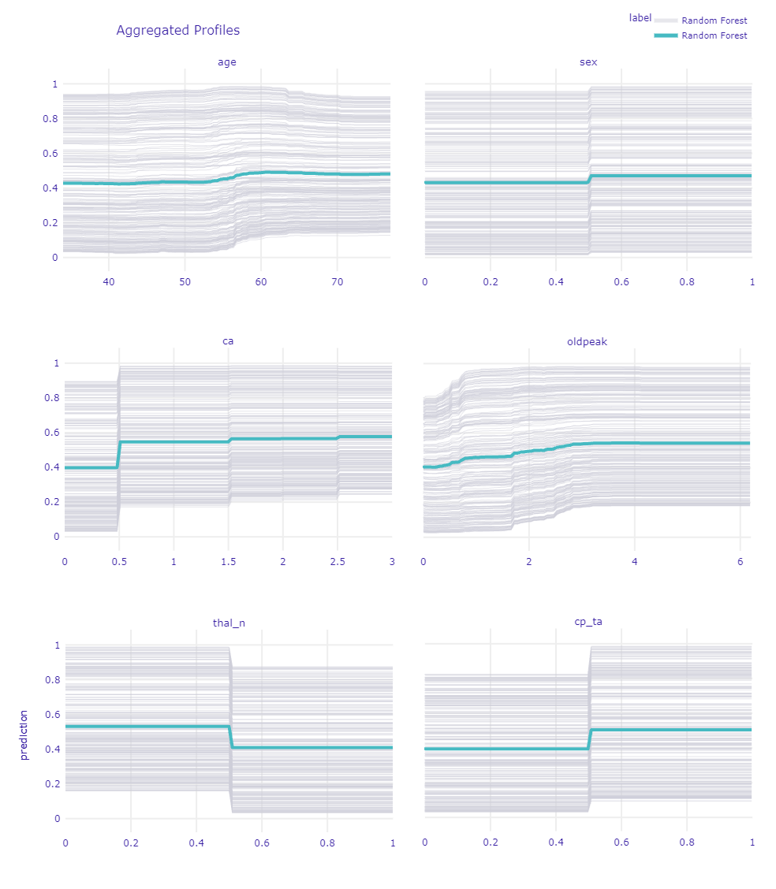
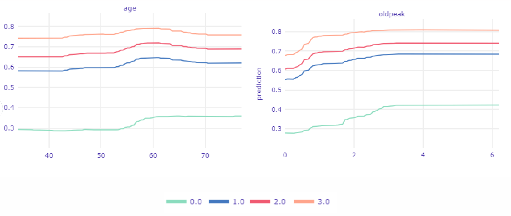
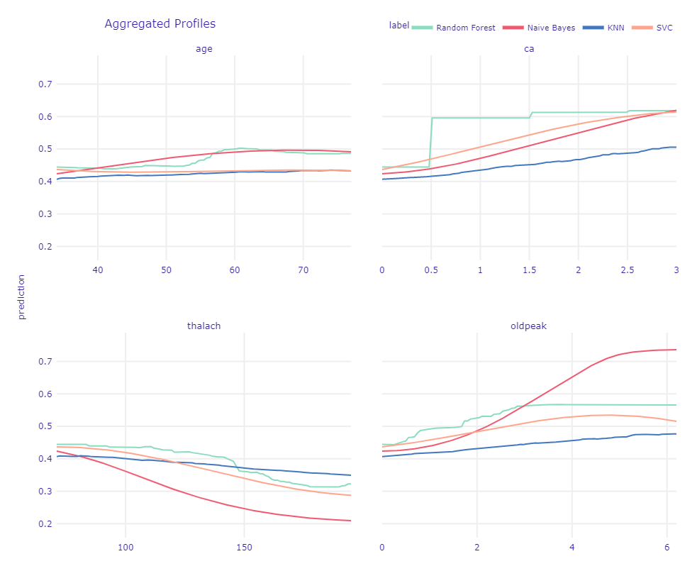
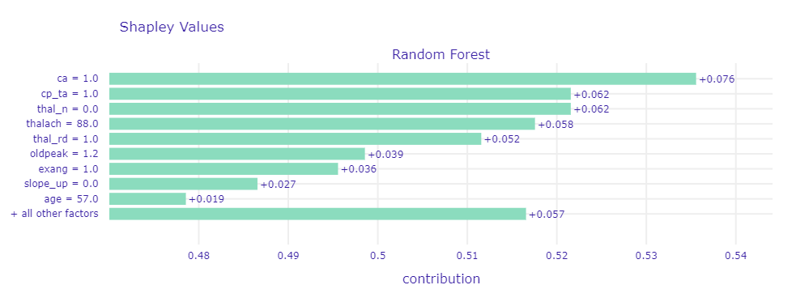
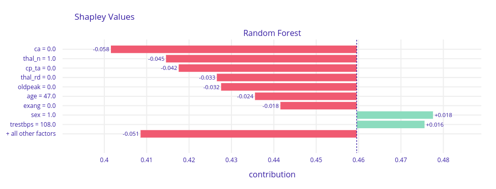
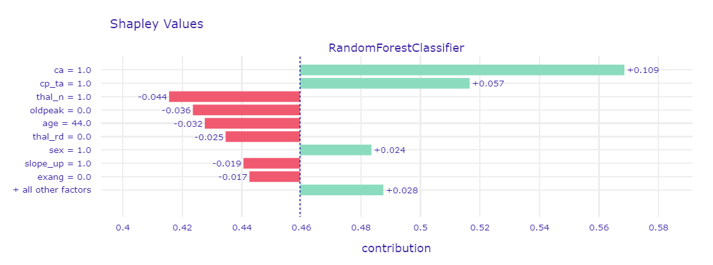
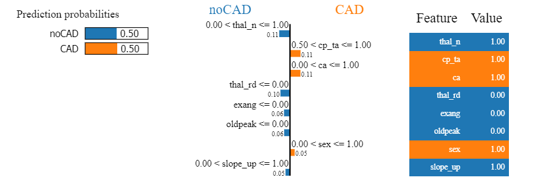

## Coronary artery disease: Is it worth trusting ML when it comes to our health?

*Authors: Paulina Przybyłek, Renata Rólkiewicz, Patryk Słowakiewicz (Warsaw University of Technology)*

### Abstract

Coronary artery disease is a dangerous heart sickness and the number of people suffering from it is significant around the world. In medicine research this disease, artificial intelligence are used more and more often. We decided to create a machine learning model which gonna try to predict the danger of coronary artery disease base on the results of few medical examinations. An important part of this paper is an attempt to explain predictions made by the model, using explainable artificial intelligence methods, and compare it with the medical approach. We will try to answer the question of whether it is worth trusting classification algorithms when making a diagnosis, or maybe in this case only doctors opinion has to be used?

### Introduction and Motivation

The heart is an organ on which the life and proper functioning of all other organs depend. For this reason, everyone should keep their heart healthy. However, it is not easy as we are not always aware of the impact of our actions on future health. How many times have we heard or witnessed a heart attack from someone close to us? Coronary artery disease (CAD) is very often behind the infarction. CAD, also known as ischemic heart disease - is a disease syndrome characterized by insufficient blood supply (and thus insufficient oxygen supply) to the heart, caused by a significant narrowing of the coronary arteries that nourish the heart muscle. CAD is the most common cardiovascular disease in developed countries, and heart attacks and sudden cardiac death are the most common causes of death. In Poland, it affects over one and a half million people and is the cause of about 20% of all deaths. Hence, it is important to detect this disease in a patient early and implement appropriate treatment before it is too late. \
More and more often when looking for a solution, we reach to artificial intelligence (AI) and machine learning (ML). Although in medicine AI has been used for decades, it still raises many doubts and is often criticized because of the lack of trustworthiness and questionable quality of the results. In medicine, human experts must be able to retrace the decision-making process of the machine. This is why it is crucial for models to be transparent, interpretable, and explainable. Unfortunately, successful models are often black-box ones. Explaining them is not so easy, but this is what explainable artificial intelligence (XAI) was made for. \
Building a model to predict coronary artery disease based on test results and medical history to be used to detect this disease in new patients could reduce the number of serious medical complications. However, trusting such a model completely in terms of health and even life is unconvincing. After all, you must put your life in the hands of the machine. The purpose of this article is to check to what extent and whether it is worth trusting ML algorithms when making a diagnosis of suffering from CAD. To answer this, we used XAI methods to understand models built on a set of patients with or without CAD. We checked the relationships between data science and the medical approach and saw which approach is better.

### Related Work

Usage of AI in medicine and the importance of XAI methods are widely researched. Countless approaches, methods, models, or measures are considered and are discussed ways how to build explainable AI systems for the medical domain [@1-3-xai-medicine]. In medicine designing an algorithm that can automatically learn without any human impact is impossible. The integration of the knowledge of a domain expert can often be indispensable. That is why interactive machine learning (iML), human-in-the-loop approach [@1-3-xai-iML1] and the extension of that - doctor-in-the-loop [@1-3-xai-iML2] are considered. \
However, most research still focuses on classic ML solutions like supervised learning. One of the fields in medicine in which machine learning is frequently used in cardiology. AI is being increasingly applied in cardiovascular medicine for identifying new genotypes and phenotypes, enabling cost-effectiveness, and importantly, risk stratification [@1-3-xai-cardiology]. Often those are deep learning models that are difficult to interpret, so XAI methods are needed [@1-3-xai-carxai1] [@1-3-xai-carxai2]. On the other hand, using black-box models and XAI methods in high-stakes decisions like those in medicine have also opponents that prefer design models that are inherently interpretable [@1-3-xai-opponent]. There are also approaches that believe that XAI is not enough and to reach the next level in explainable medicine we need causability that encompasses measurements for the quality of explanations [@1-3-xai-causability1] [@1-3-xai-causability2]. The variety and abundance of articles in the field of usage AI in medicine confirm our belief that this is a current and needed topic.

### Methodology

In our article, we analyze a dataset about CAD with XAI methods. We use global and local explanations and describe results using our ML and medical knowledge. This section of the article contains information about the dataset, data preparation for an experiment, ML algorithms, and using XAI methods. Also, at the end of the section, the workflow of our experiment is briefly presented.

---

#### *Dataset*

In the experiment, we used a heart disease dataset from UC Irvine Machine Learning Repository [@1-3-uci]. The dataset was originated in 1988 and designed for the classification task [@1-3-detrano]. It contains information about 303 of the patients from Cleveland hospital and 14 attributes describing theirs. Details of this data collections are described by @1-3-detrano2. These attributes are both categorical and numeric, and the "goal" field refers to the presence of heart disease in the patient. 

Before we made our explanations, we discussed the attributes of this dataset with the cardiologist and prepared a description of them to better understand our data. The information about these attributes are given below:

- **age** - patient's age in years 
- **sex** - gender of the patient:
    - male 
    - female
- **cp** - chest pain type:
    - typical angina - pain indicating CAD
    - atypical angina
    - non-anginal pain
    - asymptomatic - no pain
- **trestbps** - resting blood pressure (in mm Hg on admission to the hospital)
- **chol** - serum cholestoral in mg/dl
- **fbs** - fasting blood sugar > 120 mg/dl:
    - true - diabetes
    - false
- **restecg** - resting electrocardiographic results:
    - normal
    - having ST-T wave abnormality (T wave inversions and/or ST elevation or depression of > 0.05 mV) - changes indicating ischemia of the heart muscle (repolarization period)
    - showing probable or definite left ventricular hypertrophy by Estes' criteria - possible hypertrophy of the heart muscle
- **thalach** - maximum heart rate achieved during exercise testing
- **exang** - exercise-induced angina:
    - yes
    - no
- **oldpeak** - ST depression induced by exercise relative to rest
- **slope** - the slope of the peak exercise ST segment:
    - upsloping
    - flat
    - downsloping
- **ca** - calcification, number of major vessels (0-3) colored by flourosopy
- **thal** - MPS, myocardial perfusion scintigraphy using thallium 201, two tests - rest and exercise:
    - normal
    - fixed defect - permanent defect, present in both images (irreversible change, e.g., post-infarction scar)
    - reversable defect - post-exercise loss with the redistribution, only in the exercise image, reversible ischemia (risk of ischemic heart disease)
- **target** - the goal of this dataset (the predicted attribute), diagnosis of heart disease (angiographic disease status):
    - < 50% diameter narrowing - patient with CAD
    - \> 50% diameter narrowing - patient without CAD, but he can have another heart disease

The cardiologist paid special attention to some variables and their influence on the incidence of coronary artery disease. These variables include *cp*, *thal*, *ca*, *oldpeak*, *age*, and *sex*. In medicine, typical angina (*cp*), fixed defect (*thal*), high *ca* and *oldpeak* values, being male, and having a certain age make the patient more likely to suffer from coronary heart disease. Additionally, doctors use a pre-test probability of CAD (PTP) [@1-3-ptp] to estimate the likelihood of coronary heart disease based on the patient's age, sex, and chest pain type. If PTP is <15%, coronary artery disease is unlikely, if >85% certain. There is no point in performing diagnostics in these ranges. The group between 15-65% may have a non-invasive test for CAD diagnosis, and the 65-84% group should have a functional diagnosis performed. The PTP table used by cardiologists was presented in Figure \@ref(fig:1-3-ptp-test).

```{r 1-3-ptp-test, cache=FALSE, out.width="600", fig.align="center", echo=FALSE, fig.cap='Clinical pre-test probabilities in patients with stable chest pain symptomps'}

```

When analyzing the dataset, we noticed that some variables had distributions that quite clearly separate healthy and sick patients. The variables that caught our most attention were also mentioned by the cardiologist as factors influencing the presence or absence of coronary artery disease. Figure \@ref(fig:1-3-distributions) shows the distributions of the variables *ca*, *oldpeak*, *thal*, *cp*, *age*, and *sex*. The legend specifies which color corresponds to patients with and without CAD.

```{r 1-3-distributions, cache=FALSE, out.width="800", fig.align="center", echo=FALSE, fig.cap='Clinical pre-test probabilities in patients with stable chest pain symptomps'}
knitr::include_graphics('images/1-3-dist.png')
```

The dependencies described by the cardiologist were shown on the plots - namely, for higher *ca* or *oldpeak* values or fixed defect (*thal*) or typical angina pain in the chest or age of around 60 or having male sex, the probability of CAD increases. At the time of this analysis, it was puzzling for us whether the explanations of the model and the data would capture this.

#### *Preparation of the dataset for an experiment*

Before modeling, we properly prepared the dataset. The original set contained five target categories, which had to be divided respectively - CAD (values 1,2,3,4) and no CAD (value 0). Categorical attributes that had only two values were coded as 0 and 1, while if they had it more, we used one-hot encoding to encode them.

Some of the data had missing values. For every such case, we imputed the missing values with a mode. 

After consulting with a cardiologist, we decided to change the one attribute because we think it contained errors after being processed before it was uploaded to the UCI website. We swapped the values in the *cp* variable between typical angina and asymptotic. In addition, we combined the categories denoting heart problems in *restecg* due to the low number of occurrences of one of the categories.

#### *Classification algorithms*

As part of the search for the optimal model, we tested many different algorithms using hyperparameter tuning. All models were based on classifiers from the sklearn [@1-3-sklearn] package, with the accuracy being the summary metric that was used to select the optimal model. We chose accuracy because it measures how a good model is incorrectly predicting both positive and negative cases. Ultimately, we selected four models that gave the best results on the test dataset. Selected classification algorithms are both glass-boxes and black-boxes, which allowed us to compare the XAI approach to different types of models. They are listed below.

1. Random Forest - very flexible, robust, and popular algorithm, with no assumptions about data. Multiple classification trees trained on bagged data. Selected hyperparameters in the model: max_depth=7, min_samples_split=20, n_estimators=1000.
2. C-Support Vector Classification (SVC) - nonparametric clustering algorithm that does not make any assumption on the number or shape of the clusters in the data. Selected hyperparameters in the model: C=0.5, probability=True.
3. k-Nearest Neighbors (KNN) - assumes that similar observations are close to each other in feature space, assumes a very local impact of features. Selected hyperparameters in the model: n_neighbors=17.
4. Naive Bayes - nonlinear model with the assumption that all features are independent of each other. In the model, all hyperparameters were a default.

In the case of SVC and KNN, the data from the dataset was standardized. For reproducible results, a seed equal to one was set (the random_state hyperparameter).

On selected trained models, we used three other metrics besides accuracy to measures the quality of models: precision, recall, and area under the ROC curve. Precision quantifies the number of positive class predictions that belong to the positive class, while recall (also known as sensitivity) quantifies the number of positive class predictions made out of all positive examples in the dataset. The area under ROC curve (AUC) measures the area under a plot of sensitivity against specificity (measures the proportion of negatives that are correctly identified). The results of these measures on the test dataset are given in Table \@ref(tab:1-3-measure).

```{r 1-3-measure, tidy=FALSE, echo = FALSE, warning=FALSE}
statistics <- data.frame('Model name' = c('Random Forest','SVC','KNN','Naive Bayes'),
                         'Accuracy' = c(0.918, 0.902, 0.869, 0.869),
                         'Precision' = c(0.897, 0.893, 0.917, 0.857),
                         'Recall' = c(0.929, 0.893, 0.786, 0.857),
                         'AUC' = c(0.919, 0.901, 0.863, 0.868))

colnames(statistics) <- c("Model name" , "Accuracy", "Precision", "Recall", "AUC" )

kableExtra::kable_styling(knitr::kable(statistics, caption = 'The results of measures on the test dataset for all classification algorithms'))
```

The results achieved by the models are good. The glass-box models achieved higher values everywhere. They will be good examples to compare the explanations on the black-box models, which also have high scores on the test dataset.

#### *eXplainable Artificial Intelligence*

We used local and global explanations to check the model predictions. For a good understanding of the data, we looked at consider entire models first and then single predictions. All of the XAI methods we used are from the dalex [@dalex] package. 

Global explanations methods that we used:

1. Permutation-based variable-importance [@xai1-vip].
2. Partial Dependence Profiles (PDP) [@xai1-pdp].
3. Aggregated Profiles (ALE) [@xai1-ale].

And local explanations methods:

1. Break Down [@xai1-breakdown].
2. Shapley values [@xai1-shapleyvalues].
3. Local Interpretable Model-agnostic Explanations (LIME) [@xai1-lime].
4. Ceteris Paribus Profiles (CP) [@xai1-ice].
  
For reproducible results, a seed equal to zero was set (the random_state hyperparameter).

#### *Experiment*

To sum up, in the experiment we used 4 different classification algorithms and 7 different XAI methods to understand the predictions on the dataset. Random Forest was adopted as the main algorithm and other models were used to compare the XAI results. We decided so because we wanted to take the black-box model for the XAI so that the use of explanations would make sense. We rejected the SVC model because it gives a disproportionately high probability of disease at the extremes of some values.

The procedure followed to understanding data and models with explanations methods was as follows:

1. We have coded and processed the variables as described in the **"Preparation of the dataset for an experiment"** section.
2. The dataset was divided into train and test subsets with a split ratio of 80/20. A seed equal to zero was set.
3. We imputed values separately in train and test datasets.
4. All imputed train and test datasets were used in four classification algorithms. The classifiers were built using a transformed train dataset. And measures of their quality were checked using a test dataset.
5. We used learned models and a train dataset to apply the XAI methods.

Then we described the explanations, trying to back them up with medical knowledge to have a benchmark against the results obtained.

### Results

Our motivation in using explanation methods was to understand which variables influence our model prediction the most and how they change along with the values of each variable. \
Our model is expected to predict CAD disease. It is crucial to comprehend the model's decisions. What's more, we would like our model to detect the same dependencies as doctors use to diagnose CAD.

---

#### *Global explanations*

Global explanation methods gave us the overall view into the logic of our models, the importance of variables, and how they influence predictions.

The first global method we used, was Permutation-based variable importance (presented in Figure \@ref(fig:1-3-pvi)) which works by permuting values of a particular variable and counting how much does the prediction change. We expected models to get high score on variables which are known as important for doctors.

```{r 1-3-pvi, cache=FALSE, out.width="800", fig.align="center", echo=FALSE, fig.cap='Permutation-based variable importance'}

```

On the top of the list, we got *thal* what is not surprising because this medical examination is widely used by cardiologists. Conducting this test is prescribed in serious cases to ensure the doctor in his concerns about patient health.
Also, *ca* is one of the most important and the case is similar to *thal* variable.

The third is *cp* which is chest pain and it is classified during interview. With *age* and *sex* is used to estimate CAD possibility and choose a futher treatment plan (as mentioned in Figure \@ref(fig:1-3-ptp-test)).

We have taught few models so now we going to show the differences in Variable Importance between them for each variable, to depict why the random forest is in our opinion the best.

```{r 1-3-pvi3m, cache=FALSE, out.width="800", fig.align="center", echo=FALSE, fig.cap='Comparation of permutation-based variable importance for 3 models'}
knitr::include_graphics('images/1-3-pvi3m.png')
```

It is important that this method not only showing importance but also how stable the model is what means the resistance of a model for bias in data. Even if for *ca* each model has a high score but for different variables Random Forest got is significantly smaller. In Figure \@ref(fig:1-3-pvi3m) in contrast to KNN and SVC which have high and almost the same values for each, Random Forest lower importance score for variables we do not find so important.

To understand better, how these variables change prediction, depends on the value of each one we used Partial Dependence Profiles which changing value of a particular variable and count predictions for each observation and then taking the mean of it so we can see how different values of variable change prediction outcome.

In Figure \@ref(fig:1-3-cpp), grey lines represent Ceteris Paribus Profiles of each observation but this is wider discussed in Local explanations.

```{r 1-3-cpp, cache=FALSE, out.width="800", fig.align="center", echo=FALSE, fig.cap='Ceteris Paribus Profiles for chosen variables'}

```

Looking at the *age* we can see growth at the age of 55, this is correct with intuition and medical's statements. Pay attention to a slight jump in the age of 45. It is a reflection of the age when increase probability of getting heart disease according to PTP. \
As we see for *sex*, being a male highly increases predictions. Good that our model finds this dependence. It is also one of the main factors taken into account by doctors in using PTP, mentioned before. Also looking at the gray lines we cannot spot a single one that goes down while changing to male. That is means that is true for every patient. \
Variable *ca* is one of the most important according to the previous XAI method. So thanks to that plot we see that having at least one calcification rapidly increases the prediction of the model and having more only ensures the model in the diagnosis. \
*oldpeak* as a deviation from normal, follow the rule the bigger the worse. For the right limit values, it becomes a straight line probably because further growth does not influence CAD more since is really big already. Also there is no much number of records having such big values. \
For the *thal* we chose to show an indicator of normal results of this medical examination. Thanks to that we can see if the patient has *thal_n* (normal) that is mean he does not have any other type which would be a sign of CAD. \
Pay attention to *cp_ta* (typical angina) because it is one of the main variables considered by doctors. Also for our model, it is meaningful.

```{r 1-3-cpca, cache=FALSE, out.width="800", fig.align="center", echo=FALSE, fig.cap='Ceteris Paribus Profiles devided into *ca* values.'}

```

Using the same technique we will get deeper into relations  *age* and *oldpeak* with  *ca* because it is one of the most important variables. In Figure \@ref(fig:1-3-cpca), we see Partial Dependence Profiles in the division for values of *ca*. The biggest differences are visible between having at least one calcification and not having it at all. In the *age* plot three top lines are almost the same shape. We can spot on all three of them that prediction is rising in the age of 45, the same age does not increase prediction for observations  *ca* equal 0. \
In the second plot, we see how the value of prediction changes based on *oldpeak* values and *ca* values. If a patient is already in the high-risk group by having *ca* at least equal to one then even a slight aberrance of *oldpeak* (less than one) will rapidly increase the value of prediction. Meantime when *ca* is equal to 0, *oldpeak* has to reach much higher values to have a vivid influence on prediction (greater than 1.5).

The last global method we used was ALE which works as CP Profiles but in addition, allows to spot dependencies between variables. We used it to check and compare all four models. This gonna give us a piece of information about differences and relationships between models.

```{r 1-3-ale4m, cache=FALSE, out.width="800", fig.align="center", echo=FALSE, fig.cap='Ceteris Paribus Profiles devided into *ca* values.'}

```

In Figure \@ref(fig:1-3-ale4m), looking at the *age* plot we see that Naive Bayes has a similar trend as Random Forest. Other models underestimate *age*. \
For *ca* we see why Random Forest was the best choice. Since all other models tried to suit straight lines into values 0 and 3 they underestimate values equal to 1 and 2. It is not what we would expect, since we know that difference between 0 and 1 is the most important. \
*thalach* as well as *oldpeak* have a more or less similar trend in each model. Interesting output is Naive Bayes's prediction for high values. We can assume it is because of the small number of such big values.

#### *Local explanations*

In global explanations, we have to remember that obtained values are often averaged. Sometimes, especially in medical cases, it is crucial to take a look at individual observations to catch interesting dependencies and draw conclusions. That is why the next step in examining our model was predict-level explanations. 

At first, we used Break Down, Shapley values, and LIME methods that show the decomposition of model prediction by particular variables to see which attributes had the greatest impact on model decisions. We examined the cases the model had no doubts about (both where predictions were correct and incorrect) and borderline cases. In Figure \@ref(fig:1-3-shap-sure-cor) and Figure \@ref(fig:1-3-shap-sure-incor) were presented Shapley values for respectively correct CAD classification and incorrect noCAD classification predictions.

```{r 1-3-shap-sure-cor, cache=FALSE, out.width="800", fig.align="center", echo=FALSE, fig.cap='Shapley values for observation that model had no doubt about - correct CAD classification' }

```

```{r 1-3-shap-sure-incor, cache=FALSE, out.width="800", fig.align="center", echo=FALSE, fig.cap='Shapley values for observation that model had no doubt about - incorrect noCAD classification'}

```

In most cases where the model was sure about prediction regardless of whether the prediction was correct or not, on top were *ca*,*thal*,*cp*, and *oldpeak*. Those are the variables that also in global explanations were frequently highlighted, so we recognized them as very good CAD indicators. \
Like the doctor, our model classified patients based on their symptoms. Some of them got wrong, but probably the cardiologist would have made the same decision as well. A sick person, but with no symptoms is almost impossible to be diagnosed. Similarly, a healthy person with CAD symptoms will be considered sick and have further medical examinations.

```{r 1-3-shap-borderline, cache=FALSE, out.width="800", fig.align="center", echo=FALSE, fig.cap='Shapley values and LIME for borderline case'}

```

```{r 1-3-lime-borderline, cache=FALSE, out.width="800", fig.align="center", echo=FALSE, fig.cap='Shapley values and LIME for borderline case'}

```

Borderline case was presented by using two methods - Shapley values in Figure \@ref(fig:1-3-shap-borderline) and LIME in Figure \@ref(fig:1-3-lime-borderline). For such observations, it turned out that usually half of the variables that were mentioned before as indicators (*ca*, *cp*, *thal* and *oldpeak*) had values indicative of CAD, and the other half not. That is why the prediction results were uncertain. By comparison to the previous cases, more often we could notice the greater influence of the other seemingly less important variables.

Next, we used Ceteris Paribus Profiles to some what-if analyses. By changing the values of one explanatory variable we examined how would the model's predictions change.

```{r 1-3-cp, cache=FALSE, out.width="800", fig.align="center", echo=FALSE, fig.cap='Ceteris Paribus Profile for case with strong prediction and borderline observation'}
knitr::include_graphics('images/1-3-cp.png')
```

For observations that contained strong indications of disease, a change in the value of one attribute had less impact on prediction than for healthy patients or borderline cases. With *age*, the risk of CAD increases. The more symptoms of the disease a given patient has, the smaller spike is usually observed on the chart (the blue line is almost flat, the green one clearly increases). The similar conclusions we can draw for *ca* - greater variance is observed for smaller prediction values. The presence of at least one calcified vessel significantly affects the prediction.

We also analyzed CP profiles coupled with LIME to get a better understanding of changes in CP predictions. In Figure \@ref(fig:1-3-lime-borderline) was presented mentioned plots for two observations.

```{r 1-3-cp-lime, cache=FALSE, out.width="800", fig.align="center", echo=FALSE, fig.cap='Ceteris Paribus Profile and LIME for two borderline observations'}
knitr::include_graphics('images/1-3-cp-lime.png')
```

In the shown example we have two patients - they are both the same age, the predictions are also very similar (about 50%). For green, the main factors influencing the prediction result are typical angina and *exang*, for blue - the presence of a reversed defect and high *oldpeak*. The significant difference in the CP chart is because the variable that has the greatest influence on the prediction of the green patient - chest pain - becomes dangerous only with age. Hence, if the patient was 10 years younger, but her other symptoms were the same, the risk of the disease would be reduced by 10 percentage points. By analyzing these charts individually, we would not be able to catch this dependence.

### Summary and conclusions

To sum up we created the model which can, with great accuracy, predict Coronary artery disease from given results of medical examinations listed in the **"Dataset"**. To achieve it, we deeply analyzed data searching for relationships between variables and target. Knowing that we were able to present the first hypothesis and validate them with the cardiologist. The review we got, made us reconsider the meaning of variables and our working hypothesis. So mistakes spotted in data were fixed thanks to that. After that, we started to create many models. Using tuning algorithms we chose the best hyperparameters for a few of them and then compared them using more metrics. Having in mind our other goal (get know XAI methods in use) we had to choose the best black-box model. As we mentioned, our other goal was to learn about tools for explanation machine learning and then by using them explain if the model is suitable for our problem. Not only we did it but also by comparing it with medical knowledge we could reveal the importance of some variables in the occurrence of CAD disease. Using global methods allowed us to check if the model fining important variables we have known as important then by studying PD profiles we saw the patterns the model recognize. Being aware of the limitation of the model we decided to check particular patients and how the model acts trying to predict their sickness. In that matter, we could check what makes our model imperfect. We found out that some of the cases would be problematic not only for our model as also for human specialists. This problem is sadly unsolvable. \
Medical interpretation is similar to the data science approach and it indicates the importance of the same variables like *cp*, *thal*, *age*, and *ca*. Let’s keep in mind that the model doesn’t replace specialists and some unusual cases may appear, which the model will not solve. We assume that the model might be an advisor for doctors rather than a final diagnosis.
