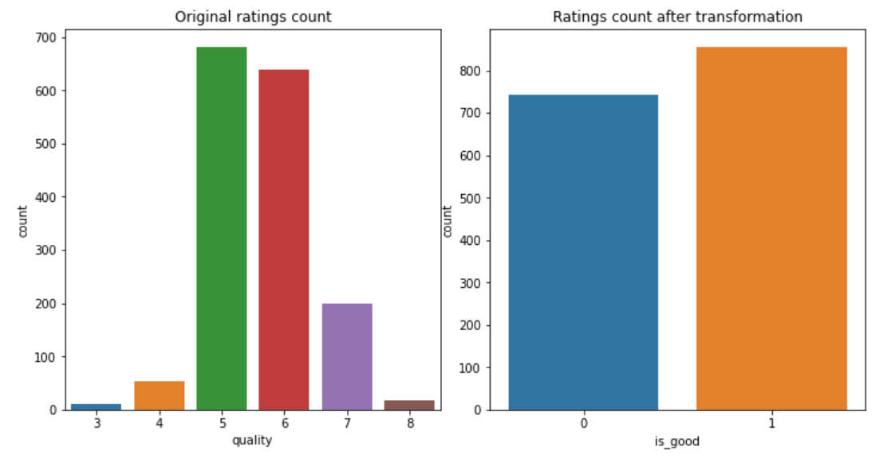

## Red wine quality mystery {#xai1-explainable-wine} 
(TODO: naukowy tytuł)
*Authors: Jakub Kosterna, Bartosz Siński, Jan Smoleń (Warsaw University of Technology)*

### Abstract

Wine is one of the most widespread and culturally significant drinks in the world. However, the factors determining its quality remain a mystery to the absolute majority of people.  There are many variables contributing to the final effect and it seems unclear which ones are crucial in making some wines better than others. In this paper, we have looked at this issue from a fresh perspective using Red Wine Quality from Kaggle community dataset^1^. Much to our initial surprise, despite the fact that a dozen or so chemical factors were taken into account, there is one that stands out and seems to be the main predictor of the drink's quality - it is alcohol. The study used four black box models interpreted through modern methods of explainable artificial intelligence to explore the subject.

### Introduction and Motivation

Term 'glass box models' refers to interpretable machine learning models - user can explicitly see how they work, and follow the steps from inputs to outputs.  The case is completely different in the case of the very advanced black box models. The goal of explainable machine learning is to allow human to inspect the factors behind results given by the model. 

There are numerous projects on the Internet that look at the Red Wine Quality dataset^1^ from both perspectives. However, due to the nuanced nature of the problem, many of them don't allow us to draw any constructive conclusions concerning the impact that various physicochemical properties have on the quality of wine. Our goal was to implement XAI solutions in terms of the analysis of the above-mentioned dataset and to confront results with  previous research and literature on the subject.

In this study, we will be taking a look at all the variables included in our dataset, while paying some special attention to one that seems to be standing out the most - the alcohol content. It is also the one that is the most recognizable to an average consumer and, in contrast to other physicochemical properties, is easily found on every wine label.

While analysing the results, we have to keep in mind the obvious limitations associated with the subject. Not only is the perception of the quality of wine an inherently subjective property, but it is also affected by factors not included in the data, such as the color of the wine or the temperature in which the drink was served.


### Methodology

#### Dataset

The original collection contains 1 600 observations, each representing one Portuguese Vinho Verde of the red variety. It is a proper to analyze and respected set, as evidenced by its verification, multiple use, as well as a very high rating of "usability" of 8.8 on the website. It consists of eleven predictors:

* *fixed acidity* - most acids involved with wine or fixed or nonvolatile (do not evaporate readily)
* *volatile acidity* - the amount of acetic acid in wine, which at too high of levels can lead to an unpleasant, vinegar taste
* *citric acid* - found in small quantities, citric acid can add 'freshness' and flavor to wines
* *residual sugar* - the amount of sugar remaining after fermentation stops, it's rare to find wines with less than 1 gram/liter and wines with greater than 45 grams/liter are considered sweet
* *chlorides* - the amount of salt in the wine
* *free sulfur dioxide* - the free form of SO2 exists in equilibrium between molecular SO2 (as a dissolved gas) and bisulfite ion
* *total sulfur dioxide* - amount of free and bound forms of S02
* *density* - the density of water is close to that of water depending on the percent alcohol and sugar content
* *pH* - describes how acidic or basic a wine is on a scale from 0 (very acidic) to 14 (very basic)
* *sulphates* - a wine additive which can contribute to sulfur dioxide gas (S02) levels, wich acts as an antimicrobial and antioxidant
* *alcohol* - alcohol by volume percentage

The decision variable was originally *quality* - the median rating of an assembly of minimum 3 experts, who made their classification on a scale from 0 to 10. Due to the capabilities of the analyzed XAI tools, our team decided to make it a binary classification problem, assigning the wines rated <= 5 value 0, and others - value  1. It resulted in an intuitive "bad / good" wine classification,  which gave us 855 "good" and 744 "bad" wines.


```{r targetCounts, out.width="700", fig.align="center", echo=FALSE, fig.cap='Distribution of target before and after transformation'}

```

#### Machine learning algorithms used

In order to look at the nature of this data, four well-known algorithms have been trained from data divided into: 1199 observations for the training set and 400 for the test set.

1. **XGBoost** (*gbm*) - powerful modern method based on *AdaBoost*^2^ and gradient boosting, imported from *xgboost* package^3^, with tuned hyperparameters using the randomized search method from *sklearn* package^4^, with the best values obtained: *min_child_weight* - 1, *max_depth* - 12, *learning_rate* - 0.05, *gamma* - 0.2 and *colsample_bytree* - 0.7

2. **Support Vector Machine** (*svm*) - algorithm, in which we plot each data item as a point in n-dimensional space (where n is number of features you have) with the value of each feature being the value of a particular coordinate. Then, we perform classification by finding the hyper-plane that differentiates the two classes very well; imported from *sklearn* package^5^, with tuned hyperparameters using the grid search method from *sklearn* package^6^, with the best values obteined: *C* - 10000, *gamma* - 0.0001 and *kernel* - rbf

3. **Random Forest** (*rfm*) - method building multiple decision trees^7^ and merges them together to get a more accurate and stable prediction; imported from *sklearn* package^8^, with tuned hyperparameters using the randomized search method from *sklearn* package^4^, with the best values obtained: *n_estimators* - 2000, *min_samples_split* - 2, *min_samples_leaf* - 2, *max_features* - auto, *max_depth* - 100 and *bootstrap* - True

4. **Gradient Boosting** (*xgm*) - a type of machine learning boosting. It relies on the intuition that the best possible next model, when combined with previous models, minimizes the overall prediction error; imported from *sklearn* package^9^, with tuned hyperparameters using the grid search method from *sklearn* package^6^, with the best values obteined: *learning_rate* - 0.1, *max_depth* - 7 and *n_estimators* - 50

All solutions have been implemented in Python with random states set to 42. The choice of these solutions was made on the basis of their popularity, diversity and practicality, taking into account the essence of the problem under consideration.

After checking the operation of the models on the test set, the following quality measures were obtained:

```{r modelMeasures, out.width="700", fig.align="center", echo=FALSE, fig.cap='Results achieved by models after applying hyperparameter tuning'}
knitr::include_graphics('images/1-4-02ModelsMeasures.png')
```

### Global explanations

#### Permutance-based variable importance

```{r permutance_xgb, out.width="700", fig.align="center", echo=FALSE, fig.cap='Permutance-based variable importance plot for tuned XGBoost model'}
knitr::include_graphics('images/1-4-03permutance_xgb.png')
```

Our starting point was rendering a permutance-based variable importance plot using our XGBoost model to examine which variables play the biggest role in model's decision. Surprisingly, all of them seem to have a positive impact on the accuracy of the prediction. This, combined with a relatively small size of our dataset, led us to decision not to exclude any variables in further proceedings. However, the importances of the variables vary greatly - alcohol and sulphates together overcome all other factors combined. (todo: przypisy do metod?)


#### Mean absolute SHAP value

```{r meanShap_xgb, out.width="700", fig.align="center", echo=FALSE, fig.cap='Mean absolute SHAP value for tuned XGBoost model'}
knitr::include_graphics('images/1-4-04meanShap_xgb.png')
```
 In order to gain a different perspective, we examined a plot of mean absolute SHAP values of our model. Although this method differs significantly from above-mentioned permutance-based variable importance, it provided us with a simillar information on the hierarchy of importance of the variables - once again, alcohol seems to be the biggest factor, followed by sulphates. Analysing those plots encouraged us to take a closer look at the role that alcohol content plays on the prediction.

#### PDP & ALE


#### Break Down and Shapley Additive Explanations (SHAP) 
The first method that we have used for our explanations is Shapley Additive Explanations (SHAP). It is based on another explanatory method called Break-Down, which similarly to SHAP is used to compute variables' attribution to the model's prediction. Break-Down method fixes values of variables in sequence and looks at changes in label value. Moreover, as we can see in figure \*.\* this method is sensitive to the order of fixed variables.
```{r breakdownplot, out.width="700", fig.align="center", echo=FALSE}
knitr::include_graphics('images/1-4-05breakdown_plots.png')
```
This influence is removed in SHAP which is averaging results for different permutations of variables. As an example, you can see computed Shapley values for same observation as in figure example on figure \*.\*
```{r shapplot97, out.width="700", fig.align="center", echo=FALSE}
knitr::include_graphics('images/1-4-06shap_97_plot.png')
```

#### LIME

#### Ceteris Paribus

#### PDP & ALE

### Summary

TODO: hurra im wino mocniejsze tym lepsze, ale nie do konca

### Conclusions

TODO: yay XAI jest super, czarne skrzynki można tlumaczyc, dokonalismy przelomu

### References

*^1^Red Wine Quality dataset: simple and clean practice dataset for regression or classification modelling*
https://www.kaggle.com/uciml/red-wine-quality-cortez-et-al-2009

*^2^AdaBoost: AdaBoost, short for Adaptive Boosting, is a statistical classification meta-algorithm formulated by Yoav Freund and Robert Schapire, who won the 2003 Gödel Prize for their work*
https://en.wikipedia.org/wiki/AdaBoost

*^3^XGBoost Python package*
https://xgboost.readthedocs.io/en/latest/python/index.html

*^4^RandomizedSearchCV from sklearn*
https://scikit-learn.org/stable/modules/generated/sklearn.model_selection.RandomizedSearchCV.html

*^5^Support Vector Machine from sklearn*
https://scikit-learn.org/stable/modules/svm.html

*^6^GridSearchCV from sklearn*
https://scikit-learn.org/stable/modules/generated/sklearn.model_selection.GridSearchCV.html

*^7^Decision tree: a flowchart-like structure in which each internal node represents a "test" on an attribute (e.g. whether a coin flip comes up heads or tails), each branch represents the outcome of the test, and each leaf node represents a class label (decision taken after computing all attributes)*
https://en.wikipedia.org/wiki/Decision_tree

*^8^Random Forest classifier from sklearn*
https://scikit-learn.org/stable/modules/generated/sklearn.ensemble.RandomForestClassifier.html

*^9^Gradient Boosting classifier from sklearn*
https://scikit-learn.org/stable/modules/generated/sklearn.ensemble.GradientBoostingClassifier.html