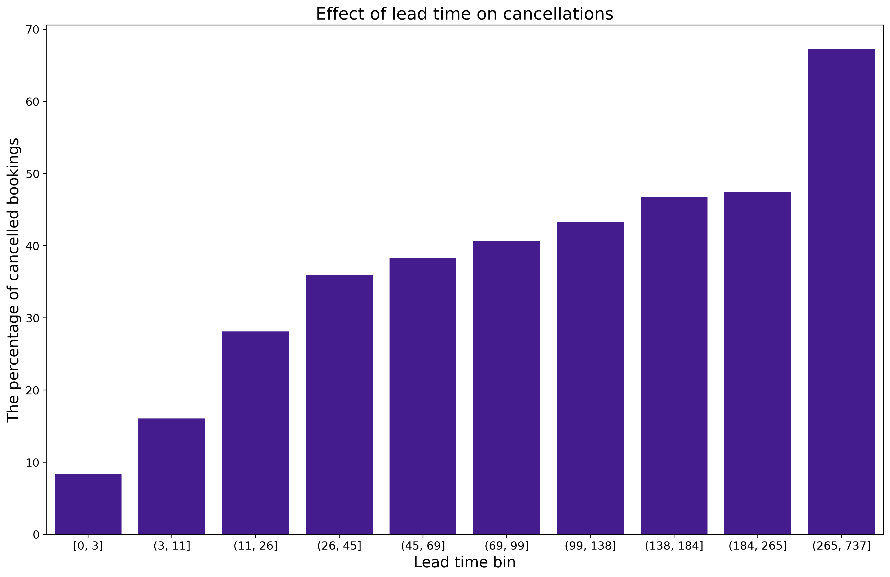
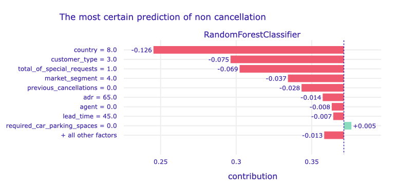
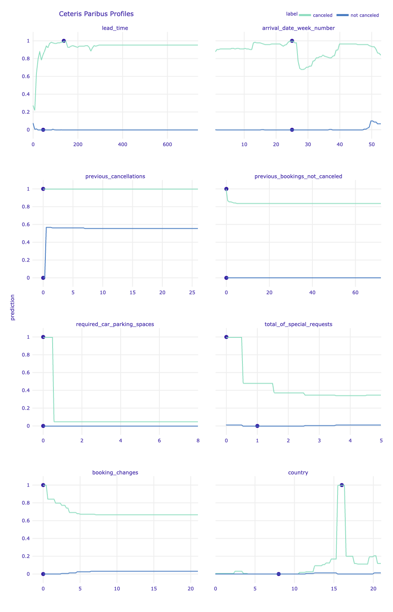
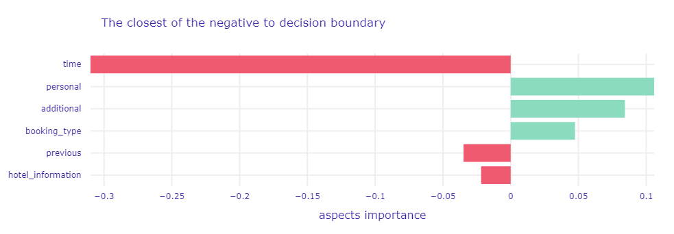
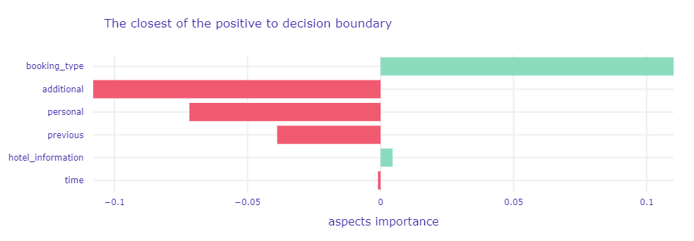
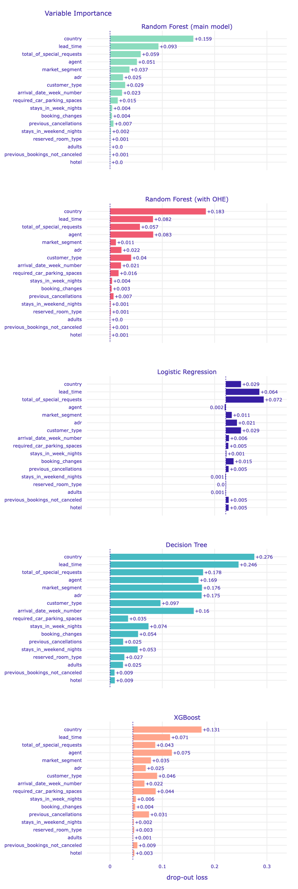
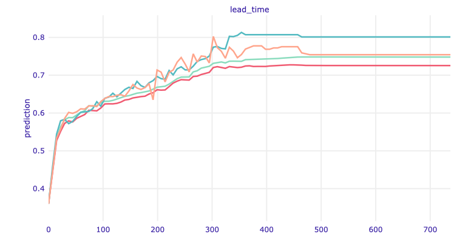
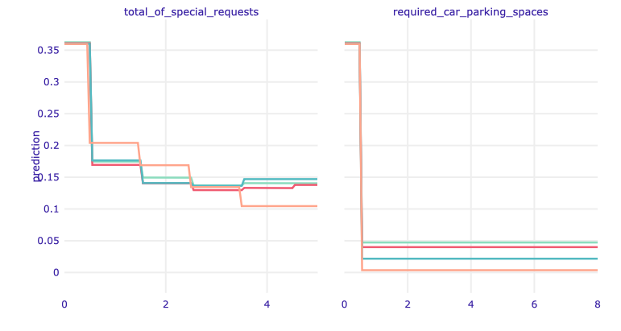

## Explanatory approach to modeling the risk of hotel booking cancellations {#xai1-explainable-hotels}

*Authors: Mateusz Krzyziński, Anna Urbala, Artur Żółkowski (Warsaw University of Technology)*

### Abstract 
Booking cancellations are a key aspect of hotel revenue management. Therefore, in order to better manage the reservation system and apply appropriate cancellation policies, decision support systems based on machine learning models are used. However, behavior of the described and introduced models has not been studied so far and they have not been tested in terms of the causes of their predictions. To fill this gap, we used explainable Artificial Intelligence methods to investigate predictive models based on booking data, both on a global level and for decisions related to individual customers. The purpose of our study is also to provide new insights into the factors that influence cancellation behavior.

### Introduction
One of the biggest problems and challenges facing the hospitality industry is the significant number of canceled reservations. Common reasons for cancellations include a sudden deterioration in health, accidents, bad weather conditions, schedule conflicts, or unexpected responsibilities [@1-5-hotels-modelling-cancellation-behaviour]. Interestingly, a noticeable group consists of customers who, after making a reservation, are still looking for new, better offers, and even make many reservations at the same time to be able to choose the most advantageous one [@1-5-hotels-predicting-to-decrease-uncertainty-increase-revenue].

The hospitality industry's response to the above problem is hotel cancellation policies. They play a crucial role in determining various
aspects of the hotel business, including the ultimate goal of
revenues and profits optimization. In recent years (before the pandemic), there has been a clear tightening of these policies. Hotels do this, for example by shortening the free cancellation windows or increasing cancellation penalties [@1-5-hotels-cancellation-policies-shift; @1-5-cancellations-policies-study].

The use of machine learning to forecast and identify potential cancellations is also playing an increasing role. There are many systems to support hotel management that use booking data. Various machine learning algorithms are used for this purpose, ranging from support vector machines, through artificial neural networks, to the most common tree-based models [@1-5-hotels-efficient-forecasting; @1-5-hotels-prediction-using-crisp-dm]. Most of the solutions and projects are only theoretical, while some have been tested in practice, enabling cancellations to be reduced by up to 37 percentage points [@1-5-hotels-automated-ml-system].
 
Unfortunately, most papers do not tackle the issue of the importance of the used explanatory variables and do not try to explain the model's predictions. However, it is the exploration of trained models that should be treated as one of the key factors in the design of hotel management support systems. Business validation and ethical verification of solutions are necessary. Bearing in mind that a strict cancellation policy or overbooking strategy can have negative effects on both reputation and revenue, systems designers should be wary of unfairly biased behavior. At the same time, the use of explanatory artificial intelligence methods is helpful in creating models with better performance scores.

In the following chapter, we present an analysis of predictive models for hotel booking cancellations. We answer questions about the reasons for the model prediction both in general view and in relation to individual reservations. 

The study was conducted in Python using the scikit-learn [@scikitlearn] machine learning library. Most of the eXplainable Artificial Intelligence (xAI) methods used in the article are implemented in the DALEX [@dalex] package. However, we also used methods implemented by ourselves, based on the triplot [@1-5-triplot] package available in the R language.

### Dataset and models {#dataset_models}

The dataset used to build the models and perform the analysis is the _Hotel booking demand_  dataset, which is publicly available on [Kaggle](https://www.kaggle.com/jessemostipak/hotel-booking-demand). This is a cleaned version of the datasets described in the article _Hotel booking demand datasets_ [@1-5-dataset].

It contains information about bookings from two hotels in Portugal for the period from July 2015 to August 2017. One of the hotels is a resort hotel and the other is a city hotel. There are 119 390 observations in total (each of them describes one reservation). The key is that about 37% of them were canceled which is a pretty large number. The dataset provides 31 attributes that can be useful in prediction but we have selected only the 17 most promising, removing the target leakage or redundant features. The variables included in the modeling are described in the Table \@ref(tab:variables).

```{r variables, out.width="700", fig.align="center", echo=FALSE}
data=data.frame(
   Variable = c ('adr',
 'adults',
 'agent',
 'arrival_date_week_number',
 'booking_changes',
 'country',
 'customer_type',
 'hotel',
 'lead_time',
 'market_segment',
 'previous_bookings_not_canceled',
 'previous_cancellations',
 'required_car_parking_spaces',
 'reserved_room_type',
 'stays_in_week_nights',
 'stays_in_weekend_nights',
 'total_of_special_requests'), 
   Description = c ('Average Daily Rate, calculated by dividing the sum of all lodging transactions by the total number of staying nights', 
                   'Number of adults',
                   'ID of the travel agency that made the booking',
                   '	Week number of the arrival date',
                   'Number of changes/amendments made to the booking from the moment the booking was entered on the Property Management System (PMS) until the moment of check-in or cancellation',
                   'Country of origin',
                   'Type of booking, assuming one of four categories: Contract - when the booking has an allotment or other type of contract associated to it; Group - when the booking is associated to a group; Transient - when the booking is not part of a group or contract, and is not associated to other transient booking; Transient-party - when the booking is transient but is associated to at least another transient booking',
                   'Type of hotel',
                   'Number of days that elapsed between the entering date of the booking into the PMS and the arrival date',
                   'Market segment designation. In categories, the term "TA" means "Travel Agents" and "TO" means "Tour Operators"',
                   'Number of previous bookings not canceled by the customer prior to the current booking',
                   'Number of previous bookings that were canceled by the customer prior to the current booking',
                   'Number of car parking spaces required by the customer',
                   'Code of room type reserved. Code is presented instead of designation for anonymity reasons',
                   'Number of week nights (Monday to Friday) the guest stayed or booked to stay at the hotel',
                   'Number of weekend nights (Saturday or Sunday) the guest stayed or booked to stay at the hotel',
                   'Number of special requests made by the customer (e.g. twin bed or high floor)'),
   stringsAsFactors = FALSE
)
knitr::kable(data, caption='Descriptions of variables used in modeling. The alphabetical order of variable names has been preserved.')
```

Already at the stage of exploratory data analysis (EDA), we managed to notice interesting relationships between the features of the reservation and the indicator of its cancellation. An example of the noticed dependencies is illustrated in Figure \@ref(fig:lead-time). The use of the methods of explainable artificial intelligence helped us, among other things, to confirm the assumptions we had made.

```{r lead-time, out.width="700", fig.align="center", echo=FALSE, fig.cap='Effect of lead time on cancellations. Quantile binning (with the deciles) was used to bin the observations into 10 groups. The ranges of each group are shown on the x-axis. The y-axis shows the percentage share of canceled reservations in a given group. There is a clear trend towards more frequent cancellations of bookings made in advance.'}

```

As part of the research, we trained four models: Decision Tree, Random Forest, Logistic Regression, and XGBoost. In order to select the main model for the project, we compared different metrics. The values of the considered metrics are shown in the Table \@ref(tab:model-comparison). The best model was Random Forest, so we focused on tuning its hyperparameters. We also prepared a version of Random Forest using the label encoding of categorical variables (all previous models used one-hot encoding). Both tuned Random Forest models achieved very similar results, so we decided to use the one with label encoding, which facilitated the use of xAI methods. Thus, in the rest of the article, when we refer to *model*, we mean the Random Forest model with label encoding, unless otherwise stated. Note also that this is a black-box model, so the use of xAI methods is especially important when trying to understand its predictions.

```{r model-comparison, out.width="700", fig.align="center", echo=FALSE}
data=data.frame(
   Model = c ("Decision Tree", "Random Forest", "Logistic Regression", "XGBoost","Tuned Random Forest (with one-hot encoding)", "Tuned Random Forest (with label encoding)"), 
   Recall = c(0.77, 0.76, 0.54, 0.71, 0.82, 0.82),
   Accuracy = c(0.82, 0.87, 0.75, 0.85, 0.89, 0.89), 
   ROC_AUC = c(0.82, 0.93, 0.78, 0.91, 0.96, 0.96),
   F1 = c(0.76, 0.81, 0.62, 0.77, 0.84, 0.84),
   stringsAsFactors = FALSE
)
knitr::kable(data, col.names=gsub("[_]", " ", names(data)), caption='Values of considered metrics for trained predictive models. Values are rounded to two decimal places.')
```

### Local explanations {#local}
In order to explain model output for a particular guest and their booking, we used instance-level exploration methods, such as Break-down [@xai1-breakdown], SHapley Additive exPlanations (SHAP) [@xai1-shapleyvalues], Local Interpretable Model-agnostic Explanations (LIME) [@xai1-lime], Ceteris Paribus (CP) [@xai1-ice]. We decided to investigate noteworthy predictions, i.e. false positive and false negative (respectively canceled bookings predicted as not canceled and vice versa), the most valid (the predictions the model was most sure of), and the closest to decision boundary.

#### False positive and false negative predictions
We might discover that the model is providing incorrect predictions. The key is to find the reasons for this, that is, to answer the question of what has driven the wrong prediction.

We used local explanations methods for the observations in both groups with the worst predictions, i.e. the lowest probability of proper classification.

```{r shap-false-positive, out.width="700", fig.align="center", echo=FALSE, fig.cap='A plot of Shapley values for the main Random Forest model and misclassified observation (false positive) with the highest probability of cancellation. The green and red bars correspond to the contribution of the variable to the prediction. The green ones increase the probability of cancellation, while the red ones decrease it (increase the probability of no cancellation). On the x-axis, there is the model prediction value, while on the y-axis there are variables and their values for the observation.'}
knitr::include_graphics('images/1-5-shap-false-positive.png')
```
Informations with the biggest contribution to the final prediction are guest's country of origin (Portugal), a total number of special requests equals zero, and the fact that customer type related to the given booking is Transient-Party. This is an indication that the model may be slightly biased due to the country of origin. It is the property of the customer and not of the booking itself. Thus, depending on the application, it is worth considering whether this response is satisfactory and meets ethical standards. With every value contributes to the misprediction, the only feature with the correct contribution is customer type (Transient-Party guests are the most popular type of customers, accounting for as much as 75% of bookers).

```{r shap-false-negative, out.width="700", fig.align="center", echo=FALSE, fig.cap='A plot of Shapley values for main Random Forest model and misclassified observation (false negative) with the lowest probability of cancellation. The elements of the plot have the same meaning as in the previous case.'}
knitr::include_graphics('images/1-5-shap-false-negative.png')
```
It can be seen that the largest contributions are related to the country of origin of the booker and the type of guest assigned to them. It is worth noting that the values of these variables are the same as in the case of the observation analyzed in Figure \@ref(fig:shap-false-positive). Again, they contribute to the same side of the prediction, but the contribution values are different. In this case, the type of client turns out to be the most important. Most of the values also affect the prediction of no cancellation. It is interesting that a slightly later booking in relation to the date of stay (lead time) has the opposite effect than in the previous example. The reason is the dependencies between the variables.

```{r shap-false-predictions, out.width="700", fig.align="center", echo=FALSE, fig.cap='A plot of LIME model values for the main Random Forest model and the most missclassified observations.'}
knitr::include_graphics('images/1-5-lime-false-predictions.png')
```
The similarity between the observations is also noticeable in the LIME method. The first five variables are identical and have almost the same coefficients. Therefore, it is these less significant variables that influence the final prediction.

In the case of these two observations with similar characteristics, but completely different predictions, the use of the SHAP method (generalizing the Break-down method) gives a better picture. The glass box model selected in LIME method to approximate the black-box model, and not the data themselves, is not able to capture dependencies between variables.


#### The most valid predictions
The considered model returns an appropriate prediction in over 89% of cases. However, the level of certainty of the model with respect to the prediction (i.e. the probability that an observation is assigned to a class) may be different. Thus, it is worth considering why the model is almost sure of some outputs and how would the model's predictions change if the values of some of the explanatory variables changed.

We used local explanations methods for the observations in both groups with the best predictions, i.e. the highest probability of proper classification (equal to 1.0).

```{r shap-best-negative, out.width="700", fig.align="center", echo=FALSE, fig.cap='A plot of Shapley values for the main Random Forest model and observation with sure negative prediction.'}

```
Like in the previous examples - the largest contribution has the country, in that case: France. Again, this is a Transient-Party customer and that also affected the prediction. Also, no special requests affect negatively prediction (more than eg. no previous cancellations). Only one of the top variables affected positively: it was no required car parking spaces, but this impact was unnoticeable in the final prediction.

```{r shap-best-positive, out.width="700", fig.align="center", echo=FALSE, fig.cap='A plot of Shapley values for the main Random Forest model and observation with sure positive prediction.'}
knitr::include_graphics('images/1-5-shap-best-positive.png')
```
Again, Portugal as a country of origin affected positively the probability of cancellation (keep in mind that the hotel is in Portugal, so we can assume that compatriots cancel their reservations more often). Also, no special requests affected positively prediction (although in the previous case it had a negative effect). We can notice that for positive prediction other factors have the biggest impact than for negative. Eg. a longer lead time moved up to the third place and now has a positive impact.

```{r ceteris-paribus-sure, out.width="700", fig.align="center", echo=FALSE, fig.cap='Ceteris Paribus profiles for the selected continuous explanatory variables and label encoded country variable for the main Random Forest model and observations with the sure prediction. Dots indicate the values of the variables and the values of the predictions for observations. Green profiles are for sure positive prediction (a cancellation), while blue profiles are for sure negative prediction.'}

```
Looking at the Ceteris Paribus profiles, it is intuitive to see that the prediction for the observation classified as the not canceled stay is more stable, i.e. less sensitive to changes in the values of explanatory variables.

In the case of observation of canceled reservations, a change of the arrival date by a few weeks would cause a significant decrease in the certainty of the prediction. It is related to the seasonality of bookings (the decrease occurs at the beginning of July - the holiday period). However, the biggest changes in the prediction for this observation could be due to noting the fact of additional booking requirements (required car parking spaces and a total number of special requests). Changing these values to non-zero would change the prediction completely. Moreover, the huge changes depend on the country of origin of the booker, which in this case is Portugal.

When considering the prediction for an observation classified as not canceled, we see that the only explanatory variable whose change would have a significant impact on the certainty of the prediction is the number of previously canceled reservations. A change to any non-zero value would change the prediction, but its certainty would be close to the decision boundary.


#### The closest to decision boundary predictions
We analyzed the situations when the model is sure of the returned output. However, the observations for which the prediction was uncertain, close to the decision limit, are also worth considering.

We might want to know the answer to the question of whether it is a matter of similar numbers of explanatory variables shifting the prediction in different directions, or maybe there are variables that do not fit the whole picture, and therefore the model is not certain. It is also worth checking how much such predictions fluctuate depending on the changes in the explanatory variables.

```{r shap-negative-50, out.width="700", fig.align="center", echo=FALSE, fig.cap='A plot of Shapley values for the main Random Forest model and observation classified as negative with probability near 50%.'}
knitr::include_graphics('images/1-5-shap_negative_50.png')
```
This is a very interesting example. One variable fixed prediction. Very short lead time (one day) opposed all other factors like Portugal as country of origin or no special requests and made the model predict correctly. It is amazing, that one factor can change everything.

```{r shap-positive-50, out.width="700", fig.align="center", echo=FALSE, fig.cap='A plot of Shapley values for the main Random Forest model and observation classified as positive with probability near 50%.'}
knitr::include_graphics('images/1-5-shap_positive_50.png')
```
This observation is not so exciting as the previous one, but it is the next evidence that the special requests decrease the probability that the client will cancel the reservation. Nevertheless, this observation was classified as positive. Agent was the most important positive variable although in the previous examples he did not have such a contribution.


In order to better understand why the predictions for these observations are close to the decision boundary, we used the method implemented by ourselves, based on the triplot, which made it possible to check the importance of thematically grouped variables, taking into account the correlation between them. Thanks to this, it was also possible to look more generally at the factors influencing a given prediction (note that it can be complicated to investigate the effects of particular variables if there are many, as in this case).

The thematic groups of variables, i.e. the aspects, we have created are presented in the Table \@ref(tab:aspects).

```{r aspects, out.width="700", fig.align="center", echo=FALSE}
data=data.frame(
   Aspect_name = c ("time", "previous", "booking_type", "hotel_information", "additional", "personal"), 
   Features = c('lead_time, stays_in_weekend_nights, stays_in_week_nights, arrival_date_week_number', 'previous_bookings_not_canceled, previous_cancellations', 'agent, market_segment, customer_type', 'adr, hotel, reserved_room_type', 'required_car_parking_spaces, total_of_special_requests, booking_changes', 'country, adults'),
   stringsAsFactors = FALSE
)
knitr::kable(data, col.names=gsub("[_]", " ", names(data)), caption='Created aspects and features grouped in them.')
```

```{r triplot-negative-50, out.width="700", fig.align="center", echo=FALSE, fig.cap='A plot of Aspects Importance for the main Random Forest model and observation classified as negative with probability near 50%. It shows the group of variables contributions to the single prediction. The green and red bars correspond to the contribution of the aspects to the prediction. The green ones increase the probability of cancellation, while the red ones decrease it (increase the probability of no cancellation).'}

```

```{r triplot-positive-50, out.width="700", fig.align="center", echo=FALSE, fig.cap='A plot of Aspects Importance for the main Random Forest model and observation classified as positive with probability near 50%.'}

```
Now we can clearly identify why the model predictions are close to the decision boundary. Note that the most important aspect for both observations affects the prediction in one direction, and the next three affect the prediction in the opposite.

In the case of the non-canceled booking, the most important factors are time-related variables (of course, lead time is the key here, also indicated as the most important in the SHAP, see Figure \@ref(fig:shap-negative-50)).
However, we can notice new insights regarding the canceled booking. It turns out that the model indicated its cancellation mainly due to factors related to the booking type.

### Global explanations

The second group of methods of explainable artificial intelligence is those concerning not a single observation, but the entire set of them. We used these model-level explanations to provide information about the quality of the model performance and infer how the model behaves in general. The methods we used for this purpose are Permutational Variable Importance [@xai1-vip], Partial Dependence Profile (PDP) [@xai1-pdp], Accumulated Local Effects (ALE) [@xai1-ale]. We applied them not only to the main Random Forest model but also to other trained models to compare the obtained results.

#### Importance of explanatory variables
First, we decided to check which variables are important for our main model and compare the obtained results with the intuitions we had after conducting the exploration at the prediction level.  

```{r pvi-main-model, out.width="700", fig.align="center", echo=FALSE, fig.cap='A plot of variable importance for the main Random Forest model. The length of each bar represents the difference between the loss function (1-AUC) for the original data and the data with the permuted values of a particular variable.'}
knitr::include_graphics('images/1-5-pvi-main-model.png')
```
As we can see above, the most important variable for the model is the information about the guest's country of origin. This confirms the intuitions obtained thanks to local explanations, for many observations this variable was the key aspect. In particular, the origin of Portugal (the country where the hotels are located) is the most significant for the prediction. 

The method indicated that the next principal variables for predictions are information on lead time and the number of special booking requests. Lead time is the number of days that elapsed between the entering date of the booking into the system and the arrival date. It is a factor that may inform about whether the stay was planned long before or it is spontaneous. Meanwhile, the number of special requests is related to additional interest in the booking, which may indicate that it is an important stay for the client.

The next variables with a significant average impact on the model are the group of those concerning the booking method (agent and market segment) and the type of booking (customer type and adr associated with the booking cost).

It should also be noted that some of the variables are of marginal importance.
These are (from the bottom of the plot) the type of hotel (recall that the data relate to two hotels of different specificity), the number of adults, the number of previously not canceled bookings (this is probably also related to a small number of observations with a non-zero value of this feature - 3.1% in the entire dataset), the type of room reserved.
These are the variables that should be considered to be excluded in order to simplify the model.

On the other hand, it is quite surprising that the number of previously canceled reservations, which was often indicated by LIME as one of the most important factors for the predictions under consideration, is so insignificant (0.007 drop-out loss) according to the algorithm of the permutational variable importance.


#### Comparison with other models

Plots similar to that above in Figure \@ref(fig:pvi-main-model) are useful for comparison of a variables' importance in different models. It may be helpful in generating new knowledge - identification of recurring key variables may lead to the discovery of new factors involved in a particular mechanism [@EMA] (in our case, cancellation of reservations). 

Thus, we decided to compare the importance of the variables in the models we had trained, described in the [Dataset and models](#dataset_models) section. The plots below show the results for our main Random Forest model and 4 other models with legend:

- <span style="color:#8fddbf">**green**</span> - Random Forest with label encoding (main model),
- <span style="color:#eb5872">**red**</span> - Random Forest with one-hot encoding,
- <span style="color:#3e09a1">**purple**</span> - Logistic Regression,
- <span style="color:#53bac1">**blue**</span> - Decision Tree,
- <span style="color:#fba58e">**orange**</span> - XGBoost.


```{r pvi-comparison, out.width="700", fig.align="center", echo=FALSE, fig.cap='The comparison of the importance of explanatory variables for selected models. The elements of a single plot were described above. Note the different starting locations for the bars, due to differences in the AUC score value obtained for the training dataset for different models.'}

```

It can be seen that the importance of the variables is related to the type of algorithm used in a given model. For example, in a decision tree, each variable has a clearly noticeable effect on the predictions.

In all the tree-based models explained, the most important variable overlaps - it is the aforementioned country of origin. In the logistic regression model, this feature is the third most important variable, but it is the model with the worst score overall. 

However, in general, the groups of the most important variables in each model are also similar. So our earlier conclusions regarding the key booking cancellation factors are confirmed. Likewise, in each of the tree-based models (even in a single decision tree model), the same variables were indicated as least important. 

An interesting fact is that in Random Forest with one-hot encoding the agent variable is even more important than in Random Forest with label encoding. It is a categorical variable, so we can see the influence of encoding here - trees could extract more information from this variable thanks to not creating unnatural numerical relationships as with label encoding. The second noticeable difference between these models is the importance of the market segment. 


#### The global impact of variables

Then we decided to check the influence of the most influential variables on the predictions in the context of the whole set. For this, we used the ALE method. The plots below show the results for our Random Forest and 3 other tree-based models with legend:

- <span style="color:#8fddbf">**green**</span> - Random Forest with label encoding (main model),
- <span style="color:#eb5872">**red**</span> - Random Forest with one-hot encoding,
- <span style="color:#53bac1">**blue**</span> - Decision Tree,
- <span style="color:#fba58e">**orange**</span> - XGBoost.

Note that we chose not to generate plots for the logistic regression model because it performed too poorly.

```{r ale-country, out.width="700", fig.align="center", echo=FALSE, fig.cap='ALE plot for the country. The ALE plots work like Ceteris Paribus - they show how the variable affects a prediction but not only for one observation - for the entire training dataset.'}
knitr::include_graphics('images/1-5-ale-country.png')
```

We have a greater probability of resignation for one country - this is Portugal. This confirms our hypothesis built on the basis of local explanatory methods. Generally, compatriots more often resign from booking.

```{r ale-leadtime, out.width="700", fig.align="center", echo=FALSE, fig.cap='ALE plot for lead time.'}

```

And again we have confirmation that the longer the lead time, the greater the chance that the customer will resign. 

The ALE plots are very similar to Ceteris Paribus but that is a great example that they are not the same. Look at the Ceteris Paribus profile for lead time in Figure \@ref(fig:ceteris-paribus-sure). The probability of resignation increased to about 170 days, then decreased and remained at a constant level. Here we can see that it was the "local behavior". Globally, the probability only grows, then it stabilizes (after about 350 days - a year). Therefore, you may suspect that it is not worth allowing reservations so far in advance.

```{r ale-leadtime-30, out.width="700", fig.align="center", echo=FALSE, fig.cap='ALE plot for lead time shorter than 35 days.'}
knitr::include_graphics('images/1-5-ale-leadtime-30.png')
```

Moreover, one can spot the biggest change in predictions up to 30 days of lead time, which confirms the intuition coming from data exploration (see Figure \@ref(fig:lead-time)). Thus, it is worth taking a closer look at how the ALE profiles change in this short period. In Figure \@ref(fig:ale-leadtime-30), we can see that the increase in the average prediction is greater up to about 15 days, then it starts to stabilize.

```{r ale-requests, out.width="700", fig.align="center", echo=FALSE, fig.cap='ALE plot for total of special requests and required car parking spaces.'}

```

Additional actions taken by the client regarding booking reduce the likelihood of cancellation.

The very first special request significantly reduces the probability of resignation. The influence of the next ones is not that clear. This also confirms the thesis we made earlier that the lack of special requests increases the probability of resignation. 

Reserving a parking space has an even greater impact on the predictions. We may think that in these hotels it is payable in advance, or that car travelers are less dependent on public transport, so their arrival is more certain.


```{r ale-previous, out.width="700", fig.align="center", echo=FALSE, fig.cap='ALE plot for previous cancellations and previous bookings not canceled.'}
knitr::include_graphics('images/1-5-ale-previous.png')
```

Information about a given customer's prior bookings is also very valuable for prediction. The fact of earlier cancellation of a reservation strongly influences the prediction of the next one, which seems natural.

A non-zero number of prior non-canceled bookings works the opposite way, but the prediction values don't fluctuate that much.

After analyzing these examples, an important conclusion can be drawn about the XAI methods. ALE plots can be a great tool for analyzing the influence of variables on the prediction - they can be used to verify the hypotheses put forward at the stage of local explanations and introduce new ones. 

When comparing the results for different models, note that the profiles for Random Forests with both versions of the categorical variable encoding are almost identical (green and red lines in the graphs).

Looking more broadly, the profiles are comparable for all models. The most significant differences can be seen in the variables relating to the previous reservations of a given customer - the number of canceled and non-canceled reservations. The XGBoost model favors non-zero values more - the prediction changes are bigger. In general, this model is the most sensitive to all variables, as can be seen from the shape of the profile curves.

Moreover, we used the comparison of the PDP and ALE plots for our main model (see Figure \@ref(fig:ale-pdp)). In the case of some variables, the profiles generated using both methods almost coincide. However, there are also variables where you can see differences in prediction values, but profiles are parallel to each other. This parallelism suggests and allows us to conclude that the used model is additive due to these explanatory variables [@EMA].

```{r ale-pdp, out.width="700", fig.align="center", echo=FALSE, fig.cap='Partial-dependence and accumulated-local profiles for the main Random Forest model and selected variables'}
knitr::include_graphics('images/1-5-ale-vs-pdp.png')
```


### Summary and conclusions

The use of explainable artificial intelligence methods helped us understand the behavior of the models created. This is crucial before the implementation of any hotel management support systems based on machine learning models, in particular in the light of the current legal regulations [@1-5-right-to-explanation] and the currently processed documents [@1-5-regulation-proposed].

Referring to the so-called *Right to Explanation*, it is especially important to provide the analysis of the examples of model prediction for single observations, i.e. a single customer and the booking made by them. The way the analysis presented by us can be considered an example of partial explanation. In addition, we have indicated the types of predictions that should be examined before putting the model into use - false positive and false negative, the most valid, and the closest to the decision boundary.

Furthermore, we managed to discover that the country of origin of the booker is the most important factor determining the decisions of the created models. They are more likely to predict cancellations for people from the country where the hotels are located, i.e. Portugal. In business use, this could be considered an unfairly biased behavior, so the possible solution would be to use separate models for predicting cancellations for foreigners and compatriots. Moreover, the identification of the least significant variables makes it possible to eliminate them and simplify the model.

Thanks to the conducted analysis, we also discovered the variables to which the model is notably sensitive. We indicated the ranges of the biggest changes in prediction, which in the case of designing the final system may be crucial for uncertain bookings, i.e. the predictions that are close to the model decision boundary.

The xAI methods also allowed for the validation of the created model and an additional, not related to any metric, assessment of its behavior. By comparing several models, we gained confidence in the correctness of the main model analyzed in the article. The comparisons made also showed the impact of the coding of categorical variables on the predictions of the model. It turned out that this technical aspect did not significantly affect the interpretation of the features by models.

In addition, it should be borne in mind that the discovered and described relationships serve not only to explain the operation of the model itself, but also constitute a newly generated knowledge about the phenomenon of hotel cancellation and confirm its causes, often intuitive, but not described in the scientific literature. This can be helpful for research on hotel cancellation policies.

To conclude, the above article shows a real-life use case of using the methods of explanatory artificial intelligence. It is these methods that allow us to understand the operation of complex machine learning models, enabling us to validate them and generate new domain knowledge.
