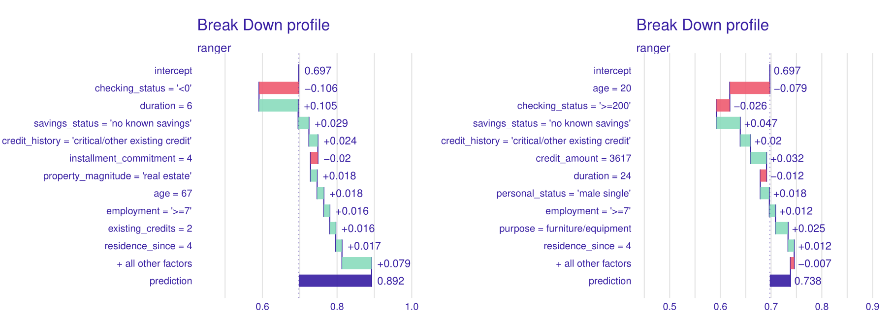
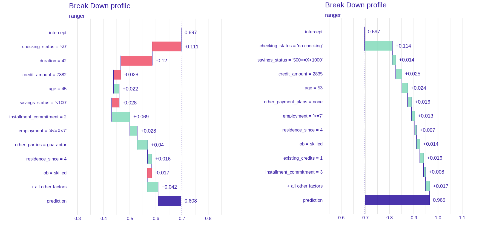
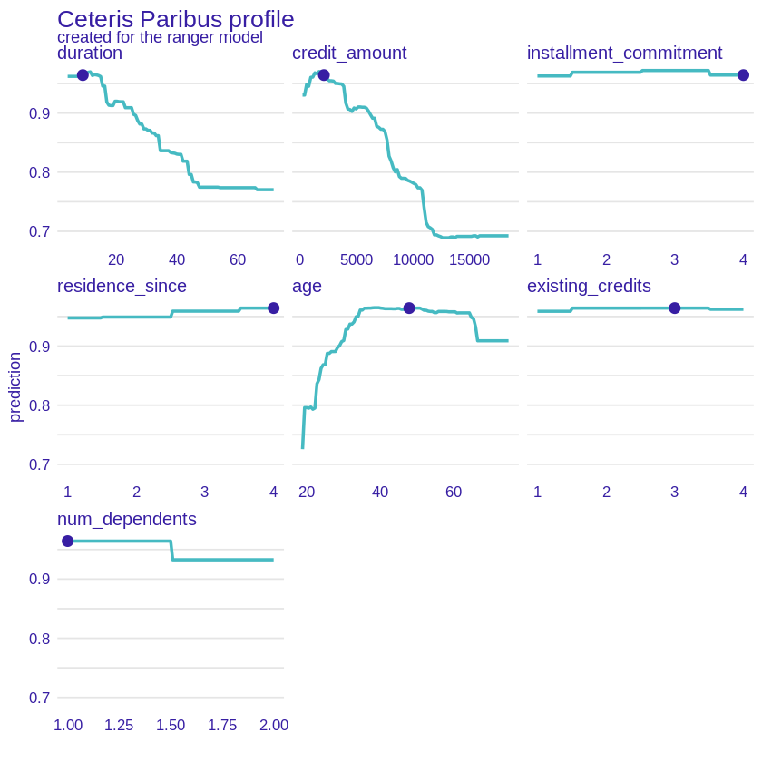
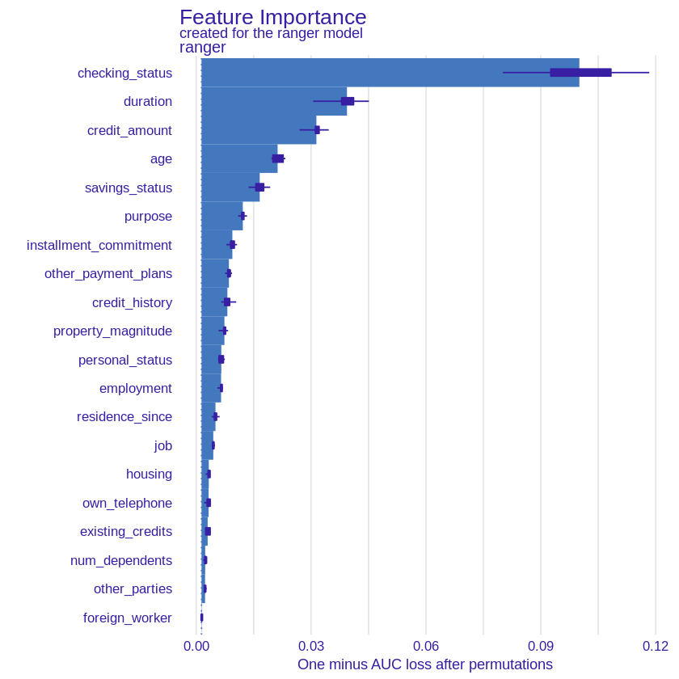
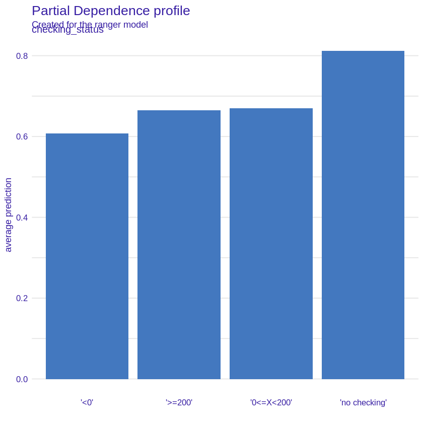
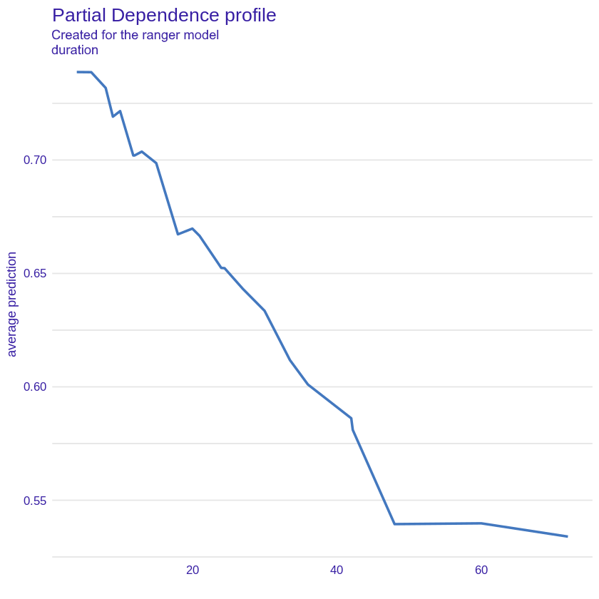
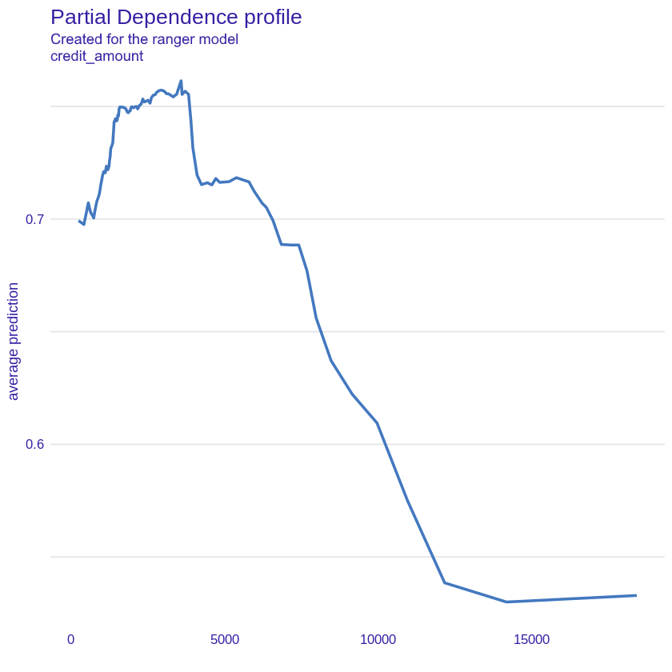
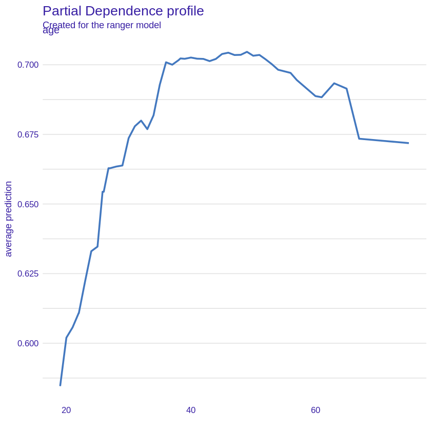

## Classifying people as good or bad credit risks {#xai1-explainable-german-credits}

*Authors: Paweł Fijałkowski, Paulina Jaszczuk, Jakub Szypuła (Warsaw University of Technology)*

### Introduction

In 1980s first ever PC was introduced to the public. Since then, rapid technological progress in computer-science lead to enormous demand for implementing and developing previously theoretical studies to suit capable of remembering and performing extensive calculations machines. By combining academic effort with pragmatical, engineer approach, humanity succeeded in building complex infrastructure that is able to solve pretty much any problem we have ever faced.

We found ourselves in the point, where machine-learning algorithms make sensitive and in many cases opinion-based decisions, based on numerical and statistical analysis. It may seem harmless on the first glance, but do we really "trust" these models when it comes to predicting lung cancer? Or granting us a credit? In many cases, we do not and we should not.

This is where XAI or Explainable Artificial Intelligence kicks in. It is a branch of AI, which results can be clearly understand and interpreted by experts in a given field (in order to e.g. comply with regulations or improve model user experience). XAI, using multiple complementary tools, turns black-box (meaning, very hard to interpret and understand even by specialist) ML models into white-box predictable solutions. Why is it important? Mainly for two reasons. First one is, we feel safer knowing what is going under the hood. We can't simply "believe" outputted answer without digging into specifics on what grounds it was constructed. It gives us sense of security and provides a way of detecting possible miscalculations. Second reason is, these models, due to their mathematical construction (often minimizing value of loss function) in many cases proved to tend towards biases. 
This cannot be accepted while building systems supporting banks or hospitals. 

In the article below, we are facing the problem of creating explainable classifier for German bank credit score. We will build black-box model and then employ XAI methods in order for us to understand which features and statistics tend to outbalance model's decision towards good/bad borrower classification.

### Dataset and models

During entire analysis, we'll be operating on publicly available data set containing information about German borrowers. Input was processed/collected by Professor Dr. Hans Hofmann from [University of Hamburg](https://www.uni-hamburg.de/en.html) and is available [here](https://archive.ics.uci.edu/ml/datasets/statlog+(german+credit+data)).

Data set provider, basing on academic research,  have chosen certain variables to describe each borrower. That combination of numerical and qualitative variables proved to carry certain importance/influence on probability of paying back borrowed assets. 

Brief overview of statistics describing an observation (columns in data set):

Statistic                 Explanation
-----------------------   ----------------------------- 
checking_status           Status of existing checking account (qualitative)
duration                  Credit duration in months (numerical)
credit_history            Credit history (qualitative)
purpose                   Purpose (qualitative)
credit_amount             Credit amount (numerical)
savings_status            Savings account/bonds (qualitative)
employment                Present employment since (qualitative)
installment_commitment    Installment rate in percentage of disposable income (numerical)
personal_status           Personal status and sex (qualitative)
other_parties             Other debtors / guarantors (qualitative)
residence_since           Present residence since (numerical)
property_magnitude        Property ownership (qualitative)
age                       Age in years (numerical)
other_payment_plans       Other installment plans (qualitative)
housing                   Current housing deal (qualitative)
existing_credits          Number of existing credits (numerical)
job                       Job type quality (qualitative)
num_dependents            Number of people being liable to provide maintenance for (numerical)
own_telephone             Ownership of telephone (qualitative)
foreign_worker            Worker from abroad (qualitative)


Author also suggest using cost function that "punishes" model more for false-positives (classification of bad customer as a good one) than for false-negatives. For a model user (i.e bank-owner), it is much worse to classify bad customer as a good one, than the other way around.

After careful deliberation and testing using multiple metrics the team decided to use random forest as a baseline model for further modeling and explanations. Random forest is a supervised machine learning algorithm, basing on a simple idea of decision tree. Each decision tree is making a classification prediction and then their votes are counted/merged. Only difference between
standard forest voting and random forest is that in the latter case, only random subset of features is considered during selecting most important feature (with lowest gini index value).
Model performed exceptionally good during cross-validation, even without fine parameter hyper-tuning.

### Local explanations

To better understand the behavior of Random Forest, we employed a set of machine learning explanation methods. In order to comprehend the reasoning behind model predictions and interactions between variables we began at the local level, i.e. single observation. This way, we could compare influence of each variable within a clearly defined context of every potential borrower. Our primary motivation in selecting observations to present in this paper was to show interesting cases and how variables interact with one another in our model in creating predictions. As a result we selected various observations.

Methods employed by us were Break-down, SHAP, LIME and Ceteris Paribus.

#### Initial analysis

We began by analyzing the output of the Break-down method on two random observations. Once compared side-by-side (see the figure) several key differences emerge. First of all, the importance of checking status variable (which will return in forthcoming sections). One can also notice the importance of the "age" variable, which seems intuitive. A further conclusion can be drawn from this - influence of a variable depends on its value. In fact, depending on interactions between variables in the data set even the same value can have opposite effects. An example (although miniscule) can be found by comparing observations 4 and 7 (both classified correctly). The same value of "job" variable (i.e. "skilled") gives opposite influences (-1.7% "bad" probability and +1.4% respectively). Thus we should always take into account context in which each variable is evaluated.
 
Regarding specific conjectures on the data set one can draw from this comparison, we can see that both observations share 7 out of the top 10 most influential variables. Among them are, for example age, checking status, which would be expected by a "common sense" intuition. Influences confirm that intuition. Young age contributes negatively towards credit rating and lower duration positively. Same for checking status - the higher the better. 

```{r 2-2-breakdown, out.width="700", fig.align="center", echo=FALSE, fig.cap='Comparison of plots of breakdown method for two observations - number 1 (left) and number 94 (right). Positive values indicate an increase in probability of being classified as a "good" borrower while negative values indicate the opposite.'}

```

```{r 2-2-bd-different-impact, out.width="700", fig.align="center", echo=FALSE, fig.cap='Comparison of plots of breakdown method for two observations - number 4 (left) and number 7 (right). The same value of job variable has a different effect on the prediction.'}

```

#### In-depth analysis

Consequently, we used SHAP method to analyze the first observation and compare results with the Break-Down method. The results of this can be seen in the figure below. Duration and checking status remain the two most important variables, while age grows in importance. 8 of the top 10 variables remain the same, with around the same influences. The major difference being absence of information on existing credits and residence since, have been replaced with credit amount and purpose. This method offers new information, primarily about the variation of influence of each variable. One can notice that age is the most varied (since it can affect the prediction both positively and negatively), which again would correspond to the "common sense" intuition (as with duration, the credit amount and checking status). The opposite occurs with credit history, purpose, property magnitude and length of employment, where variation remains lower compared to influence. Changes, in order of importance are rather small, only the installment commitment moves by more than 3 places (from number 5 to number 10). The rest is swapping of checking status and duration, fall of property magnitude by 2 places, employment by 1 place and rise of age by 2 places. It should be noted that all these changes occur similar or very similar absolute influence values in break-down method. One can judge that importance of variables is a trait that can remain consistent between various explanation methods.

```{r 2-2-breakdown2, out.width="700", fig.align="center", echo=FALSE, fig.cap='A plot of results of SHAP method for 1st observation'}
knitr::include_graphics('images/2-2-shap.png')
```

#### The most certain predictions

Our model classifies clients in binary terms as good and bad potential borrowers but the certainty of its predictions is not always the same. We decided to analyze the cases in which it has no doubts which group to assign a given client to. For this purpose, we used the Cateris Paribus method which checks how the prediction for a given observation would change for different values of one variable while the others remain constant.

```{r 2-2-cp21, out.width="700", fig.align="center", echo=FALSE, fig.cap='A plot of results of CP method for 21st observation'}

```

Looking at the Cateris Paribus plot for an observation that the model classified as a good borrower with almost 97% certainty, we can draw several conclusions. First, the variables were divided into those important and less important for the model prediction. 'Duration', 'credit amount', and 'age' would clearly change the result if they had a different value - for example, a few thousand higher credit amount would significantly reduce the prediction, as would the duration value. On the other hand we see plots of 'installment commitment', 'residence since', 'existing credits' and 'num dependents' which are almost straight lines - changing their values would hardly affect the model's predictions. This allows us to conclude that in this case it was the values of these three variables (listed first) that mainly determined the classification of the borrower. 

The explanations also once again confirm our intuition - the high certainty of the model as to the classification of the customer as a good borrower was motivated by logical arguments - 
a relatively low loan amount, short loan duration and the average age of the borrower.

```{r 2-2-cp64, out.width="700", fig.align="center", echo=FALSE, fig.cap='A plot of results of CP method for 64st observation'}
knitr::include_graphics('images/2-2-cp64.png')
```

Cateris Paribus charts for an observation confidently classified as a bad borrower are almost the opposite of the previous ones. This time the client is very young, he wants to take a high loan with a long repayment period. All these features have a negative effect on prediction. Interestingly, if only a few years older client applied for the same loan, the model's prediction would be much higher. 

Once again, 'installment commitment', 'existing credits' and 'num dependents' features do not seem to be important in the classification. However, the variable 'residence since' is different, as if it had assumed the value 1, it would significantly increase the prediction.


#### Incorrect predictions

Although the accuracy of our model is at satisfactory level, sometimes it is providing incorrect predictions. We decided to take a closer look and analyze the situations when our model misclassifies. For this purpose we explained the false positives and false negatives predictions with the local methods LIME and SHAP.

##### False positive

```{r 2-2-lime_false_pos, out.width="700", fig.align="center", echo=FALSE, fig.cap='A plot of results of LIME method for 56th observation which was missclasified by our model and predicted as false positive'}
knitr::include_graphics('images/2-2-lime_false_pos.png')
```

The model classified the observation positively mainly on the basis of the features duration (12 months) and savings status (no known savings). This is in line with our earlier conclusions - a short loan duration has a positive effect on prediction. 

To better understand the operation of the model in this case, we also made an explanation using the SHAP method. 

```{r 2-2-shap_false_pos, out.width="700", fig.align="center", echo=FALSE, fig.cap='A plot of results of SHAP method for 56th observation which was missclasified by our model and predicted as false positive'}
knitr::include_graphics('images/2-2-shap_false_pos.png')
```

The explanations agree on the influence of feature savings status but according to the SHAP method, duration has a marginal positive effect on prediction. Interestingly, both methods give checking status as the most influential feature. Its value (in the range from 0 to 200) negatively affects the prediction which is how the model should classify this observation but this is outweighed by the positive effects of other features.

##### False negative

```{r 2-2-lime_false_neg, out.width="700", fig.align="center", echo=FALSE, fig.cap='A plot of results of LIME method for 945th observation which was missclasified by our model and predicted as false negative.'}
knitr::include_graphics('images/2-2-lime_false_neg.png')
```

The model's prediction was not certain, but it indicated that the client is a bad borrower with a probability of 65%. The biggest negative contributions are related to checking status (in the range from 0 to 200), credit history (no credits/all paid) and duration (48 months). While the relatively long loan term may indeed have a negative effect on the prediction, the fact that there are no other loans seems to be contradictory. The LIME method did not answer all our questions. To dispel any doubts we also explained the observations using the SHAP method.

```{r 2-2-shap_false_neg, out.width="700", fig.align="center", echo=FALSE, fig.cap='A plot of results of SHAP method for 945th observation which was missclasified by our model and predicted as false negative.'}
knitr::include_graphics('images/2-2-shap_false_neg.png')
```

SHAP's explanations are very similar to those LIME's ones. 
Again, features duration, checking status and credit hisotry have the greatest influence on negative prediction. Perhaps the strange contribution of the feature credit history is due to its interaction with other variables.


### Global explanations

A major shortcoming of local explanations is that they are just that - local. It is the ability to see "the bigger picture" that allows us to achieve a better understanding of the model. Thus, we resolved to using Global Explanation methods in order to properly grasp approach behind predictions in our machine learning model.

#### Feature Importance


First of all, we began with Feature Importance method which gives information on the importance of features in the model. The results of applying this method on our model can be seen in the figure below.  

```{r 2-2-feature_importance, out.width="700", fig.align="center", echo=FALSE, fig.cap='A plot of Feature Importance values for each variable for our model.'}

```

As one can notice, results are in line with local explanations. That is, the domination of such features as checking status, credit duration and credit amount. Then follows age, saving status and purpose. Yet again, our "common sense" intuition seems to be confirmed. Noteworthy, the plot resembles an exponential function, hinting that predictions are based mostly on the first few most important features, a trait not so obvious to observe in local explanations. It should be noted, however, that the low impact on the prediction of some variables may be dictated by a small number of observations - e.g. the number of non-foreign workers in our data set is just under 4%.

Surprisingly, the explanation showed that some variables that had a significant influence on the prediction in local explanations, had a very low global impact on the model, e.g. installment commitment (installment rate in percentage of disposable income), which in both incorrectly classified observations was in the lead in terms of importance according to SHAP explanation but globally its impact was marginal.

We can also notice the opposite situation - a globally important variable has almost no impact on the prediction of a specific observation - an example may be the age variable, which, according to feature importance, has the fourth largest impact on the prediction while in the analyzed by us incorrectly classified observations it is quite the opposite.

If we assume that the model is correct, then we can also draw conclusions regarding the "real life" importance of features. Those results should still be compared with other Global Explanation methods.

#### Dependence of variables

The feature importance method seems to be very helpful in exploring the model, but it also has some drawbacks. One is that it does not perform well on correlated variables - permutating only one dependent variable while the other remains constant is not the best solution. In the case of our data set this problem also occurs - for example, the duration of the loan is strongly correlated with its amount. For this reason, we decided to use the triplot package which enables the analysis of grouped variables. We divided the features of our data into 3 categories - those relating to the loan (e.g. credit amount and duration), the client's account (e.g. checking and savings status) and the borrower himsefl (e.g. age and employment). Then we explained the contribution of the whole groups of variables.

```{r 2-2-triplot, out.width="700", fig.align="center", echo=FALSE, fig.cap='triplot for grouped variables.'}
knitr::include_graphics('images/2-2-triplot.png')
```

As we can see, although according to Feature Importance the most important variable for our model is checking status (rating group), the total prediction is influenced most by the characteristics of the loan itself while the variables connected with the current account have the most marginal effect on the model

#### Global impact of specific variables
In order to better understand the influence of specific variables on the model prediction in relation to the global reference, we decided to perform the PDP explanations. This method works similarly to Cateris Paribus - it shows the preduction of the model for different values of the variable while maintaining other features of the model constants. We explained the four features that turned out to be the most significant for our model according to Feature Importance (checking status, duration, credit amount, age).

##### Checking status

```{r 2-2-pdp-checking-status, out.width="700", fig.align="center", echo=FALSE, fig.cap='PDP plot for checking status variable.'}

```

As we can see, a customer with a negative checking status has the lowest probability of being a good borrower according to the model and the best borrowers turn out to be those without a current account. It is somewhat surprising that the slightly higher prediction applies to customers with a lower positive checking status than those with a higher one. This may be due to the small number of clients with high checking status - just over 6% of all while other values are evenly matched.

##### Duration

```{r 2-2-pdp-duration, out.width="700", fig.align="center", echo=FALSE, fig.cap='PDP plot for duration variable.'}

```

The variable duration plot leads us to similar conclusions as for the local explanations. The longer the loan term, the greater the credit risk. For the initial values the prediction of a good borrower decreases almost linearly (the jagged graph is the result of using the random forest model), to a certain threshold of around 40 months when the loan duration is already so long that this variable does not have a significant impact on the prediction.

##### Credit amount

```{r 2-2-pdp-credit-amount, out.width="700", fig.align="center", echo=FALSE, fig.cap='PDP plot for credit amount variable.'}

```

The plot of credit amount is somewhat similar to that of duration. As the loan amount increases, the probability that the customer will turn out to be a good borrower decreases until the loan is so high (around 12,000) that increasing it no longer has a significant impact on the prediction. The initial low value of the prediction and the increase for the loan amount from 0 to 4000 may be due to the fact that clients taking loans for small amounts may have problems with financial liquidity.

##### Age

```{r 2-2-pdp-age, out.width="700", fig.align="center", echo=FALSE, fig.cap='PDP plot for age variable.'}

```

The age plot is consistent with our earlier assumptions and intuition - young borrowers who do not yet have a stable position on the labor market and their income is uncertain are the clients for whom credit risk is the highest. Subsequently, the prediction increases to peak for an approximately 38-year-old borrower. Statistically, people of this age have a stable job with high earnings. Thereafter, the prediction remains steadily high until around 55 years after which it begins to decline - this corresponds to the period when borrowers begin to retire which causes their incomes to decline frequently.


### Summary and conclusions

Applying XAI methods to our black-box model helped understand it, turning it, even if by a minimal margin, into more of a glass-box model. We found the most important features (that is checking status, duration, credit amount and age) and the rules governing their influence on predictions. We also confirmed the validity of a "common sense" intuition, e.g. the probability of being a "good" borrower being lower for very young and very old people. This allows us not only to validate the performance of our model, but also to better understand the rules governing this dataset. 

We can confidently say, that the main aim of our work has been achieved. The model has been explained and various explanations remained stable between methods used. Assuming our methodology was correct, it would mean that it is an adequate explanation that works not only within the model, but also within the data. With real-life data this can approach could prove useful in finding dependencies and interactions with phenomena, one would not connect with machine learning on first instinct. However, this would require greater research, far exceeding scope of this article.  

