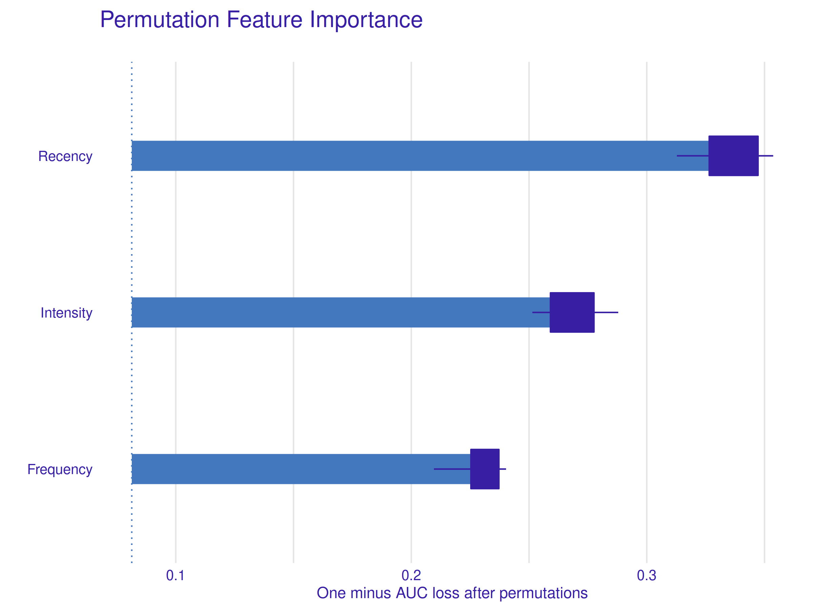
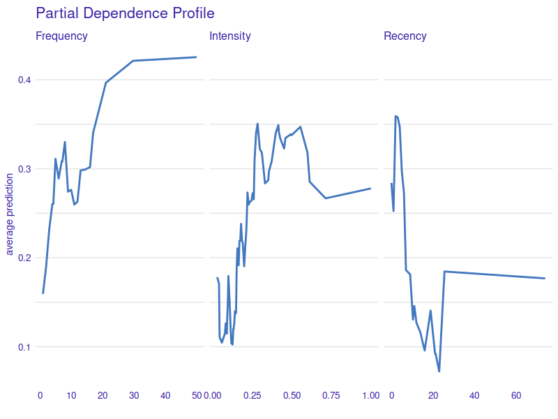
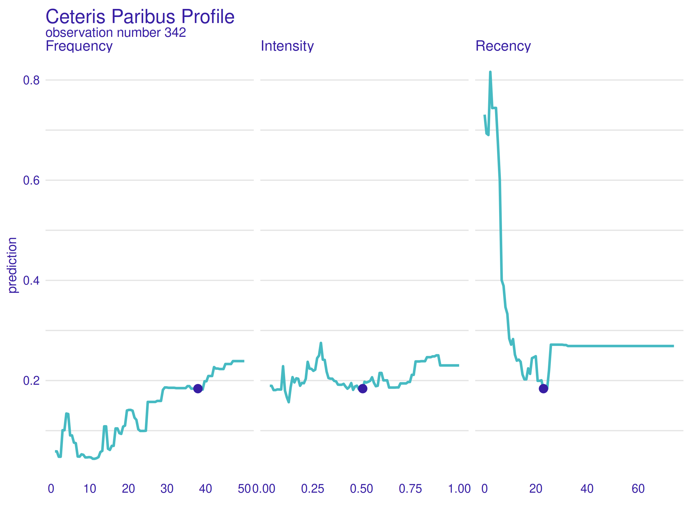
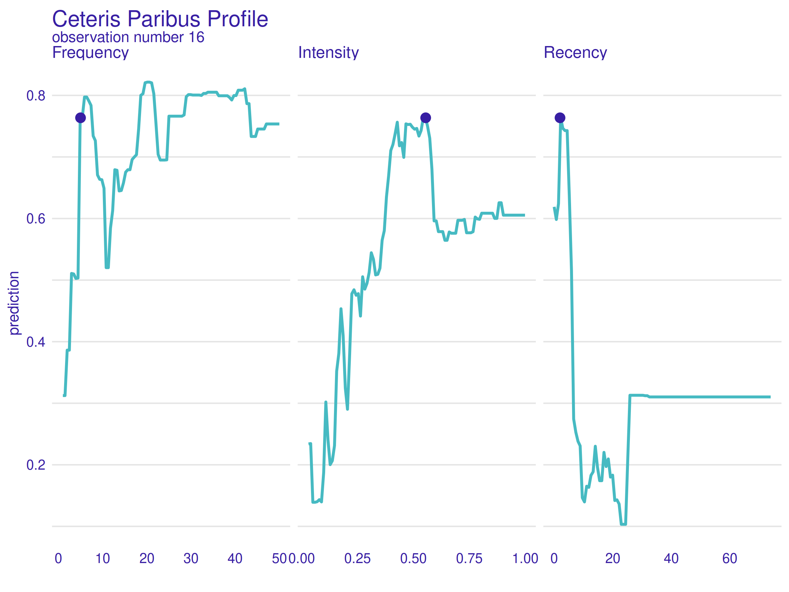
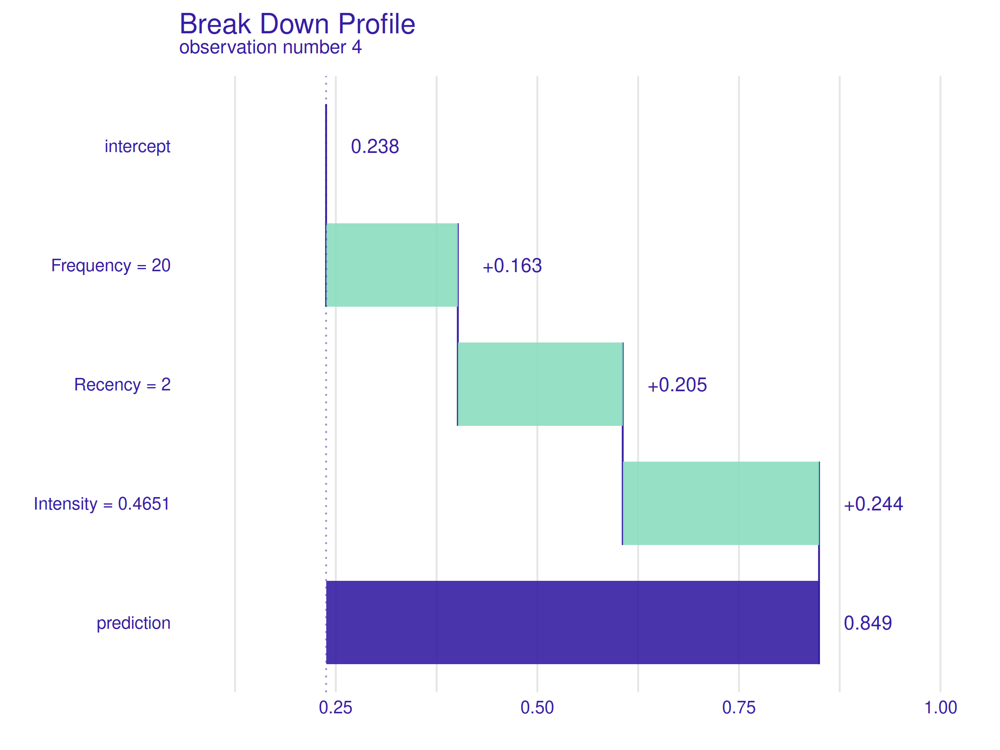
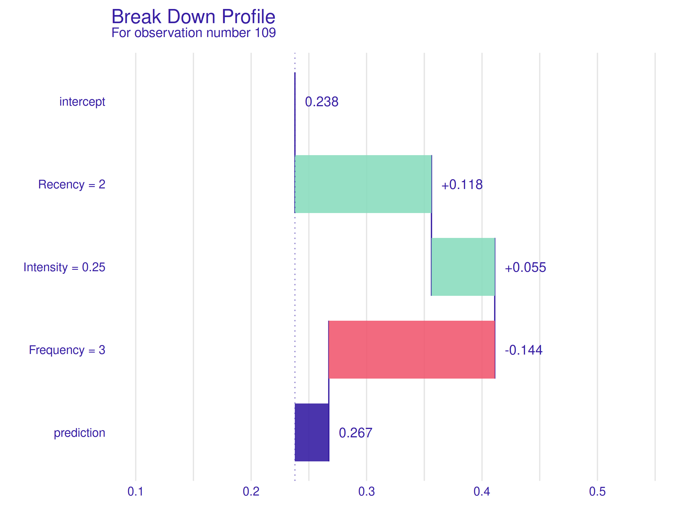

## How to predict the probability of subsequent blood donations?

*Authors: Maciej Chylak, Mateusz Grzyb, Dawid Janus (Warsaw University of Technology)*

### Abstract

Blood donated for transfusions saves millions of lives every year. Reliable prediction of a patient's blood donation intention is valuable information for the medical community. This work focuses on studying machine learning predictive models for such tasks through methods of explainable artificial intelligence (XAI). We consider a model based on the Random Forests algorithm and a dataset containing information about patients' blood donation history. Through prudent data pre-processing, model preparation, and the use of global and local explanations of the model, we exhibit how strongly and in what way various features affect the model's prediction. During our analysis, we also uncover meaningful patterns hidden in the data itself. Among other conclusions, we show that a short time since the patient's last donation is crucial for positive prediction and that donation burnout is a probable effect affecting donors. We believe that the presented results are valuable for this matter of life and death subject.

### Introduction and motivation

Interest in explainable artificial intelligence (XAI) has increased significantly in recent years. XAI facilitates humans to understand artificial intelligence solutions [@2-3-xai]. It contrasts with a concept of the black box, where even its designers cannot explain why an AI model has arrived at a specific conclusion. The intense development of such methods has led to the wide choice of XAI tools that we have today [@2-3-landscape]. It includes the R package DALEX [@2-3-dalex], which is the foundation of this work.

Our goal is to prepare and explain a model designed to predict the probability of subsequent blood donations based on a history of a patient's previous offerings. Careful use of XAI tools allows us to verify model correctness and discover phenomena affecting blood donations that hide in the data. Obtained knowledge may have various implications, especially better prediction of future blood supply and an improvement of planning and advertising of blood donation campaigns.

### Related work

The prediction of an intention of a blood donation seems to be an important issue, as there are multiple articles available that try to tackle it while making use of machine learning methods and often the same dataset that is also used during this work. A few of them are presented shortly below.

In [@2-3-rel-1], the authors test Multilayer Perceptrons and Support Vector Machines in combination with Principal Component Analysis as a solution to the mentioned issue. Their models achieve good results, and some ways of further improvement are proposed.

In [@2-3-rel-3], the authors use unsupervised machine learning techniques to cluster the data before building predictive models and check whether the performance is significantly improved when using such an approach. They found out that a Support Vector Machines model based on data clustered into four distinct groups with the K-Means algorithm achieved the best sensitivity of 98.4 %.

In [@2-3-rel-2], the authors study models created in the JustNN environment. They propose a model with an outstanding test subset accuracy of 99.31 %. They identify the Recency, Time, and Frequency variables (described precisely in the following section of this article) to be the most important factors.

In [@2-3-rel-4], the authors use a different dataset but of a partly similar structure. They note that some religious periods like Fasting and Performing Hajj may negatively affect the number of donations.

It is important to say that none of the articles we found include explainable artificial intelligence methods. Therefore, the presented approach is novel and may potentially lead to a perspective undiscovered before.

### Data and model

#### Original dataset

The data, which all the prepared models are based upon, comes from the Blood Transfusion Service Center Data Set, which is available through OpenML website [@2-3-openml].

The dataset consists of 748 observations (representing individual patients) described by 5 attributes:

  * recency - months since last blood donation,
  * frequency - total number of blood donations,
  * monetary - total amount of donated blood in c.c.,
  * time - months since first blood donation,
  * donated - a binary variable representing whether she/he donated blood in March 2007.

#### Data analysis

Initial data analysis is a critical process allowing to discover patterns and check assumptions about the data. It is performed with the help of summary statistics and graphical data representations. 

The short data analysis below is based on two visualizations representing distributions and correlations of variables.

```{r 2-3-distributions, out.width='600', fig.align='center', echo=FALSE, fig.cap='Distributions of explanatory variables (histogram)'}
knitr::include_graphics('images/2-3-distributions.png')
```

Based on the above figure \@ref(fig:2-3-distributions), an important insight can be made - distributions of Frequency and Monetary variables are identical (excluding support). It probably comes from the fact that during every donation the same amount of blood is drawn. The presence of both of these variables in the final model is pointless.

```{r 2-3-correlations, out.width='600', fig.align='center', echo=FALSE, fig.cap='Correlations of explanatory variables (correlation matrix)'}
knitr::include_graphics('images/2-3-correlations.png')
```

The above figure \@ref(fig:2-3-correlations) represents correlations of explanatory variables measured using robust Spearman's rank correlation coefficient. Apart from the already clear perfect correlation of Monetary and Frequency variables, a strong correlation of Time and Monetary/Frequency variables is visible. It probably comes from the fact that the minimal interval between subsequent donations is strictly controlled. Such dependence can negatively affect model performance and the accuracy of explanations. This potential problem is addressed during the pre-processing of used data.

#### Pre-processing

A simple data pre-processing is conducted, mainly to reduce detected correlations of explanatory variables.

Firstly, the variable Monetary is removed from the dataset. The information it carries duplicates information contained in the Frequency variable.

Secondly, a derived variable is introduced instead of the Time variable. It is called Intensity and is calculated as follows:

$$\textrm{Intensity} = \frac{\textrm{Frequency}}{\textrm{Time}-\textrm{Recency}}$$

The above equation results in values between around 0.031 and 1.

The denominator can be interpreted as a time window bounding all the known donations of a given patient.

Spearman's rank correlation coefficient of the new variable Intensity and the old variable Frequency is -0.46, which is better compared to the previous 0.72 value for the Time and Frequency combination.

#### Final model

According to the OpenML website, Ranger implementation of Random Forests [@2-3-ranger] is among the best performing classifiers for the considered task. All the tested models utilize this machine learning algorithm.

Performance of the models is assessed through three measures - basic classification accuracy and more complex area under the Receiver Operating Characteristic curve (ROC AUC) [@2-3-roc-1] [@2-3-roc-2] and area under the Precision-Recall curve (PR AUC) [@2-3-pr-1] [@2-3-pr-2]. PR AUC is an especially adequate measure for unbalanced classification problems [@2-3-pr-3], which is the case here.

Based on the described measures, the best model is chosen from the models trained on the following explanatory variables subsets:

* Recency, Time
* Recency, Frequency,
* Recency, Frequency, Time
* Recency, Frequency, Intensity

The first two models, utilizing only two explanatory variables, perform significantly worse. Out of the last two models, the model utilizing the Time variable is slightly worse than the model utilizing the introduced Intensity variable.

The accuracy of the last model is 0.85, other performance measures describing it are presented graphically below.

```{r 2-3-roc, out.width='600', fig.align='center', echo=FALSE, fig.cap='ROC curve and corresponding AUC for the final model'}
knitr::include_graphics('images/2-3-roc.png')
```

ROC curve visible in the above figure \@ref(fig:2-3-roc) represents good model performance and the AUC value of almost 0.92 is satisfactory.

```{r 2-3-pr, out.width='600', fig.align='center', echo=FALSE, fig.cap='PR curve and corresponding AUC for the final model'}
knitr::include_graphics('images/2-3-pr.png')
```

The baseline for the ROC AUC is always 0.5, but it is not the case for the PR AUC. Here, the baseline AUC is equal to the proportion of positive observations in the data. In our case it is $\frac{178}{748}=0.238$. Due to the above, the PR AUC value of around 0.81 visible in the figure \@ref(fig:2-3-pr) is also proof of high model precision.

Summarizing the above model selection, the final model used for all the presented explanations is Ranger implementation of Random Forests utilizing Recency, Frequency, and Intensity variables. Its performance measures are at least good, so the prepared explanations have a chance to be accurate.

### Global explanations

Global explanations are used to discover how individual explanatory variables affect an average model prediction on the level of the whole dataset. Here, one can learn how strong is the influence of a given variable or how its particular values shape the overall model response.

In the case of large numbers of observations, global explanations can be prepared using only a representative fraction of them to save calculations time. Dataset presented in this work can be considered of modest size, and therefore all observations are always used.

#### Permutation Feature Importance

Permutation Feature Importance [@2-3-pfi] is a method of assessing how strongly a given variable affects the overall model prediction. The idea behind it is to measure a change in the model's performance when it is not allowed to utilize a selected feature. Removal of variables from the model is realized through multiple random permutations of them.

```{r 2-3-permutation, out.width='600', fig.align='center', echo=FALSE, fig.cap='Permutation Feature Importance Profile'}

```

Figure \@ref(fig:2-3-permutation) shows, all explanatory variables have significant importance in the model under study. The most important feature is the Recency (highest loss after the permutations) followed by the derived variable Intensity and the Frequency in the last.

The significance of the Recency variable is also well visible later on, especially when local explanations are considered.

#### Partial Dependence Profile

Partial Dependence Profile [@2-3-pdp-1] [@2-3-pdp-2] allows users to see how the expected model prediction behaves as a function of a given explanatory variable. It is realized through averaging (basic arithmetic mean) of multiple Ceteris-Paribus Profiles, a method described shortly in the Local Explanations section.

```{r 2-3-pdp, out.width='600', fig.align='center', echo=FALSE, fig.cap='Partial Dependence Profile'}

```

First of all, curves presented in the figure above \@ref(fig:2-3-pdp) are visibly ragged. It is mostly caused by the selection of the machine learning algorithm - Random Forests contain many if-then rules that can change the final prediction value rapidly, even under small explanatory variable change. Therefore, it is best to look at the overall shape of yielded curves and ignore fine uneven details.

Visible shapes are largely in line with the intuition - higher Frequency and Intensity values lead to higher average prediction (probability of subsequent blood donation to recall), whereas the impact of Recency is inverse - the lower the value, the higher the prediction.

However, some parts of the curves need further investigation - the tails. For the Frequency variable, the profile tail simply flattens, whereas for the other two variables there is a significant change in the mean prediction value.

The explanation for this in the case of the Frequency and Recency variables is simple - an insufficient amount of data. There are only eight observations with $\textrm{Frequency} > 30$ and only nine observations with $\textrm{Recency} > 24$. It is a worthy reminder that XAI methods can be only as good as the data and the model themselves.

Interestingly enough, the case of the sudden drop in the mean prediction as a function of the Intensity variable is much different. It is a genuine pattern contained in the data itself, that the model has learned to take an advantage of. The following table aids greatly in interpreting these results:

|                                  | Observations with Intensity > 0.55 (group A) | Observations with Intensity < 0.55 (group B) |
|:--------------------------------:|:--------------------------------------------:|:--------------------------------------------:|
| **Total number of observations** |                      241                     |                      507                     |
|   **Number of positive cases**   |                      42                      |                      136                     |

In group A there is 17 % of positive observations, and in group B there is 27 %. Using Fisher's exact test [@2-3-fisher] it can be shown that the difference in proportions between mentioned groups is statistically significant (p-value 0.0028).

A probable hypothesis is that above a certain Intensity threshold there is an increased chance of a patient's burnout caused by too frequent donations.

#### Accumulated Local Effect Profile

The method presented in the previous subsection - Partial Dependence Profile, can be misleading if explanatory variables are strongly correlated, which to some extent is still the case here, even after the pre-processing. Accumulated Local Effect Profile [@2-3-ale] is another method used to explain a variable's effect on the prediction, which is designed to address the mentioned issue.

```{r 2-3-ale, out.width='600', fig.align='center', echo=FALSE, fig.cap='Accumulated Local Effect Profile'}
knitr::include_graphics('images/2-3-ale.png')
```

Although this method addresses the very problem the used data has, no significant difference is visible in the figure \@ref(fig:2-3-ale) when compared to the previous figure \@ref(fig:2-3-pdp). It only reassures that the conclusions presented in the previous subsection are correct. 

### Local explanations

Local explanations are relevant on a level of a single observation. They aid in understanding how strongly and in what way explanatory variables contribute to the model's prediction when considering a single instance of data. It is a visible contrast when compared to the previously presented global explanations.

#### Ceteris Paribus Profiles

"Ceteris Paribus" is a Latin phrase that translates to "other things held constant" or "all else unchanged". The idea behind this method is rather simple - for every variable, prediction is plotted as a function of its changing value while all other variables are held constant. Primary variables' values come from a previously selected single observation and are marked with dots.

This tool is also known as Individual Conditional Expectations [@2-3-ice].

```{r 2-3-ceteris1, out.width='600', fig.align='center', echo=FALSE, fig.cap='Ceteris Paribus Profile for observation number 342'}

```

In the figure above \@ref(fig:2-3-ceteris1), Ceteris Paribus Profile for observation number 342 is presented. This patient is characterized by high Frequency and Intensity values (which has already been shown positive in terms of the model's prediction), but also a high Recency value (which on the contrary is considered a negative trait).

It is worth noting that the model's prediction for this observation is correct (she/he did not donate).

As the rightmost plot shows, the model's prediction could be improved significantly only by lowering the Recency value. It is coincident with common sense - if someone was, at a time, an active donor but has not donated for almost two years, the chance of another donation seems low.

Also, this local explanation complements the previously presented Permutation Feature Importance well - explanatory variable Recency is the most important one because it can negate the effect of positive values of both the other variables.

```{r 2-3-ceteris2, out.width='600', fig.align='center', echo=FALSE, fig.cap='Ceteris Paribus Profile for observation number 16'}

```

In the figure above \@ref(fig:2-3-ceteris2), Ceteris Paribus Profile for observation number 16 is presented. This patient is characterized by a moderate Frequency value, a high Intensity value and a low Recency value.

It is worth noting that the model's prediction for this observation is correct (she/he did donate).

What is interesting here is that the Intensity variable value is nearly perfect. Value even a little higher would raise the risk of the hypothetical donation burnout and lower the predicted donation probability. It is convincing proof that the described before patterns hidden in the data are expressed in the model as well and reveal themselves on a level of single observations.

#### Break Down Profiles

The last method presented aims to answer probably the most elementary question that can be asked when trying to explain the model's behavior - what is the contribution of particular variables to the prediction for a single observation? Break Down Profile [@2-3-break] does it by evaluating changes in the mean model's prediction when the values of consecutive variables are being fixed.

```{r 2-3-break1, out.width='600', fig.align='center', echo=FALSE, fig.cap='Break Down Profile for observation number 4'}

```

In the figure above \@ref(fig:2-3-break1), Break Down Profile for observation number 4 is presented. The patient's characteristics are good and well balanced - twenty completed donations, only two months since the last donation, and an Intensity value of around 0.47, which is high but, as it has been shown already, not too high.

It is worth noting that the model's prediction for this observation is correct (she/he did donate).

The plot shows, the contributions of variables are all positive and well balanced as the values themselves. The result is not surprising but creates a good reference point for the following explanation.

```{r 2-3-break2, out.width='600', fig.align='center', echo=FALSE, fig.cap='Break Down Profile for observation number 109.'}

```

In the figure above \@ref(fig:2-3-break2), Break Down Profile for observation number 109 is presented. This patient is chosen deliberately because of the same low Recency value as the previous example but much lower Intensity and Frequency values.

It is worth noting that the model's prediction for this observation is correct (she/he did not donate).

A Recency of two months still has a similar positive impact, but a mediocre Intensity value and a low Frequency change the prediction dramatically.

When compared to the previous explanation, this plot is a perfect example of how important for positive prediction is that all variables' values are well balanced. Previously (first Ceteris Paribus profile), it was visible that a high Recency value can negate the effect of positive values of the other two variables, but here it becomes clear that a low Recency value cannot make up for unfavorable values of the other two variables.

### Conclusions and summary

After data analysis and pre-processing, model preparation and selection, preparation and investigation of global and local model explanations, the short answer to the title question - "How to predict the probability of subsequent blood donations?" - is as follows:

The most important factor is whether the patient under consideration is active - when her/his last donation took place more than six months ago, the subsequent donation probability falls drastically, and other factors lose their importance.

But when the Recency is low, other factors become decisive. A bigger number of past donations is almost always considered positive for the prediction, and higher values of the proposed Intensity feature are favorable only until a certain threshold (around 0.55) when a phenomenon of burnout probably becomes relevant.

We believe that the purpose of our work has been fulfilled. We took care to prepare a precise model based on meaningful data to limit the uncertainty of the obtained model explanations. The same conclusions came up multiple times during the analysis of different explanations, which reassures their correctness. Some of the discovered phenomena are visible not only in the explanations but also in the data itself.

Over the years, XAI has become a powerful tool that can produce numerous meaningful insights about the considered model and the data itself. With that said, it is best used with caution, as any statistical tool can yield false conclusions when its assumptions are not carefully checked.