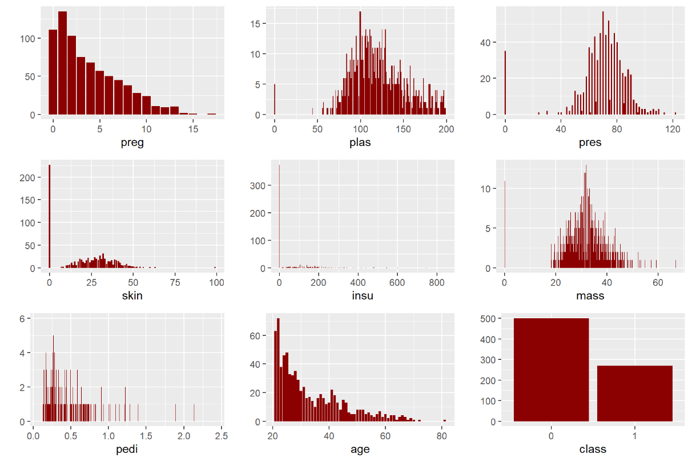
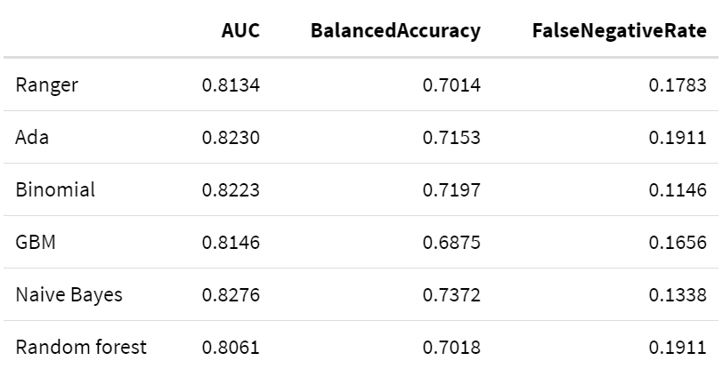
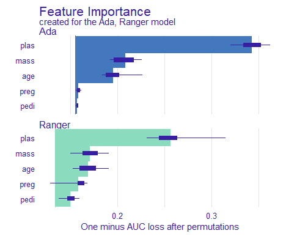
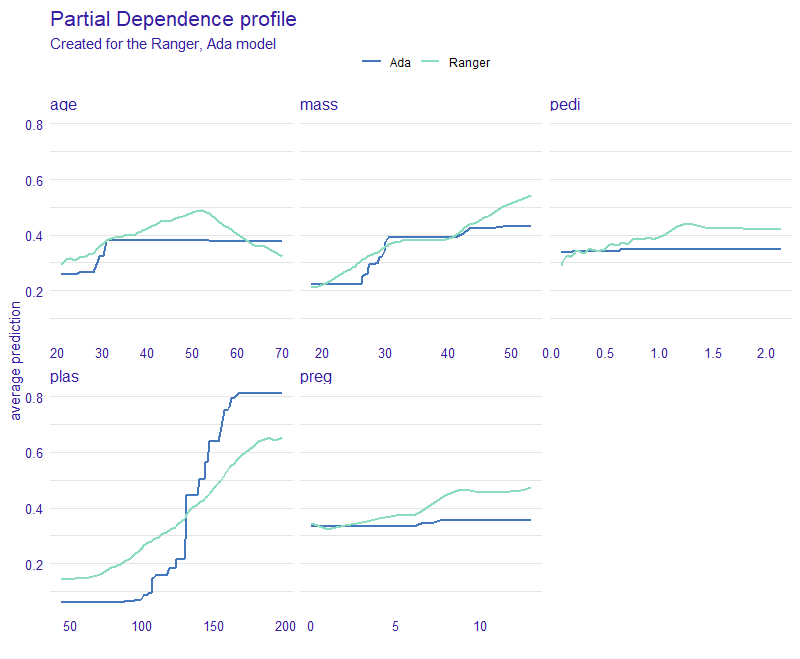
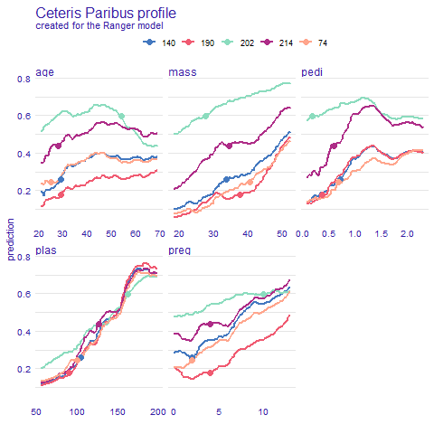
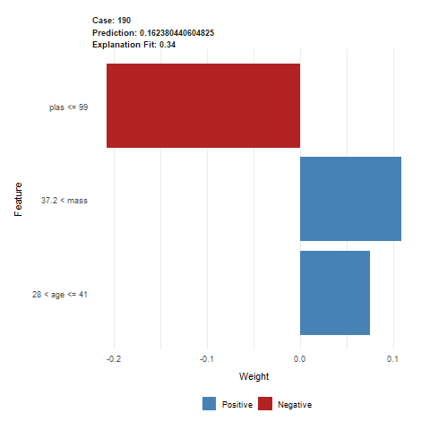
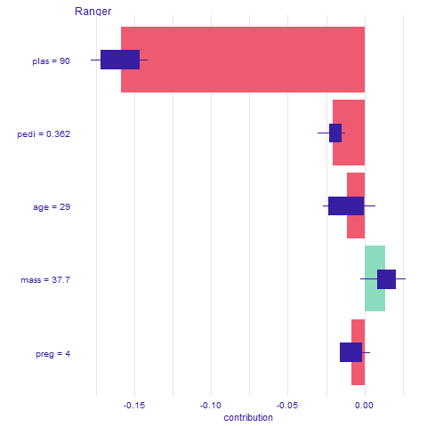
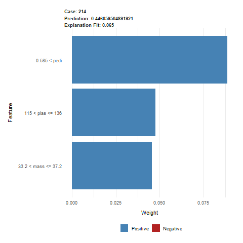

## Explaining diabetes indicators

*Authors: Martyna Majchrzak, Jakub Jung, Karol Niewiadomski (Warsaw University of Techcnology)*

### Abstract

Machine Learning is nowadays widely used in many more or less scientific fields. Some interesting ones include economy, social networking and medicine. Sometimes however we not only need a well performing model but also an understable one. The Explainable Atrificial Intelligence (XAI) is still pretty new concept and has a lot of potential for its use. In this paper we harness XAI methods for a real world medicine problem. We take a look at the diabetic data, build a decent model based on it and try to understand what conclusions the model has reached. As a result of our experiment we will try to understand what factors contribute to higher chance of diabetes occurence.

### Keywords

Machine Learning, Explainable Artificial Intelligence, XAI, Classification, Diabetes

### Introduction

With the rise in popularity of Machine Learning algorithms people started questioning the solutions obtained by computers' calculations. As an answer a whole new branch of AI has been formed - Explainable Artificial Intelligence (XAI). With its methods we analyzed the model made for the specific problem.

Our task was to find correlation between different biomarkers and positive diagnosis of diabetes based on the data of over 700 women of indian ancestry (Pima tribe). In order to do that, we used XAI tools on our black box models to present the decision making process of algorithms in understandable for humans way from which we could later draw conclusions.

### Methods

#### Dataset

Our dataset consists of 768 observations of 8 features being different biomarkers and 1 target variable (`class`) saying if that woman was diagnosed with diabetes. 

- `preg` : number of pregnancies
- `plas` : plasma glucose concentration (mg/dL) at 2 hours in an OGTT (oral glucose tolerance test) - a test in which subject is given glucose and blood samples are taken afterward to determine how quickly it is cleared from the blood
- `pres` : blood pressure (mm Hg)
- `skin` : triceps skinfold thickness (mm) measured at the back of the left arm. A measurement giving rough information about body fat percentage.
- `insu` : 2-hour serum insulin (mu U/ml)
- `mass` : BMI index (weight in kg/(height in meters)^2)
- `pedi` : diabetes pedigree function outcome, where DBF is a function that uses information from parents, grandparents, siblings, aunts and uncles, and first cousins and provides a measure of the expected genetic influence of affected and unaffected relatives on the subject’s eventual diabetes risk
- `age` : age (years)
- `class` (target): 1 if tested positive for diabetes, 0 otherwise

{width=70%}

The dataset didn't have any missing data, however after analysing the features and their meaning we found many 0 values that made no sense and weren't physically possible (for example 0 value of `mass` which is BMI index - mass (in kilograms) divided by squared height (in meters)). We then went through the article for which this data was collected and found that it was possible that some tests had never been carried for some observations. This meant that the 0 values in our dataset (for features other than `preg` and `class` for which they absolutely make sense) were actually missing values.

#### Dataset versions

During preprocessing and based on the observations of our fist models we created 4 different versions of dataset which we later used to train our models. First, the dataset was randomly divided into a training dataset (70% of data) and testing dataset(30% of data). Then the datasets were individually modificated in the following way:

- `original` - base dataset with no modifications
 
- `naomit` - base dataset excluding observations with any missing values

- `mice` - base dataset with all missing values imputed with mice (Multivariate Imputation by Chained Equations) package using PMM method. Mice is suitable for this dataset, since the values are missing at random. 
 
- `skip` - base dataset excluding features `skin`, `insu` and `pres` with missing values in `mass` and `plas` imputed with mice package
 
|Dataset |Rows Train| Rows Test | Columns|
--- | --- | --- | --- |
|original|537|231|9|
|naomit|372|160|9|
|mice|537|231|9|
|skip|537|231|6|

#### Measures

For the assessment of the model in our experiment we will use three commonly known measures:

1.  **AUC - Area Under ROC Curve**     
 
An ROC curve (receiver operating characteristic curve) is a graph that shows the performance of a classification model at all classification thresholds. This curve plots two parameters:
TPR (True Positive Rate) and FPR (False Positive Rate), defined as:

  $TPR=\frac{TP}{TP+FN}$
    
  $FPR=\frac{FP}{FP+TN}$
 
2.  **BAC - Balanced Accuracy**
 
 This measure is a weighted accuracy, that is more suitable for datasets with imbalanced classes. 
 
3. **FNR - False Negative Rate**
 
It corresponds to the number of cases where model incorrectly fails to indicate the presence of a condition when it is present, divided by the number of all.

  $FNR=\frac{FN}{TP+FN}$

 It is particularly important for medical data models, because it indicates how many sick patients are going to be categorised as healthy, and therefor not get any treatment.

#### Models

To identify the models, that could potentially be efficient classificators on this dataset, we measured the AUC, Balanced Accuracy and False Negative Rate measures on 6 different classification models from `mlr` package:

Tree-based models:

- **Random Forest** - Random Forest

- **Ranger** - Random regression forest

Boosting models:

- **Ada** - Adaptive Boosting

- **GBM** - Gradient Boosting Machine

Other:

- **Binomial** - Binomial Regression

- **Naive Bayes** - Naive Bayes

### Explanations

In this section we will take time to investigate some model explanations that we will be using later. Feel free to use this chapter as reference for quick overview. For more in-depth knowledge please refer to paper [_Explanatory Model Analysis_](https://ema.drwhy.ai/InstanceLevelExploration.html) [1] by professor Biecek. //bookdown?? TODO
All images in this section are also taken from this article.

#### Local

Local explanations allow us to better understand model's prediction from the level of single observations. This can be useful when we want to evaluate predictions for certain instances. For example, which values have the most importance for the particular observations, or how the change in variables would impact the result. Local explanations combined with professional expertise could sometimes hint towards potential problems with the model in case they contradict each other. 

##### Break Down

In this explanation all observations start from the same base that is the mean prediction for all data. Next steps consist of fixing consecutive variables on values from the observation in question and measuring the change in mean prediction that is now calculated with some of the values fixed. This shift in mean prediction is interpreted as the impact of this variable's value on prediction for this observation. Figure TODO shows the corresponding steps.

{width=50%}

A big drawback for this method is how the order of variable can influence the explanation outcome. This problem occurs most often as a result of existing interactions between variables as seen in OBRAZEK TODO

{width=50%}

##### Shap

Shap is a direct response to the biggest problem of Break Down method that is the ordering chosen for explanation could alter the results as seen in figure TODO. Shap takes a number of permutation and calculates the average response of Break Down on these permutations. More permutations result in more stable explanations. Exemplary output is shown in figure TODO.

{width=50%}

{width=50%}

##### Lime

The essence of Lime is to locally approximate the black box model with a glass box one. Then we can use it for local explanations that should yield results appropriate for the black box. Firstly, we generate data "close" to our observation (also called Point of Interest) and make predictions with black box model. Based on those predictions we try to fit the glass box model that accurately predicts those observations. In result we receive a glass box model that should behave the same as original model as long as we remain close to the Point of interest. Figure TODO describes the idea.

{width=50%}

This method is often used for datasets consisting of many variables. Methods like Break down and Shap come out short in these situations.

##### Ceteris Paribus

Ceteris Paribus is a Latin phrase meaning "all else unchanged". This accurately describes what it does. For the certain observation we take values that are interesting to us and observe how the prediction changes as we change values in those columns one at a time. This can yield interesting conclusions about change in values and its impact on predictions. Figures TODO and TODO show prediction change as response for variable change.

{width=50%}

{width=50%}

Ceteris Paribus is very popular due to its simplicity and interpretability. The biggest drawback however is the possibility of unpredictable or misleading results. For example, with fixed variable age set to 18, predicting outcome for a significant number of pregnancies does not make sense. It is also hard to capture interactions when working with variables separately.

#### Global

As the name implies in global explanations we look at variables from the perspective of whole dataset. We can check the importance of variable for the model or analyze average impact of certain values on predictions.

##### Feature Importance

The main idea behind Feature Importance is measuring how important each variable is for model's predictions. To do that we measure the change in AUC after permutating values of each variable. The bigger the change, the bigger importance of variable. To stabilize the results, we can measure average change for a number of permutations. In figure TODO we can see that variable gender is the most important for model's prediction.

{width=50%}

##### Partial Dependence

To put it short, Partial Dependence is the average of Ceteris Paribus for whole data. This results in average importance and impact of variable and its values. The similarities can be observed in figure TODO

{width=50%}

As we can see observations can return different shapes for Ceteris Paribus, hence averaging them could mean loss of information. To answer this problem Partial Dependence implements grouping and clustering that could show the difference as shown in figure TODO.

{width=50%}

As in Ceteris Paribus this method is very simple and understandable. However, it also carries over the same problems resulting from correlated variables.

##### Accumulated Dependence

Also referred as Accumulated-Local Dependence. It is the direct answer for correlation issue in Partial Dependence. The construction of Accumulated Dependence is the same as in Ceteris Paribus. The only difference being how the observations are summarized. Partial Dependence uses marginal distribution while Accumulated Dependence uses conditional distribution. This means that when there are at most negligible correlations, Accumulated Dependence yields results very similar to Partial Dependence.

### Results

#### Dataset versions comparison

We compared the performance of the `ranger` model with default values on the testing datasets, using AUC, Balanced Accuracy and False Negative Rate measures.

{width=50%}

The `naomit` dataset has the best scores, however, using this dataset version may cause the loss of valuable information. Because of that, we are going to use `original` and `skip` versions for further analysis.

#### Model comparison

The models were checked on both `original` and `skip` dataset version, with the following results:

##### Data Original

{width=50%}

The measure values between models are quite similar, however Ada has the best Balanced Accuracy and Binomial has the lowest False Negative Rate.

##### Data Skip
{width=50%}

On this dataset version Binomial still has the lowest `FNR`, but no model has a sighnificantly better results than the `ranger` model.

Better results can be achieved with the use of parameter tuning.
Based on the results, two models: Ranger and Ada were chosen for further experimenting. Hyperparameter tuning using random grid search was performed, resulting in classificators with the following values:

**Ranger**

 - num.trees=776, 
 - mtry=1,
 - min.node.size=8
 - splitrule="extratrees"
 
**Ada**
 - loss='logistic'
 - type='discrete',
 - iter=81,
 - max.iter=3,
 - minsplit=45, 
 - minbucket=4, 
 - maxdepth=1
 

### Explanations results

#### Global

##### Variable Importance

Figure TODO shows Feature Importance for both Ada and Ranger models. As we can see, both agree with each other as to what variables are most important to them. Their predictions are mostly based on the values of *plas* variable and then *mass* and *age* come second.

{width=50%}

##### Partial Dependence Profile

Partial Dependence profile seen in figure TODO give us perhaps the most interesting results. Firstly, they are adequate to Feature importance in Figure TODO. The more important variables return wider range of average prediction and less important give less varied predictions respectively. Secondly, we can observe the difference in model's inner characteristics based on the shape of theirs PDP functions. Ada is more edgy and straight while ranger more smooth. 
Based on results yielded by PDP and according to these two models we can conclude that, generally speaking the bigger the values the higher the chance of positive Diabetes test result.

Some other key observations include: 

* Little to none impact by change of _age_ after 35 years of living.
* A sudden increase in prediction with _mass_ reaching 30 being the border of obesity in BMI model.
* Almost no change for ada prediction with change of _pedi_.
* A big increase in prediction with 7th pregnancy.

{width=50%}

##### Accumulated Dependence Profile

Accumulated Dependence gave us similar results to Partial Dependence, thus we can conclude that our dataset does not contain any problematic correlations. Comparison between PD and AD is plotted on the Figure TODO for _mass_ variable.

{width=50%}

#### Local

Local explainations for Ada and ranger models were very similar so we focused on the one with a bit better metrics, that is Ranger. 

Ceteris Paribus shows us results adequate to Pratial Dependence Profile (See Figures TODO and TODO). Predictions are very consistent in variable _plas_. However in _age_ and _pedi_ cases we can spot different trends in prediction behaviour. This could hint towards potential interactions between variables. As for _mass_ and _preg_ they differ mostly in initial prediction value. Overall tendency is rising.

{width=50%}

Let us analyze observation 190 in more detail. Lime explanation (Figure TODO) tells us three biggest factors approximated by glass box model. Having _plas_ lower than 100 in our case has significant negative impact on positive diagnosis of diabetes. On the other hand, having high _mass_ index and being in 30's adds to our probability of having diabetes.

{width=50%}

Breakdown and Shap (Figures TODO and TODO) as opposed to Lime give us prediction change for exact values, not intervals. Because of that the results may be different. So is the case with the _age_ variable which behaves differently for Lime. According to Breakdown and Shap being 29 years of age slightly decreases prediction but Lime says otherwise. Not only it increases but also by a significant amount. Other variables seem to match their impact if just scaled down a bit for BD and Shap.

{width=50%}

{width=50%}

The next observation we analyze is observation 214 for which the model has a prediction of about 44% for positive diagnosis of diabetes. Lime explanation (Figure TODO) tells us that three biggest factors for this prediction are _pedi_, _plas_ and _mass_. This time the first one is _pedi_ with high value of over 0.5. Despite high values of _plas_ (over 115) and _mass_ (over 33), the prediction is higher than average for this dataset, but still lower than 50%.

{width=50%}

Breakdown and Shap (Figures TODO and TODO) show similar results, just toned down. The biggest difference is the impact of _pedi_ which in Lime was nearly twice as big as the impact of _plas_ and _mass_. The only value making it less probable that the observation would have diabetes is _age_ equal to 28.

{width=50%}

{width=50%}

### Discussion

#### Expert opinion

There are two main types of diabetes:

- **type 1 diabetes**, where the body does not make insulin. It is mostly caused by genetic and environmental factors

- **type 2 diabetes**, where the body does not make or use insulin well. It is the most common kind of diabetes. It is caused by several factors, including lifestyle factors and genes

Unfortunately, we do not have any data about the type of diabetes that was found among the patients in the investigated dataset. However, since type 2 diabetes is the most common type, and some of the factors causing the different types are common, we will focus mostly on the risk factors for type 2 diabetes.

##### Causes of type 2 diabetes

According to the National Institute of Diabetes and Digestive and Kidney Diseases (NIDDK), type 2 diabetes can be caused by several factors:

- **obesity and physical inactivity**

Extra weight sometimes causes insulin resistance and is common in people with type 2 diabetes. 

- **insulin resistance**

Type 2 diabetes usually begins with insulin resistance, a condition in which muscle, liver, and fat cells do not use insulin well. As a result, your body needs more insulin to help glucose enter cells. At first, the pancreas makes more insulin to keep up with the added demand. Over time, the pancreas cannot make enough insulin, and blood glucose levels rise.

- **genes and family history**

As in type 1 diabetes, certain genes may make you more likely to develop type 2 diabetes. Genes also can increase the risk of type 2 diabetes by increasing a person’s tendency to become overweight or obese.

- **ethnicity**

Diabetes occurs more often in these racial/ethnic groups:
  - African Americans
  - Alaska Natives
  - American Indians
  - Asian Americans
  - Hispanics/Latinos
  - Native Hawaiians
  - Pacific Islanders
  
- **age**
Type 2 diabetes occurs most often in middle-aged and older adults, but it can also affect children.

- **gestational diabetes**
Gestational diabetes is the type of diabets that develops during pregnancy and is caused by the hormonal changes of pregnancy along with genetic and lifestyle factors. Women with a history of gestational diabetes  have a greater chance of developing type 2 diabetes later in life.

#### Comparison

The causes of diabetes according to experts directly correspond with the columns is the explained dataset:

- `plas` - plasma glucose concentration, can indicate whether the patient suffers from a **insulin resistance**
- `mass` - Body Mass Index (BMI) can be one of the indicators whether patients **weight** puts him at risk for type 2 diabetes
- `age`- *older* people are generally more likely to develop diabetes
- `pedi` - predigree function is meant to be an indicator of patients' risk for diabetes based on his **genes and family history**
- `preg` - women that have been pregnant multiple times are more likely to develop **gestational diabetes**, and therefore, type 2 diabetes later in life.

Since all the women in the dataset have the same **ethnicity**, it is not a factor that can be considered valuable in this experiment.

### Conclusion

In this scenario the causes of diabetes indicated by the XAI methods match the causes presented by the medical professionals. The Explainable Artificial Intelligence is an extremely helpful tool. It can be used to gain better understanding of the classification models, especially the ones used for making medical diagnosis, where this understanding is crucial to patients health and safety. 