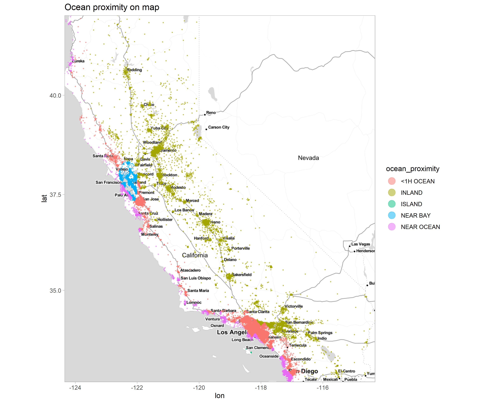
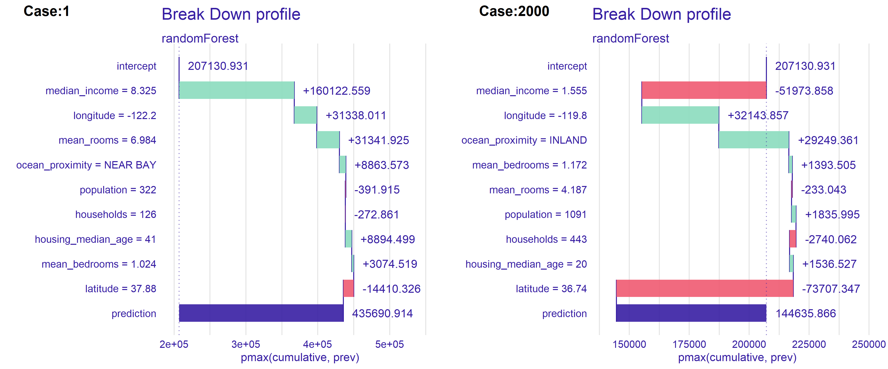
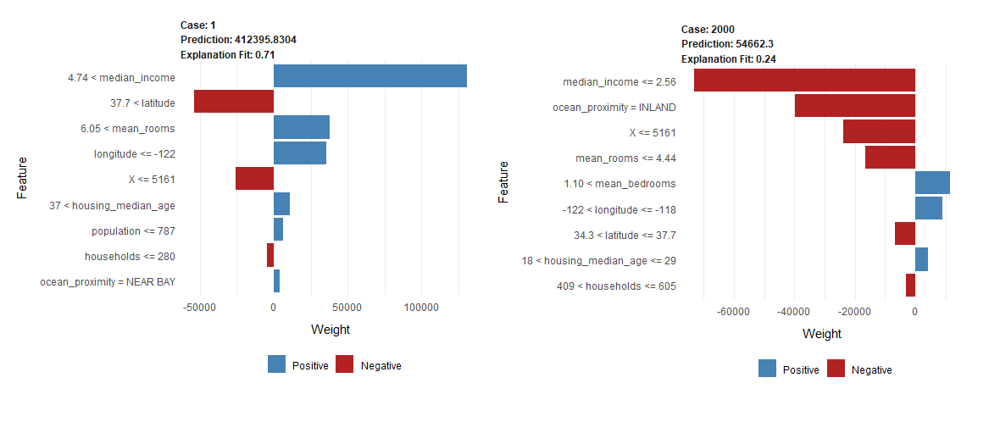
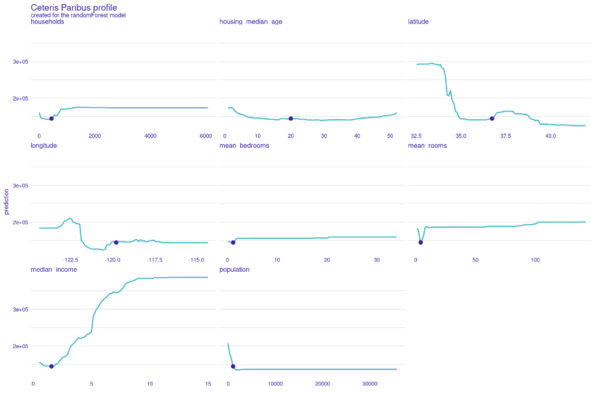
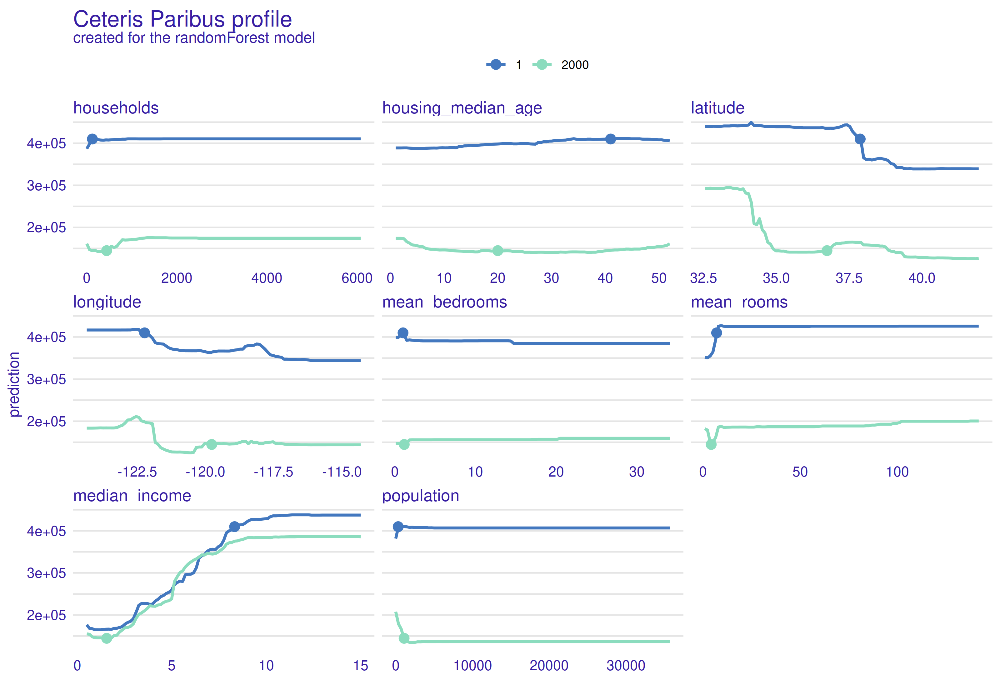
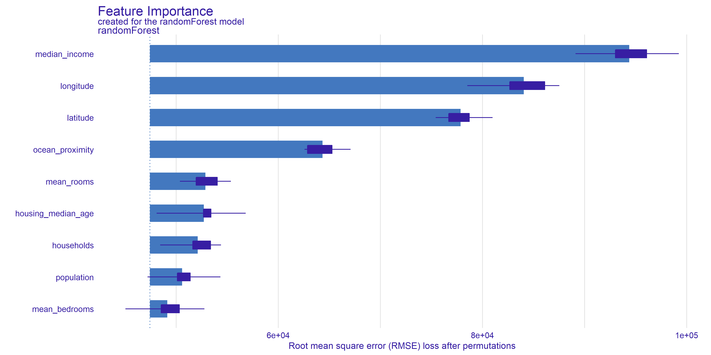
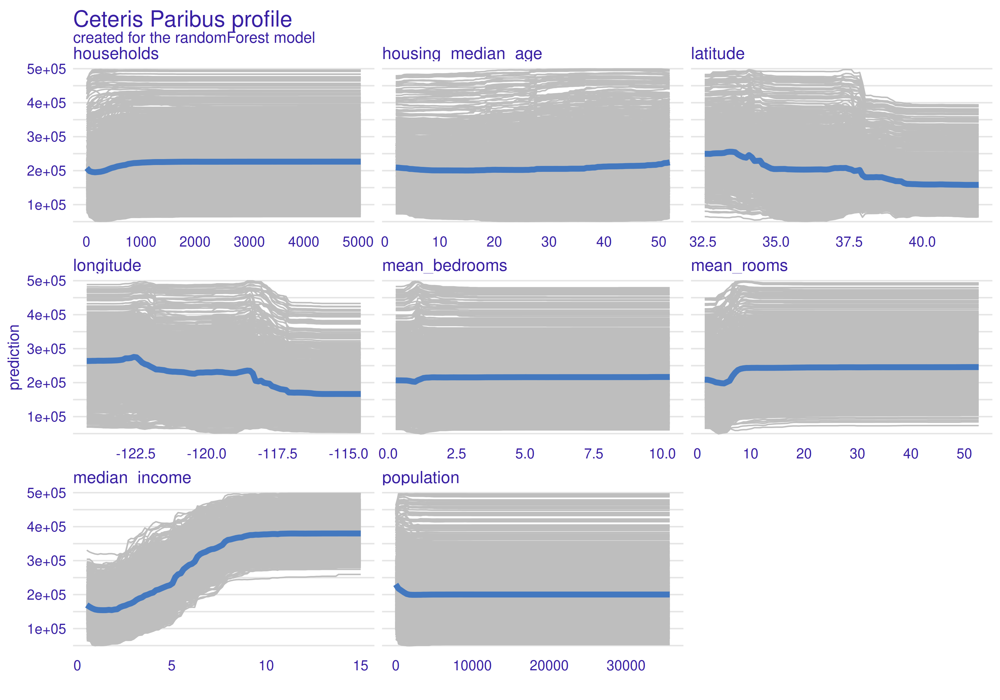
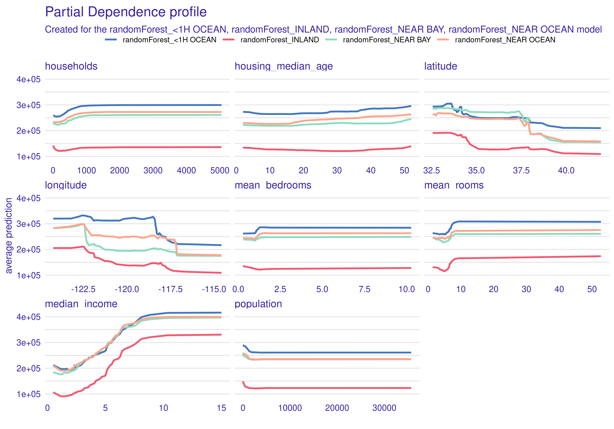

##  How the price of the house is influenced by neighborhood? XAI methods for interpretation the black box model

*Authors: Klaudia Gruszkowska, Bartosz Jamroży, Bartosz Rożek (Warsaw University of Technology)*

### Abstract

*The value of a house is extremely important to all of us, no matter if we are buyers, sellers or homeowners. That is why correct price prediction is so important. With the help of machine learning we are able to predict this price but not every time we know what influenced such prediction result. For this reason, the interpretability of models, used in important areas of life, has recently become increasingly valuable. In this article we interpret and explain these unknowns using Explainable Artificial Intelligence (XAI) methods.*

### Introduction

Being able to predict the potential price of a house is crucial for the real estate market. Therefore, over the years, many papers have been focused on improving prediction methods [@2-5-housingprediction-ml1; @2-5-housingprediction-ml2]. The main question regarding forecasts is what data influences the price. In addition to physical factors of the house, such as size, number of rooms, the condition of the building, the price is also influenced by the area in which the house is located. The neighborhood affects the price of the house and the house affects the value of the surrounding buildings. Thus, house price prediction models based on neighborhood data were created [@2-5-neighborhood1; @2-5-neighborhood2; @2-5-neighborhood3].

With the development of artificial intelligence and machine learning, the use of this type of algorithm is gaining popularity in the field of forecasting house prices [@2-5-housingprediction-ml1]. In machine learning, we can distinguish two types of models: glass-box and black-box models. In the glass-box model human can follow the steps from inputs to outputs. Black-box models is also an important part of machine learning, however unlike glass-box models, they do not have a clear, human-readable way of determining predictions [@EMA]. So why do we use them when we have glass-box models at our disposal? The complexity  of black-box models is both an advantage and disadvantage at the same time. Due to it, we get better, more tailored predictions, but we also doom ourselves to the lack of precise information on how the given result was obtained.

Using algorithms, we would like to know what influenced the prediction result and how. We are not inclined to trust such a difficult and complicated activity to algorithms whose decisions are unclear to human. Therefore, in this paper we use Explainable Artificial Intelligence (XAI) methods to analyze the output of the  black-box model. 


**Data**

The data that was used was the "California Housing Data Set".
This data was initially featured in the following paper:[@2-5-pace1997sparse].The data pertains to the houses found in a given California district and some summary stats about them based on the 1990 census data. Data is cleaned, contains no empty information.


| Column title     | Description                                                                                                                    |
|------------------|--------------------------------------------------------------------------------------------------------------------------------|
| longitude        | A measure of how far west a house is; a higher value is farther west                                                           |
| latitude         | A measure of how far north a house is; a higher value is farther north                                                         |
| housingMedianAge | Median age of a house within a block; a lower number is a newer building                                                       |
| totalRooms       | Total number of rooms within a block                                                                                           |
| totalBedrooms    | Total number of bedrooms within a block                                                                                        |
| population       | Total number of people residing within a block                                                                                 |
| households       | Total number of households, a group of people residing within a home unit, for a block                                         |
| medianIncome     | Median income for households within a block of houses (measured in tens of thousands of US Dollars)                            |
| medianHouseValue | Median house value for households within a block (measured in US Dollars)                                                      |
| oceanProximity   | Location relative to the ocean described as however in the category: "NEAR BAY", "<1H OCEAN", "INLAND", "NEAR OCEAN", "ISLAND" |


```{r 2-5-HeatmapOfMedianHouseValue, out.width="500", fig.align="center", echo=FALSE, fig.cap='Map of property distribution within the state of California. The brightness of the points reflects the price.'}
knitr::include_graphics('images/2-5-HeatmapOfMedianHouseValue.png')
```

The map shows a density of bright blue dots in two locations, these are expensive properties located within two urban centers, Los Angeles, San Francisco, and San Diego.
Also, more expensive properties are located along the Pacific coast.


```{r 2-5-OceanProximityOnMap, out.width="500", fig.align="center", echo=FALSE, fig.cap='Map of property distribution within the state of California. Colors show the value of the oceanProximity column.'}

```

Property map, packing the `ocean_proximity` feature. Properties with the 'NEAR BAY' category colored blue, appear in only one grouping next to San Francisco, `NEAR BAY` means San Francisco Bay. Green category, `ISLAND` collects 10 properties located on one island near Los Angeles.

**Machine learning model**

The machine learning model explained is from https://www.kaggle.com/camnugent/introduction-to-machine-learning-in-r-tutorial.
A random forest model[@2-5-breiman1999random] from the "randomForest" library with default parameters was used to predict property values. This model does not require scaling of data or decoding of categorical data. This makes it easier to analyze the results.

The two columns `total_bedrooms` and `total_rooms` were averaged by dividing by the number of household members. The new columns are `mean_bedrooms` and `mead_rooms`. 

### Literature

Over the years, many solutions have been developed for the task of house price prediction, and what particularly interests us, solutions using machine learning [@2-5-houseprediction-1; @2-5-housingprediction-ml1; @2-5-houseprediction-2]. However, in our paper we will not focus on the process of creating good models but on the process of explaining models and their results using XAI methods. 

Why are these explanations so important? As we mentioned in the introduction, black box models do not give us insight into the reason for their decisions. As mentioned in the article [@2-5-XAI] that is one of the main barriers AI is facing nowadays. 

However, not everyone supports the development of XAI [@2-5-against-xai1; @2-5-against-xai2 ; @2-5-againstxai3]. They point to the insufficient credibility of the explanations and the possibility that the model conceal his unethical behavior.

The second issue addressed in our paper is the relationship of house price to location. Several works have been created on this topic as well. For example, Stephen Law in his work [@2-5-neighborhood1] proposed defining a street as a local area unit and measuring its effect on house price. The results of his research of Metropolitan London showed significant local area effects on house prices. In our case the local area unit is block, which is a rectangular area marked by intersecting streets.
Another example is the article written by Robin A. Dubin [@2-5-neighborhood4]. He points out the importance of the correlations existing between the prices of neighboring houses, which is ignored in others method of predicting house values.

### Local explanations

We used observation 1 and 2000, because they are far from each other in the set so that they have different value.

```{r 2-5-local-map,out.width="1000", fig.align="center", echo=FALSE, fig.cap='Choosen observations presented on a map. Red point - observation 1, green point - observation 2000'}
knitr::include_graphics('images/2-5-map.png')
```

#### Break Down

**Intuition**

Break down provides a way to show the local importance of variables and the effect of individual values on predictions[@2-5-iBreakDown].
The basic idea is to calculate the contribution of variable in prediction of f(x) as changes in the expected model response given other variables. This means that we start with the mean expected model response of the model, successively adding variables to the conditioning. Of course, the order in which the variables are arranged also influences the contribution values.

**Results**


```{r 2-5-BreakDownProfile,out.width="100%", fig.align="center", echo=FALSE, fig.cap='Break Down decomposition (L) observation 1, (R) observation 2000'}

```

Figure \@ref(fig:2-5-BreakDownProfile) shows the result of using Break Down method from DALEX [@dalex] package.
The variables are ranked in terms of the importance of their impact on the predictions. The most important characteristic for both properties is `median income`. Median income is indicative of neighborhood status. Residents who earn more are likely to purchase more expensive properties. For both observations the influences are strong but opposite, high earnings for the first observation at \$83,000 per year have a positive influence. In contrast, for property number 2000, earnings around \$15 thousand per year are the reason why the model lowers the predicted price. 
`Longitude` is the second significant feature. Average number of rooms and location relative to the ocean was also significant. Interestingly, in observation number 2000, the inland location raises the price. From the map \@ref(fig:2-5-HeatmapOfMedianHouseValue), it appears that it is the homes farthest from the ocean that are the cheapest.

#### Lime

**Intuition**

Local Interpretable Model-agnostic Explanations (LIME) was firstly proposed by Ribeiro, Singh, and Guestrin [@2-5-lime].

In LIME decomposition, our goal is to create an approximate glass-box model for a given observation. That model would be fully human-readable and can be easier analyzed. To do so, we create an artificial data set and teach the chosen glass-box model on it. The coefficients on the variables for the created model are the coefficients on the validity of the variables for our observation.

**Results**

```{r 2-5-lime, out.width="1000", fig.align="center", echo=FALSE, fig.cap='Lime decomposition  (L) observation 1, (R) observation 2000'}

```

Figure above \@ref(fig:2-5-lime) shows the result of using LIME method [@lime] from DALEX [@dalex] package. Common for both observations is that the `median_income` variable has the largest effect on prediction. However, the impact in the case 1 is large positive but in the case 2000 it is large negative. It is caused by the value of the variable. It is worth noting that the variables longitude and latitude have opposite signs in both cases. This is because these variables are negatively correlated. The second most valuable variable is the map location variable. 

It follows that for the observations, the key variables are `median_income` and some kind of location. This is consistent with our expectation and intuition that the higher the earnings of residents, the richer and more valued the neighborhood. Consequently, the houses themselves are also priced higher. Additionally, plots show us that impact of `population`,`households` or `housing_median_age` is not significant. 

What is interesting, in the case 2000 above \@ref(fig:2-5-BreakDownProfile) BreakDown found this location to be positive. 

#### Ceteris Paribus

**Intuition**

*Ceteris Paribus* is a phrase that comes from Latin. Word for word meaning is "other things equal", but in XAI much more meaningful translation would be "other things held constant". In fact, these few words describe this method deeply - we choose one variable from observation, change it's value, while other variables held constant and calculate new model's prediction. Output of this operation is a function that shows us how prediction changes.

**Results**

<center>
 
```{r 2-5-single-ceteris, echo=FALSE, fig.cap="Ceteris Paribus: first observation", out.width = '100%'}

```
</center>

Plot \@ref(fig:2-5-single-ceteris) above shows *Ceteris Paribus* calculated for first observation of data set. As we can see, in most cases it is straight line with change for small values. `Households` and `population` profiles are similar, which seems to be reasonable, because not many people look for apartment in a remote area. `Latitude` and `longitude` profiles are vertical lines with one decrease. Hence, a region on map can separated where `median value` would be the highest.`Mean bedrooms` is hard to explain in the oposition to `mean rooms` where we can see that the more rooms the higher the value is. It stops at certain value, above which valuation doesn't change. `Median income` is almost linear function, which is understandable as rich people can afford expensive apartments.

<center>
 
```{r 2-5-double-ceteris, echo=FALSE, fig.cap="Ceteris Paribus: first and 2000th observation", out.width = '100%'}

```
</center>

Next plot \@ref(fig:2-5-double-ceteris) shows *Ceteris Paribus* calculated for two different observations. Specially two observations with massive difference in `median value` where chosen to observe what would change. Clear differences can be observed. Especially `latitude`, `mean bedrooms`, `mean rooms` and *population* shows major changes. Rest of variables have similar profiles, but these four are great example why shouldn't we draw conclusions about whole data set based on one *ceteris paribus* calculation.

#### Local explanations conclusions

As it could be observed, local explanations tells a lot about given observation. Unfortunately, juxtaposition of two different observations showed us, that they can have totally different explanations. Hence, local XAI, in this case, would allow us to increase already built house's value rather than give an instruction how to build expensive property. To get this instruction global explanations should be used.  

### Global explanations

In global explanations, we want to find out what influenced the model as a whole in the data, rather than looking at individual observations. This gives us an overall view of the predictions for the population.

#### Feature Importance

**Intuition**

Idea of permutation-based variable-importance[@2-5-xailandscape]:
If a variable is important in a model, then after its permutation the model prediction should be less precise. The permutation importance of a variable $k$  is the difference between model prediction for original data and prediction for data with permutation variable $k$.


**Results**

```{r 2-5-FeatureImportance,out.width="100%", fig.align="center", echo=FALSE, fig.cap='Feature Importance'}

```

Plot \@ref(fig:2-5-FeatureImportance)  show, `Median income ` turns out to be the most important feature for the model under study. Removing the median income information by permutations, resulted in the largest decrease in the RMSE measure. This means that without this feature the model is much less precise.
The geographic variables, `longitude` `latitude` and `ocean proximity` also turn out to be important for prediction.
The average number of rooms, age, and the number of householders already have less impact on the prediction.
The `mean bedrooms` category has the smallest and ambiguous impact. Whiskers extending beyond the left border of the bars indicate that there were draws where removing the variable improved the model results. The model may ignore this feature, having partial information about it in the form of number of rooms and household members.  


#### PDP

**Intuition**

PDP [@xai1-pdp] stands for partial dependence plot and it is connected with *Ceteris Paribus*. We take a random sample from data set, and calculate *ceteris paribus* for each one. After that, mean of all these functions is calculated, which leaves us with one profile for whole data set. In the plot below thick blue line is PDP and thin grey lines are *Ceteris Paribus* calculations for each observation.

**Results**

<center>
 
```{r 2-5-pdp, echo=FALSE, fig.cap="PPD", out.width = '100%'}

```
</center>

As we can see above \@ref(fig:2-5-pdp), `households`, `mean bedrooms`, `mean rooms` and `population` profiles are almost straight lines with fluctuations for small values. `Housing median value` is a interesting case, because small curvature can be observed at the end of line. This is probably due to the fact that new apartments are expensive, because they are modern and old ones are expensive because of historical background behind they. `Latitude` shows that most expensive houses are located on south, especially below $34 ^{\circ} N$, in California this is area near Los Angeles. `Median house value` is highest for `longitude` values lower than $118 ^{\circ} E$ (majority of a state except of San Diego and surrounding area). As it was in *ceteris paribus*, `median income` grows together with `median house value` to the level where income money simply doesn't matter.  

<center>
 
```{r, echo=FALSE, fig.cap="PPD in groups", out.width = '100%'}

```
</center>

PDP makes it possible to create separate profiles for different groups of observation. In our case, we used `ocean proximity` as it is a categorical variable. In the plot above we can observe, that all profiles are similar to each other, the only significant difference is vertical shift. Conclusion drawn from this plot is the fact that houses `1h <Ocean` are most expensive, `inland` apartments are the cheapest, while `near ocean` and `near bay` behave similar to each other and have average prices. If we take a look at the plot from *Data* paragraph, conclusions look reasonable. `1h <Ocean` houses are the ones located in Los Angeles and in the suburbs of San Francisco, which are well known from expensive neighborhoods.   

#### Global explanations conclusions

In contrast to local explanations, global explanations give a more general picture of the entire data set. With PDP profiles, we can see the relationships between the data. The future importance graph allows understanding what variables are relevant to the model. 


### Conclusion

XAI methods can have multiple applications. They allow to study the behavior of Machine Learning Models. It gives an opportunity to understand the model, detect errors, for example, made during data preprocessing. 
With a good model matched to the data, XAI can be used to study the dependencies in the data.

