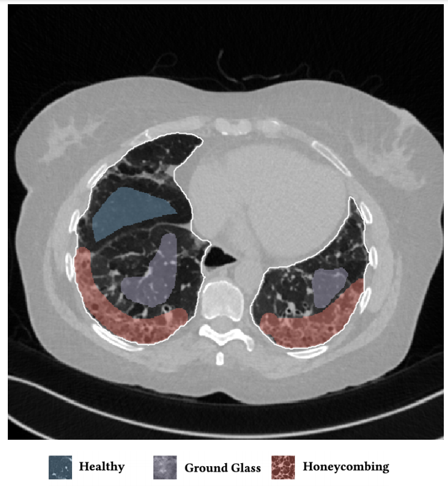
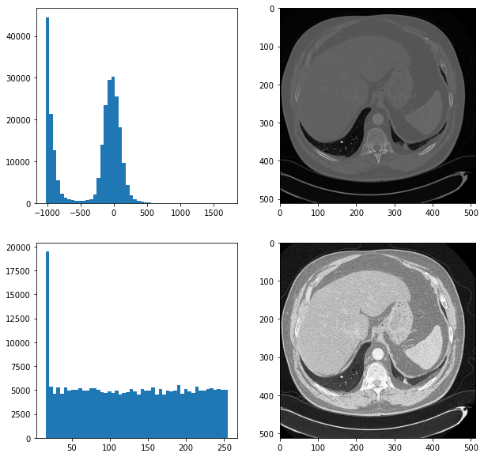
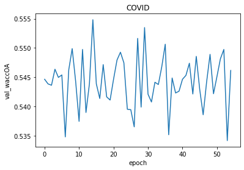
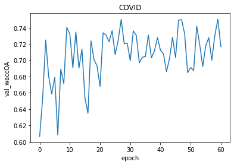
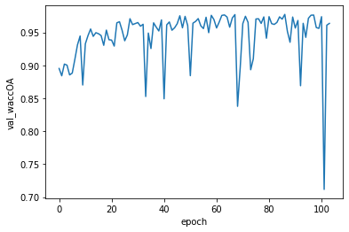
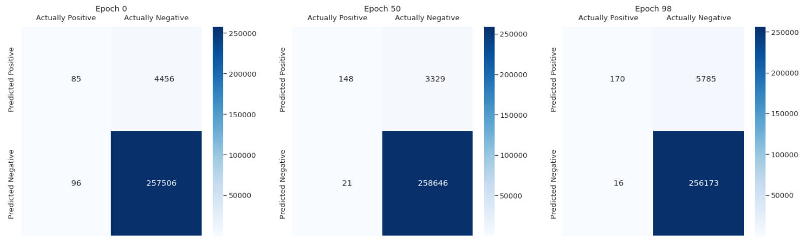
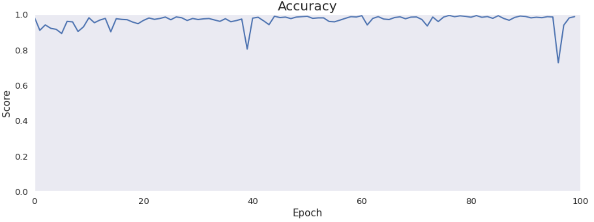
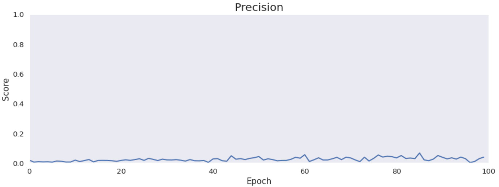
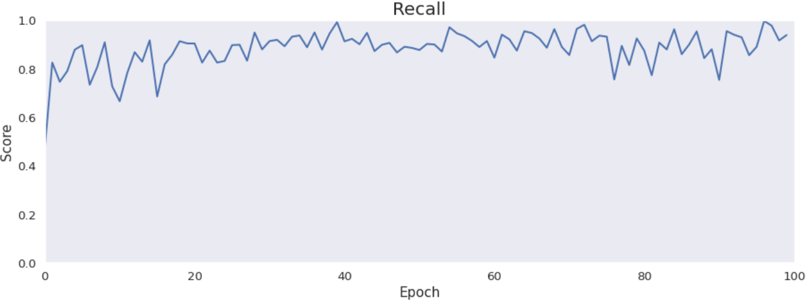
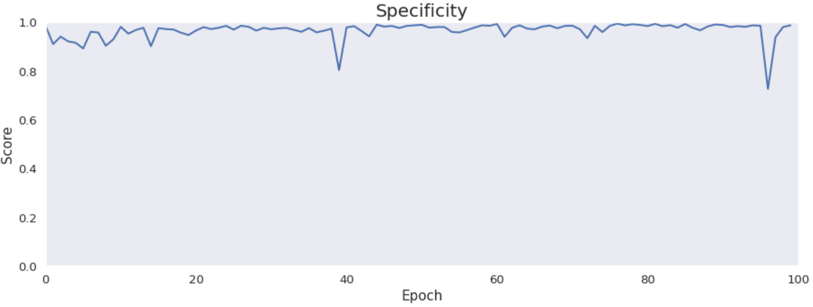

## LungNet

*Authors: Adam Frej, Piotr Marciniak, Piotr Piątyszek*

### Introduction

Our goal is to recreate the results achieved in the article: Semantic Segmentation of Pathological Lung Tissue
with Dilated Fully Convolutional Networks [@3-0-LungNet]. Authors developed a deep purely convolutional neural network for the semantic segmentation of interstitial lung diseases. The proposed CNN takes as input a lung CT image of arbitrary size and outputs the corresponding label map. We want to recreate that CNN and achieve as similar results as possible.\
Interstitial lung disease (ILD) is a group of more than 200 chronic lung disorders characterized by inflammation and scarring of the lung tissue that leads to respiratory failure. The diagnosis of ILD is mostly performed by radiologists and is usually based on the assessment of the different ILD pathologies in high resolution computed tomography (HRCT) thoracic scans. Early diagnosis is crucial for making treatment decisions, while misdiagnosis may lead to life-threatening complications. Pathological tissue is usually manifested as various textural patterns in the CT scan. The article proposes the use of a deep fully convolutional network for the problem of ILD pattern recognition that uses dilated convolutions and is trained in an end-to-end and semi-supervised manner.\
On the image is presented a typical HRCT scan with annotations. The white border line denotes the lung field segmentation, the blue denotes healthy tissue, the purple micronodules and the red the honeycombing pattern.

```{r, out.width="500", fig.align="center", echo=FALSE, fig.cap='Example of an annotated HRCT lung scan'}

```

### Data

In order to recreate the article we needed already annotated HRCT scans of lungs.

#### Original data

The authors of the article used a dataset of 172 sparsely annotated HRCT scans, each corresponding to a unique ILD or healthy subject. The dataset contains 109 cases from multimedia database of interstitial lung diseases by the Geneva University Hospital (HUG), along with 63 cases from Bern University Hospital - “Inselspital” (INSEL), as collected by the authors. Two experienced radiologists from INSEL annotated or reannotated ILD typical pathological patterns, as well as healthy tissue in both databases. A lung field segmentation mask was also provided for each case.\
Article claims that the datasets are publicly available. However, we could not reach them. The HUG dataset required a copyright agreement signed by a person duly authorized by the institution (e.g., Department or Administrative Head or similar). We could not find any access to the INSEL dataset.
In order to find datasets, which correspond to our theme, we looked for similar articles. One of them was an article Computer-Aided Diagnosis of Pulmonary Fibrosis Using Deep Learning and CT Images [@3-1-Similar], which is about pulmonary fibrosis that belongs to ILD. This article uses multiple datasets, but none of them is available online.

#### Our data

Because of the issues with the original data we had to find new datasets.\
The first one, [COVID19-DL](https://github.com/adnan-saood/COVID19-DL) contains lungs scans of COVID-19 patients. The dataset is designed for training deep learning models. It has 100 png images in grayscale, each in $256 \times 256$ resolution.\
The second one, [The Lung Image Database Consortium (LIDC)](https://wiki.cancerimagingarchive.net/display/Public/LIDC-IDRI) consists of 1018 diagnostic and lung cancer screening thoracic computed tomography (CT) scans with marked-up annotated lesions. The dataset is a web-accessible international resource for development, training, and evaluation of computer-assisted diagnostic (CAD) methods for lung cancer detection and diagnosis. Four experienced thoracic radiologists independently reviewed each CT scan and marked lesions. The images are in dicom format, grayscale and $512 \times 512$ resolution.\
The LIDC dataset is much better annotated and contains more cases. That is why we decided to use it in training process of our models.

### Original model

The original model has 13 convolutional layers. In particular, each of the first ten layers has 32 kernels of size $3 \times 3$ and dilation rates $1, 1, 2, 3, 5, 8, 13, 21, 34, 55$. The authors chose not to increase the dilation rates exponentially. The outputs of these layers are concatenated, which are passed through a dropout layer with a rate of $0.5$. The last three layers have $1 \times 1$ kernels with numbers of filters set to $128, 32, 6$. The number of last- layer filters depended on number of classes. In our case we set them to $2$ and $3$ depending on dataset.

#### Preprocessing

As authors did not mention any preprocessing techniques that had been used. We tried to improve results of their neural network by two techniques which we introduced by ourselves.
One of them was a histogram equalization, which makes images more readable for humans. Below we have a comparison of two pictures with a histogram equalization and without. On the left side we have histograms of the scans. 

```{r, out.width="600", fig.align="center", echo=FALSE, fig.cap='The comparision of scans'}

```

Unfortunately, it did not improve results of our neural network.
Another technique which we used was cutting images to smaller parts. We did it because a tumor is a small part of the whole image. By doing this, we increased the proportion of a tumor to the whole picture.
Below we have a plot showing the comparison of preprocessing techniques.

```{r, out.width="600", fig.align="center", echo=FALSE, fig.cap='The comparision of scans'}
knitr::include_graphics('images/3-1-comparison_preprocessing.png')
```

### New models

To improve results on our datasets we used another architectures of neural networks.

#### Smaller ones

This architecture was a modification of the one proposed by the authors. We added a convolutional layer and a batch normalization to a convolution block and decreased the number of convolution blocks to 5. As a result, we did not achieve any noticeable changes in our metric. The model was not learning throughout epochs. 

```{r, out.width="600", fig.align="center", echo=FALSE, fig.cap='The results of smaller architecture'}

knitr::include_graphics('images/3-1-smaller_ones_lidc.png')
```

#### SegNet

Another architecture which inspired us was the SegNet. It is a deep convolutional encoder-decoder architecture for image segmentation. Originally, it consisted of 10 convolutional blocks, where each block is made up of a convolutional layer, a batch normalization and as an activation relu is used. Depending if a block is in an encoder or a decoder, a pooling layer or a upsampling layer is added to the block.
```{r, out.width="900", fig.align="center", echo=FALSE, fig.cap='Original SegNet'}
knitr::include_graphics('images/3-1-segnet-architecture.png')
```

We used our modification of SegNet consisted of 8 convolutional blocks. We deleted 2 middle blocks. It performed much better than the original model proposed by authors of the article on both datasets. It achieved about $0.97$ weighted accuracy over annotated area (the metric proposed by the authors of the paper, which we are trying to reproduce) on the LIDC dataset and $0.75$ accuracy on the COVID dataset. Below we have two plots showing, how much our score on the validation set changed throughout epochs.
```{r, out.width="600", fig.align="center", echo=FALSE, fig.cap='The results of modified SegNet'}


```
This model we evaluated later.

##### Metrics

We used several metrics to evaluate our model. 
The most important one is the confusion matrix. It shows how accurate is the model. We can notice that it improves a little over time but it is not significant. Most of predicted healthy area of the lungs is actually healthy. It is the main part of the scans. However, there are a lot of false positive cases. The model marks healthy parts of the lungs as lesion. It finds most of the actual lesions but marks it together with a lot of healthy part.

```{r, out.width="900", fig.align="center", echo=FALSE, fig.cap='Confusion matrix'}

```

Accuracy, precision, recall and specificity are basic ones. Accuracy is not very meaningful because of the uneven distribution of the considered classes across the cases. Precision is very low that is connected with the confusion matrix. The model marks a lot of false positive cases. Recall is pretty high. The model finds most of the damaged part of the lungs. Specificity is extremely high that is also connected with the confusion matrix. The model finds almost all healthy lung tissue. In some metrics we can notice an improvement throughout epochs.

```{r, out.width="600", fig.align="center", echo=FALSE}




```

Intersection over Union is an important metric in our case because we segment images. It says how accurately model marks lesions in lungs. It is calculated by dividing an area of the intersection of the actual and the predicted lesions by an area of the union of them. The metric is pretty high and improves over time. The reason why it is not close to 1 is the problem with false positives and low precision.

```{r, out.width="600", fig.align="center", echo=FALSE}
knitr::include_graphics('images/3-1-IoU.png')
```

##### Our attempts to improve scores

We tried to improve results of our best model in various ways.

###### Pretraining

One of them was pretraining. We taught block after block to copy the input pictures. In this way we wanted our model to discover more patterns from our input picture. At the plots we can see the results of training each convolutional block. We achieved about 200 MEA for all blocks, but with more blocks we scored better result.

```{r, out.width="600", fig.align="center", echo=FALSE,fig.cap='Training of blocks'}
knitr::include_graphics('images/3-1-pretraining_layers.png')
```

After training of each layer we transferred weights to our modified SegNet. Then we frozen all layers of encoder and started training of decoder layers. Below we have a plot which shows the improvement of our model after training each layer of the encoder. We accomplished about $0.98$ weighted accuracy.

```{r, out.width="600", fig.align="center", echo=FALSE, fig.cap='After transfer learning'}
knitr::include_graphics('images/3-1-pretrained.png')
```

###### Learning with an auxiliary task

Our auxiliary task was generating a lung scan 3 millimeters further based on an input scan. We expected that our network would learn a better feature extraction for both tasks. Next we frozen first 11 layers, changed the last layer to softmax and we tried to learn our model on the proper task. Unfortunately, that model achieved worse performance and did not learn faster than the pure model.

```{r, out.width="600", fig.align="center", echo=FALSE, fig.cap='Performance of network with auxiliary task'}
knitr::include_graphics('images/3-1-auxiliary_task.png')
```

### Summary

To sum up, our modified neural network achieved good scores. However, the whole project stopped to remind the original article. Article turned out to be irreproducible. Due to the fact that we had to change input data and model. 

