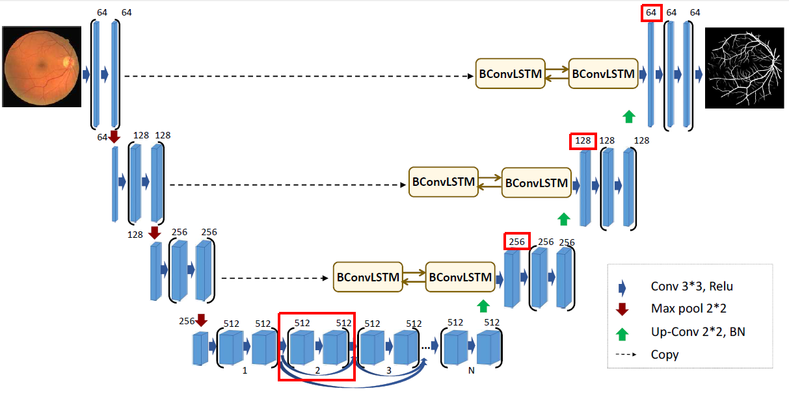
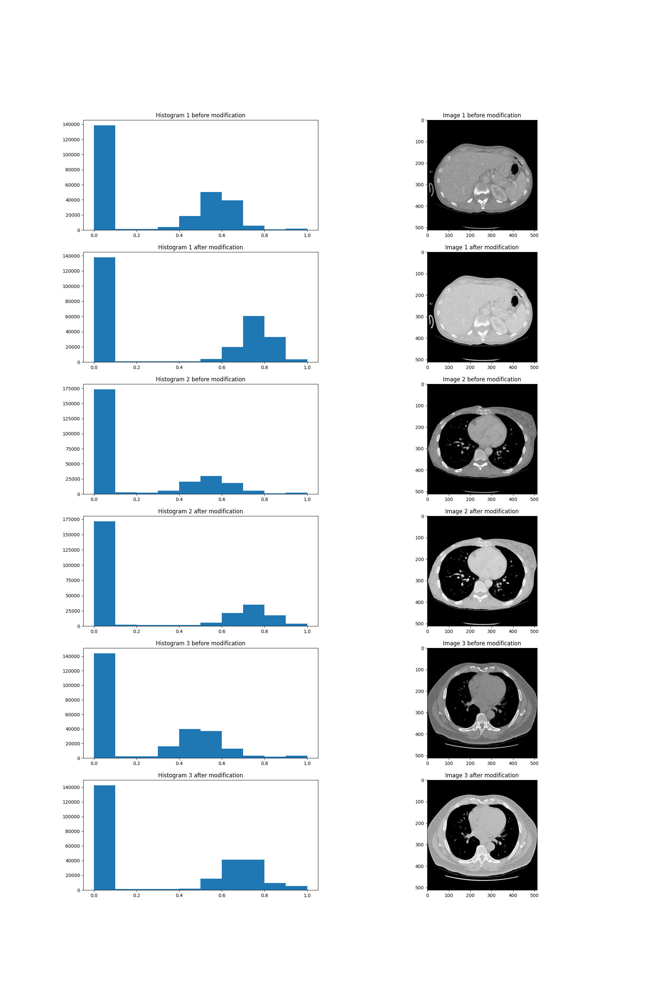
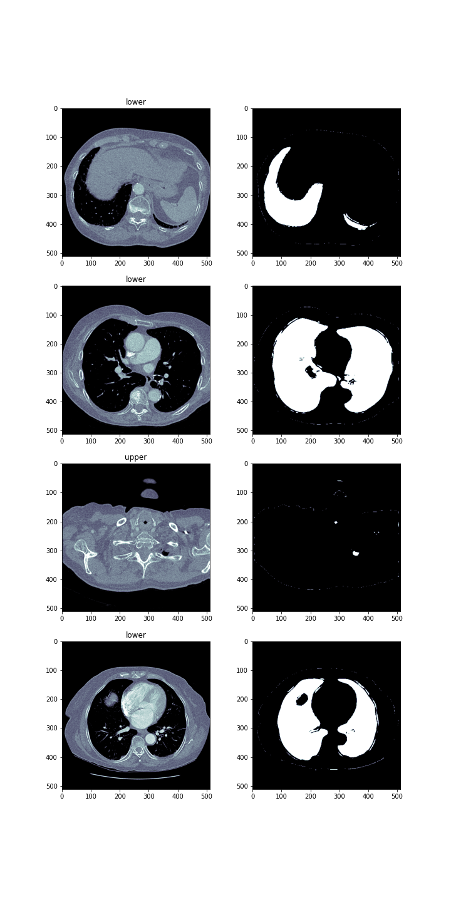
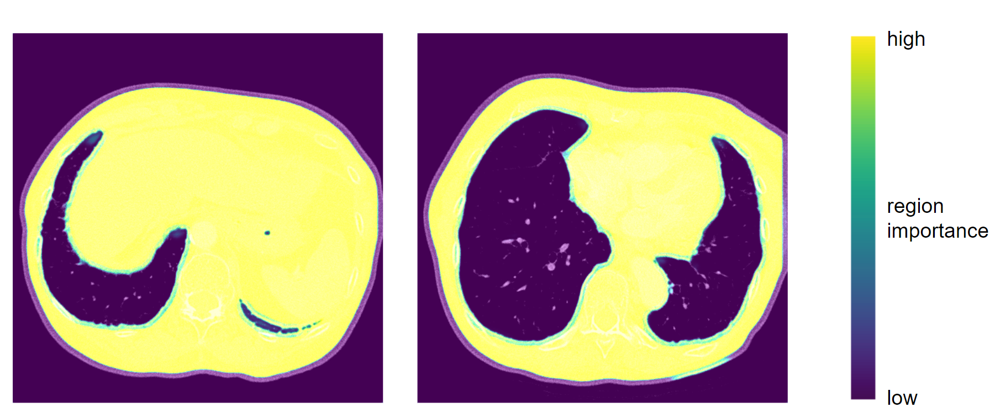

## On the reproducibility of the BCDU-Net model

*Authors: Maria Kałuska, Paweł Koźmiński, Mikołaj Spytek (Warsaw University of Technology)*

### Abstract

Reproducibility is a hot topic in present-day research. Especially in the field of data science and machine learning, the possibility of reusing the proposed solution by other scientists is essential as it proves its correctness and may become a starting point to further work. We introduce the article summarizing our attempts to reproduce BCDU-Net model used for lung segmentation from computer tomography images, proposed in [@3-0-BCDUNet_segmentation]. Moreover, we present our commitments to improve its performance, using techniques popular in the area of image processing. BCDU-Net turned out to be fully reproducible and highly optimized as only one of our attempts resulted in partly better performance. 

### Introduction

Being able to reproduce results presented in published papers is a significant part of the scientific process. It is important mainly because it allows other scientists to verify that the method produces consistant results. The main goal of our work was to reproduce the results of the BCDU-Net deep neural network [@3-0-BCDUNet_segmentation] and to check if the source code provided with the paper was of sufficient quality so as to add our own modifications to the network. We focused on working with the version of the network which performed a lung segmentation task.

The architecture of the BCDU network is based on U-Net [@3-2-unet] which takes its name from the shape of the model. Both, the original and the improved models consist of max-pooling layers, convolutional layers and up-convolutional layers, but what makes BCDU-Net stand out, is the usage of BConvLSTM cells. They contribute to an easier flow of information between the first and last layers of the model, which in turn improves the performance.

#### Dataset

The dataset used by the authors of the article was downloaded from [Kaggle](https://www.kaggle.com/kmader/finding-lungs-in-ct-data/data) and consists of eight files in NIfTI (Neuroimaging Informatics Technology Initiative) format. There are four 3D CT scans of human chest, the other four files are corresponding masks. Each photo consists of horizontal sections with the resolution 512x512.

After unpacking those images, there were about 1200 horizontal images of lungs and corresponding masks.

##### Preprocessing

The preprocessing applied to the lung images was to normalize the grayscale to the range $[0, 255]$ and to remove blood vessels and bones. In addition, horizontal sections consisting only of black pixels have been removed. In the case of masks, all pixels have been limited to the value set $\{0, 1\}$. Moreover, masks around the lung area were generated, and binary erosion was also used in the photos prepared in this way.

#### Execution

The code repository provided with the article contained all the necessary files to train the model and obtain results. At first we didn't see if the authors attached information about the versions of packages they used, so we decided to try the following: `keras==2.4.3`, `tensorflow==2.4.1`, `scikit-learn==0.24.1`, `numpy==1.19.5`, `matplotlib==3.3.4` and ran the code in `python 3.8.7`. Much later it turned out that the list of versions of packages was included in one of the pull requests in the Github repository, but we decided to stick with the ones chosen by us, as by then they worked and allowed us to obtain results.

Even though the code was mostly functional, it still required some debugging. Some errors seemed as though they were simple omissions, whereas some might have been the result of us using slightly different versions of packages. In order to get the model to work we: added `import os` to the `Prepare_data.py` file, added `import numpy as np` to the `models.py` file, changed argument names from `input, output` to `inputs, outputs` in the definition of the model in the `models.py` file. After implementing these changes we successfully trained and evaluated the model.

Even though at this moment the model was working, it was extremely slow. It was due to the fact that the calculations were being carried out using the CPU. To improve training speed we installed the cuDNN library, so that we were able to use the performance of our graphics cards.

### Reproduction of the results

Using the setup described in previous paragraphs we were able to train the model provided by the authors of the article and obtain results. Due to the technical limitations of our hardware we were forced to change some hyperparameters. We changed the batch size from 2 to 1, and the number of epochs from 50 to 40. Achieved results are presented in the table below.

|                        | Accuracy | Sensitivity | Specificity | ROC AUC | Jaccard Score | F1 Score |
|------------------------|----------|-------------|-------------|---------|---------------|----------|
| claimed in the article | 0.9972   | 0.9910      | 0.9982      | 0.9946  |     0.9972    | 0.9904   |
| reproduced by us       | 0.9961   | 0.9894      | 0.9973      | 0.9933  |     0.9741    | 0.9869   |

The difference between these two models in most of these metrics is less than 0.1%. The only one with a bigger gap is Jaccard score. Our model produced results which show Jaccard score to be 2% lower than these claimed by the authors of the article. In our opinion the results are satisfactory and the difference can be blamed on the shorter learning time and changed batch size. The results from the article can be reproduced.

### Further experiments

In order to better understand the BCDU-Net network we decided to check out the possibility of improving its performance by implementing additional techniques, addressed to image processing. This way, we created a few modifications of original solution and could have compared the performances using well-known metrics applied to the problem of classification and, specifically, segmentation. 

#### Modified architecture

At first, we decided to modify the architecture of the model proposed by BCDU-Net's authors. We developed and evaluated four new architectures which differed from the original one by layouts of layers, their size or activation functions. We have chosen two most interesting cases proving that slight changes may lead to different results.

As the BCDU-Net consists of plenty convolutional layers, we decided to check what happens after adding another one. It was implemented in the beginning part of the model, before the first operation of max pooling. Moreover, the activation function of hidden layers was changed - we used hiperbolic tangent instead of reLU. 
The results of proposed version were marginally worse as they fell by less than 1%.

The second chosen modification is more experimental. Inspired by another version of BCDU-Net, provided by authors in the source code, we removed one part of the network at the bottom of the schema. What is more, first layers after up-convolutional parts were quadrupled (each dimension was expanded by a factor of two). Parameters' initialization method was changed from original He normal method to Glorot normal.
Unfortunately, this modification turned out to be a flop. The value of Jaccard score was over three times lower than originally (0.29). Produced masks did not cover the whole surface of the lungs.

#### Regularization

As one of the modifications to the BCDU network we tried adding regularization to the models' layers. Including this penalizes the neural network for learning weights of high magnitude. Doing so makes the network a bit less complex, but can often lead to an improvment of the results. The two main methods of applying regularization are l1 and l2. In l1 regularization the penalty is proportional to the absolute value of the parameter, whereas in l2 regularization it is proportional to the sqare of of the weight. As such, l2 regularization is stronger when the values of parameters are higher, and weaker when they are lower.

We tried applying both l1, and l2 regularization to the original model. The results of our testing have shown, that l2 regularization with the parameter $\lambda=10^{-3}$ scored the best. However the results are still somewhat lower than the results of the original network. The masks generated by the model with l2 regularization applied are shown on the figure below.

#### Additional preprocessing

Even though the authors of the model already implemented some preprocessing features such as removing artefacts, we've decided to try some methods used to change the input pictures. They are often used as a way to improve the performance of a model. We tried two methods of altering the pictures: histogram stretching and histogram equalization.

Contrast stretching is a technique, which allows the image to take up the entire brightness spectrum. The metod works by scaling the interval of the brightness values which appear in the image, to the whole available space. In traditional imaging that would be the interval $[0,255]$, but in our network $[0,1]$ as BCDU-Net uses values from the unit interval. In the case of our images, they were already scaled such that the lowest and highest values already appear in each picture. Because of that our implementation of histogram stretching didn't have any effect on the pictures.

The other method we've tried produced far greater results. Histogram equalization works by changing pixels' brightness values such that the number of pixels of each brightness is approximately equal. There is however one modification we applied to this method. The value of zero contains valuable information in the case of our task. Because of that we left pixels of this value unchanged and applied the equalization only to positive values of brightness. The resulting images can be seen below.

We've trained the original architecture from the BCDU-Net article using data preprocessed with histogram equalization. The results were lower than these achieved by the original model. 

We have also tried to use non linear transforms. Such methods are often used in photograpy so as to apply filters to pictures. We didn't however find any sources which would suggest using these methods in medical imaging. We've changed the value of each picture using the $\tanh$ function. The results shown below seemed to be just a brightened version of the pictures. Due to the lack of time, we decided that the images weren't different enough from the original ones to train the model using  them.

#### Learning with an auxiliary task

Transfer learning is a technique used in machine learning that focuses on benefits from storing knowledge gained during solving an additional, related problem. One of the most popular transfer learning methods is applying a new, auxiliary task for the model so we decided to add one to BCDU-Net. Details and inspirations on the subject of auxiliary tasks are exhaustively described in [@3-2-Multitask-Ruder]. Chosen auxiliary task was to predict the number of white pixels in the ground truth masks. New labels for the new task were acquired by ourselves from both traning and test datasets.
In order to implement the new task, we were obliged to slightly modify the original structure of the net. After last up-convolutional layer, there used to be only one batch of three layers. The modification based on adding the new output of net, just after the last up-convolutional layer. We chose Root Mean Squared Error as a loss function. As its values were relatively small, when compared to the loss of original task, its weight was 2,5 times higher so it could have a significant influence on the process of fitting model to data.

Proposed net modification resulted in high efficiency, nevertheless the values of metrics when evaluating it on test data, were not as high as these made by the original model. However, out of all modifications tested by us, this was one of the closest to the scores of original model.

#### GAN for CT images

##### CycleGAN

The first idea was to use the available CycleGAN[@3-2-cycle-gan] to transfer non-contrast images to contrast images. This approach changes just the grayscale on image and does not change the shape of lungs, so we wouldn't have to generate additional masks. However to use CycleGAN one needs to have both datasets: contrast and noncontrast. Only one data set was available to us. Therefore images we've prepared via histogram equalization were used as contrast images. Dilation with random kernel was applied to the generated images and corresponding masks in order to further diversify the initial dataset from the generated dataset. This action resulted in reduction of the lung area.

Later, a mix of both initial and generated dataset was used to train the BCDU-Net. Unfortunately, the training results were significantly worse. It might have happened due to the small differences between generated images' ground truth masks and masks generated by us.

##### DCGAN

The next approach was to generate images and masks from random noise with DCGAN by supplying to the network's discriminator's input both an image and a corresponding mask. This approach has been previously applied to chest X-ray images generation [@3-2-gan-cxr]. The aim was to teach generator to generate images with corresponding masks simultaneously. The issue with this approach was that such a network requires hours of learning on a strong GPU. Therefore the code was implemented and run for too few epochs, which did not provide satisfying results.

#### Dual output model

The goal was to help the person who interprets the photos locate them in the human body. Therefore, apart from the masks, we decided to generate labels informing about where a given lung section is located. There were two possible locations 'upper' and 'lower'. The division was based on the image below. The upper part is the part above human heart. 

The newly created network consisted of two branches. The first branch was the BCDU-Net network, while the second branch responsible for the classification of photos was the ResNet[@3-2-resnet] network. It has been slightly modified so that it could be used in a two-output model.

Despite the small number of epochs = 2, the model results are satisfactory.

**Classification results**

| Accuracy | Sensitivity | Precision | F1 Score |
|----------|-------------|-----------|----------|
| 0.9221   | 0.6066      | 1         | 0.7551   |

In the image below you can see lung images, masks and their labels produced by this modification to the network.

### Other tools applied to the model

#### Tensorboard - supervising the training

Tensorboard allows developers supervising the process of fitting and visualising the model. It is a visualization's toolkit offered for models implemented in tensorflow. As BCDU-Net meets this criterion, we decided to use it during the process of fitting the original model so we could modify the hiperparameters in a pinch. Fortunately, checking the performance of the model on the validation dataset did not indicate overfitting or any other worrying phenomena.

#### XAI - explaining the predictions

We've also worked on the aspect of explainability. Although deep neural networks are mostly seen as black boxes, in the recent years there's been a lot of rapid development in methods which explain neural networks' results, especially in the field of computer vision. However, we've encountered a problem, most of these methods are developed for classification tasks, and almost none of them work with segmentation. In the end we did find one, which worked - GradCAM. The method makes use of the gradients which are used to optimize the layers' weights during training and can highlight the areas which are taken into consideration when producing the mask. In the example below we can see that the network focuses on the tissues which are inside of the human body but outside the lung area. We can deduce, that it recognizes the boundries of the mask in that way.

### Results and conclusions

|                           | Accuracy  | Sensitivity | Specificity | ROC AUC     | Jaccard score | F1 score   |
|---------------------------|-----------|-------------|-------------|-------------|---------------|------------|
| claimed in the article*   | **0.9972**| 0.9910      | **0.9982**  | **0.9946**  | **0.9972**    | **0.9904** |
| reproduced original model | 0.9961    | 0.9894      | 0.9973      | 0.9933      | 0.9741        | 0.9869     |
| arbitrary modifications   | 0.8955    | 0.2908      | 0.9997      | 0.6453      | 0.2904        | 0.4501     |
| l2 regularization         | 0.9867    | 0.9413      | 0.9974      | 0.9693      | 0.9311        | 0.9643     |
| histogram equalization    | 0.9860    | **0.9920**  | 0.9845      | 0.9883      | 0.9313        | 0.9644     |
| auxiliary task            | 0.9933    | 0.9915      | 0.9937      | 0.9926      | 0.9660        | 0.9827     |

\* _authors of the article declared that training was conducted with hyperparameters impossible for us to use_

Our research based on [@3-0-BCDUNet_segmentation] led up to a success. The solution appeared to be fully reproducible despite some minimal errors in provided source code.
In the 'Further experiments' part we have described our contribution to the model development: proposed modifications of the architecture, adding regularization, conducting additional preprocessing of input images, learning with an auxiliary task, training with extended database using GAN and learning using dual output. Some of proposed modifications were evaluated using metrics dedicated to the problem of segmentation. The scores are presented in the table above.
Unfortunately, modifications proposed by our team did not eventuate in improvement of the original performance, apart from the value of sensitivity after using histogram equalization, which proved high optimization of model proposed by Azad R. et al.
However, we were limited by the resources we could have used for the project, so there is still a field to work continuation - trying to test and beat the model using better machines. 
