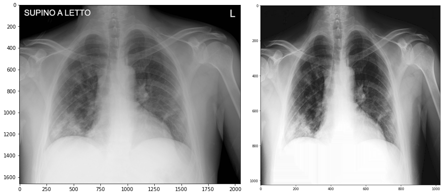
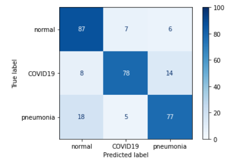
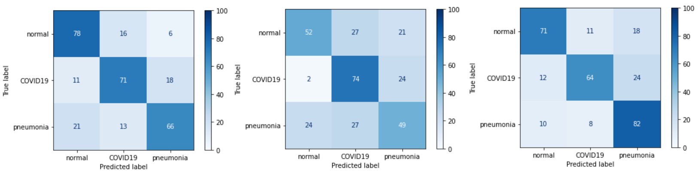
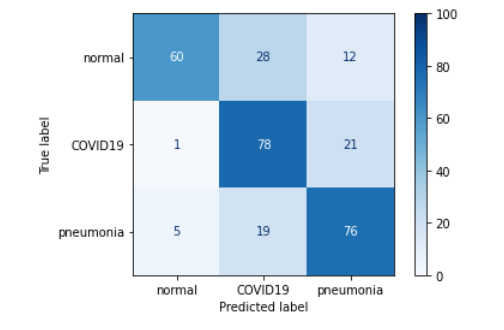
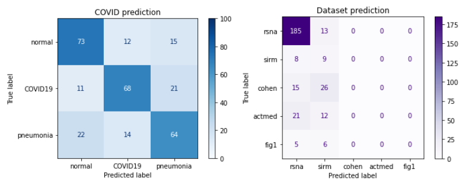
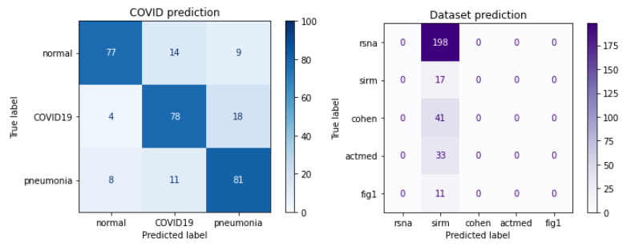
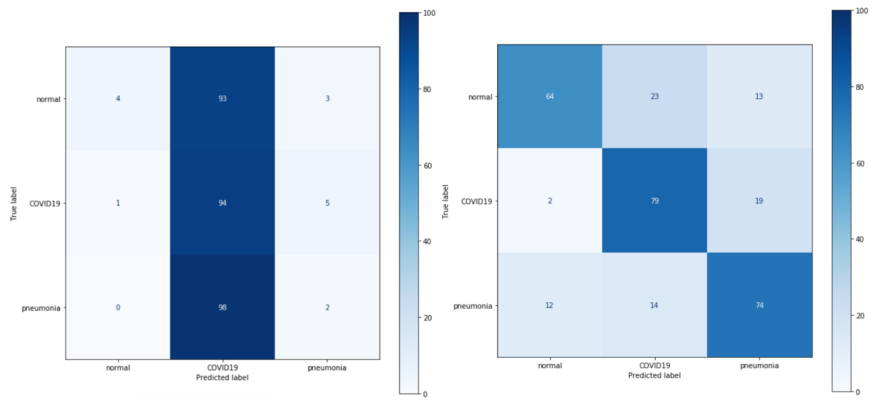
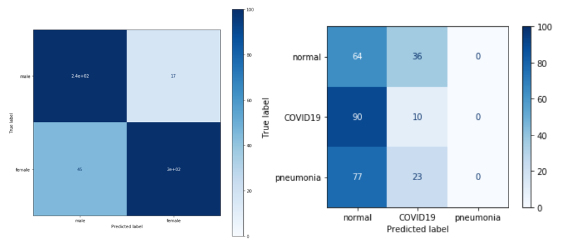
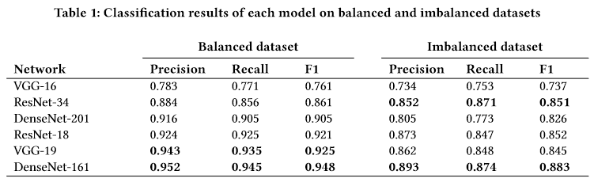

## An Exploration of DeepCovidExplainer: Explainable COVID-19 Diagnosis from Chest X-rays

*Authors: Kurowski Kacper, Mróz Zuzanna, Podsiad Aleksander*

### Introduction and motivation <!-- DONE -->

To make no secret of it, the main motivation for our work was to pass the Research Workshop class. Our task was to try to reproduce the results of the DeepCovidExplainer project. It is a Deep Learning model based on deep convolutional neural networks for predicting disease (or lack thereof) from lung x-rays.

In our opinion, however, the end goal isn’t the most important part of the journey. It is, as the saying goes, the process (and the friends we made along the way). Therefore, in this article we would like to focus on it. We will outline our adventure in trying to reproduce this model, including the problems and obstacles we encountered along the way. We will also try to describe what could be done to prevent such problems in your own projects. After all, reproducibility in research is necessary for two key reasons: to provide evidence of the correctness of a study's results, and to provide transparency with your experiment and allow others to understand what was done.

### Related work

DeepCovidExplainer [@3-0-DeepCOVIDExplainer] is the work of 6 researchers. This project involved training several neural networks: VGG, ResNet, DenseNet, based on the [COVIDx](https://github.com/lindawangg/COVID-Net/blob/master/docs/COVIDx.md) dataset to recognize whether a given image belongs to a healthy person, a COVID-19 patient, or a pneumonia patient.

The COVIDx dataset, consists of six smaller publicly available datasets:

1. Covid-chestxray-dataset [@3-3-cohen2020covidProspective]
2. [COVID-chestxray-dataset](https://github.com/agchung/Figure1-COVID-chestxray-dataset): a public open dataset of chest X-ray and CT images of patients who are positive or suspected of COVID-19 or other viral and bacterial pneumonias (MERS, SARS, and ARDS.) Built to enhance models for COVID-19 detection (COVID-Net) and COVID-19 risk stratification (COVID-RiskNet):
3. [Actualmed COVID-19 Chest X-ray Dataset Initiative](https://github.com/agchung/Actualmed-COVID-chestxray-dataset): also built to enhance models for COVID-19 detection (COVID-Net) and COVID-19 risk stratification (COVID-RiskNet)
4. COVID-19 Radiography Database described in [@3-3-9144185] and in [@3-3-RAHMAN2021104319],
5. [rsna-pneumonia-detection-challenge](https://www.kaggle.com/c/rsna-pneumonia-detection-challenge) dataset from kaggle competition;
6. Medical Imaging Data Resource Center (MIDRC) - RSNA International COVID-19 Open Radiology Database (RICORD) Release 1c - Chest x-ray Covid+ (MIDRC-RICORD-1c) [@3-3-d22318dbf59248c99bd2b5bfe8944b03].

The above dataset is used in many other works on deep neural networks. We will name a couple of them.

In the paper [@3-3-Wang2020], the authors use COVID-Net. They compare their results (more than 90% Accuracy) with the results they obtained on the VGG-19 and ResNet-50 networks. The paper differs from DeepCovidExplainer mainly in that in the latter the authors practically ensemble three networks, while in COVID-Net they use only the titular one.

The authors of the paper [@3-3-Ucar2020COVIDiagnosisNetDB] use SqueezeNet to create the model, which is fine-tuned using Bayesian optimization. The fine-tuned model has over 90% Accuracy. The work differs in the network used and the method of selecting optimal parameters.

Each of the above mentioned works deals with the application of deep neural networks in classifying the health status of a patient based on CXR images of his lungs. However, as our authors say, the final goal is to create a tool to assist radiologists in diagnosing the condition, not to replace them.

### Our work 

#### Getting started 

The first step in our journey was to create a virtual environment to run all the code. Unfortunately, this is where the problems start. The authors did not specify - either in their article or in the project repository - which libraries and their versions are needed, or even which version of Python the code is written for. This would have made our job very difficult if we had not thoroughly searched all the included code files. Fortunately, we were able to find a code snippet that listed the versions of some packages (numpy version 1.18.1, tensforflow version 1.14.0, keras version 2.3.1) and the runtime environment (Python 3.6.9).

However, if this piece of code had not appeared in the previously generated .ipynb notebook it would probably have strongly affected the pace of our further progress, perhaps even prevented the completion of the project.

Through trial and error (and repeating the process of running the code and installing missing libraries many times) we finally managed to figure out how the virtual environment should look like. Here are our results:

1. Virtual environment

Package                   Version
-----------------------   ----------------------------- 
Python 3.6                3.6.9 or newer
numpy                     1.18.1
tensorflow                1.14.0
tensorflow-gpu            1.14.0 (optional)
keras                     2.3.1
h5py                      2.10.0
weightwatcher             0.2.7
matplotlib                newest compatible
scipy                     newest compatible
scikit-learn              newest compatible     
pandas                    newest compatible
pydicom                   newest compatible
ipython                   newest compatible
jupyter                   newest compatible
ipykernel                 newest compatible
opencv                    newest compatible
torch                     newest compatible
PIL                       newest compatible
xlrd                      newest compatible
openpyxl                  newest compatible
innvestigate              newest compatible

2. Standalone installation 

Program                   Version
-----------------------   ----------------------------- 
CUDA                      10.0 (optional for gpu)
cuDNN                     7.4.2 (optional for gpu)


#### Finding data

The main source of data for our project were the github repositories presented in the original article, which make up the COVIDx dataset. It contains chest X-ray (CXR) images of patients of different ages and health conditions. There are three prediction classes: the lungs of a Covid-19 patient, the lungs of a person with pneumonia, and the lungs of a healthy person. The images are mostly black and white and vary in size.

Unfortunately, here we also encountered a major obstacle. Namely, the authors did not include the data on which they trained their model in their repository. We had to find the repositories from which the data were taken knowing the name of the dataset given by the authors (COVIDx). We then generated this dataset from various sources, although this was not without problems. Most of the datasets generated in this way had too few or too many images from the relevant classes relative to the description of the authors of the paper.

We were able to obtain a dataset which mostly matched the description of the dataset used by our authors, but to this day we are unsure why the same dataset generation script kept giving different people different results. Hopefully the generated dataset matches the one used in DeepCovidExplainer but unfortunately we have no way of confirming that.

#### First look at the models 

After acquiring the dataset, it was time to attempt to train and test the preliminary models. In the article, the authors describe three separately trained model types: VGG (16, 19), ResNet (18, 34), and DenseNet (161, 201). All of these networks are convolutional networks; the number behind the name indicates the total number of layers (so, for example, VGG-16 has 16 and VGG-19 has 19).

In VGG networks, the last three layers are dense layers, while the previous ones are convolutional layers, with a 3x3 filter, arranged in blocks of 2, 3 or 4. Each such convolutional block ends with max pooling. In all cases (except the last one, where the activation function is softmax,) the activation function used is ReLU.

```{r VGG19, out.width="550", fig.align="center", echo=FALSE, fig.cap='VGG19 architecture'}
knitr::include_graphics('images/3-3-vgg19.jpg')
```

In the case of VGG, the convolutional blocks end in max pooling with stride=2, which makes the first two dimensions of the data accepted by the next layer twice as small. After a few convolutional blocks, we no longer have the ability to do another stride, making it impossible for the next block to operate on the reduced dimension. The consequence of this problem is that as the number of convolutional layers increases, the prediction error becomes larger.

ResNet addresses this problem; it solves it by creating convolutional blocks with an additional connection between the data after the block and that before. In this way, further convolutional blocks learn small changes that can improve the prediction.

```{r ResNet18, out.height="350", fig.align="center", echo=FALSE, fig.cap=''}
knitr::include_graphics('images/3-3-resnet18.png')
```

This idea is somewhat developed in DenseNet networks. In them, instead of convolutional blocks, we have dense blocks that end in convolution with ReLU and max pooling. This time the results of the dense block are transferred as additional information to the result of each subsequent block. In this way, no information is lost and the network learns to improve the results slightly in each subsequent block.

```{r DenseNet161, out.height="350", fig.align="center", echo=FALSE, fig.cap='DenseNet161 architecture'}
knitr::include_graphics('images/3-3-densenet161.png')
```

Of the six models mentioned in the paper, we decided to focus on the VGG-19 network, which we felt had the clearest architecture, was easily modifiable, and which we were able to run.

However, here we also encountered a couple of problems. Firstly, the code from the repository set up by the authors created a model that distinguished 4 classes (covid-viral, non-covid-viral, bacterial, normal), while the article distinguished only 3 classes, which we wrote about earlier. We were therefore forced to modify the model to match the original idea from the article and change some of its parameters. Fortunately, this was not a hard problem to overcome, but its presence indicates that the code provided may be out of date with the article.


#### An attempt at preprocessing 

Our data for training the model had not been modified in any way at this point other than the resizing to 224x224x3 (RGB conversion) required to run the model.

Therefore, we decided to do a full-fledged preprocessing as recommended by the authors of the paper. Unfortunately, the code for preprocessing posted on the repository did not work, so we had to actually write our own version of it, following the description from the article and fragments of unfinished code provided by the authors.

Our preprocessing consisted of:

 * resizing the image with anti-aliasing,
 * histogram stretching (contrast enhancement),
 * reducing noise with anisotropic diffusion,
 * converting from RGB to greyscale format for better performance,
 * creation of a mask using the threshold function from the OpenCV library (detection of the brightest spots in the photo),
 * modifying (thickening) the mask using the dilate function from OpenCV (in order to be able to detect thin lines),
 * removing annotations from the image using the inpaint function from OpenCV and using the already created mask.

We have also dropped the part of the authors' code where they introduce the division between the right and left side of the image, as they did not use this later in the code and it does not seem necessary.

```{r BeforeAfter, out.height="300", fig.align="center", echo=FALSE, fig.cap='Before and after preprocessing'}

```

#### Modifications and other curiosities 

As we mentioned earlier, we focused on the VGG19 model, mainly because of the straightforward implementation and ease of modification of its architecture. We performed several experimental modifications and improvements that aimed to improve the performance of this model.

```{r ConfMatrix, out.height="250", fig.align="center", echo=FALSE, fig.cap='Confusion matrix of the base model '}

```

##### Superficial changes 

The first changes we decided to make were small alterations to the VGG network. The reason for choosing VGG was the simplicity of making these changes combined with the ease of evaluating the results.
Firstly, the value of filters was changed from 16 to 32 in the last (fifth) convolutional block.
The second change was to add a new (sixth) convolutional block at the end of the network with the same values as the other blocks, except for the filters value which was set to 32.
The last was to add another dense layer (256 neurons + Dropout 0.25 between the first and second dense layer) in the classifier block.
Unfortunately, none of these changes resulted in improved prediction of the network. On the other hand, it's somewhat interesting to note that these changes didn't result in a significant worsening of the network prediction: the Accuracy still remains at 70-80%, the same as before the changes were made.


```{r Smallchanges, out.height="250", fig.align="center", echo=FALSE, fig.cap='Confusion matrices of models with small changes: first, second and third'}
knitr::include_graphics('images/3-3-small_changes.png')
```

We also used 3 types of regularization: L1 regularization, L2 regularization, and mixed L1 and L2 regularization. In the case of mixed regularization, we obtained an improvement in the prediction of pneumonia, but this came at the expense of predicting both the absence of disease and the presence of COVID19. Unfortunately, it cannot be concluded that any of the regularizations improved network performance.

```{r L1L2, out.height="250", fig.align="center", echo=FALSE, fig.cap='Confusion matrices of models: with L1, with L2 and with both'}

```

We also tested the performance of VGG19 without the so far present Dropout 0.5 mechanism between dense layers, and as you might guess we only got worse results.

```{r WihoutDropout, out.height="250", fig.align="center", echo=FALSE, fig.cap='Confusion matrix of the model with no dropout'}

```

##### Multiple outputs and ensemble 

The idea behind creating the second output in our model was to see which dataset a particular image came from. To remind the reader, the dataset we are using is actually a mixture of several datasets.
We tried adding an additional output three times. The first time, we decided to perform branching in the part of the VGG network composed of dense layers. The resulting output unfortunately turned out to be quite poor - first, the COVID-19 detection quality deteriorated, and second, too many images were misclassified as originating from the RSNA dataset.

```{r CM1, out.height="250", fig.align="center", echo=FALSE, fig.cap='Confusion matrix of the model with branching in dense layers'}

```

The lack of success with the first approach contributed to our second attempt - we separated the last three convolutional blocks and implemented the class weights mechanism. Unfortunately, this did not improve our results - this time all data were classified as coming from the sirm dataset.

```{r CM2, out.height="250", fig.align="center", echo=FALSE, fig.cap='Confusion matrix of the model with earlier branching and class weights mechanism'}

```

Finally, we decided to separate the network from the first convolutional block and dispensed with class weights. Similarly, this time all images were classified as coming from a single dataset.

```{r CM3, out.height="250", fig.align="center", echo=FALSE, fig.cap='Confusion matrix of the model with the earliest branching and no class weights'}
knitr::include_graphics('images/3-3-cm_output3.png')
```

These results can be seen as a lack of success on the one hand, and somewhat positive news on the other. Despite the lack of improvement in prediction, we learned that images from different datasets are not that different. This is, of course, good news, so that we know that the model does not learn exemplary features based on potential special features of the sets.


Let’s move on to our ensemble ideas. The first concept for the ensemble was to combine results from ResNet and VGG. Unfortunately, this idea did not give successful results, because ResNet classified all data as one class, which resulted in incorrect prediction of the whole ensemble.

```{r Ensemble, out.height="250", fig.align="center", echo=FALSE, fig.cap='Ensemble of ResNet and VGG'}

```

For this reason, we opted for an ensemble composed of most of the decently performing VGG networks generated during the previous steps. The results obtained were definitely better than those of the previous ensemble idea, but still did not give an improvement over the baseline.

```{r Ensemble2, out.height="250", fig.align="center", echo=FALSE, fig.cap='Ensemble of multiple VGGs'}
knitr::include_graphics('images/3-3-cm_ensemble_vgg2.png')
```

##### GAN and transfer learning - unsupervised pretraining and an auxiliary task 

To augment the training data, we decided to train an image generator using the generative adversarial network (GAN) method. With this model we could perform pretraining on a large number of randomly generated lung images without the risk of overtraining.
The results are quite satisfactory however, due to hardware limitations the generated lung images are not of very high quality.

```{r GAN, out.height="300", fig.align="center", echo=FALSE, fig.cap='GAN generator results'}
knitr::include_graphics('images/3-3-gan.png')
```

We then tried to use pretraining on VGG19 using images from our dataset without labels. We chose not to use images generated from the GAN network because we were able to visually determine that the images were not of high enough quality for this task.
We trained the convolutional layers using an unsupervised feature detection algorithm (autoencoder). After training the layers in this manner, we added an output layer and tuned the network using supervised learning (without unfreezing the convolutional layers due to the very high encoder accuracy - 99.99%). Unfortunately the results weren’t very satisfactory - the network placed far too much emphasis on the prediction of pneumonia and far too little on the prediction of normal lungs.

```{r Transfer, out.height="250", fig.align="center", echo=FALSE, fig.cap='Unsupervised pretraining results'}
knitr::include_graphics('images/3-3-cm_tf0.png')
```

Let us focus next on the auxiliary task. We noticed that much of the dataset we use in our project comes from the RSNA dataset. It does not contain the lungs from COVID-19, but it does contain many more other types of ailments. This dataset also contains much more information about each image - such as the gender of the person in the image - and it was because of this information that we decided to create an auxiliary task.

Our auxiliary task was to identify whether a photo was of a man or a woman. In order to accomplish this task we trained the VGG network, and then using the weights stored as training starters, we attempted to teach the network our initial task.

Unfortunately, while the network's results on the aux task were quite satisfactory, the network's results on the output task were much worse - the network was unable to break out of the weights predicting two variables - moreover, it seems to even come close to predicting all values as one class.

```{r Aux, out.height="250", fig.align="center", echo=FALSE, fig.cap='Auxilary task results'}

```

#### Final results 

Interestingly, all our models oscillated between 70-80% accuracy. In the end, it turned out that we got the best (or comparable) results after performing undersampling alone. This result is similar (or even a little better!) to the result obtained in the notebooks on the repository.

Despite the fact that we tried to follow as closely as possible the process described by the authors, we could not achieve results similar to those in the article, where VGG19 had results ranging between 85%-95%. This is not surprising, given that we are not experts in Deep Learning practices and had access neither to the actual version of the code used by the authors nor are we even sure if we used exactly the same dataset as they did.

```{r Aut, out.height="200", fig.align="center", echo=FALSE, fig.cap='Original authors\' results'}

```

### Conclusions and summary

As you can see, our road was long and sometimes arduous, but we must admit that we learned many valuable things during it. First of all, we gained a lot of practical knowledge about deep learning and became skilled in using related libraries. After the problems we encountered and the ones we heard about from our colleagues in other groups working on other deep learning projects, we drew some conclusions about what authors of a scientific paper can do to facilitate the reproducibility of their results.

First, as authors we should make the code of our project available and also describe as precisely as possible the environment in which it was written, including our programming language’s version and the versions of all necessary libraries and additional software, if we use any. Without this it is very hard to verify our results and you can never be sure if any reproduction is completely accurate.

The code we include should also be as up-to-date as possible, and it should be run at least once from start to finish. We should make sure it works as-is and doesn't need to be corrected. If there are a lot of files, they should have clear and appropriate names, and we might even want to consider writing a short manual

If we're using open-source data, we should also provide access to it if possible, or at least describe its source in detail - it's very useful to include links if they exist.

By following these steps we will ensure reproducibility of our results and make it much easier to verify them, which as we know is crucial in any scientific project.
