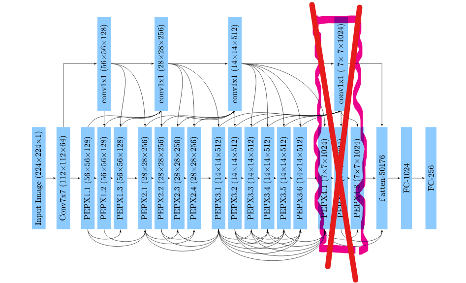
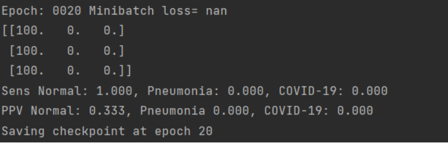
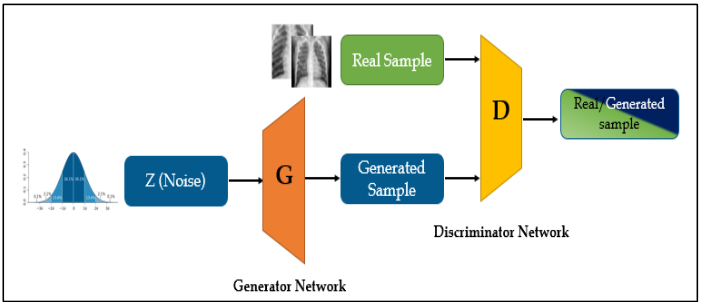
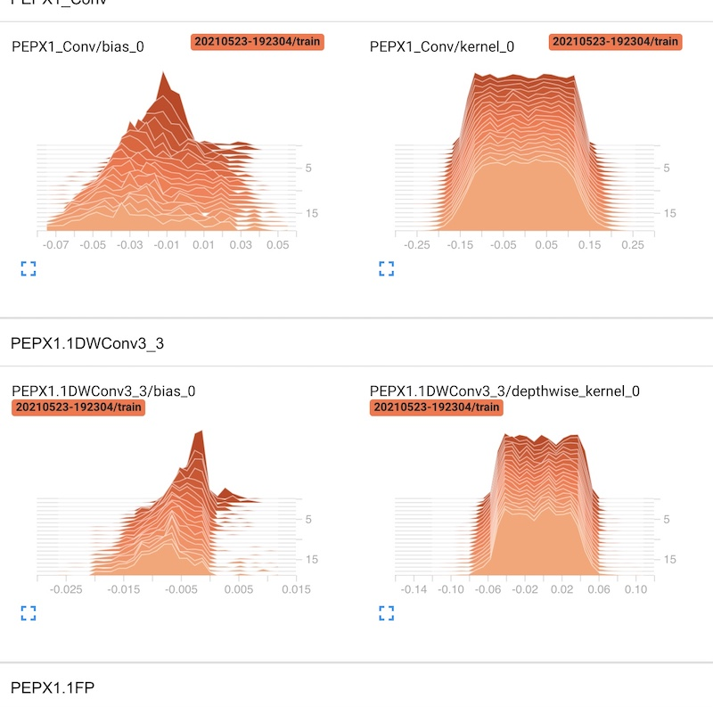
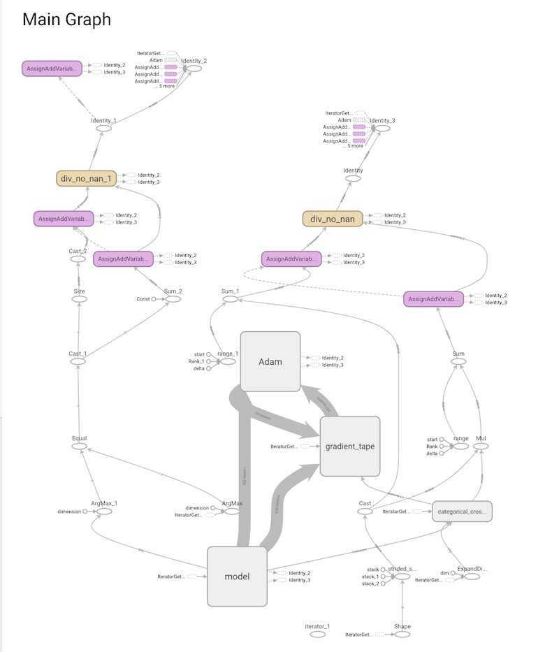
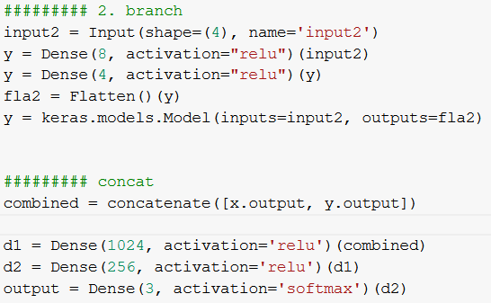

## Reproducing and modifying COVID-Net

*Authors: Kozieł Jakub, Nocoń Tomasz, Staroń Kacper*


### Abstract

COVIDNet being one of the most effective and well-established deep neural networks for COVID-19 diagnosis should be fully reproducible. Additionally, as a state-of-the-art solution it can serve as a case study for exploring advanced deep learning methods. In this work we present our attempts in both of those fields.


### Introduction and motivation

Global pandemic of COVID-19 disease demanded quick response from the scientific community and bioinformatics plays a key role in research on the virus, its development, transmission, disease diagnosis, etc., due to how powerful of a tool it is.
Particularly deep neural networks that are able to learn new patterns in medical data in an automated manner and present doctors quickly with a set of complex hypotheses for consideration.
One of the widely appreciated models is COVID-Net developed by Linda Wang, Zhong Qiu Lin and Alexander Wong, that diagnose patient based on image of x-ray chest photo.
Reproducibility is always important factor of scientific paper, but in joined attempts to fight global pandemic it is even of greater importance when discussing medical papers.
Additionally this work is a part of case study in Data Science course at Warsaw University of Technology, so beyond assessment of reproducibility we will focus on exploring multiple modifications to COVID-Net.

### Related work

1. COVID-Net: a tailored deep convolutional neural network design for detection of COVID-19 cases from chest X-ray images [@3-5-Wang2020]- original COVID-Net paper
2. Siamesifying COVID-Net [@3-5-kerascovid] - reconstruction of COVID-Net in Keras framework
3. Detection of Coronavirus (COVID-19) Associated Pneumonia based on Generative Adversarial Networks and a Fine-Tuned Deep Transfer Learning Model using Chest X-ray Dataset [@3-5-gancovid] - using GAN for chest x-ray datasets

### Dataset

The dataset for COVID-Net was combined from 3 repositories and two kaggle databases, gathering collectively $16690$ (at the day of 03.03.2021) examples. From what is written we can deduce that all samples are X-ray photos. 
Moreover, each one is in JPG format and on a grayscale. Unfortunately every photo has different size. The analyzed model mainly focused on recognizing the 3 categories of the lungs state: normal, pneumonia and Covid-19 and took photos of size $480\times480$ as an input, although their original size was $1024\times1024$


For the time being COVIDx dataset can be summarized with output produced by jupyter notebook intended to combine data from various sources. Metadata corresponding to the extracted samples is inconsistent and missing values to the point that the imputation or any meaningful analysis on the majority of parameters cannot be performed. Only two parameters available for analysis are sex and view (describing the type of photo).

Used data souces:

1. Covid Chest X-Ray Dataset [@3-5-cohen2020covidProspective]
2. [covid-chestxray-dataset](https://github.com/agchung/Figure1-COVID-chestxray-dataset)
3. [Actualmed COVID-19 Chest X-ray Dataset Initiative](https://github.com/agchung/Actualmed-COVID-chestxray-dataset)
4. [COVID-19 Radiography Database](https://www.kaggle.com/tawsifurrahman/covid19-radiography-database)
5. [rsna-pneumonia-detection-challenge](https://www.kaggle.com/c/rsna-pneumonia-detection-challenge )

After minor modifications to scripts provided by authors of COVID-Net reproducing initial dataset was successful.

### Reproducibility

Having composed a proper dataset we could try to reproduce results presented in the article. However, many changes in the training script had to be made. First of all, labels provided had inconsistent format. Before proper corrections this resulted in error while acquiring proper label for an image. There was no information about requirements and which versions of which packages are needed so we had to figure them out experimentally. In order to use TensorFlow v2, we had to provide appropriate compatibility within the training script. Those changes were sufficient to obtain solid results within 10 epochs. 


```{r reproduction, fig.align="center", echo=FALSE, fig.cap='Training results'}
knitr::include_graphics('images/3-5-reproduction.png')
```

This is not the only attempt to acquire COVID-Net results. The way described above wouldn't allow any major architecture modifications, therefore we were forced to created our own training and evaluation scripts using generators to be able to train Keras implementation of this network. Despite many tries to improve the training, the accuracy of this model was around $33\%$, it remained a random classifier.

### Further experiments and network modifications

#### Network modifications
Taking advantage of Keras implementation of the model architecture few modifications were introduced. Although this version of the model is completely random, we were searching for any impact of implemented changes.

##### Downsizing the architecutre

First change was motivated by high probability of the model being heavily underfitted. Having considered this, it seems very reasonable to reduce the number of parameters.

We have decided to get rid off the very last group of PEPX modules.

```{r architecure, fig.align="center", echo=FALSE, fig.cap='Modified architecture'}

```

Removal of the 4th group of PEPX modules consisting of relatively large layers allowed for a noticeable reduction of the number of trainable parameters from $183M$ to $133M$. However, this modification wasn't sufficient to eliminate randomness of the model. Accuracy after 30 epochs still tends to vary around $33\%$ with no much of a promise for quick improvement. We though compare this performance to the original on the training set. Accuracy there achieved $70\%$ and is comparable to previous.


#### Diverse regularization methods
Regularization is a process that aims to reduce generalization error of the model. We are going to present different types of regularization implemented to original COVID-Net model.

##### L1 and L2 regularization
L1 regularization adds the penalty term in cost function, which is calculated by adding the absolute value of weight parameters. L2 regularization is in fact adding L2 norm to the cost function - adding squared value of weights. We tried both having set the alpha parameter to $10^{(-3)}$. However, our model after 20 epochs still needs a lot of training and is nowhere near overfitting. We expected that it might worsen the results, but it went even further and a quite good classifier became a random one.


```{r norm, fig.align="center", echo=FALSE, fig.cap='L2 regularization results'}

```

##### Dropout

Dropout is a technique that relies on dropping randomly selected units from hidden layers. This ensures that no units are codependent.

This method in contrast to the previous was applied to the model architecture implemented in Keras because it was much easier to perform.

Dropout with the rate set to 0.3 was applied to two out of three dense layers.

In both cases of training (regular and with dropout) the network acts just as a random classifier, therefore it is hard to come up with any reasonable conclusions. However, we were able to compare results on training dataset. We could observe increased value of loss function and accuracy falling from 70% to 60%. This provides us with arguments to state that this method of regularization is also going to have a negative influence on model performance due to reasons mentioned in L2 regularization description.


#### Generative Adversarial Network

Generative Adversarial Network is a pair of two specific neural networks - generator and discriminator, which train each other by generating by the generator data similar to the original training set and assessing the quality of the generated sample by the discriminator. 

```{r discriminator, fig.align="center", echo=FALSE, fig.cap='Disicriminator architecture'}

```

In paper titled 'Detection of Coronavirus (COVID-19) Associated Pneumonia based on Generative Adversarial Networks and a Fine-Tuned Deep Transfer Learning Model using Chest X-ray Dataset' the authors provide an analysis of how the use of GAN in various neural networks in issues related to the processing of x-ray images of the lungs (including the diagnosis of COVID-19) increased the efficiency of classification.

Upon examining architecture proposed in the paper and modifying it specifically for the purpose of COVID-Net we decided to proceed with the following design:

```{r discriminator2, fig.align="center", echo=FALSE, fig.cap='Disicriminator architecture'}
knitr::include_graphics('images/3-5-disc-arch.png')
```


```{r generator, fig.align="center", echo=FALSE, fig.cap='Generator architecture'}
knitr::include_graphics('images/3-5-gen-arch.png')
```

Designed Generative Adversarial Network was complete and operational, however in face of the limited time and resources and extensive computational requirements our network did not succeed in providing any actual images beyond simple patterns in random noise.

#### TensorBoard

TensorBoard was used to visualize some statistics and the dataset. Starting with the first one, we showed on the plots the increase in the accuracy of the model on the training set after 20 epochs and the decrease of the loss.

```{r fig.align="center", echo=FALSE, fig.cap='TensorBoard Plot'}
knitr::include_graphics('images/3-5-plot.jpg')
```

This tool has given us a handful of opportunities to test some behavior of our model. We could also smoothen the curve if we wanted to see better results. Furthermore, we had an access to the distribution of the values of the weight matrixes (kernel) and the bias after each iteration. Here is an example for the PEPX layer.


```{r fig.align="center", echo=FALSE, fig.cap='TensorBoard Plot'}

```

Also to show the complexity of the model we could display the graph of it. The TensorBoard gave us such a possibility:


```{r fig.align="center", echo=FALSE, fig.cap='TensorBoard Plot'}

```

Moving on to an overview of the dataset. To our surprise, TensorBoard performed very well. We were able to use the PCA and T-SNE algorithm to see the dataset in the 3D world. It also gave us some information about the similarities of the individual samples, as both are clustering methods. Here we display the screen of that experiment:


```{r fig.align="center", echo=FALSE, fig.cap='TensorBoard Plot'}
knitr::include_graphics('images/3-5-dataset.jpg')
```


#### XAI

Convolutional neural network presented by COVID-Net team is a type of "black box" model, however, it is possible to investigate how the classifier itself works. In order to get better understanding of results achieved, we have implemented one of explainable artificial intelligence methods. Framework iNNvestigate offers many analyzers with LPR being one of them. LRP (Layer-Wise Relevance Propagation) attributes recursively to each neuron's input relevance proportional to its contribution of the neuron output. Thanks to it, humans can monitor areas of interest of the model. Output achieved with LPR can be another evidence of in fact poor performance of the model and its complete randomness.

```{r xai, fig.align="center", echo=FALSE, fig.cap='Chest X-Ray input'}
knitr::include_graphics('images/3-5-xai-pluca.png')
```

```{r xai2, fig.align="center", echo=FALSE, fig.cap='Output of LPR model'}
knitr::include_graphics('images/3-5-xai-wyniki.png')
```


#### Model Ensemble

It is common to observe an ensemble of models to perform significantly better than the single model on the given task, especially in the image recognition field. In this modification, we devised a simple stacking ensemble.

```{r generator2, fig.align="center", echo=FALSE, fig.cap='Generator architecture'}
knitr::include_graphics('images/3-5-ens.png')
```

It was composed of two models - COVID-Net and ConvPool-CNN-C and trained to combine the predictions of both of the models, which in this case was simply averaging outputs, which in problem of classification on images is acceptable approach.

However, we cannot determine how effective is this approach in terms of enhancing initial COVID-Net performance.

What we can observe and what can provide even remote insight in hypothetical performance of proposed ensemble is "side-by-side" performance of both models individually after one epoch on subset of data with over 1500 samples. Unfortunately, both models of an ensemble trained during this experiment simply classified all samples into one category, which isn't a base for any further conclusions.

#### Mulitmodal input

We decided to modify COVID-Net architecture so it would accept multiple different types of input training data, particularly numerical and encoded categorical data apart from images.


```{r generator3, fig.align="center", echo=FALSE, fig.cap='Generator architecture'}
knitr::include_graphics('images/3-5-2inputs.png')
```

We decided that additional data will be represented as a vector and processed by new branch added to COVID-Net consisting of two Dense layers, implemented in Keras.

```{r generator4, fig.align="center", echo=FALSE, fig.cap='Generator architecture'}

```

The most prominent problem with this modification are imperfections of dataset. Metadata regarding x-ray images utilized during training are scarce at best, and above all incomplete beyond imputation.

The richest set of metadata is covid-chestxray-dataset, from which after encoding categorical values we extracted additional data describing the patient's age, sex and information about intubation.

However, amount of data was still far too limited to perform complex analysis of performance of this modified model in relation to original COVID-Net.


### Summary

As far as reproducibility is concerned, we have achieved partial success. The repository prepared by the model authors is very comprehensive. So running the model and merging the dataset was not the difficult part. The model itself presents very decent results. In this aspect we achieved similar results as the authors. However, we only had access to the weights and metadata of the model, not the architecture itself. This meant that we could not conduct the whole research process, especially in building the model from scratch and starting the research at the very beginning. This solution proposed by authors made their research somewhat hermetic. 

Therefore, we used the keras model to perform some changes. Layer reduction, batch normalization did not make any major difference to the model. We also tried to see if regularization could improve some statistics. Introducing the GAN was an attempt to enlarge the dataset. The XAI method gave us rather ambiguous results. In general, we applied some advanced techniques to improve the result, even model ensemble. Nevertheless, results achieved with Keras implementation were close to random, thus non-comparable in any way to the original ones.

