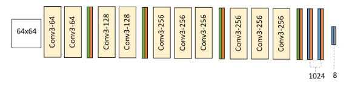
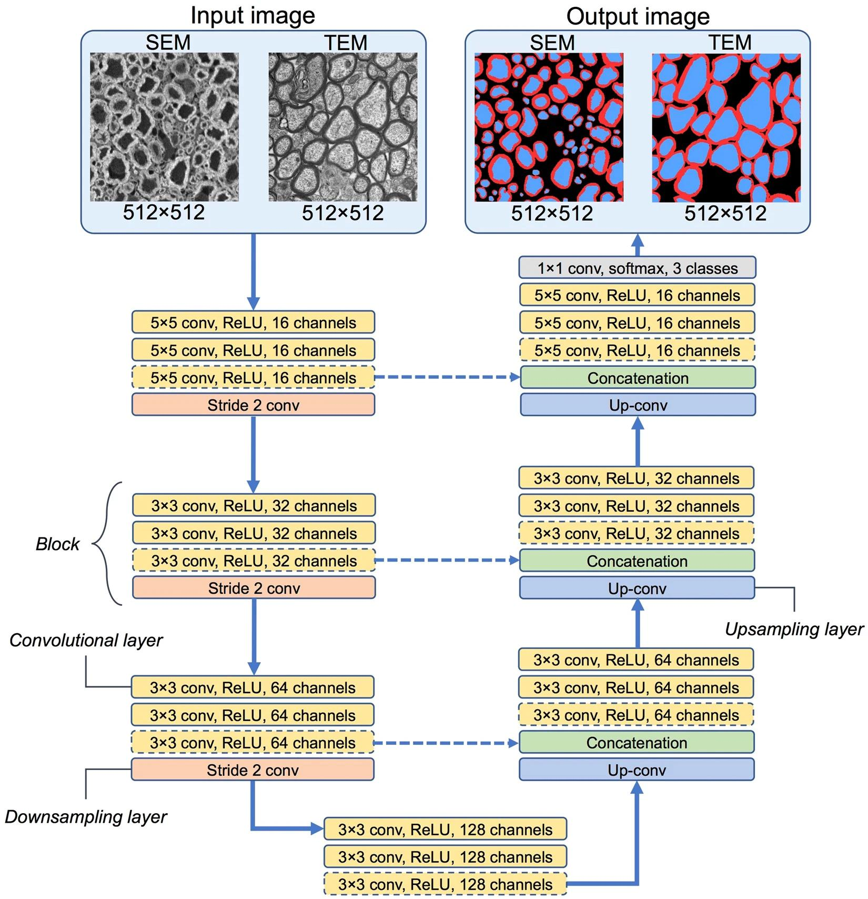

## What makes an article reproducible? Comparison of the FER+ paper and AxonDeepSeg
*Authors: Mikołaj Jakubowski, Patryk Tomaszewski, Mateusz Ziemła (Warsaw University of Technology)*

### Abstract

Reproduction of the code presented in scientific papers tends to be a laborious, yet important process, as it gives the reproducers a better understanding of the methods proposed by the authors, and verifies the credibility of a given paper. While recreating an article, various problems, which sometimes can be hard to overcome, can appear. We decided to go through these problems and compare two papers with their corresponding code. As a result, we identify the most important characteristics of an article that factor into its reproducibility.

### Introduction

#### Why is reproducibility important?

Reproducibility is the ability to rerun an experiment described in a given article and obtain results similar to those presented. Ideally, we would like for the reproduced results to be identical to the ones in the article, however this can be almost impossible to achieve due to the influence of external factors, such as the internal structure of the GPU used. Unfortunately, in most cases even getting similar results may prove to be very difficult [@4-1-reproducibility-crisis]. Many articles do not contain enough information for the reproduction process to be successful. Crucial steps of the experiment may be omitted or presented incorrectly. This is very damaging for the article itself and for the message it is trying to convey. Without the ability to rerun the experiment, the reader cannot be sure that no mistakes were made in the process or that the results were not purposefully misrepresented to fit the narrative. Because of that, the credibility of the article is significantly reduced, and it may prevent other researchers from using those findings in further works [@4-1-taxonomy-of-reproducibility]. Moreover, being able to see each stage of the experiment on its own, tweak different values and observe the change in results can help the reader to better understand the methodology presented in the article and allow for them to apply it, or even improve it, in the future. All those reasons make reproducibility a crucial part in any scientific article, and yet it is being overlooked more often than it should.

#### Motivation
The fundamental purpose of this article is to identify good and bad practices of an article's reproducibility. We outline the methods used in AxonDeepSeg, so they may be used as a reference in future creation of articles to ensure their reproducibility. 

#### Methods
We decided to analyze two different papers, *FERplus* [@4-1-facial-expression-recognition] which will be used for comparison, and *AxonDeepSeg* [@4-1-axon-deep-seg] which was our main focus. We analyzed the articles alongside the source code and other materials provided within them. For both papers, we evaluated their consistencies with the actual code and the ease of replication for anyone trying to verify their results. For the first paper, to evaluate the impact of omitted information and inconsistencies on the final results, we also created a secondary model in the Keras framework, since the original code is presented using the CNTK framework. 

### Analyzing the FERPlus paper

What the authors of this paper want to demonstrate, is how to train a deep convolutional neural network (DCNN) from noisy labels. A great example of obtaining them is getting crowd-sourced labels of facial expressions. With the accuracy oscillating around 65%, there are more precise methods of tagging these photos, but they appear to be significantly more expensive and slower to produce. The authors want to compare 4 different approaches for training DCNNs, showing that including outlier-tagging information in models may have a positive impact on the results.

Specifically for this research a new dataset of facial expressions, called FER+, has been created. Experiments have shown that, as the number of taggers increased, their agreement rate increased as well. They ended up with 10 taggers to label each face image, with one of eight emotions. This allowed for experimentation with multiple distribution schemes during training.

Authors claim to have used a custom VGG13 model with 64x64 input, 10 convolution layers, interleaved with max pooling and dropout layers, and 8 emotion classes as output. 

   <em>Image 1. DCNN architecture used by the authors</em>

As mentioned earlier, various approaches for utilizing labels would be presented. In each example, probability distributions of emotion captured by the facial expression will be generated in a different way.

 - Majority Voting (MV) is the simplest and most obvious method. Each observation gets assigned a label, with 1 for an emotion that was chosen most frequently and 0 for all other emotions.

 - Multi-Label Learning (ML) approach assumes that it is natural for a picture to present more than one emotion. For each observation, whenever a certain emotion’s votes have exceeded a given threshold that emotion is labeled with 1, otherwise with 0.

 - In Probabilistic Label Drawing (PLD), labels are dynamically assigned in each epoch of learning. Every observation gets a label with 1 for a chosen emotion, and 0 for all other emotions. The labels are randomly chosen with probability distribution, based on percentage of taggers' votes for each of them.

 - The Cross-entropy loss (CEL) method simply feeds the model with labels being equal to probability of an emotion appearing in observation. Exactly as before, probability distribution is based on percentage of taggers' votes for each of emotions.

Results of their work, which lead them to the conclusion that PLD and CEL are more effective in this scenario, were as follows:

|Scheme|Accuracy|
|---|---|
|MV|$83.85\%$|
|ML|$83.97\%$|
|PLD|$\pmb{84.99}\%$|
|CEL|$84.72\%$|

   <em>Table 1. Results of the evaluation of the models according to the article</em>

### Reproducibility analysis

#### Insufficiently explained data augmentation
The original model had a 64x64 input, even though the original FER data was only 48x48. The input size was bigger because data augmentation was used. However, this process was only briefly mentioned. Due to the insufficient explanation of used methods, we chose to skip this process, and just repeat the other described steps, as we believed the data augmentation step not to be crucial to the hypothesis. The transformations applied in the original code were hard to reproduce exactly, as the exact specifics of data augmentation were split over multiple objects, variables, and methods.

#### Inconsistencies in the article
As it turns out, the equations for the losses, which were a major part of the hypothesis, were written out incorrectly. 

The equations were in conflict with the words preceding them. For both Multi-Label Learning and Probabilistic Label Drawing, the losses were given in the form of: 
$$\mathcal{L} = - \sum^{N}_{i=1}\underset{k}{\operatorname{argmax}}g(p)^{i}_{k}\log q^{i}_{k}$$
where $g$ was some form of an element-wise transformation. For ML, this was described as a new loss function, and for PLD it was described as standard cross entropy loss. The equation given is neither standard cross entropy loss, nor a valid loss function. $\operatorname{argmax}$ cannot be used as a gradient descent loss function, as it is not continuous, and its gradient is zero everywhere it is defined.

After examining the source code, we realized the authors actually used standard cross entropy loss (extended by a transformation function on the target vector) losses except in the ML scenario, where the following loss was used:
$$\mathcal{L}=- \log\sum^{N,\#\text{features}}_{i,k = 1}(p \odot q)^{i}_{k}$$ where $\odot$ denotes element-wise multiplication. This loss was not present, and is not an equivalent of any loss function given in the article, both in writing or in the form of an equation.

With these inconsistencies, a major part of the article is in direct conflict with the code.

#### Source code reproduction
Multiple outdated dependencies were required, which forced us to downgrade our environment for it to work properly. Other than that, there were no issues with running the code. Both the setup process and usage was clearly described on the github page and worked as described. 

It is also worth noting that the original code is compatible with the CUDA architecture, making the training process significantly faster.

After training each of the models once, we noticed that the accuracy we received was on average 2% lower than the values presented in the article. As no modifications were done to the source code, we are unsure why such differences appeared. 

However, the relation between the schemes which were highlighted in the article stayed the same - with majority voting and multi label being noticeably worse than probability or crossentropy. While this time the most accurate scheme turned out to be crossentropy, the gap between it and PLD is small in both the article and our results, and the difference can be attributed to variation.

|Scheme|Accuracy|
|---|---|
|MV|$85.81\%$|
|ML|$85.72\%$|
|PLD|$86.58\%$|
|CEL|$\pmb{86.96}\%$|

   <em>Table 2. Reproduced results of the evaluation of the models</em>

#### The Keras model
We tried to reproduce the original model in Keras[^model], trying to limit ourselves only to the information contained in the article, as long as it was possible. As mentioned before, we were forced to change the model to accept 48x48 inputs, and trained it as such, with appropriate losses equivalent to the losses in the original code. Using 48x48 inputs has caused a slight bottleneck in the network after the convolution and pooling layers, as the lower initial inputs reduce the dimensionality of the last convolution layer in the VGG architecture, but we assert that the bottleneck limits the capabilities of the model independently of the loss function.

After training the 4 models once, we arrived at similar results as the original paper. The accuracies of the model were significantly lower (~$8\%$), but this can be accounted for by a slight bottleneck in the middle of the model caused by the smaller input dimensions, the different gradient descent algorithm we used and untuned hyperparameters. Our training results were:

|Scheme|Accuracy|
|---|---|
|MV|$77.42\%$|
|ML|$76.52\%$|
|PLD|$\pmb{78.65\%}$|
|CEL|$78.12\%$|

   <em>Table 3. Results of the evaluation of the reproduced Keras models</em>

Our reproduction of the original model gave the same results - that PLD is the best method out of the four given in the article for predicting multilabel data. Sadly, it was not possible to recreate the article's thesis using the article alone.

[^model]: https://gist.github.com/mtizim/364d25f4bdc2ee00cb2a97d270d6aef2

### Analyzing the AxonDeepSeg paper

The previous article has shown some of the issues that may appear when trying to reproduce an article. To further focus on methods of improving reproducibility, we analyze the AxonDeepSeg paper - an article that we have found to be very reproducible.

Authors of this paper are introducing a new open-source software _AxonDeepSeg_, created to ease the process of axon and myelin segmentation from microscopy images of the nervous system. This can be especially useful in research of magnetic resonance imaging, as a validation method for new techniques.

Said software has three features:
 - two ready to use CNN models trained from scanning electron microscopy (SEM) and transmission electron microscopy (TEM).
 - a CNN architecture, suited for axon and myelin segmentation problem
 - a training procedure, which can be used to generate new models based on manually-labelled data

As the dataset for such a problem is not easily accessible, it had to be created for the purpose of this project. Microscopy images were marked and cross-checked by at least two researchers. Sheets were manually segmented using _GIMP_. The final ground truth dataset consists of a single png image with the corresponding values: background = 0 (black), myelin = 127 (red), axon = 255 (blue). Some of the pictures required small manual corrections to avoid false positive outcomes.

Since this dataset is not large, an augmentation strategy was used in order to reduce overfitting and improve generalization. This strategy includes random shifting, rotation, rescaling, flipping, blurring and elastic deformation.

The architecture of the CNN was designed for both SEM and TEM images. The image below explains the architecture design. Dashed lines signify that the segment is viable only for the SEM model, since the TEM model is smaller.

   <em>Image 2. CNN architectures used in AxonDeepSeg models</em>

To assess the quality of the segmentation authors used  _Dice_ coefficient, given by $Dice = \frac{2(|A \cup B|)}{|A| + |B|}$ where $2(|A \cup B|)$ is the number of pixels that well predicted by the model in both images, $|A|$ is the number of well predicted pixels in image A and accordingly $|B|$ for image B.

To assess the performance of myelinated fiber detection, they used sensitivity (true positive rate) and precision (positive predictive value) measures. Both of them are based on the number of detected axons, calculated using the positions of their centroids. 
$$TPR = TP/(TP+FN)$$

$$PPV = TP/(TP+FP)$$

Authors evaluated their trained model with the metrics given above, which produced the results as follows:

|Modality|Test sample(s)|Axon Dice similarity|Myelin Dice similarity|Pixel-wise accuracy|Sensitivity|Precision|	
|---|---|---|---|---|---|---|
|SEM|Rat 1|0.9089|0.8193|0.8510|0.9699|0.8468|
|SEM|Rat 2|0.9244|0.8389|0.8822|0.9876|0.7987|
|SEM|Human|0.8089|0.7629|0.8114|0.9300|0.7306|
|TEM|Mice|0.9493|0.8552|0.9451|0.9597|0.9647|
|TEM|Macaque|0.9069|0.7519|0.8438|0.9429|0.8129|

   <em>Table 4. Results of the evaluation of the models according to the article</em>

### Reproducibility analysis

#### Installation instructions
The installation was well documented, with all dependencies listed as an `anaconda` dependency file. Because of that, the process of installation of necessary libraries was streamlined to executing commands listed on the project's page. The project also provides a video describing the installation process.

#### Usage instructions with examples
Since the paper lead to the development of a scientific tool, the code ended up well-documented. A website containing detailed instructions regarding the usage of the tool is provided with the project. For ease of use, the tool also comes with several python notebooks with fully functional code snippets displaying its potential use cases and capabilities, such as data preparation, model training, processing images and usage of various evaluation metrics.

#### Accessible prepared data
The source code comes with two example datasets, one for the SEM model and one for the TEM model, which are the same as the ones used in the article. Both of those datasets are available in a format already prepared for work with this tool. Additionally, the documentation contains instructions on how to create a compatible dataset from your own images, as well as a reference to the source of images used in the examples.

#### Documentation of differences between the code and the article 
The project itself is still being improved after the release of the article. Because of that, there do exist differences between the code and the original paper, but they are documented inside of the repository, and each difference is given a reason for the change.

#### Accessible pretrained models
The aforementioned notebooks contained functions capable of downloading pretrained models for the tool from the internet, making the models accessible with a single line of code. As such, for most use cases there is no need of dedicating hours of processing time to train a different model.

Evaluating those models yielded similar, if not slightly better results to the ones described in the article. The difference can be attributed to the constant improvement of the source code since the release of the article.

|Modality|Test sample(s)|Axon Dice similarity|Myelin Dice similarity|Pixel-wise accuracy|Sensitivity|Precision|	
|---|---|---|---|---|---|---|
|SEM|Rat 1|0.9256|0.8366|0.9574|0.9178|0.9336|
|SEM|Rat 2|0.9458|0.8278|0.9666|0.9337|0.9581|
|TEM|Mice|0.9439|0.8661|0.9701|0.9179|0.9738|

   <em>Table 5. Reproduced results of the evaluation of the models</em>

#### Working training code

The notebooks also contained example well commented code allowing easy model training, either with the use of training data used in the article or any other data conforming to the format specified in the documentation. We ensured that the code was working by successfully training a model with a single epoch. 

### Conclusion

While the source code of the first article can be compiled without any difficulties, and the results it generates are similar to the ones described in the article, the code itself is not consistent with the article. The differences in loss methods, which are the focus of the paper, and the lack of a proper description of used augmentation methods makes this article poorly reproducible without access to the code. Even paired with the code, the paper is not a proper description of the code's actions, and as such, the thesis of the article is not the thesis which the code is evidence for.

In contrast, the second article provides a sufficient description of the technical knowledge required to reproduce the source code. No details relevant to the paper's thesis were omitted. As the code changed over time, all inconsistencies with the article are labeled, and the reason for each one of them is given. The authors went to great lengths to ensure that the usage of the tool is as easy as possible, providing detailed instructions for common use cases, as well as video recordings and premade code snippets. The project also contains example datasets and pretrained models for each of the network types, further simplifying working with the tool.

We posit that there are two main components of reproducibility of an article: the consistency of the method used with the method described in the paper, and a proper technical description of all variables relevant to the thesis, so that with enough effort, the method can be repeated again from the paper alone. What's more, the inclusion of additional material, such as code snippets, is also beneficial for the ease of reproducibility.