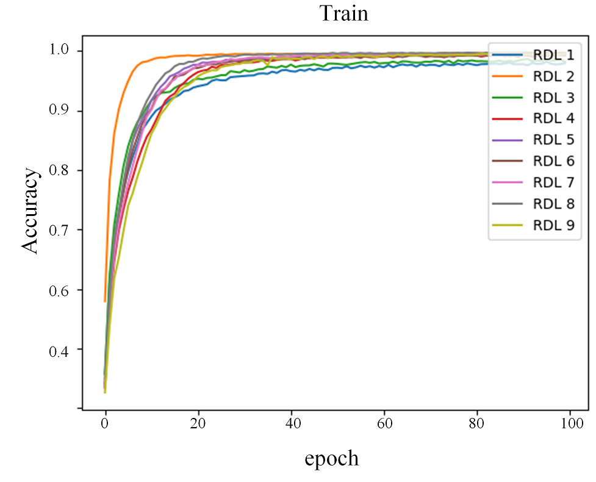
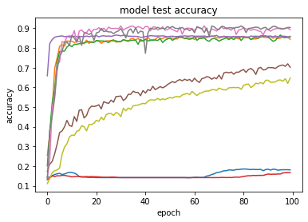
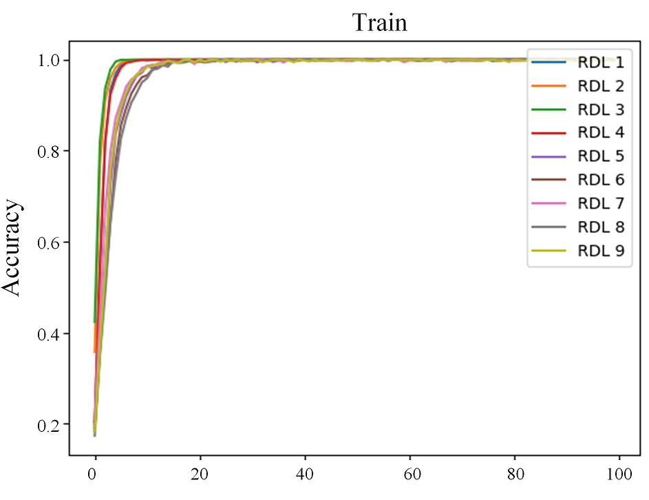
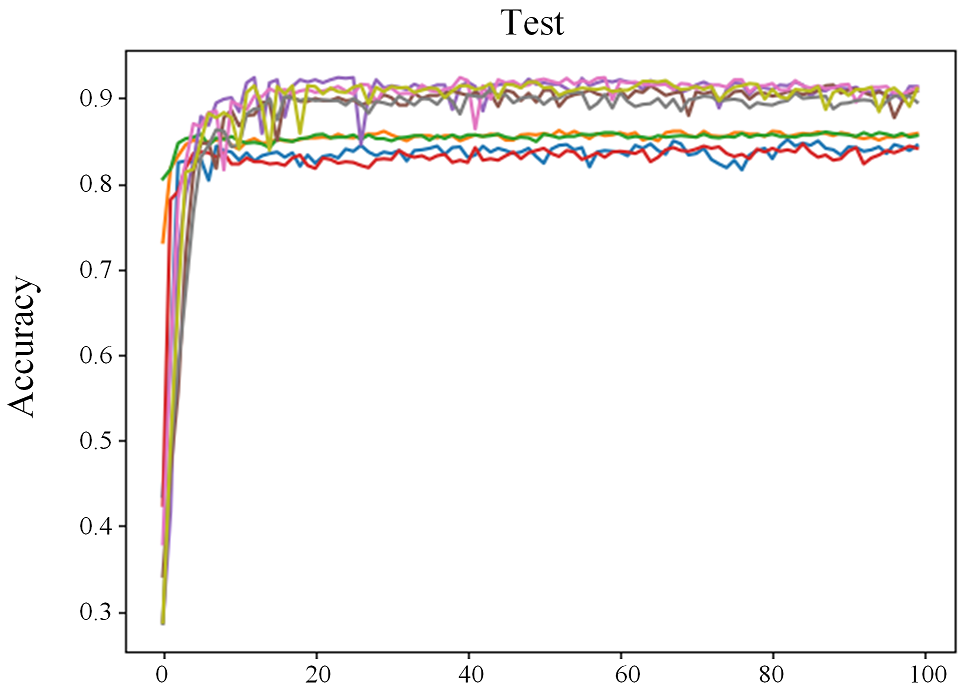
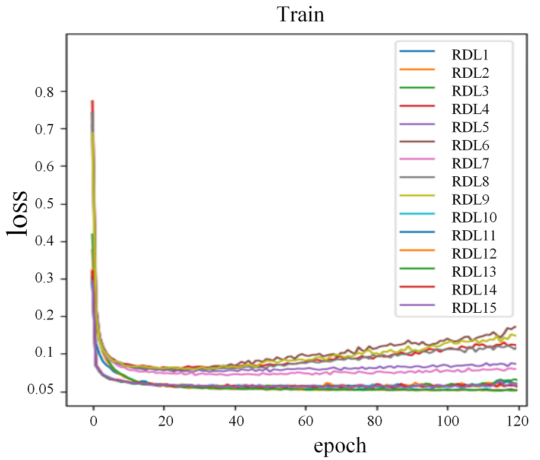
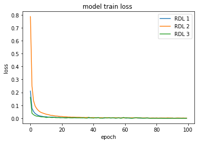
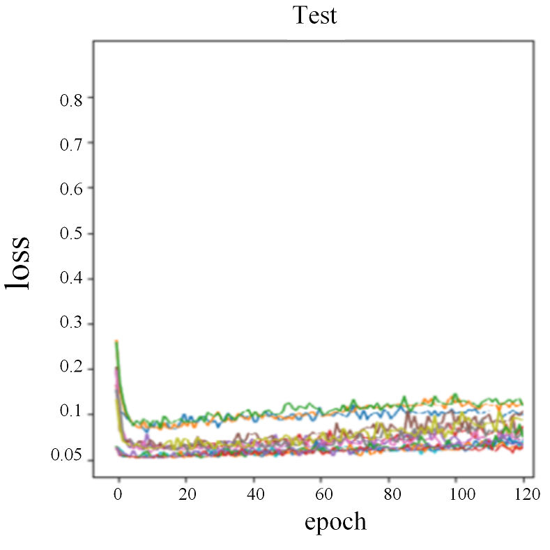

## Title
*Authors: Filip Chrzuszcz, Szymon Rećko, Mateusz Sperkowski (Warsaw University of Technology)*

### Title, Authors, Abstract, Keywords

### Introduction

### Related Literature

### Methods

### Result
Skrot do pierwszego projektu: Despite lower results than in the first paper, in most datasets we still achieved better results than the baselines paper attempted to beat. The ones that we weren't able to reproduce where either limits of processing power, or could be assigned to effect off randomness which is basis od this paper. The authors unfortunately didn't include their randomness results, therefore their exact calculations aren't reproducible.

### Discussion

### Conclusion

### References

### Random Multimodel Deep Learning for Classification

Results

<table class="tg">
<thead>
  <tr>
    <th class="tg-0pky" colspan="2" rowspan="2"></th>
    <th class="tg-c3ow" colspan="8">Dataset</th>
  </tr>
  <tr>
    <td class="tg-c3ow" colspan="2">WOS-5736</td>
    <td class="tg-c3ow" colspan="2">WOS-11967</td>
    <td class="tg-c3ow" colspan="2">WOS-46985</td>
    <td class="tg-c3ow" colspan="2">Reuters-21578</td>
  </tr>
</thead>
<tbody>
  <tr>
    <td class="tg-c3ow" colspan="2">Score Source </td>
    <td class="tg-c3ow">Paper</td>
    <td class="tg-c3ow">Repr.</td>
    <td class="tg-c3ow">Paper</td>
    <td class="tg-c3ow">Repr.</td>
    <td class="tg-c3ow">Paper</td>
    <td class="tg-c3ow">Repr.</td>
    <td class="tg-c3ow">Paper</td>
    <td class="tg-c3ow">Repr.</td>
  </tr>
  <tr>
    <td class="tg-c3ow" rowspan="4">RMDL</td>
    <td class="tg-0pky">3 RDLs </td>
    <td class="tg-0pky">90.86</td>
    <td class="tg-0pky">89.37</td>
    <td class="tg-0pky">87.39</td>
    <td class="tg-0pky">84.25</td>
    <td class="tg-0pky">78.39</td>
    <td class="tg-0pky">---</td>
    <td class="tg-0pky">89.10</td>
    <td class="tg-0pky">87.64</td>
  </tr>
  <tr>
    <td class="tg-0pky">9 RDLs</td>
    <td class="tg-0pky">92.60</td>
    <td class="tg-0pky">89.28</td>
    <td class="tg-0pky">90.65</td>
    <td class="tg-0pky">---</td>
    <td class="tg-0pky">81.92</td>
    <td class="tg-0pky">---</td>
    <td class="tg-0pky">90.36</td>
    <td class="tg-0pky">89.83</td>
  </tr>
  <tr>
    <td class="tg-0pky">15 RDLs</td>
    <td class="tg-0pky">92.66</td>
    <td class="tg-0pky">---</td>
    <td class="tg-0pky">91.01</td>
    <td class="tg-0pky">---</td>
    <td class="tg-0pky">81.86</td>
    <td class="tg-0pky">---</td>
    <td class="tg-0pky">89.91</td>
    <td class="tg-0pky">---</td>
  </tr>
  <tr>
    <td class="tg-0pky">30 RDLs</td>
    <td class="tg-0pky">93.57</td>
    <td class="tg-0pky">---</td>
    <td class="tg-0pky">91.59</td>
    <td class="tg-0pky">---</td>
    <td class="tg-0pky">82.42</td>
    <td class="tg-0pky">---</td>
    <td class="tg-0pky">90.69</td>
    <td class="tg-0pky">---</td>
  </tr>
</tbody>
</table>

Table 1

 

#### Reuters-21578

Paper's Plots | Our Reproduction
--- | ---
 | 
 | 

Figure 1

#### WOS-5736

Paper's Plots | Our Reproduction
--- | ---
 | 
 | 

Figure 2

<table class="tg">
<thead>
  <tr>
    <th class="tg-0pky" colspan="2" rowspan="2"></th>
    <th class="tg-c3ow" colspan="4">Dataset</th>
  </tr>
  <tr>
    <td class="tg-c3ow" colspan="2">IMDB</td>
    <td class="tg-c3ow" colspan="2">20NewsGroup </td>
  </tr>
</thead>
<tbody>
  <tr>
    <td class="tg-c3ow" colspan="2">Score Source </td>
    <td class="tg-c3ow">Paper</td>
    <td class="tg-c3ow">Repr.</td>
    <td class="tg-c3ow">Paper</td>
    <td class="tg-c3ow">Repr.</td>
  </tr>
  <tr>
    <td class="tg-9wq8" rowspan="3">RMDL</td>
    <td class="tg-0pky">3 RDLs</td>
    <td class="tg-0pky">89.91</td>
    <td class="tg-0pky">88.49</td>
    <td class="tg-0pky">86.73</td>
    <td class="tg-0pky">---</td>
  </tr>
  <tr>
    <td class="tg-0pky">9 RDLs</td>
    <td class="tg-0pky">90.13</td>
    <td class="tg-0pky">---</td>
    <td class="tg-0pky">87.62</td>
    <td class="tg-0pky">---</td>
  </tr>
  <tr>
    <td class="tg-0pky">15 RDLs</td>
    <td class="tg-0pky">90.79</td>
    <td class="tg-0pky">---</td>
    <td class="tg-0pky">87.91</td>
    <td class="tg-0pky">---</td>
  </tr>
</tbody>
</table>

Table 2

 

ERROR RATE 1-Accuracy

<table class="tg">
<thead>
  <tr>
    <th class="tg-0pky" colspan="2" rowspan="2"></th>
    <th class="tg-c3ow" colspan="4">Dataset</th>
  </tr>
  <tr>
    <td class="tg-c3ow" colspan="2">MNIST</td>
    <td class="tg-c3ow" colspan="2">CIFAR-10 </td>
  </tr>
</thead>
<tbody>
  <tr>
    <td class="tg-c3ow" colspan="2">Score Source </td>
    <td class="tg-c3ow">Paper</td>
    <td class="tg-c3ow">Repr.</td>
    <td class="tg-c3ow">Paper</td>
    <td class="tg-c3ow">Repr.</td>
  </tr>
  <tr>
    <td class="tg-9wq8" rowspan="4">RMDL</td>
    <td class="tg-0pky">3 RDLs </td>
    <td class="tg-0pky">0.51 </td>
    <td class="tg-0pky">0.55 </td>
    <td class="tg-0pky">9.89</td>
    <td class="tg-0pky">38.23</td>
  </tr>
  <tr>
    <td class="tg-0pky">9 RDLs</td>
    <td class="tg-0pky">0.41</td>
    <td class="tg-0pky">0.65</td>
    <td class="tg-0pky">9.1</td>
    <td class="tg-0pky">36.91</td>
  </tr>
  <tr>
    <td class="tg-0pky">15 RDLs</td>
    <td class="tg-0pky">0.21</td>
    <td class="tg-0pky">---</td>
    <td class="tg-0pky">8.74 </td>
    <td class="tg-0pky">---</td>
  </tr>
  <tr>
    <td class="tg-0pky">30 RDLs</td>
    <td class="tg-0pky">0.18</td>
    <td class="tg-0pky">---</td>
    <td class="tg-0pky">8.79</td>
    <td class="tg-0pky">---</td>
  </tr>
</tbody>
</table>

Table 3

#### CIFAR 10

Paper's Plots | Our Reproduction
--- | ---
 | 
 | 

Figure 3

#### MNIST

Paper's Plots | Our Reproduction
--- | ---
 | 
 | 

Figure 4

### Adversarial Attacks Against Medical Deep Learning Systems