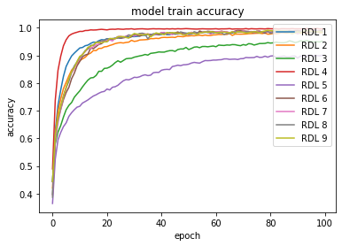
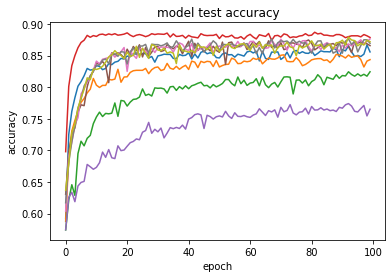
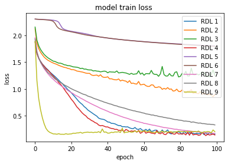
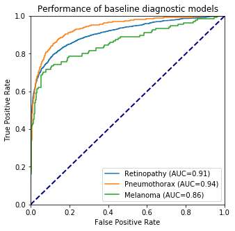
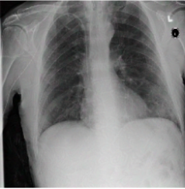

## Can you trust science? On Reproduction in Deep Learning.

*Authors: Filip Chrzuszcz, Szymon Rećko, Mateusz Sperkowski (Warsaw University of Technology)*

### Abstract
One of the most important aspects of machine learning scientific articles is reproducibility. Obtaining results similar to those from the paper, using the same codes and data sets, allows for verification and evaluation of the reliability of the research. In our work, we try to reproduce the results of two deep learning articles using the code and information provided by their authors. We will present the problems with reproduction that we encountered, their reasons and the action we had to take to solve them. The results of our experiments show that despite the lack of information or computational resources, it is possible to obtain sufficiently similar results to those presented in the articles.

### Introduction

To increase the credibility of published scientific literature, researchers should increase the credibility and effectiveness of their research [@4-5-ReproducibleScience]. Reproducibility in the field of deep learning is the feature of scientific research, which allows for independent repetition of the experiment and obtaining similar results using the code of the original creators of the experiment [@4-5-ReproducibilityInML]. To increase it, articles should contain as much information as possible about datasets, models and their parameters that will help others to recreate them. This includes more researchers who will be able to continue their work in a given field. Unfortunately, often even basic reproduction is not possible. The purpose of this article is to recreate two articles on Random Multimodel Deep Learning [@4-1-RMDL] and Adversarial attacks against medical deep learning systems [@4-5-AdversarialAttacks], respectively, and to identify reproducibility problems occurring in them.

### Methodology

To study the reproducibility of the original publications, we used the author codes publicly available on GitHub. Each of the following subsections will address further important aspects of reproduction and, depending on the article, the numerous problems we encountered.

#### Models
As Deep Learning evolves and extensive scientific research happens, many new architectures are constantly introduced such as published in 2017 Transformer Neural Network [@4-5-TNN_Attention], which revolutionized the Natural Language Processing (NLP) field of machine learning. Most common architectures include Deep Neural Networks, Recurrent Neural Networks and Convolutional Neural Networks (further as DNN, RNN, CNN respectively) [@4-5-Deep_Overview],[@4-5-Deep_Medical_Overview].

##### RMDL
This paper introduces a new approach to deep learning models. Authors propose an ensemble, named Random Multimodel Deep Learning (RMDL). It consists of many randomized deep learning models, referred to as Random Deep Learning (RDL). Only the extent of randomization is controlled by the hyperparameters. The resulting ensemble consists of units with different architecture, which according to the authors leads to increased robustness of the model.

Our reproduction covers the experiments on the classification tasks of images and text. The same or similar model can be expanded to many more fields of machine learning.

##### Adversarial medicine

This research paper addresses the topic of influencing the performance of a machine learning model. Unlike the first RMDL project, where the topics the authors dealt with were quite broad, here we have a thorough consideration of one particular aspect. Namely, the authors talk about specific types of attacks on an already trained architecture for predicting whether a particular disease is present in a given medical image. Our reproduction dealt with training the models proposed by the authors and then attacking them with prepared scripts whose task was to flip the labels predicted by the model. Additionally, this had to be done in a way that was completely indistinguishable to the human eye, i.e., the images had to remain as similar to the original photo as possible.

#### Datasets
The most important part of supervised machine learning is the dataset. Data scientists spend the majority of development time on data cleaning [@4-5-Data_Cleaning]. The basis for the reproduction of deep learning models is that the sets for training and testing come from the same dataset used by the models in the article. Even small differences in data sets can affect the results and the reliability of reproduction. 

##### RMDL
[@4-1-RMDL] in the original paper is used as a classification model. For comparison with the original results, this reproduction covers the same datasets as [@4-1-RMDL] did. All of the datasets used are well known pre-cleaned data, so the majority of preprocessing is already done.

Reproduction attempts on 6 different text classification datasets were made. More specifically: WOS-5736, WOS-11967, WOS-46985, which are datasets published [@4-5-WOS_Dataset] by authors of the original paper and they cover classification of scientific abstracts (Web Of Science). The number in the dataset name refers to the number of documents in the corpora. The next NLP dataset is Reuters-21578 containing 10 788 documents on topics of business/economics from Reuters newswire service. The next two datasets were IMDB, for classification of movie reviews, and 20NewsGroup for topic classification of newsgroups posts. Respectively they contain 50 000 reviews and 19 997 news posts. Newsgroups can be interpreted as discussion groups.

For image classifications, two datasets were used. The first one is MNIST containing 70 000 handwritten greyscale digits in a 28x28x1 pixels format. The second one is CIFAR-10, which consist of 60 000 images of 10 classes with common objects such as aeroplane, automobile, cat. This dataset images are in format 32x32x3, which implies RGB photos.

##### Adversarial medicine

The authors add 3 types of medical images to their models. These are lung, eyeball, and skin photos. These photos do or do not include pneumothorax, melanoma, and diabetic retinopathy depending on the class. A total of about 20,000 images are available to analyze the results provided. To train the model, additional data must be downloaded from open-source sources to then use a ready-made script to train the model. The data for testing has been prepared by the authors and is available in a conveniently downloadable form as tables in .npy format. The images are 224 by 224 pixels in colour. It is worth noting that even though these images have been provided there are some problems with reproducing their display in the code, as there are often no images with the indices designated by the authors, which is a bit of a problem. Additionally, the scripts include relative paths, to the authors' computers, which obviously cannot be easily reproduced, requiring additional work.

#### Hyperparameters
Hyperparameters can have a significant impact on the training and performance of a model, therefore they are an important component of the reproduction process of any article in which they occur.

##### RMDL
The original papers introduce randomization of hyperparameters in the elements of the ensemble, as a feature to increase the robustness of the ensemble. In the code/library provided by authors on the GitHub linked to the paper, hyperparameters differ from regular neural networks. The most important factors are the numbers of RDL's used in the model. When referring to RDL's in terms of numeric order, interpret them in increasing order, starting from 1 first DNNs, then RNNs, and finally CNNs. Barely any information on the original paper's experiment is available. Therefore in the reproduction experiments, whenever possible, the used hyperparameters were the same as in the original author's code. Although it is unsure whether the code provided is the one used to generate the article results, as such basic things as plots differ in the library provided by them. In the paper, randomization of the optimizer used in an RDL is proposed to improve robustness. Authors argue that if one optimizer doesn't perform well on a certain dataset, other RDL's will have different ones which may score higher. Despite that argument, this option is not used by the authors and therefore not used in reproduction.

##### Adversarial medicine
The scripts provided for training the models as well as for the attacks contain rigidly set hyperparameters, and the articles and code comments themselves lack any comments about changing them or adjusting them to fit the data. 
For the prediction of image labels, the well-known and widely available Resnet50 and InceptionResNet v2 models are used. As for the scripts intended for attacks on the model infrastructure, the number of comments contained therein allows only a guess as to what they can improve or worsen individual parameters. The situation is slightly better in the case of parameters responsible for training the network itself. There are available and quite well-described parameters such as the rate of learning, or the size of the batch, on which the network is to learn. However, the article itself does not mention in any way to change the values of these parameters, so during our reproduction, they remained at the same level.

#### Evaluation
Choosing proper evaluation metrics for the problem is a crucial point in classification tasks. Many different metrics were introduced to fit specific situations. For example, in testing for a contagious disease, Recall (1) might be more important than Accuracy (2).

$Recall$ = $\frac{Number\;of\;Predicted\; Positives}{Number\;of\; True\; Positives}$ $(1)$

##### RMDL
In reproduction experiments, the same metrics as in the original paper were used. This way, the results achieved can be compared. For NLP tasks accuracy score (2) is used. For image classification tasks error rate (3) [@4-5-error_rate] is used.

$Accuracy$ = $\frac{Number\;of\;Correct\; Predictions}{Number\;of\;Total\; Predictions}$ $(2)$

$Error$ $Rate$ = $1-Accuracy$ $(3)$

##### Adversarial medicine

On the reproduction of the second article, it is hard to talk about the metrics used by the authors, as most of the attacks took place on single images, where the probability of belonging to a particular class was analyzed. The only measure other than probability was the AUC value. This is the area under the ROC curve that results from comparing different True Positive Rate and False Negative Rate values over different thresholds. This measure is used to analyze the performance of the network on the authors' basic unaltered images.

#### Computational environment
Because of this, how computationally exhaustive this task is, most of the research on deep learning is done with incomparably more resources than we could afford. [@4-5-Computational_Limitations] Due to these constraints, we had to make concessions to get as many results as possible.

##### RMDL
In the case of RMDL, Google Colaboratory [@4-5-Google_Colab] was used for all experiments. Code was written in Python, using the library RMDL version 1.0.8, provided by the authors of the original paper. Our experiments resemble the examples for the datasets, provided by the authors, with some changes. Corrections in code to repair errors, manual download of data for WOS datasets were introduced to run the code. Additionally, due to limited resources in the Collaboratory (RAM and processing time), limits on some of the experiments were set, described further. 

Unfortunately on the IMDB and 20NewsGroup datasets, no significant results were achieved due to computational limits, even after setting rigorous limits on hyperparameters to decrease computational resources.

##### Adversarial medicine

In terms of the equipment required, it was quite a burden to have to load all of the provided boards and photos into the computer memory. Due to their weight, there were some problems with the stability of the code. The whole code can be run using the local Python environment. The attacks themselves were not too computationally complicated, although the training of the network was quite a complicated task due to the high computational requirements of this training. Additionally, small corrections in the code were necessary, although they were not too significant and usually resulted from different versions of packages, rather than the carelessness of the authors.

### Result
#### Reproduced Results
While achieving slightly lower scores than the papers proposed, the reproductions support the main claims of both original papers. The original results in comparison to the reproduced results can be found in the Tables below. In the case of [@4-1-RMDL], tables show competing or higher accuracy scores than 'state of the art' baseline models in classification tasks on a variety of datasets, as proposed by the paper. In the case of [@4-5-AdversarialAttacks], the table shows that the attacks correctly change the classification of the model while being unrecognizable by the untrained in this task, the human eye.

#### Random Multimodel Deep Learning for Classification
The main result of the paper is achieved, as the networks score results either similar to the best of the baselines or higher than any of them. Comparison between these values isn't straightforward, as the models consist of different architectures. Randomization of hyperparameters in the units of the ensemble is a crucial point, which according to the original paper, improves the robustness of the ensemble. 

In the table below scores on the left (Paper) are taken directly from the original paper, while the scores on the right (Repr.) represent successful attempts at reproducing the corresponding RMDL ensemble. Lacking scores (marked as three dashes) are discussed in section Methods. Only in WOS-5736 3 RDLs model, the same architecture as in the original paper is shown, consisting of 1 DNN, 1 RNN and 1 CNN. In every other reproduction model, half of RDLs were DNNs and half were CNNs, caused by computational limits. Only in Reuters 3 RDLs model, the additional RDL was assigned to CNN, in every other model it was assigned to DNN.

<table class="tg">
<thead>
  <tr>
    <th class="tg-0pky" colspan="2" rowspan="2"></th>
    <th class="tg-c3ow" colspan="8">Dataset</th>
  </tr>
  <tr>
    <td class="tg-c3ow" colspan="2">WOS-5736</td>
    <td class="tg-c3ow" colspan="2">WOS-11967</td>
    <td class="tg-c3ow" colspan="2">WOS-46985</td>
    <td class="tg-c3ow" colspan="2">Reuters-21578</td>
  </tr>
</thead>
<tbody>
  <tr>
    <td class="tg-c3ow" colspan="2">Score Source </td>
    <td class="tg-c3ow">Paper</td>
    <td class="tg-c3ow">Repr.</td>
    <td class="tg-c3ow">Paper</td>
    <td class="tg-c3ow">Repr.</td>
    <td class="tg-c3ow">Paper</td>
    <td class="tg-c3ow">Repr.</td>
    <td class="tg-c3ow">Paper</td>
    <td class="tg-c3ow">Repr.</td>
  </tr>
  <tr>
    <td class="tg-c3ow" rowspan="4">RMDL</td>
    <td class="tg-0pky">3 RDLs </td>
    <td class="tg-0pky">90.86</td>
    <td class="tg-0pky">89.37</td>
    <td class="tg-0pky">87.39</td>
    <td class="tg-0pky">84.25</td>
    <td class="tg-0pky">78.39</td>
    <td class="tg-0pky">---</td>
    <td class="tg-0pky">89.10</td>
    <td class="tg-0pky">87.64</td>
  </tr>
  <tr>
    <td class="tg-0pky">9 RDLs</td>
    <td class="tg-0pky">92.60</td>
    <td class="tg-0pky">89.28</td>
    <td class="tg-0pky">90.65</td>
    <td class="tg-0pky">---</td>
    <td class="tg-0pky">81.92</td>
    <td class="tg-0pky">---</td>
    <td class="tg-0pky">90.36</td>
    <td class="tg-0pky">89.83</td>
  </tr>
  <tr>
    <td class="tg-0pky">15 RDLs</td>
    <td class="tg-0pky">92.66</td>
    <td class="tg-0pky">---</td>
    <td class="tg-0pky">91.01</td>
    <td class="tg-0pky">---</td>
    <td class="tg-0pky">81.86</td>
    <td class="tg-0pky">---</td>
    <td class="tg-0pky">89.91</td>
    <td class="tg-0pky">---</td>
  </tr>
  <tr>
    <td class="tg-0pky">30 RDLs</td>
    <td class="tg-0pky">93.57</td>
    <td class="tg-0pky">---</td>
    <td class="tg-0pky">91.59</td>
    <td class="tg-0pky">---</td>
    <td class="tg-0pky">82.42</td>
    <td class="tg-0pky">---</td>
    <td class="tg-0pky">90.69</td>
    <td class="tg-0pky">---</td>
  </tr>
</tbody>
</table>
Table 1: RMDL reproduction accuracy scores in comparison to the paper, on four NLP datasets.

 

Figure 1 shows the comparison of accuracy score through epochs on the Reuters-21578 dataset. Taking into account the different scales on test plots, the reproduction model closely resembles the original model change through epochs. In the ensemble architecture, low scoring models (in this case RDL 3 and 5 in reproduction) still increase overall accuracy.

Paper's Plots | Our Reproduction
--- | ---
 | 
 | 

Figure 1: Accuracy scores on the train and test sets for Reuters-21578 dataset. 

In the plots of the paper, the model consisted of 3 DNNs, 3 RNNs and 3 CNNs. 
In the reproduction, 5 DNNs and 4 CNNs.
 

As this table below shows, the results achieved during reproduction attempts on the MNIST dataset are slightly worse than those presented in the article. Both the 3 RDLs and 9 RDLs models on this dataset have the same architecture as those presented in the article. The difference in the results may be since during reproduction the models have trained 100 epochs, which is 20 less than in the article.
The results of the reproduction of the CIFAR-10 dataset presented in the table are significantly worse than the results presented by the authors. The reason for this is not the difference in architectures. Rather, we should look for it in the fact that due to the previously mentioned problems, the training of models on this dataset has been reduced from 200 epochs to 100 epochs. However, as we'll see in Figure 2, that is not the point.

<table class="tg">
<thead>
  <tr>
    <th class="tg-0pky" colspan="2" rowspan="2"></th>
    <th class="tg-c3ow" colspan="4">Dataset</th>
  </tr>
  <tr>
    <td class="tg-c3ow" colspan="2">MNIST</td>
    <td class="tg-c3ow" colspan="2">CIFAR-10 </td>
  </tr>
</thead>
<tbody>
  <tr>
    <td class="tg-c3ow" colspan="2">Score Source </td>
    <td class="tg-c3ow">Paper</td>
    <td class="tg-c3ow">Repr.</td>
    <td class="tg-c3ow">Paper</td>
    <td class="tg-c3ow">Repr.</td>
  </tr>
  <tr>
    <td class="tg-9wq8" rowspan="4">RMDL</td>
    <td class="tg-0pky">3 RDLs </td>
    <td class="tg-0pky">0.51 </td>
    <td class="tg-0pky">0.55 </td>
    <td class="tg-0pky">9.89</td>
    <td class="tg-0pky">38.23</td>
  </tr>
  <tr>
    <td class="tg-0pky">9 RDLs</td>
    <td class="tg-0pky">0.41</td>
    <td class="tg-0pky">0.65</td>
    <td class="tg-0pky">9.1</td>
    <td class="tg-0pky">36.91</td>
  </tr>
  <tr>
    <td class="tg-0pky">15 RDLs</td>
    <td class="tg-0pky">0.21</td>
    <td class="tg-0pky">---</td>
    <td class="tg-0pky">8.74 </td>
    <td class="tg-0pky">---</td>
  </tr>
  <tr>
    <td class="tg-0pky">30 RDLs</td>
    <td class="tg-0pky">0.18</td>
    <td class="tg-0pky">---</td>
    <td class="tg-0pky">8.79</td>
    <td class="tg-0pky">---</td>
  </tr>
</tbody>
</table>
Table 2: RMDL reproduction error rate in comparison to the papers result, on two image classfication datasets.

 

Figure 2 shows the comparison of loss through epochs on the CIFAR-10 dataset. Looking at the growing loss on the test set, while at the same time the loss on the training set was decreasing, it appears that most of the RDLs overfitted, which resulted in a deterioration of the final score.

Paper's Plots | Our Reproduction
--- | ---
 | 
 | 

Figure 2: Error rate on the train and test sets for CIFAR-10 dataset.

In the plots of the paper, the model consisted of 3 DNNs, 3 RNNs and 3 CNNs.
In the reproduction, 4 DNNs, 3 RNNs and 2 CNNs.

#### Adversarial medicine

Referring to the results achieved is not a simple matter. As we mentioned earlier, almost all available results both in the authors' code and ours are in the form of probabilities of qualifying a particular image to a given class. So as far as we can talk about success in the case of analyzing one particular photo, it is hard to talk about reproducing this result when using other photos. It is worth saying, that the model trained by us on basic data obtained similarly good results as the one used by authors.

Paper's Plots | Our Reproduction
--- | ---
 | 

Figure 3: ROC curves on training sets.
 

As seen in Figure 3, we were able to achieve very similar results in training the initial networks as the authors. This shows that the script responsible for this part of the work was well prepared, and indeed, this part gave us relatively the least problems, compared to the other reproduction issues of this paper.

<table class="tg">
<thead>
  <tr>
    <th class="tg-0pky" rowspan="2"></th>
    <th class="tg-0pky" colspan="2">Pneumothorax</th>
    <th class="tg-0pky" colspan="2">Melanoma</th>
    <th class="tg-0pky" colspan="2">Retinopathy</th>
  </tr>
  <tr>
    <td class="tg-0pky">Paper </td>
    <td class="tg-0pky">Repr.</td>
    <td class="tg-0pky">Paper</td>
    <td class="tg-0pky">Repr.</td>
    <td class="tg-0pky">Paper</td>
    <td class="tg-0pky">Repr.</td>
  </tr>
</thead>
<tbody>
  <tr>
    <td class="tg-0pky">Before Attack</td>
    <td class="tg-0pky">0.997</td>
    <td class="tg-0pky">0.981</td>
    <td class="tg-0pky">0.99</td>
    <td class="tg-0pky">0.994</td>
    <td class="tg-0pky">0.994</td>
    <td class="tg-0pky">0.98</td>
  </tr>
  <tr>
    <td class="tg-0pky">After Attack</td>
    <td class="tg-0pky">8e-11</td>
    <td class="tg-0pky">2e-11</td>
    <td class="tg-0pky">1e-11</td>
    <td class="tg-0pky">2e-11</td>
    <td class="tg-0pky">3e-12</td>
    <td class="tg-0pky">2e-10</td>
  </tr>
</tbody>
</table>
Table 3: Adversarial Attack on lung photo
 

The table above lists the probabilities of adequately evaluating a photograph containing a pneumothorax. The results vary minimally, however, a very important fact, namely the reversal of the prediction of the data by the model was achieved by us, which is a great success. Similar results were achieved for the other two diseases, which indicates that these attacks are relatively well performed.

 
 

Figure 3: Images of pneumothorax and noise which distracts model. 
 

In the images shown above, you can see exactly the idea of the whole article. The first and second images are not different to the human eye, and the algorithm considers them completely different and gives different predictions for them on whether the lungs have pneumothorax or not. In the third image, you can see the noise that causes this prediction swap.

The authors prepared two types of attacks on the developed predictions. The first one named PGD attack takes advantage of the possibility to access the model weights and performs, so to speak, the reverse process to model learning, i.e., it tries to increase the error as much as possible. With this part of the project, we had no problem, because the code was prepared without any problem. Attacks were firing without any problems, and all the images were displaying correctly. The second approach named Patch attack was to introduce noise into the learning process by changing the weights using the process of maximizing the probability of returning an incorrect label provided the noise was introduced to a particular pixel. In the case of these attacks, the problem was that the repository was inadequately prepared by the authors, as some images and labels were missing, making it very difficult to replicate exactly what was described in the paper. Some images were able to be displayed correctly, but some were not.

<table class="tg">
<thead>
  <tr>
    <th class="tg-0pky" colspan="2">Accuracy Patch Attack</th>
  </tr>
</thead>
<tbody>
  <tr>
    <td class="tg-0pky">Paper</td>
    <td class="tg-0pky">Repr.</td>
  </tr>
  <tr>
    <td class="tg-0pky">0.00</td>
    <td class="tg-0pky">0.125</td>
  </tr>
</tbody>
</table>

Table 4: Accuracy of Second Attack on 8 samples of lung photos
 

<table class="tg">
<thead>
  <tr>
    <th class="tg-0pky" colspan="2">AUC Patch Attack</th>
  </tr>
</thead>
<tbody>
  <tr>
    <td class="tg-0pky">Paper</td>
    <td class="tg-0pky">Repr.</td>
  </tr>
  <tr>
    <td class="tg-0pky">0.00</td>
    <td class="tg-0pky">0.00</td>
  </tr>
</tbody>
</table>

Table 5: AUC of Second Attack on 8 samples of lung photos
 

As can be seen in the tables above, despite the problems previously described, we were able to reproduce attacks on the label predicate infrastructure. The AUC and accuracy metrics are at low levels, the same as the case presented in the authors' code.

### Discussion

#### What was easy?
To summarize our work, we can certainly say that it was easy to reproduce simple models, especially if they were correctly prepared by the authors. In both the RMDL and Adversarial Medicine projects, there happened to be networks or attacks that did not need any changes in the code and worked practically immediately. In the case of both articles, communication with the authors was not necessary for the code to work, however, based on the fact that the authors of both projects regularly respond to issues on Github, we can conclude that it is not a problem.

#### What was hard?

Unfortunately, things were not as easy as we would have liked. In the case of the first article, a significant problem was the lack of adequate computer resources, which at extreme moments made it impossible to work with the entire project, and thus verify the results provided by the authors. In the second project, it was also not possible to completely verify the thesis of the authors, however in this case it was connected with not completely well prepared repository, where all the files were not available. However, the code itself worked without problems, and there were no computer problems here either.

