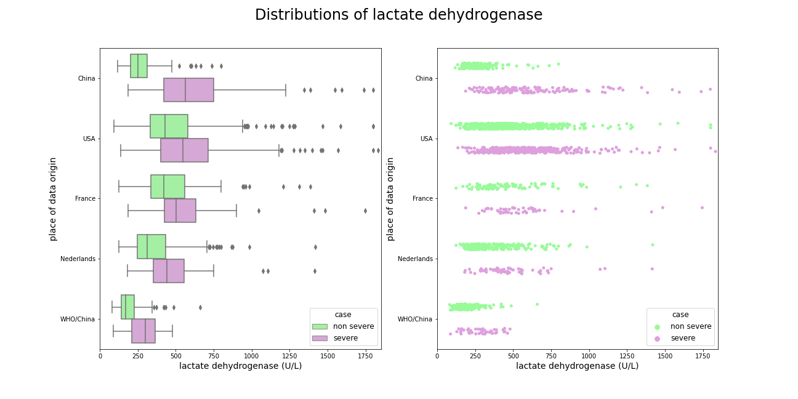
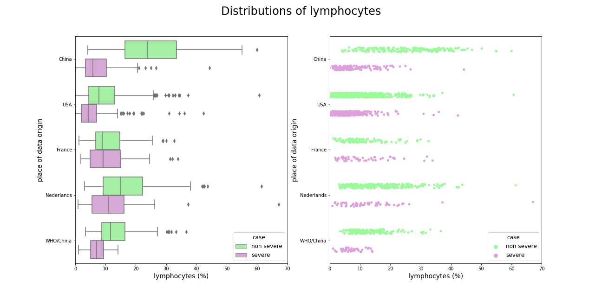
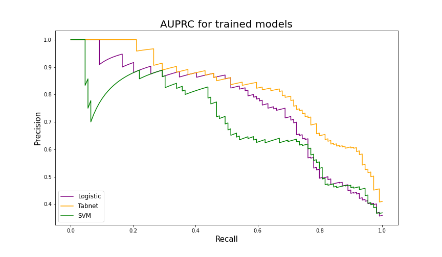
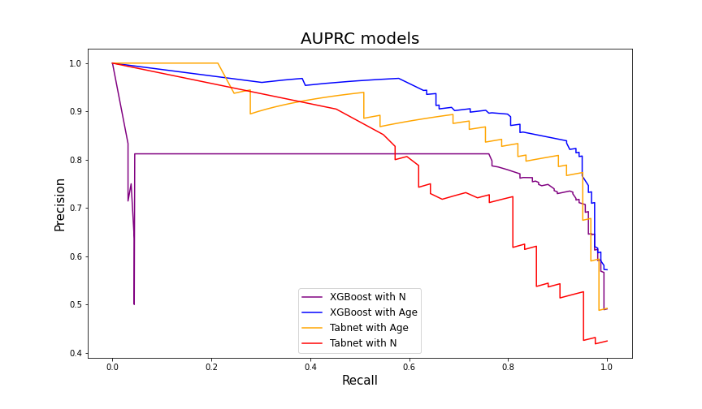

## Validation and comparison of COVID-19 mortality prediction models on multi-source data

*Authors: Michał Komorowski, Przemysław Olender, Piotr Sieńko, Konrad Welkier*


### Abstract
The work of [@yan_et_al_2020] from the first months of the COVID-19 pandemic laid the foundations for further research in the area of machine learning models that predict patients’ chances of survival. It was done by introducing a simple decision tree that in the opinion of the inventors could potentially support the cause. Since that time a few papers have emerged that touch upon the same case in which other researchers tested this decision tree on their datasets. Their findings that the original model is not suitable for patients from other countries than China appeared interesting to us and hence in the following paper we present results of our work which aim was to build models on each of the considered datasets as well as on all of them combined in order to find an universal approach for classification of patients from various countries. After testing various models such as XGBoost, Logistic Regression, SVM and Tabnet we came up with the conclusion that there is no one model for all of the datasets that includes only at most 4 crucial variables.


### Introduction

At the end of 2019, the novel coronavirus disease 2019 (COVID-19) pandemic broke out. In the next few months it quickly spread around the world. Daily cases were increasing exponentially. Although  most of the cases involved mild symptoms, the healthcare system in many countries still became overloaded. Therefore, the physicians were in an urgent need of a quick system to predict how severe the state of a patient could get, especially if there is a risk of death or a need to be put at the ICU.

A certain solution for this problem was using machine learning to create a mortality prediction model based on easily available biomarkers. One of the first models proposed in may 2020 by [@yan_et_al_2020] could predict mortality rates of the patients 10 days in advance with great accuracy. The article is considered the state-of-the-art in the COVID-19 machine learning.
Some issues with this model appeared when it was used on data from different hospitals. When used on biomarkers from patients in France, Netherlands and the United States the model’s accuracy significantly dropped.

In our article, we describe how the datasets differ, we analyze how [@yan_et_al_2020] model compares to newer model [@5-1-ZHENG2020100092] which evaluates hospitalization priority for COVID-19 patients by validating it on different datasets and propose new model which could yield great results on both datasets.

### Data description

We have begun our work from analyzing article [@yan_et_al_2020], authors have created a model based on blood samples collected form 375 patients from the Wuhan region in the first quarter of 2020. Data from another 110 patients were treated as an additional test set. Dataset contains 81 variables, including 74 describing the blood tests results, but not all tests were performed on each patient. Scientists finally created a model based on three variables: lactate dehydrogenase, lymphocytes and high-sensitivity C-reactive protein, these are going to be crucial also in our work.

The article [@yan_et_al_2020] received several replies, scientists from the USA, France and the Netherlands validated the model on datasets from hospitals from their home countries. The results pointed to the problem of rashly predicting death for patients who eventually survived Covid-19 infection. They also claimed that the [@yan_et_al_2020] model learning from most recently performed  measurements was not an appropriate tool to prioritize ICU admissions and should therefore use results from first tests.

The datasets from corresponding articles contained 3 previously highlighted features, in datasets from [@5-2-france] and [@5-2-newyork] there are multiple test results and other useful features such as age, but information about other blood components is not included. The data from [@5-2-newyork] was especially helpful, the data was shared to us after consultation with one of the article's authors. The data came from Northwell Health, New York State's largest hospital network serving 11 million patients and contained 1038 records.


Table: Table 1: contains all most important information about each of datasets and shows which of them contains features needed to create models.

| Article              | Records | Variables | Lactate Dehyd.|C-protein | Lymphocytes| Neutrophil | Age |
|----------------------|:-------:|:---------:|:-------------:|:--------:|:----------:|:----------:|:---:|
|[@yan_et_al_2020]     |485      |81         |Yes            |Yes       |Yes         |Yes         | Yes |
|[@5-2-newyork]        |1038     |14         |Yes            |Yes       |Yes         |No          | No  |
|[@5-2-netherlands]    |305      |15         |Yes            |Yes       |Yes         |No          | Yes |
|[@5-2-france]         |178      |43         |Yes            |Yes       |Yes         |No          | Yes |
|[@5-1-ZHENG2020100092]|214      |33         |Yes            |Yes       |Yes         |Yes         | Yes |

Careful inspection of distributions of these key variables from various articles helps to understand problem with applying model form [china] on dataset from corresponding articles.

Lactate dehydrogenase was the most important feature in model from [@yan_et_al_2020], relying only on its value patients were supposed to be directed to the ICU. The chart shows that indeed distribution of sever cases is significantly shifted towards higer values in comparsion with non severe cases, but such a large difference does not occur in other datasets, patients requiring additional care usually have an increased lactate dehydrogenase, but not as much as patients from China. An interesting dependence ocuurs in the dataset from [@5-1-ZHENG2020100092], a large part of the data also comes from China, there is a great distinction between the severely and slightly ill, but the overall lactate dehydrogenase levels are much lower. Additionally, slightly ill patients from Europe and the US have higher LDH levels than severely ill patients from China.

```{r 5-1-ldhDist, out.width="850", fig.align="center", echo=FALSE, fig.cap='Comparison of lactate dehydrogenase amongst datasets'}

```

A similar situation occurs when it comes to high-sensitivity C-reactive protein (CRP), in the dataset from [@yan_et_al_2020] the distributions are clearly shifted among themselves, but similar dependency occurs only in the data from [new]. Patients suffering from the virus slightly and severely from other countries with have less varied level of CRP.

```{r 5-1-crpDist, out.width="850", fig.align="center", echo=FALSE, fig.cap='Comparison of high reactive C protein amongst datasets'}
knitr::include_graphics('images/5-1-crpDist.png')
```


The same dependence occurs with lymphocytes, one additional fact about these distributions is that French do not have lower level of these cells as do patients from rest of the world.


```{r 5-1-lymDist, out.width="850", fig.align="center", echo=FALSE, fig.cap='Comparison of lymphocytes amongst datasets'}

```

Neutrofil was not used in [china] model, but it separates sever and non-severe cases in both datasets very well.

```{r 5-1-neuDist, out.width="850", fig.align="center", echo=FALSE, fig.cap='Comparison of neutrophil amongst datasets'}
knitr::include_graphics('images/5-1-neuDist.png')
```

Age is also crucial feature in predicting virus severity, the young people get sick more mildly than the old ones.

```{r 5-1-ageDist, out.width="850", fig.align="center", echo=FALSE, fig.cap='Comparison of patients age amongst datasets'}
knitr::include_graphics('images/5-1-ageDist.png')
```


### Comparison of the models

We have decided to validate two models proposed by [@yan_et_al_2020] and [@5-1-ZHENG2020100092]. The first one is a decision tree with 3 nodes and the second one is an XGboost model with 4 explanatory variables. 

To verify if the model proposed by Yan et al. is effective in predicting COVID-19 mortality amongst patients around the world, validation on external datasets was made. The decision tree was tested on combined data from American[@5-2-newyork], French[@5-2-france] and Chinese[@yan_et_al_2020], [@5-1-ZHENG2020100092] hospitals. The merged dataset has 1842 observations and 3 explanatory variables: lymphocyte, lactate dehydrogenase (denoted by LDH), and C-reactive protein (CRP). All these medical indicators have been previously studied as key factors in severity and mortality prediction[@5-1-symptoms], [@5-1-Lymph]. To compare Yan et al. decision tree with exemplary models, we created Logistic Regression, Support Vector Machine (SVM) and Tabnet model. Tabnet is a deep learning model for tabular data [@5-1-Tabnet]. It allows creating high performance and explainable classifier on numeric data. The merged dataset was splitted into a training table (80% of observations) and a test table (20%). Then, newly created models were trained on the training table and validated on the test table. Yan's algorithm was tested on the same part of a merged dataset as other models. We have selected accuracy, precision, recall, ROC AUC and AUPRC as final score metrics. 

Table: Table 1: Model scores on test table from merged dataset.

| Model                | Accuracy |  Recall | Precision | ROC-AUC | AUPRC | 
|----------------------|---------:|--------:|----------:|--------:|--------:|
| Tree                 |   0.674  |**0.908**| 0.474     | -       | -       |
| Logistic Regression  |   0.832  |   0.606 | 0.776     | 0.861   | 0.746   |
| Tabnet               | **0.840**|   0.569 | **0.838** |**0.913**|**0.824**|
| SVM                  |   0.777  |   0.596 | 0.631     | 0.843   | 0.699   |

Although the decision tree achieved high recall score (0.908), its precision is unsatisfactory. Models trained on multinational data have distinctly higher accuracy and precision thus they are more suitable for medical triage. SVM Tabnet proved to be the most efficient algorithm, having AUC at 0.91 and AUPRC at 0.824. The SVM was the worst model out of the new ones, with AUC at level 0.843 and AUPRC at 0.699.

```{r 5-1-AUPRC1, out.width="700", fig.align="center", echo=FALSE, fig.cap='AUPRC results on test table from merged dataset. Tabnet scored significantly better than Logistic Regression and SVM.'}

```

Six months after the Yan et al's paper had been published, another group of Chinese scientists released their article about machine learning models for COVID-19 patients [@5-1-ZHENG2020100092]. They examined several algorithms from which XGBoost performed most efficiently. Besides variables that had been used in the previous article, XGBoost proposed by Yichao Zheng et al. also needed information about the level of Neutrophil in each patient's blood sample. 
Importantly, this model was originally designed to predict severity therefore it was expected to have high recall and low precision in mortality prediction task. 

Model validation was performed on the dataset from Yan et al's article. To compare XGBoost performance, another Tabnet model was created. It was fitted to the same data as XGBoost and then validated on Yan et al's dataset. Additionally, we decided to create two versions of each model. The first one with the Neutrophil variable (the same explanatory variables as proposed in the article) and the second one with Age instead of Neutrophil. 

Table: Table 2: XGBoost and Tabnet scores on Yan et al's dataset

| Model                | Accuracy |  Recall | Precision | ROC-AUC | AUPRC | 
|----------------------|---------:|--------:|----------:|--------:|--------:|
| XGBoost with N       |   0.573  |**0.994**| 0.515     | 0.865   | 0.791   |
| XGBoost with Age     |   0.746  |   0.975 | **0.646** |**0.942**|**0.918**|
| Tabnet with N        |   0.538  |   0.976 | 0.432     | 0.868   | 0.787   |
| Tabnet with Age      |**0.747** |   0.984 | 0.588     | 0.941   | 0.891   |

As expected, all models achieved very high recall. However, XGBoost from the article (with Neutrophil) had significantly worse performance than XGBoost with Age variable. A similar situation occurred with Tabnet models. 
Overall, XGBoost with the hyperparameters proposed by Zichao Zheng et al. but trained on data with Age column in the place of Neutrophil had best results with 0.942 AUC and 0.918 AUPRC. 

```{r 5-1-AUPRC2, out.width="700", fig.align="center", echo=FALSE, fig.cap='AUPRC results on  Yan et al dataset. Models with Age variable are more effective in mortality prediction.'}

```
### Conclusions

Summing up, the first conclusion is that the original decision tree is not an algorithm that can be universally used to assess chances of survival of any patient around the world. The fact that the blood characteristics vary with ethnic groups is significant and therefore usage of some additional variables can improve the models’ predictive capabilities. This is not what the authors of [@yan_et_al_2020] expected but adding Age or Neutrophil variables to the set indeed boosted the performance. Hence, the intuitive windup would be that the best model is the XGBoost with Age variable since it gets high results according to multiple metrics but it is not that simple. For example its precision is significantly lower in comparison to the Tabnet model prepared on the merged datasets.

Therefore, what should be learned from this paper is that none of the proposed models that were validated and compared by us should be used on other datasets than those on which they were trained.
