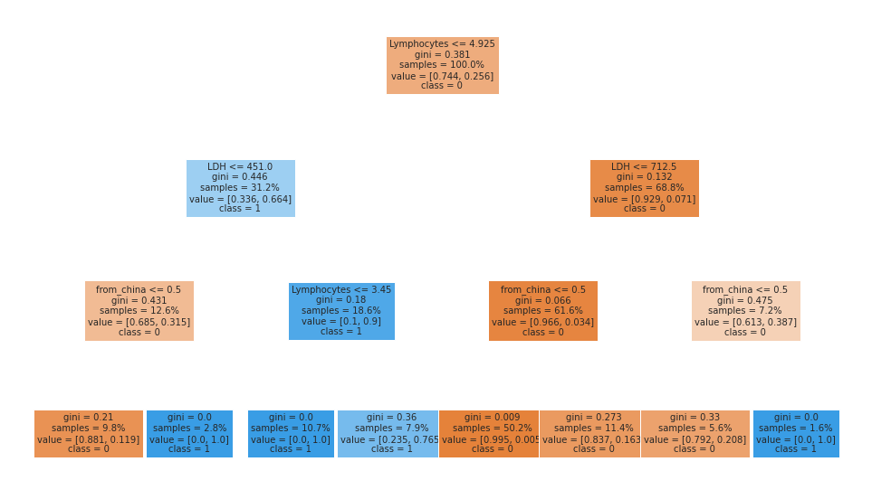
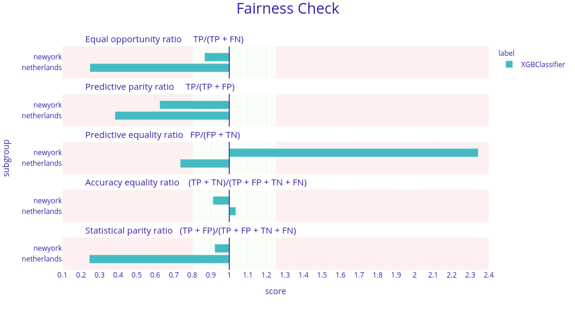

## One model to fit them all: COVID-19 survival prediction using multinational data
 
*Authors: Marcelina Kurek, Mateusz Stączek, Jakub Wiśniewski, Hanna Zdulska*
 
### Abstract
During the outbreak of SARS-CoV-2 machine learning practitioners tried to build a model that was able to predict the survival or death of patients based on available medical data. @5-2-china were among the first researchers to introduce their model based on blood data (lactic dehydrogenase (LDH), lymphocyte percentage, and high-sensitivity C-reactive protein (hs-CRP)) with 0.90 accuracy, however, recreations of this model trained on other countries' data - the US, Netherlands, and France were not so successful. In this article, we explore the possibility of building an international model for predicting COVID-19 survival. We focused on exploring the models, their variable importance, analyzed the bias they introduced, and concluded with guidelines for future researchers working on this topic.
 
 
 
### Introduction
 
Machine learning models are becoming popular in medicine because of the various opportunities they create. Such algorithms may be useful in performing early diagnosis, assessing disease severity, or personalizing treatment. During the COVID-19 pandemic, there were numerous possibilities associated with machine learning models. For example, an algorithm could predict which patients should be qualified for the Intensive Care Unit or who should be treated under a respirator. Additionally, due to the worldwide character of COVID-19 pandemic, it was easier to gather data about symptoms and various blood measures from thousands of patients.  
 
In this work, we analyze the article "An interpretable mortality prediction model for COVID-19 patients" by @5-2-china. The paper presents a decision tree, which predicts whether a patient will die or survive the disease based on the level of lactic dehydrogenase, C-reactive protein, and lymphocytes in blood samples. The presented model obtains high accuracy and ROC AUC scores on data from Yan et al., but has poor scores on datasets from the Netherlands and the US.
According to the article ‘A study in transfer learning: leveraging data from multiple hospitals to enhance hospital-specific predictions’ @5-2-multiple-data increasing the number of dataset sources for machine learning models may lead to poor performance. With a large number of datasets, controlling the extent to which data from each hospital contributes to the final model is complicated. As a result, procedures for identifying an optimal setting for hyperparameters can quickly become inefficient.
In our research we are focusing on answering the question if creation of the model with satisfactory behavior and performance independent of the data origin is possible. This approach can lead us to create an international model, which can help in recognizing the severity of COVID-19 cases. Contrastingly, creating such an algorithm can be impossible for many reasons, for example conducting different examinations in hospitals or different medical standards.
 
### Data sources
 
To create an international model, we used data from three different sources: China, New York, and the Netherlands. 

* Dataset from China is added to the article by @5-2-china. It contains 375 observations of LDH, CRP, and Lymphocytes percentage, along with the outcome of the COVID-19 disease.
* Dataset from the Netherlands is attached to the article by @5-2-netherlands. It contains 306 observations. Apart from information about blood samples, the age and gender of patients are also provided.
* The New York dataset is not attached to the article by @5-2-newyork, as it contains confidential data. However, due to the civility of the authors, we were provided with the dataset. The New York dataset contains 1000 observations of blood samples, which is more than in both other datasets combined.

On the dataset combined from the sources above we will check if the model trained on such data will be useful in a medical setting. We will check both the utility of a model and it’s fairness. 
 
### Model building
 
First, a model performing very well on training data can perform poorly on new samples coming from a different location. Such observations can be classified as out-of-distribution and models can become unpredictable in this setting. It can become really dangerous especially for patients. In many different areas of research there are efforts to detect such samples for example in @5-2-ood. 

There are also some fairness concerns. As authors of @5-2-ml-ethics mentioned, machine learning practitioners in medicine should be committed to fairness. Data sources should reflect the population and it is necessary that they contain enough members of all demographics. The source of bias in machine learning models can be traced to dozens of factors (@5-2-bias-sources). 

In our case, we found that the model presented by @5-2-china is not portable and does perform poorly on data from New York and the Netherlands.
 
As we can see in Figure \@ref(fig:var-imp) models trained on such a dataset tend to include the source of data as an important feature. That means the model is biased for some or all sources of data to give better predictions. Simultaneously it fails to achieve scores as good as models dedicated for each country. Unfortunately, such models have low scores in different performance metrics and are worse than a model created specifically for a given source of data. 
 
As an example, we used lazypredict by @5-2-lazypredict  twice to compare scores of various models trained on data from all 3 sources: the first run was on data without the column containing the source of data and a second run was on data containing all columns. The top 3 models from both runs are presented in the tables below (results are sorted by ROC AUC).


 
| Model                | Accuracy | Balanced Accuracy | ROC AUC | F1 Score | Time Taken |
|----------------------|----------|-------------------|---------|----------|------------|
| AdaBoostClassifier   | 0.753    | 0.714             | 0.714   | 0.751    | 0.191      |
| NearestCentroid      | 0.700    | 0.702             | 0.702   | 0.708    | 0.023      |
| KNeighborsClassifier | 0.726    | 0.689             | 0.689   | 0.725    | 0.038      |

Table: Table 1: Scores from the lazypredict for the top 3 classifiers sorted by “ROC AUC” trained on data from 3 sources excluding the column containing information about the source of data 
 
 
 
| Model                  | Accuracy | Balanced Accuracy | ROC AUC | F1 Score | Time Taken |
|------------------------|----------|-------------------|---------|----------|------------|
| RandomForestClassifier | 0.784    | 0.740             | 0.740   | 0.779    | 0.326      |
| XGBClassifier          | 0.770    | 0.735             | 0.735   | 0.768    | 0.223      |
| LabelPropagation       | 0.767    | 0.729             | 0.729   | 0.765    | 0.114      |

Table: Table 2: Scores from the lazypredict for the top 3 classifiers sorted by “ROC AUC” trained on data from 3 sources including the column containing information about the source of data. 

When the source of data is excluded from the training dataset, the results look less promising. This is expected as the origin of data proved to be a useful feature. Next, we tuned the parameters of the top models from each table with grid search and checked their scores using the dalex [@5-2-dalex] package. RandomForestClassifier and AdaBoostClassifier scored 0.83 and 0.76 ROC AUC respectively which proves the hypothesis about the influence of the origin.   
 
 
Our next step was to explore the ways to measure the effect of training on the data from certain countries. As we have proved, the origin is important in the modeling. Whether it is the effect of the healthcare system, biological differences between people, or the hospitals they were in, it may influence the model in ways that may not be clearly predicted. To determine how important the place of origin is, we trained RandomForestClassifier on data with place of origin. In Figure 5.8 we can see that the two most important features are blood-related. However, the third most important feature is the information whether the patient was from China or not.  
 

 
```{r var-imp, out.width="700", fig.align="center", echo=FALSE, fig.cap='Variable importance for the RandomForestClassifier model trained on a dataset that contains information about the origin of data. Notice that the drop-out loss for the “from_china” variable is rather high when compared with others.'}
knitr::include_graphics('images/5-2-var_imp.png')
```
 
Here, the variable importance is measured with perturbations [@5-2-variableimportance]. The way it works is that we first measure the performance on the entire model. Next, we reorder elements of a column (variable), train model, and then measure performance again. The difference in performances is called drop-out loss and it depicts the importance of each variable.  
 
This information was not surprising, however, we also made a similar test that conveniently simplifies the model. We created a surrogate decision tree based on the RandomForestClassifier. The surrogate model is trained to approximate the predictions of a black box predictor [@5-2-iml].
 
```{r tree, out.width="700", fig.align="center", echo=FALSE, fig.cap='Surrogate model for RandomForestClassifier trained on a dataset with information about origin of data. We can observe that the third division of the dataset is made on a condition ‘origin from China’. As a conclusion, origin of data is an important feature.'}

```
 
As expected the variable indicating the source of the data was among the three most important splits. We also had concerns over the bias introduced by the source variable. The bias (or fairness) of the classifier is discrimination in decisions made by the model. The kind of fairness that we focus on is called group fairness and it concerns the difference in outcomes between groups of people. There are many ways to measure this bias with so-called fairness metrics. They all can be derived from confusion matrices for different subgroups. We focus on five of them that are used in `Fairness check` which are

| Full Name           | Confusion Matrix Equivalent | Citation |
|---------------------|-----------------------------|----------|
| Equal Opportunity   | TPR                         | @5-2-tpr |
| Predictive Parity   | PPV                         | @5-2-ppv |
| Predictive Equality | FPR                         | @5-2-fpr |
| Accuracy Equality   | ACC                         | @5-2-acc |
| Statistical Parity  | STP                         | @5-2-stp |


`Fairness check` detects bias in metrics via the four-fifths rule [@5-2-fourfifths]. It simply looks at metrics for the privileged subgroup (in this case whether data comes from China) and for unprivileged subgroups and calculates their ratio. If this ratio is within (0.8, 1.25) then we assume that there is no bias. 
 
To investigate this claim we trained two machine learning models. The first one was XGBoost with the same parameters as in @5-2-china. The results were quite surprising as the model introduced bias in 4 metrics.  
 
```{r xgboost-fairness, out.width="700", fig.align="center", echo=FALSE, fig.cap='Fairness check of the XGBoost model presented in @5-2-china. Here, each horizontal plot represents a different metric for this model and in each plot there are 2 bars. Each bar represents a ratio between the model’s score in a given metric for data from New York or the Netherlands and China. The desired result is when those ratios are between 0.8 and 1.25. Here, in four metrics these ratios are not in this range meaning the model is biased against different sources of data.'}

```
 
To make sure that the model did not overfit the data and gave steady predictions we also checked the fairness of the Histogram-based Gradient Boosting Classification Tree from the scikit-learn package [@5-2-scikit-learn]. The bias was indeed lower but still significant. Therefore we also decided to use bias mitigation strategies. To do this, we firstly merged some subgroups for the algorithms to work better. We tried to make "fair classifiers" with two Python packages `fairtorch` and `fairlearn` [@5-2-fairlearn]. They are related to each other as the `fairtorch` implements the solutions from `fairlearn`. Using those in-processing algorithms (these are the kind of mitigation approaches that reduce the bias during model training) we obtained 2 additional models. One of them was a neural network with two hidden layers 128 and 64 neurons respectively, and ReLu activation function. The other was the Histogram-based Gradient Boosting Classification Tree that was trained using the reductions approach. The amount of bias reduced by the neural net from `fairtorch` was not satisfying enough and therefore will not be shown here. However, the results from `fairlearn` were quite good.  
 
```{r fairclassifier, out.width="700", fig.align="center", echo=FALSE, fig.cap='Fairness check of the models before and after the reductions. Models checked are Histogram-based Gradient Boosting Classification Tree but with different parameters. Bar’s length is a ratio between a model’s scores in a given metric for data not from China (other) and from China. The desired result is that the green bars are shorter than the blue ones and are close to 1 (more precisely between 0.8 and 1.25) meaning that the new model is less biased against the origin of data.'}
knitr::include_graphics('images/5-2-fairclassifier.png')
```
 
As we can see, despite the fact that the reduced model does not fit within the green field we decided that the bias was in fact reduced. The last thing to check was the performance of this model. Such reductions in the amount of bias may result in a significant drop in performance. In this case, it was the same. The ROC AUC metric dropped from 0.71 to 0.59 which for the medical applications is not enough. Therefore we concluded that in the case of this data the models were biased towards different origins. 
 
### Discussion
 
Machine learning can be very useful when applied to medical data. Over the last few years, the increased amount of health-related information created many possibilities to aid medical specialists, for example in Decision Support Systems. Such data can be successfully applied to predicting COVID-19 as proven by @5-2-china. However, creating a multinational model isn’t trivial for a few reasons. Even in a single country, forms of data collection vary from hospital to hospital. It’s impossible to enforce a unified system and data format across continents. Moreover, some measurements may depend on the time of the day taken - for example, blood pressure will be different in the morning and in the evening.
 
Another problem was observed by @5-2-bias-in-hc:
 
> Whether by race, gender or geography, medical AI has a data diversity problem: researchers can’t easily obtain large, diverse medical data sets—and that can lead to biased algorithms.
 
The case of having a model that doesn’t take into account the origin of the sample will lead to simplification of such a model since cut-off values were different for data from China, NY, and the Netherlands. This leads to lower metric scores and this excludes it from using in a medical environment, where precision is crucial. 

### Summary
 
We were working on a dataset merged from data coming from different countries and in this setting, machine learning models tend to be biased towards different nationalities. Our attempts at reducing this discrimination were not successful. We believe that with a bigger or more balanced dataset we would have a slightly better chance at meeting our goal.
 
Making models on country levels or geographical regions to achieve maximum fairness is more reasonable. It will also allow scientists to achieve the best results in predicting COVID-19 survival and ultimately we defeat COVID-19 and live happily ever after, till the end of our days, as said by short man(HOBBIT) and acclaimed author Bilbo Baggins.

