## Transparent machine learning to support predicting COVID-19 infection risk based on chronic diseases

*Authors: Dawid Przybyliński, Hubert Ruczyński, Kinga Ulasik*


### Abstract

The moment the COVID-19 outbreak in 2019 occurred, people started using machine learning in order to help in managing the situation. Our work is a build up to research described in [@5-3-chinese_et_al] and in [@5-3-mexican_et_al] articles. We improve and create new models predicting COVID-19 mortality based on blood parameters and analyze original models presented in the articles. We train a prediction model calculating risk of getting infected with the virus depending only on person's sex, age and chronic diseases and created an application which calculates the COVID-19 mortality risk based on input data and explains the model with visualizations. Considering accuracy of the model, calculations based only on chronic diseases may not achieve best results but we propose a transparent machine learning approach which doesn't need any additional medical information, is explainable and easy to understand and requires only data that everyone has access to. 

Our application is available at URL: https://hubertr21.shinyapps.io/Explainable_COVID19_Mortality_Predictor/

### Introduction

The COVID-19 pandemic is currently one of the world's biggest problem, affecting not only everyone's private lives, but also other areas of human activity, including research. In the scientific field, this is a specific issue that scientists are still able to approach this problem in completely different ways, because no distinctive and right path has yet been established. It is in the combination of these three aspects that we see an opportunity to deepen the current understanding of the pandemic and create a useful tool for predicting mortality from the disease.

All available models for predicting coronavirus mortality have numerous disadvantages, which include predictions based on small data sets, the use of medical information unavailable to the average person, unexplained models or their low effectiveness. Besides using data from mentioned articles ([@5-3-chinese_et_al], [@5-3-mexican_et_al]) we also explore data used in creation of an article [@5-3-american_et_al]. In order to provide additional knowledge for each of us, we present an application that eliminates all these drawbacks, to a greater or lesser extent. Our solution is the most beneficial for various XAI stakeholders, as described in article [@5-3-XAI_et_al]. Explanations such as SHAP (SHapley Additive exPlanations) or break down profiles are used.

The proposed application bases its mortality prediction on the information about chronic diseases that the patient suffers from. In addition to the predicted mortality, it also provides a break down plot as an explanation of the mortality, SHAP visualization, to show impact of the most important parameters and also analysis of the mortality risk depending on age.
By using the random forest model, created using ranger R package ([@5-3-ranger]), we also ensure the explainability of the entire process. Thanks to this solution, our application is useful for both ordinary people and doctors.


### Flaws

As a first step, we started analyzing one of the first articles [@5-3-chinese_et_al] on the development of predictive models to predict COVID-19 mortality in depth. The main disadvantages of the model presented in it were the very poor prediction of mortality in the case of testing on external data sets [@5-3-dutch_et_al], [@5-3-american_et_al] and the related allegation of not testing one's solution on external data [@5-3-american_et_al]. In addition, our team noticed a very large bias present in the original data, thanks to which even the simplest models achieved extremely high efficiency of over 90%.

### Improvements

Our first approach to the problem was to try to improve the work of the articles authors in question through very different methods. Firstly, we started from creating a correlation between variables heatmap to see which features were the most important. In the next step we created two models using Gradient Boosting and Ada Boosting which both achieved better results than the model presented in [@5-3-chinese_et_al]. Moreover, thanks to [@5-3-american_et_al] we were given access to additional data set with more records and were able to test the models. 

Next, we used Principal Component Analysis to try to split the data using reducing dimensions of the data receiving a surprisingly good result - we were able to separate the two classes with one straight line. Finally, took a look at the data distribution - it is visibly skewed left. We fixed it by applying proper transformation which resulted in improving the model.


While evaluating the models we mainly focused on precision score which defines what percentage of patients predicted to be in chosen class (survival and death in this case) really represents that class. If the precision score is low it is either dangerous for people's life or leads to overcrowding the hospitals.


**Prediction using original parameters on external data**

First, we decided to use the broader pandemic knowledge that the authors of the original article did not have to improve the model on its default data. Inspired by a newer article [@5-3-mortality_risk_prediction], we decided to test how the selection of variables improved according to the latest knowledge will affect the predictions of the predictive models. For the suggested parameters: age, C-reactive protein, chloride, albumin, lymphocyte count and LDH, we created a correlation map to select the most important of them.

```{r 5-3-fig1, out.width="1000", fig.align="center", echo=FALSE, fig.cap='Heatmap showing correlation between the variables in the original dataset. The more intensive the color is, the more variables are correlated'}
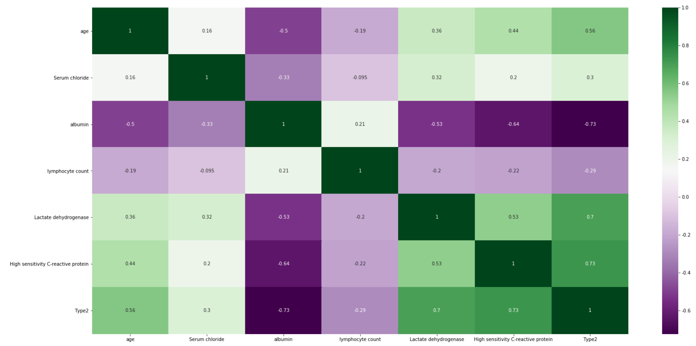
```

Figure \@ref(fig:5-3-fig1) shows that among the most important features there are age, albumin, LDH and C protein, which we used in our models. After training and testing the GradientBoostingClassifier and AdaBoostClassifier models on slightly reduced data (the original test set had to be replaced by the test and validation set), we obtain cross-validation precision at the level of 0.979 and 0.958 and the following reports(Figure \@ref(fig:5-3-fig2) and Figure \@ref(fig:5-3-fig3)). Moreover we present confusion matrix from original model (Figure \@ref(fig:5-3-fig4)).


```{r 5-3-fig2, out.width="500", fig.align="center", echo=FALSE, fig.cap='Confusion matrix showing accuracy, precision, recall and other scores for evaluating a classification for the GradientBoosting model'}
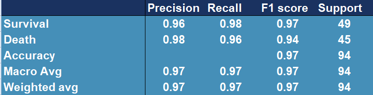
```

```{r 5-3-fig3, out.width="500", fig.align="center", echo=FALSE, fig.cap='Confusion matrix showing accuracy, precision, recall and other scores for evaluating a classification for the AdaBoosting model'}
knitr::include_graphics('images/5-3-confmatAdaexcel.png')
```

```{r 5-3-fig4, out.width="500", fig.align="center", echo=FALSE, fig.cap='Confusion matrix showing accuracy, precision, recall and other scores for evaluating a classification for the original model'}
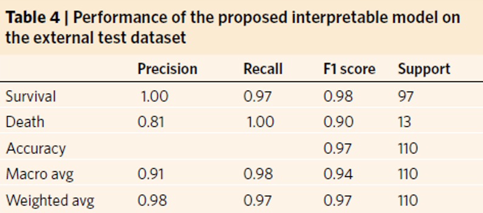
```

The above results confirm the improvement in the quality of the original model (Figure \@ref(fig:5-3-fig4)), whose precision score for death is only 0.81 and cross-validation stands around 0.97.

Thanks to the authors of the paper [@5-3-american_et_al], we were given access to additional data with features coincident with those we already had. Data set contained over 1000 observations and only fourteen features that were selected by owners to fit as good model as possible. In order to test previous model (AdaBoost), we used it to predict the outcome for those thousand patients, receiving following results (Figure \@ref(fig:5-3-fig5)).

```{r 5-3-fig5, out.width="500", fig.align="center", echo=FALSE, fig.cap='Confusion matrix showing accuracy, precision, recall and other scores for evaluating a classification for the original model tested on external data'}
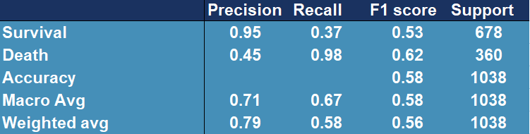
```


Model performance has dropped significantly, the outcome is far from desired.

**PCA**

In order to analyze data further, we performed Principal Component Analysis. For visualization's simplification we considered only first two, most substantial components. Obtained two-dimensional plot is shown on Figure \@ref(fig:5-3-fig8). Explained variance ratios were: 22.6% (for the first component) and 0.063 for the second component), which results in total explained variance ratio of 28.9% for both components together. Taking absolute values of the scores of each feature from the first component might be also used for feature selection. Those with the highest magnitudes were: `Prothrombin activity`, `Lactate dehydrogenase`, `albumin`, `Urea`, `neutrophils(%)`, `(%)lymphocyte`. Some of the features are those, that we have already known are important, such as `albumin`, `(%)lymphocyte` or `Lactate dehydrogenase`, but `age` was around the middle, not among the top ones.

The most noticeable fact is that our two classes are almost separable with just a single line. Even without any sort of complex machine learning or other algorithms, it’s possible and not complicated to fit a line that divides cases ended in death from cases followed by patient’s recovery. As an example, same visualization with additional function $y=2.5x+2.5$, created without any sort of optimization techniques, is presented on Figure\@ref(fig:5-3-fig7).

```{r 5-3-fig6, out.width="500", fig.align="center", echo=FALSE, fig.cap='Vizulized results of Principal Component Analysis used to reduce dimensions of the original dataset. Red colored points represent people who survived after being infected with COVID-19, green colored points represent people who passed away because of the virus.'}
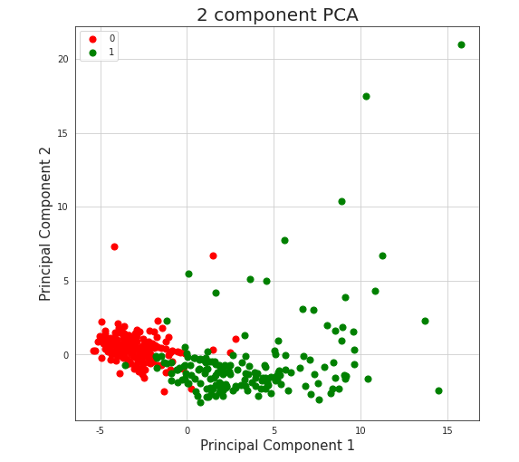
```

```{r 5-3-fig7, out.width="500", fig.align="center", echo=FALSE, fig.cap='Vizulized results of Principal Component Analysis  with line separator used to reduce dimensions of the original dataset and to divide observations into classes. Red colored points represent people who survived after being infected with COVID-19, green colored points represent people who passed away because of the virus.'}
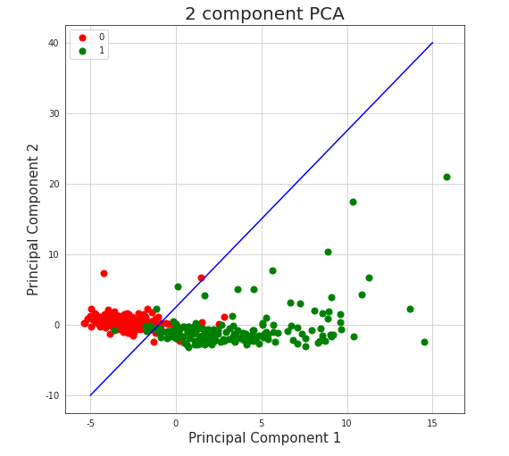
```

Such division achieves (train) accuracy of 0.94, which is almost as good as results received by machine learning algorithms described in the paper, what might encourage to consider given data not authoritative.

**Data distribution analysis**

We analyzed the distribution of percentage of lymphocytes, lactate dehydrogenase and high sensitivity C-reactive protein by creating histograms for the original and the new data.

```{r 5-3-fig8, out.width="750", fig.align="center", echo=FALSE, fig.cap='Distribution of percentage of lymphocytes, lactate dehydrogenase and high sensitivity C-reactive protein for the original dataset'}
knitr::include_graphics('images/5-3-hist1.png')
```

```{r 5-3-fig9, out.width="750", fig.align="center", echo=FALSE, fig.cap='Distribution of percentage of lymphocytes, lactate dehydrogenase and high sensitivity C-reactive protein for the new dataset'}
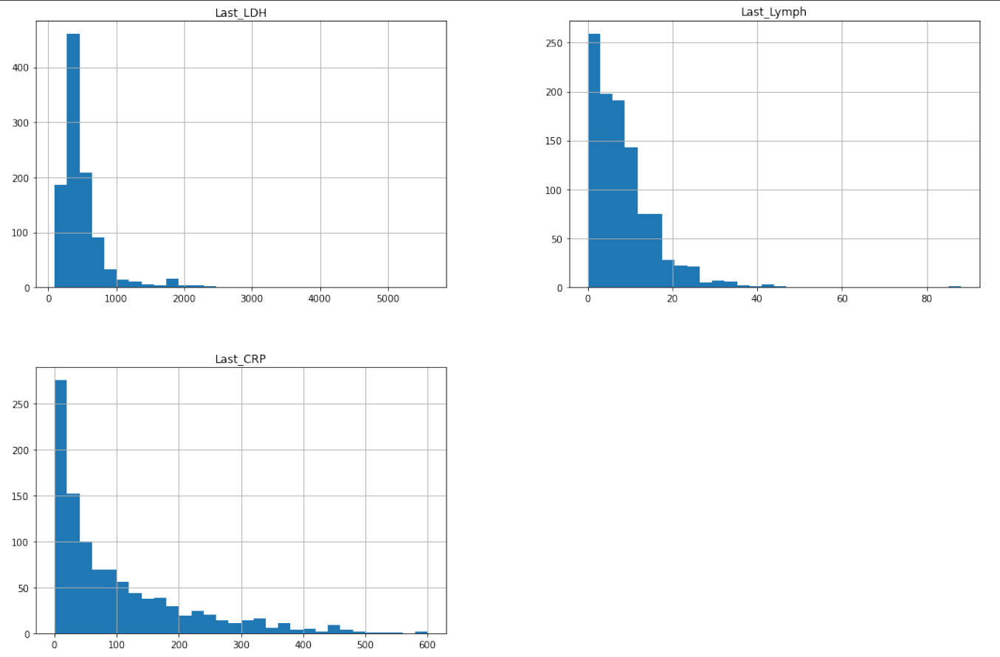
```

We noticed that all variables are strongly left skewed which is unfavorable for the model because more reliable predictions are made if the predictors and the target variable are normally distributed. Trying to make our model better, we applied square root transformation. Then we trained a new model on them (also using Ada Boost Classifier) and we tested it on the new data:

```{r 5-3-fig10, out.width="500", fig.align="center", echo=FALSE, fig.cap='Confusion matrix showing accuracy, precision, recall and other scores for evaluating a classification for the AdaBoostClassfier model tested and trained on original (highly lef skewed) data afer applying square root transformation.'}
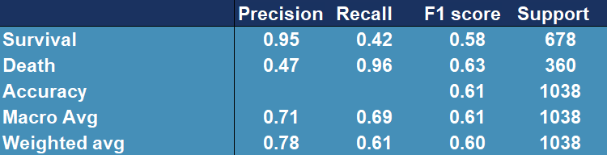
```

From Figure \@ref(fig:5-3-fig10) we can see that the model generally improved (the accuracy is higher) and it performs slightly better.

**General drawbacks**

In addition to the aforementioned bias, our models can still be accused of learning on very small data sets not exceeding even 1000 observations, which still affects the uncertainty related to the effectiveness of the presented proposals.
Moreover, the most promising model, developed on an external data set, unfortunately did not show sufficiently high efficiency to be useful in medical applications.
In addition, the models that have been proposed by us, are, unfortunately, not explainable models, which makes them less desirable by doctors.
The last, and perhaps the least obvious disadvantage is that the data used for prediction alone is unattainable for single entities, as blood tests can only be performed by highly qualified medical personnel. This aspect makes solutions based on these models incomprehensible to the average person, which significantly limits their usefulness.

**Summary**

To sum up, the most desirable effect of our work turns out to be an explainable model with high-quality predictions, based on a large database. In addition, it should be based on easy-to-obtain information about a person's health and be understandable to both ordinary people and physicians. In search of research that would help us explore this branch of machine learning, we manage to find an article [@5-3-mexican_et_al], which provided us with both a comprehensive set of data, understandable to everyone, and a very rich information background.


### Transparent Machine Learning

While working in machine learning one can often encounter an issue called the black-box problem [@5-3-black_box]. It occurs when a model is complex, unexplainable and not transparent. Explainability solves this problem by “unpacking the black-box” which is essential in building trust in the model. That is why we want to create an explainable model which could be useful to every person which doesn't need any additional medical information and easy to understand and requires only data that everyone has access to. We used explainers from [@5-3-DALEX], package for explainable Machine Learning, to create visualizations, that allow user to understand where the results come from and because of that, they are more transparent and clear.

**Model**

To create the model we use random forest from [@5-3-ranger] package constructing a multitude of decision trees which are one of the most transparent and easy to explain models, even for people not familiar with machine learning concepts. Moreover, we tuned and tested XGBoost ([@5-3-xgboost]) and Support Vector Machines from [@5-3-svm] package to maximize AUC measure. Ranger performs best with AUC of 0.92, XGboost turns out to be slightly worse with AUC of 0.87. Support Vector Machines achieve the worst results - AUC around 0.78 (Figure \@ref(fig:5-3-fig11)).

```{r 5-3-fig11, out.width="500", fig.align="center", echo=FALSE, fig.cap='Area Under (AUC) the Receiver Operating Characteristics (ROC) curve for considered models. It serves the purpose of comparing classificators - the bigger the AUC, the better the model.'}
knitr::include_graphics('images/5-3-auc.png')
```

**Data**

The data set used in the application is the same one that was used in the article [@5-3-mexican_et_al] and it is an open source data published by General Directorate of Epidemiology in Mexico.
It consists of 150,000 records from Mexican hospitals, of which over 50,000 are patients with confirmed coronavirus. The most important data for the project are information of chronic diseases, age and date of death.

### Application

In order to achieve our goal we create an easy application, in which one can choose his or hers chronic diseases, sex, age and it calculates the COVID-19 mortality risk for particular infected person. Additionally, in the bookmarks there are presented plots about the model. The first one (Figure \@ref(fig:5-3-fig12)) is a break down plot which shows how the contributions attributed to individual explanatory variables change the mean models prediction. Despite printing out the risk it also enables its user an easy option to understand the outcome. Another one (Figure \@ref(fig:5-3-fig13)) is Ceteris Paribus profile which examines the influence of an explanatory variable (which is `age` in this case) by assuming that the values of all other variables do not change. This visualization is very useful for doctors to properly distinguish a higher risk groups. The last one (Figure \@ref(fig:5-3-fig14)) is a SHAP plot, it calculates the importance of a feature by comparing what a model predicts with and without the feature.

Our application is available at the URL: https://hubertr21.shinyapps.io/Explainable_COVID19_Mortality_Predictor/

```{r 5-3-fig12, out.width="750", fig.align="center", echo=FALSE, fig.cap='Break down profile, showing how particular features affect final death risk for one individual patient.'}
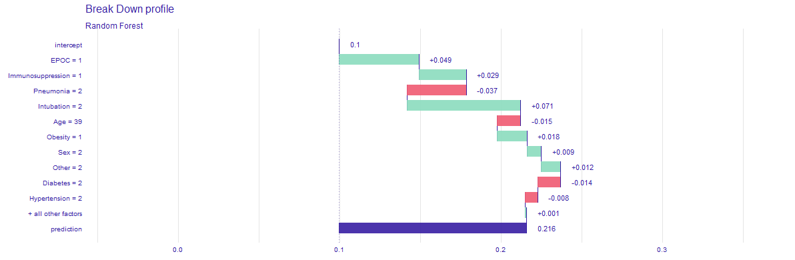
```

```{r 5-3-fig13, out.width="750", fig.align="center", echo=FALSE, fig.cap='Ceteris Paribus, showing how death risk changes with age, while keeping other features (chronic deseases) the same.'}
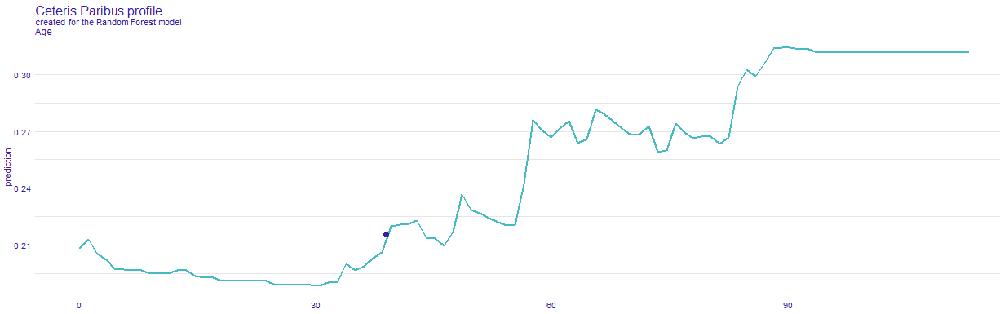
```

```{r 5-3-fig14, out.width="750", fig.align="center", echo=FALSE, fig.cap='SHAP profile, plot that visualises Shapley values for particular features.'}
knitr::include_graphics('images/5-3-mortalSHAP.png')
```

### Conclusions

```{r 5-3-fig15, out.width="750", fig.align="center", echo=FALSE, fig.cap='XAI stakeholders picture from article [@5-3-XAI_et_al].'}
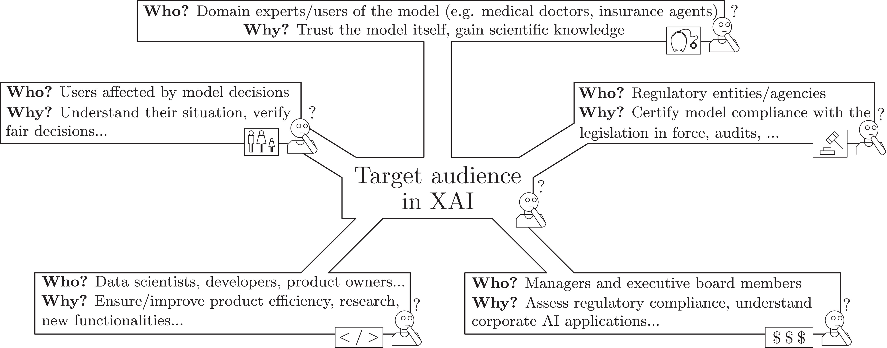
```

Thanks to the developed application, various XAI stakeholders, as presented in [@5-3-XAI_et_al] - Figure \@ref(fig:5-3-fig15), may have easier access to transparent and explainable model that estimates mortality risk in case of being infected by COVID-19. Our application allows the afflicted to see which diseases are contributing the most to their outcome, without the need of doctor's examination, such as any blood properties and other information, that can only be gathered by a specialist. Only by selecting diseases that one suffers from, reliable prediction can be obtained quickly and without leaving home. Domain experts, such as medical doctors might use it for more complex patient examination or to improve their understanding and knowledge of the disease. Model's predictions can be used by politicians to determine what people might need faster medical treatment. Moreover, data scientist may use it for extending their skills or as an inspiration to examine the problem in a different way and improve the existing solutions.