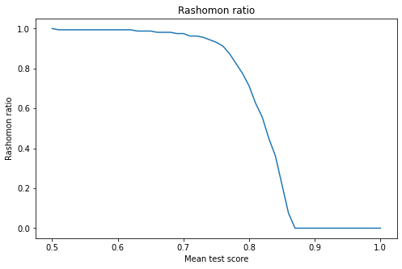
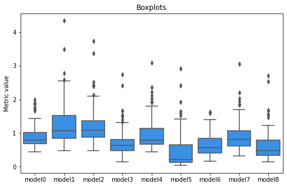
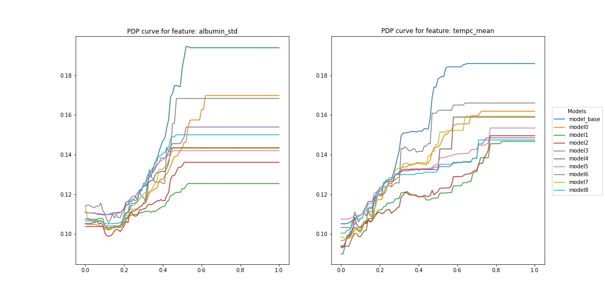

## How to compare many good machine learning models? 

*Authors: Adrian Stańdo, Maciej Pawlikowski, Mariusz Słapek (Warsaw University of Technology)*

### Abstract 

Technological advances were early adopted by healthcare with great benefits and developments. In many health-related realms, machine learning is crucial, such as developing new medical procedures, treating chronic diseases, the management of patient records and data. For each problem, many models can be created, which have similar scores, but different importance of variables. Explainable AI (XAI) gives invaluable tools in healthcare for understanding the models by humans. One of the most common techniques is PDP, which we use to compare models from Rashomon set. It was built on models predicting the mortality of patients on data from the MIMIC-III database. Following, we create a metric and based on that we compare PDP curves.  Additionally, the library in the Python language has been created, which automates this research.   

### Introduction 

Extracting all information from data, used in predictive problems, by hand is almost unobtainable because of the rapid data volume growth. This is why tools like machine learning are needed to find hidden patterns and process data. However, sometimes finding a pattern is not enough to understand how such a model works. For example, to explain to bank client why he/she did not get the mortgage or why doctors suspect a particular patient can have a tumour.   

If the model is too complicated to explain, maybe we would be capable of explaining another one, and in the end, we achieve a set of models - Rashomon set. 

Name Rashomon comes from an intriguing Japanese movie in which four people witness an incident from different vantage points. When they come to testify in court, they all report the same facts, but their stories of what happened are very different.    

Rashomon sets are crucial in medical work, where the model not only has to be accurate but also give a good explanation of why certain variables are more important. An in-depth look at explainable machine learning techniques is provided in @EMA, and a detailed comparative study of different machine learning algorithms for several medical problems is described in @6-0-tang2018predictive. 

For model comparison, we used Partial Dependency Plots, which show how variables affect the final prediction. In our research, we explored those plots and created methods enabling further comparison of PDP. As a result, we developed a metric, which compares PDP curves and applied it to MIMIC-III data [@6-0-mimic]. 

### Literature review  

In machine learning, Rashomon set is used to characterize a problem in which many different models offer accurate results describing the same data. The term was first used by @6-0-breiman2001statistical, who explains in his work the basics of Rashomon set on an example. In contrast, @6-0-rashomon-intro provide a much more in-depth and mathematical description. 

Another important topic related to Rashomon sets is analysing the feature importance of the model. @6-0-rashomon-variable-importance suggested studying the maximum and minimum variable importance across all models included in the Rashomon set. This technique was called MCR (Model Class Reliance). Furthermore, @6-0-rashomon-variable-importance-cloud presented a method to visualize the “cloud” of variable importance for models in the set, which could help us understand the Rashomon set and choose the one which gives the best interpretation. The last question stated in the article @6-0-rudin-challenges was about selecting a model from the Rashomon set. It might be a difficult task, especially when we lack good exploration tools. This is why @6-1-beams-system created a system called BEAMS that allows to choose the most critical features from linear regression models. Next, the program searches the hypothesis space to find a model which fits best to given constraints.  

### Methodology 

We started our research with data preprocessing. For this purpose, we used code provided by @6-0-tang2018predictive, with slight adjustments because the original code did not work perfectly.   

For initial predictions of mortality, a few different models were compared: XGBoost, SVM, Random Forest, and Logistic regression, from which XGBoost was selected for studies of Rashomon set, because of its satisfactory precision and pace at which model learned.  

Afterwards, with the help of a random search technique, a set of models was created. The ranges of hyperparameters were selected according to the article @6-1-tunability. We learned 160 different models with 5-fold cross-validation and used the ROC AUC measure to estimate each model effectiveness. 

The creation of many models does not solve the problem of mortality prediction. The main task is to compare, analyse and choose the one, which describes the best reality. Partial Dependence Plots (PDP) are very often studied to do so. However, it is often hard to compare them all due to the number of models and features. This is why we introduce a new metric. It is an alternative to variable importance and is based on PDP curves.  

We based our calculations on the dalex [@dalex] package, which we used to generate PDP curves for our models. Using the methods provided in this package, we retrieved the numerical values used in creating the plots. 

Our metric calculates, for a given model and feature, the sum of absolute values of distances between points on PDP curves of the base model (the best one according to random search) and the one for which we calculate distance. It is calculated according to the equation: 

$$ d_{F_{k}, n}(M_{base}, M_{i}) = \sum_{j=0}^{n} |PDP_{M_{base}, F_{k}}(x_{j}) - PDP_{M_{i}, F_{k}}(x_{j})| $$

where:

$M_{base}$ - base model,

$M_{i}$ - model for which metric is calculated,

$F_{k}$ - feature,

$n$ - number of intermediate points.

This metric allows comparing how unique models are and how much do they differ from one another.  

### Results 

Before deep score analysis, it is worth introducing the Rashomon ratio. It is defined as the ratio of the number of models with the result above point u to the number of all models. Figure 1 shows the Rashomon Ratio as a function of the threshold point. 

The top ten models were selected for further analysis. It turned out that the range of their results is $(0.861 - 0.865)$. All of them have a very similar score, and it is impossible to decide which one is the best or, maybe, all of them are equally good.  

However, we can derive some interesting conclusions using our metric described in the previous chapter. The model with the highest mean test score (by ROC AUC metric) was chosen as a base model. The distribution of our metric value for each model is presented in Figure 2. 

Model5 seems to closest to the base since its median and lower quartile is near 0. On the other hand, model1 is the furthest as it has high median and high-value outliers. Furthermore, each model seems to be different and there is no clear relationship that the better the result, the closer the model is to the base model according to our metric.  

Figure 3 presents the distribution of metric value for a few features (ten with the highest and ten with the lowest difference between maximum and minimum value). Two features (albumin_std and tempc_mean) are the ones that vary most among the models: they have high median and high IQR. Figure 4 and figure 5 presents PDP curves for these features. 
 

The straight lines on the right side of PDP curves result from a small number of records with high values. Nevertheless, each model interpreted these extreme values a little bit differently, and the PDP curve of the base model is at the top. Furthermore, the PDP curves of model1 and model2 for tempc_mean are significantly lower in the range (0.2, 0.8) than the others. 

### Summary and conclusions 

We created models which give similar performances but take different factors into consideration to predict the final class. A tool to automate this process has been created in Python programming language and is available on GitHub: https://github.com/adrianstando/RashomonSetAnalyser  

Presented results can be used to choose the best model for a given problem. Sometimes it is not the best one that is the most useful, but the one we can explain and validate with expert knowledge. For example, in our leading problem, the knowledge of doctors would be helpful to determine whether the high values of the previously discussed variables are important or not. If so, the base_model would be the best option; if not, model1 (green) should be considered, or experts should look into other features. 

