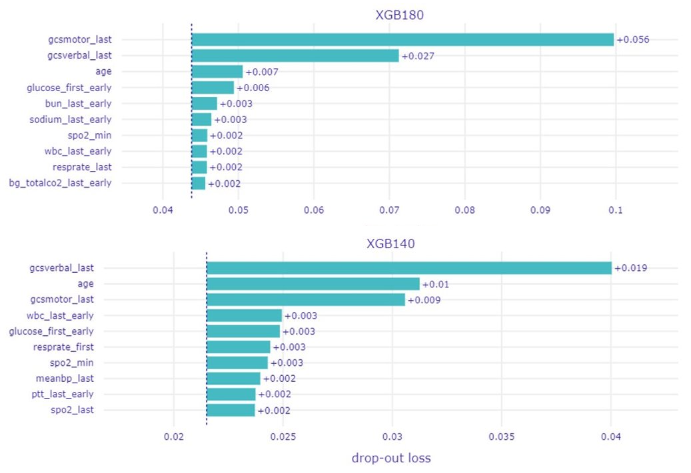
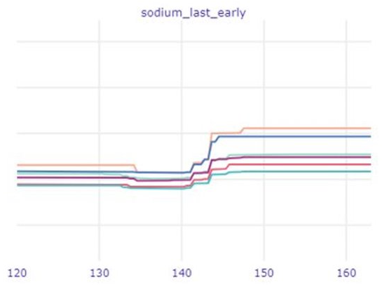

## Analysis of models predicting death probability during ICU stays
Authors: Jan Borowski, Konstanty Kraszewski, Krzysztof Wolny

### Abstract

The Rashomon effect refers to the moment when we have many accurate, but different models, that predict the same problem with the same data. To visualize the Rashomon effect we often use Partial Dependence Profile, which shows the relationship between a selected variable and the model's expected value prediction. In this paper, we analysed PD profiles for the mortality prediction model. First, we created a Random search on the Xgboost model from a paper that predicts death in ICU. Next, we created importance plots and PD curves and analysed the results. It turns out that the conclusions, that we drew from the plots are similar to the specialists' opinion. It indicates, that with using the Rashomon effect we can predict wanted values without specialised knowledge about the topic.

### Introduction 

In 1950 Japanese director, Akira Kurosawa presented the film Rashomon. The movie revolves around four witnesses, that describes the same crime in four different ways. This situation was called Rashomon effect after the name of the movie. In other words, the Rashomon effect is a situation when we have multiple different descriptions of the same event. This term is commonly used in multiple sciences like sociology, psychology or history. When it comes to machine learning, the Rashomon effect refers to a situation where we have many approximately equally accurate models that can differ on the way they achieve their results. Having multiple points of view on the same problem, allows us to get more information about it. 

One of the information that we can learn from analysing the Rashomon set is the importance of the individual features on the predicted value. To visualise it we can use partial dependence profiles. PD profiles show the relationship between dependent feature and expected model response. Plots show in what range of values the result will be higher and when it will be lower. It can allow us to predict what value a variable should have, to get the highest or lowest result. 

In this article, we analyse PD profiles used on models that predict death in the ICU. Many articles were made to create a model that predicts such an event. Researchers tried to build models with the best performance. In this work, we aim to analyse how the patient data behave in such a model. To achieve that we use the Rashomon effect. We use PD profiles to show variables like age, or sodium level. The plots present when the probability of death is higher and lower in the selected variable. It turns out that the opinion of the specialists about the tendencies of the variables are similar to the ones we got in our results.

### Literature review

The Rashomon effect was introduced to predictive modelling in [@6-0-breiman2001statistical]. It explained the concept of the Rashomon effect, gave examples of where it can be used and the benefits that it gives. In [@5-2-variableimportance] was given more instances of Rashomon usage. The paper describes ways to use the Rashomon effect to analyse variable importance. 

The development of mortality prediction models is popular in machine learning. Every created model is different when it comes to its performance and methodology. To organize achievements  [@6-2-CALVERT] compared different models that predict mortality. They compare 38 experiments using 28 published studies and attempt to reproduce their code. The code they made is available on their Github page. 

### Methodology 

In our experiment, we want to use real data and use models in a similar way they may be used in commercial applications. Because of these two factors, we decide to use MIMIC-III database [@6-0-mimic]. This base contains a very large quantity of real medical data and it's frequently used in machine learning oriented and other research. In our article, we use a subset of transformed features from this database directly correlated to patient health.

To create the Rashomon set we need to specify the exact task we want to test. To do this we examine already created articles about usage of this data in machine learning. We encountered many problems with reproducibility such as no longer supported or outdated code or badly optimized functions. Finally, we decide to use previous research about reproducibility of MIMIC studies [@6-0-johnson17reproducibility]. In this article, the researchers examine several articles involving MIMIC and try to replicate their results. In our study, we choose one of the analyzed articles. 
The chosen study [@6-2-CALVERT] concerns predicting death probability during ICU stays. More detailed explanations about feature generation and record selection can be found in the mentioned article. 

To perform our analysis we create extreme gradient boosting (farther referred to as XGB) models from package [@5-3-xgboost]. We decide to use XGB because of its relative sensitivity to hyperparameters. Models are trained using random search with 1000 iterations and 3 folds. Data were split randomly to each fold. Hyperparameter space used in training can be found [@6-3-tunability]. This article contains recommended parameter spaces for this type of research. In the evaluation and selection of models, we use mean accuracy across folds and decide to choose a subset of models over a certain threshold. To examine how selected models work, we use feature importance plots with drop-out loss as a metric from package [@dalex] and partial dependency profiles (farther referred as PDP) also from the same package. 


### Results 

 

Firstly, we take a look at the generated feature importance plots. The most notable thing about them is that they do not differ a lot from one another. The three most important features are the same for almost every model although with different rankings. These features include age and two measures referring to Glasgow Coma Scale. The rankings of the other features vary across all models, but their importance also diminishes rapidly. And that brings another issue – even the most important features have very low drop-out loss. Overall, it seems that most of the models have a lot of similarly important features rather than only a few of significantly increased importance.  

 

```{r feature-importance, fig.align="center", echo=FALSE, fig.cap='Top 10 features ranked by importance for various models.'} 
 
``` 

 

In the second part of our analysis, we focus on the created PDP plots. The curves of various models from the Rashomon set appear quite similar to one another. There are some slight differences, but not as many nor as big as we expected. Instead, we come to another conclusion - from these plots one can learn about the features themselves. The most obvious are the trends for data like age, oxygen saturation level, white blood count or Glasgow Coma Scale values. It is clearly visible how these variables relate approximately linearly to the death prediction. Another and perhaps more interesting conclusion is to be drawn from the sodium level plot. Thanks to the big, sudden shift of all the models’ curves it is possible to find out the values of normal sodium levels at 135-145 units [@6-2-Shea764]. It is surprising to be able to find these levels so accurately relying only on the data, without any kind of professional knowledge. 

 

```{r pdp-trends, fig.align="center", echo=FALSE, fig.cap='Visible trends relating to death prediction in selected features.'}  
knitr::include_graphics('images/6-2-pdp-trends.png')  
``` 

 

```{r pdp-sodium, fig.align="center", echo=FALSE, fig.cap='Clearly visible sodium levels with lowest predictions are actualy normal blood sodium levels.'} 

``` 

### Summary
Our research clearly shows how easy models can pick up real-life dependencies. This is not surprising, what can be considered surprising is a fact that models very close mimicked professional medical rules. When they wouldn't train exactly to do this. This level of accuracy was achieved as a by-product of training models to do something slightly different. This can be used to extract information about features not so details analyzed like medical data. Where we can treat model prediction changes as a source of information about certain features.
