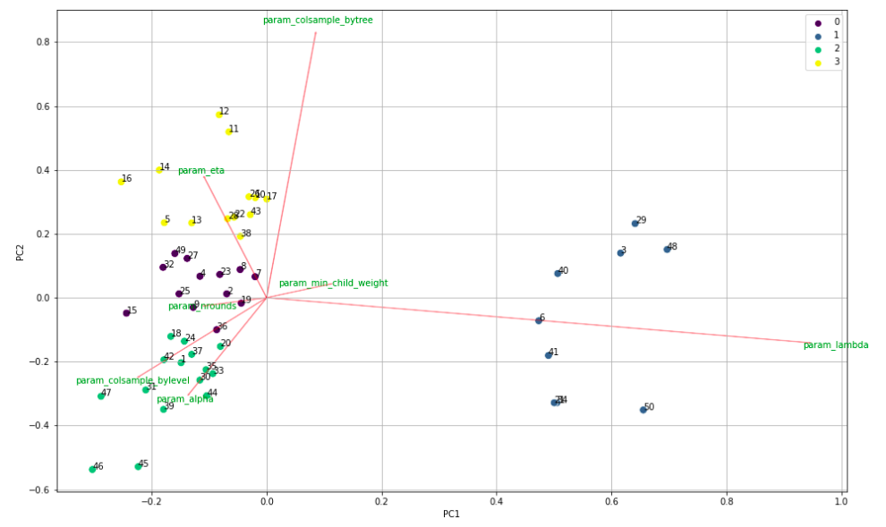
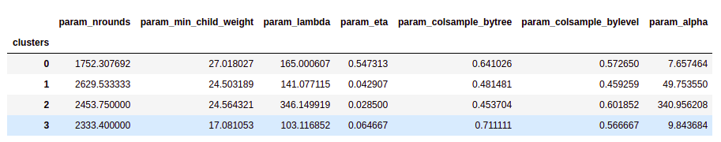
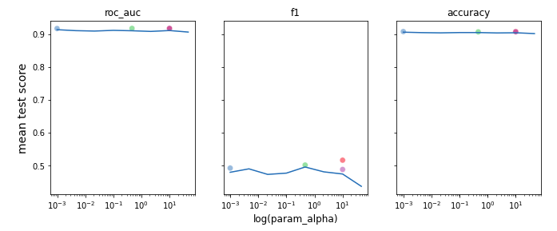
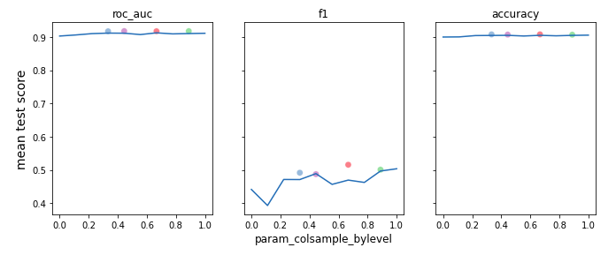
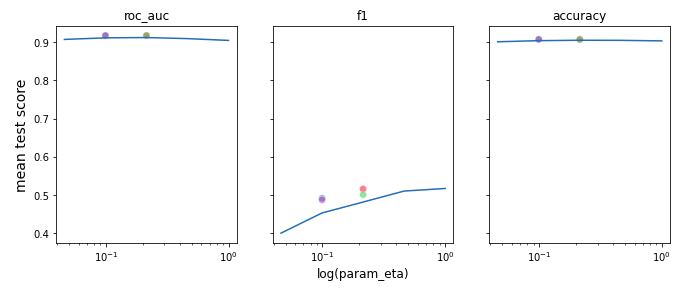
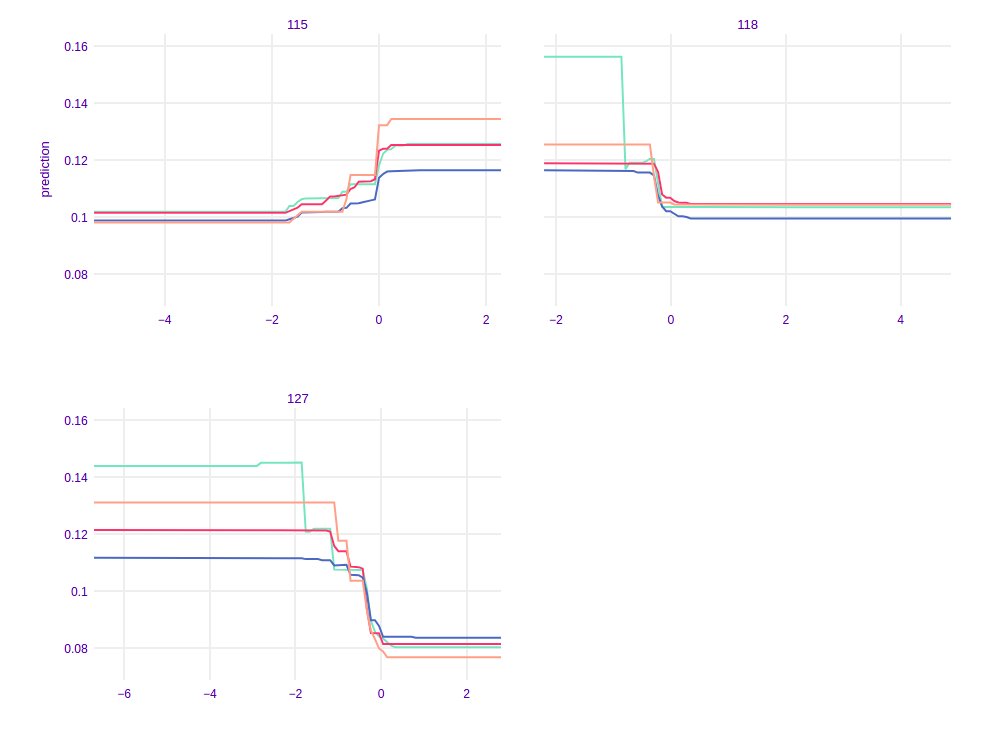
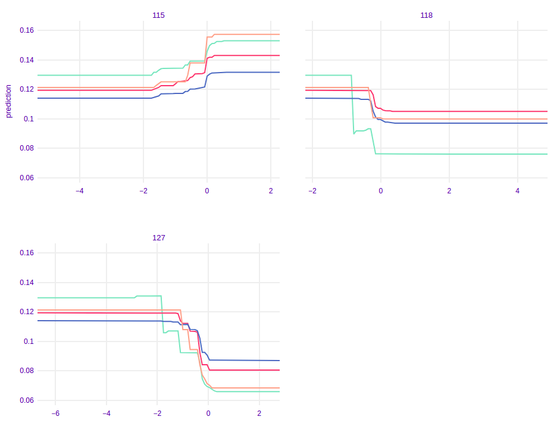

## Rashomon ML with addition of dimensional reduction
*Authors: Degórski Karol, Fic Piotr, Kamiński Adrian (Warsaw University of Technology)*

### Abstract
Rashomon effect occurs when there are many different machine learning models with similar predictions. Therefore choosing only one model out of them may have impact on the final results, so it should be done consciously and carefully. One of the ways in selecting appropriate model can be Explainable Artificial Intelligence methods. In our study, we perform an analysis of different XGBoost models using dimensionality reduction and clustering technique, so that we explain the factors that influence on the final behavior of previously built models. For building rashomon sets we use publicly available MIMIC-III dataset, which contains medical information.

The task that we focus on is an in-hospital mortality prediction, which was previously conducted by other scientists, although we expand their models. Our results suggest that XGB models from Rashomon set may be grouped into clusters in the reduced parameter space. 

### Introduction and related works
Machine learning is used to analyze data and allows us to make predictions. A typical approach to this issue is building models and then, basing on some metrics, choosing the one that will be used in the future. However, very often there are many different descriptions giving about the same minimum error rate, so that we cannot point one model as the best [@6-0-breiman2001statistical]. They have created the term Rashomon effect to describe a situation when there are many different models with quite similar predictions. An example of this effect in reality may be Linear Regression model and finding 5 from 30 best describing variables of a given problem. In this case there are approximately 140,000 such subsets. Usually we choose the model which has best results on a test set, although there may be also different subsets of 5 variables that give very similar results. Moreover, this effect occurs in different models, such as decision trees or neural networks.

Furthermore, [@6-0-rashomon-intro] contributed to expand the study about Rashomon effect. They found out that interpretability of model is connected with Rashomon sets, which are subsets of models that have similar performance to the best model in terms of loss function. Accordingly, when the Rashomon set is large there may exist simpler and higher performing model.

Analysis of the Rashomon effect is still a new and open for development field of the interpretable machine learning. Because of that, there are remaining challenges and problems, which are missing a state-of-the-art approach. Some of them are a proper measure of the Rashomon set, the best techniques of its visualization and optimal choice of the model from the Rashomon set [@6-0-rudin-challenges].

Analyzing Rashomon effect may be done by using various XAI techniques that explain the behavior of a single model. One of them for the mentioned tasks is a framework called Variable Importance [@6-0-rashomon-variable-importance-cloud], which can be used for studying the variable importance among Rashomon set. Secondly, partial-dependence profiles that show the effect of a particular explanatory variable on the dependent variable are also helpful in Rashomon study [@EMA]. These techniques are especially important in medical problems. In modeling these problems not only do we need high results of metrics, but also we have to know what exactly influenced on this prediction.

These techniques are especially important in medical problems. In modeling these problems not only do we need high results of metrics, but also we have to know what exactly influenced on this prediction. Therefore, we focus on an article of [@6-0-tang2018predictive] and their in-hospital mortality prediction and expand their modeling by conducting Rashomon analysis. Using MIMIC-III dataset [@6-0-mimic] allowed us to train lots of XGBoost models with different hyperparameters and build a Rashomon set. The purpose of the following paper is to prove whether machine learning models in Rashomon set have different hyperparameters and how their predictions differ from each other according to different metrics.

Our results may be important in predictions connected with patients’ health, since we performed hyperparameter analysis of Rashomon models, showing which of them have crucial impact on final predictions. Each hyperparameter has diverse influence on trained model, so that the ability to understand it may be important.

### Methodology

Our research consisted of many steps which touched subjects of reproducibility, hyperparameters optimization, construction of Rashomon set and comparing models' characteristics. The whole process can be described in the following chronological order:

1. **Data set**: We obtained access to the publicly available MIMIC-III database, which is a source of real medical treatment documentation, widely used in many researches in the field of medical applications of machine learning. From the whole database we extracted a data frame which could be passed to machine learning models. We chose to reproduce one of the approaches presented in [@6-0-tang2018predictive]. The features set which we used was called by the authors W48. It combined Word2Vec embeddings [@6-3-world2vec] of diagnostic history with summary features of time series data. Further the data set was divided into training and test parts. Necessary scripts for this step were provided by the authors in a public code repository [github](https://github.com/illidanlab/urgent-care-comparative).
2. **Task**: From a few benchmarking tasks considered in the mentioned work we focused on the only one: in-hospital mortality prediction. It is a binary classification problem in which we try to predict whether a patient survives a stay in hospital or dies.
3. **Model training**: We focused on the one algorithm and further analyze its behavior depending on its hyperparameters. We used XGBoost classifier [@6-3-xgb] and optimized its parameters with random search cross validation obtaining 300 models. Search space was constructed according to [@6-3-tunability] and consisted of 7 parameters. Metrics used for performance scoring were AUC, accuracy and F1.
4. **Rashomon set**: From all trained models we selected a group of the ones which achieved at least 0.9 AUC score on the test set. In this way we got a Rashomon set of 72 best models.
5. **Analysis tools**: We represented each model from the Rashomon set with its hyperparameters values as variables and performed PCA dimension reduction. Further we applied clustering algorithm on the reduced data and obtained clusters of models from the Rashomon set. In the next step we chose the best model from each cluster in terms of AUC score as their representants and used XAI techniques - variable importance, PDP and ALE plots - to compare their characteristics.

### Results

After performing steps listed above we obtained the following results.

#### Hyperparameters

After executing PCA and KMeans clustering that were mentioned before, our Rashomon set looked as follows in [Figure 6.1](#fig:1):

When we had the following clusters of models that differ in hyperparameters, we wanted to find out how the obtained clusters differ from each other. So we grouped models basing on their belonging to clusters and we gathered mean values of hyperparameters ([Table 6.1](#tab:1))  and metrics’ scores ([Table 6.2](#tab:2)). 
 

 

Basing on the mean scores ([Table 6.2](#tab:2)) of three metrics that we used (`roc_auc`, `f1`, `accuracy`), we can see that on average the best models are in cluster 3 and then respectively 2, 4, 1.

When we look closely at [Table 6.1](#tab:1) with hyperparameters we can notice which of them are responsible for that difference. The biggest difference appears to be the value of `alpha`. We can see that cluster that achieved best results have value of that hyperparameters equal around 2.7 while the rest of the clusters have this value either too low or too high. 

Then we decided to check the impact of hyperparameters (`alpha`, `colsample_bylevel`, `eta`) on different metrics and we also added the best performing models from each cluster (in terms of `roc_auc` score) to see if there is any specific value of some hyperparameter that boost performance of our models. The results are presented in [Figure 6.2](#fig:2).

As we might have expected the magic value that allow us to achieve the best possible score does not exist. However, we can see some ‘spikes’ where scores are higher and usually around that area values of best models’ hyperparameter are located. 

#### Variable Importance

To look deeper in our models’ behavior, we calculated variable importance for the best model in each cluster. In the [Figure 6.3](#fig:3) the best performing model according to `roc_auc` score is XGB 1. Unfortunately, since there were a lot of variables in our training set, we cannot observe that some variables were key factors in models’ predictions. Moreover, the differences between these 4 models are not very significant. 

**Partial Dependence Plots**

Another important XAI technique is drawing Partial Dependence Plots, which show the effect of the specific feature on the model’s final prediction. In [Figure 6.4](#fig:4) it can be observed that the best performing model has significantly distinct plot in all presented variables than the rest of clusters representants (the red line is below). For instance, in variable 40 the red curve (representing model 1) is distinct and in variable 97 it decreases to the lower values. Furthermore, the best model in cluster 3 is also different. For example, in variable 231, where it starts increasing faster than other models and in variable 115, where it increases more rapidly. What's more there are not significant differences in the curves representing models 2 and 4. Very often these curves are close to each other. The only difference which is easy to observe is in feature 118 and 40, where the curve representing model 4 starts higher than the one representing model 2, although their shape is very similar. This models' behavior may be explained by their similar hyperparameters ([Table 6.1](#tab:1)).

 

**Accumulated Local Effects Plots**

The last XAI technique that we used were Accumulated Local Effects Plots. These plots also show the influence of each feature on model’s predictions, but their advantage to PD Plots is that they are unbiased. In the [Figure 6.5](#fig:5) on the plots representing features 40 and 97 there is the biggest difference between model 1 and the others. Nevertheless, on the plots representing features 115 and 231 the best performing model is also distinct. Another important issue is that the curve of the model representing cluster 2 is distant in variable 118, and that it is between model 1 and models 3, 4 in variable 40. Furthermore, in features 231 and 115 curve representing model 3 is significantly above from others. What we have observed on PD plots is also true on ALE plots. Curves representing models 2 and 4 are similar and we cannot observe remarkable differences. 

  

### Summary and conclusions

Our research gave us interesting results which proved our hypothesis. The XGBoost models which belonged to the Rashomon set proposed by us, were different in term of hyperparameters. Reduction of dimensionality and tools of explainable artificial intelligence helped us to show the variety of their characteristics and behaviors. Further clustering approach allowed us to group the models basing on these differences. Remembering that Rashomon set consisted of the best models in terms of AUC metric, we can conclude that the choice of the best model is a non-trivial decision. We have an opportunity to select slightly worse one but more suitable for us in terms of parameters and model characteristic. Moreover, proposed by us methods of analysis of the Rashomon set were helpful and useful and can be used in the future. 
