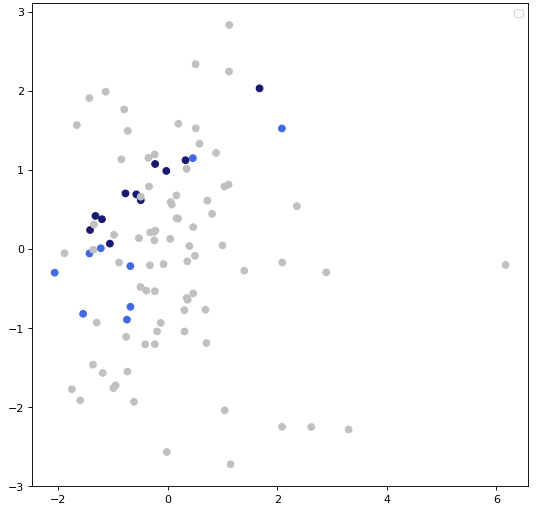

## Rashomon sets on death prediction XGB models using MIMIC-III database
*Authors: Ada Gąssowska, Elżbieta Jowik (Warsaw University of Technology)*

### Abstract  
In many health-related realms, causality, i.e. a thorough understanding of which input parameters are relevant to an outcome and understanding how particular features affect the prediction overall is especially noteworthy. Since the variable importance is only an oversimplified estimation represented through a single value, taking it as the only criterion may be a misconception.  
The task that we reproduced was an in-hospital mortality prediction.
A specific critical care database, which is MIMIC III, had was used to create a group of classifiers to be confronted and the AUC was a baseline measure against which it was built.
The aim of this article is to provide an empirical comparison of ensemble predictive models (i.e. XGBoost), which all perform roughly equally well (i.e. so called Rashomon set), with respect to: (1) predictions validity, (2) the order and grounds of the splits performed (feature importance, partial dependence) , (3) parameter grids similarity degree. For the research purposes we used PCA method, so that we explained the factors that influenced their final behavior. 
On the basis of the conducted research, we conclude that the degree of model similitude strongly depends on the choice of the comparative criterion and the resemblance relation is not transitive, that is, the similarity of models with respect to one criterion does not imply alikeness with regard to another. Furthermore, in general, XGB models from the Rashomon set may be grouped into clusters in the reduced parameter space. 

### Related works and introduction
As the Rashomon Effect is not a common concept, any references to the term in the literature are somewhat limited.  The phenomenon is considered to occur when the same matter can be explained equally aptly in multitudinous ways.  Hence the core of the name concept is the title of the Kurosawa's movie from 1950 in which each character has different perspective on the same crime.   
 
In relation to Machine Learning the Rashomon Effect term was first used in [@6-0-breiman2001statistical] to introduce a class of problems where many differing, accurate models exist to describe the same data i.e. to describe the case where there exist many models that are non-identical but almost-equally-accurate for a given issue. Breiman emphasized that the observation of many different accurate models on specific datasets is a common phenomenon. However, from 2001 on the topic has rarely been discussed.  

A matter closely related to the Rashomon effect that needs to be addressed, is the variables importance analysis. This area of research is described in a [@6-0-rashomon-variable-importance]. The publication emphasizes the existence the fields where Explainable Machine Learning (including Rashomon effect) is particularly important, as the non-explainable models may rely on undesirable variables.  In [@6-0-rashomon-variable-importance-cloud] ], it is pointed out that only by comparing many models of similar performance the importance of a variable compared to other variables can be profoundly understood. The authors presented the concept of variable importance cloud and conducted the research showing that the variable importance may dramatically differ in approximately equally good models.  

While doing research on different machine learning models, data was quite often not taken into consideration at all. As stated in the [@6-0-rashomon-intro] Rashomon Effect is directly linked to the topic of Explainable Machine Learning. Large size of the Rashomon set might imply the existence of multiple explainable model performing on the dataset equally accurately. 

In modeling medical problems, in addition to the high accuracy of prediction, it is also desirable to be able to understand what are important from the forecasting point of view. Therefore, in our considerations, we used Explainable AI (XAI) tools that provide invaluable tools for understanding the grounds of model decisions. One of the mentioned tools was a Variable Importance measure which was used to decide how much a given model from Rashomon set relies on individual variables to make predictions, as it was presented in [@6-0-rashomon-variable-importance-cloud]. Another XAI technique that turned out to be helpful in Rashomon study was partial-dependence profiles showing showing the marginal effect selected features had on the predicted outcome of a machine learning model [@EMA].

The aim of this article is to reproduce the results of a study conducted for the [@6-0-tang2018predictive] needs and to investigate the Rashomon effect on mortality prediction performed  on dataset from MIMIC-III database  [@6-0-mimic], which allowed us to train plenty  XGBoost models with different hyperparameters and build a Rashomon set as a consequence. The purpose of the investigation is to attempt to draw attention to the indispensability of analyzing more than one model and the benefits of using XAI techniques such as feature importance and partial dependance plots. 

### Methodology
#### Experiment settings
The study focused on models generated by XGBoost algorithm which is an implementation of gradient boosted decision trees designed for speed and performance. The algorithm performs well both on regression and classification tasks.  
Since mortality prediction is a classification problem, cognately to the authors of the reproduced article intentions, we used the *XGBClassifier()* function from the XGBoost Python package. To create and examine a set of Rashomon models for a given dataset and task, we created a value grid for nine hyperparameters: *max_depth*, *learning_rate*, *subsample*, *colsample_bytree*,*colsample_bylevel*, *min_child_weight*, *gamma*, *reg_lambda* and *n_estimators*. The distributions of the hyperparameters we tuned were taken from the [@6-3-tunability] paper.  
With the random search use, we obtained 100 models, for which the learning process on a data set and a 5-fold cross-validation were carried out. We analyzed the variability of the number of models in the Rashomon Set (set of best models) depending on the values of theta parameter which is the maximum difference between the best model's AUC score, and the AUC score of the models accepted into Rashomon Set.

#### Analysis workflow
Taking into account the degree of similarity of the results of individual models in terms of the adopted metrics, we decided to select the best 20 for analysis in the remainder of this study. Then, for the three features that occurred in in every model's top five, we analyzed PDP plots, which showed how that particular variable's value change affected the prediction of each model.

 In the next step, we studied the resemblance of the predictions of the models from the Rashomon Set, by using the accuracy score between each pair of models which described how many of the class predictions were the same for the two of them. We also computed the actual accuracy score between each model's prediction and the real response variable. As our data was imbalanced, we checked the F1 score of each model, and as the results quite differed we used PCA (Principal Component Analysis) to see if the models with high F1 score differ in terms of hyperparameters from the models for which the score was low. 
 
### Results

It should be mentioned that almost all of the 100 checked models achieved quite similar AUC scores, and for the theta 0.03, almost half of the models were included in the Rashomon Set. Rashomon sets size variability due to theta parameter value change are shown in the table below: 

| Theta         | Number of models in Rashomon set |
|:-------------:|:--------------------------------:| 
|   0.005       |              3                   | 
|   0.01        |             12                   |
|   0.015       |             24                   | 
|   0.02        |             30                   | 
|   0.025       |             36                   | 
|   0.03        |             44                   | 

For the rest of experiments we decided to choose 20 best models, where difference of AUC scores between the first and the twentieth was equal to 0.012 and the best score achieved was 0.906.  

#### Predictions resemblance  and grounds of the splits performed similarity context . 
For each model we analysed the features importances and chose 5 most critical variables, which were assigned a score from 5 (most important variable) to 1 (the fifth most important variable). All remaining features were given a score of 0.  The scores achieved by features which were included in at least one model's top five most important variables are presented on [Figure 1](#fig:1):

The feature importances of the models, as seen on the plot, were quite similar. Not only only eleven variables achieved any non-zero score, but also three of them were included in every model's top five most important features.  
Quite interestingly those three features all happen to be  related to Glasgow Scale which is a clinical scale used to reliably measure a person's level of consciousness. The variable *gcseyes_last* describes the dynamic of the patient's eyes opening, *gcsmotor_last* - the dynamic of the patient's motoric movement and *gcsverbal_last* - the person's verbal dynamic. For all these characteristics, the higher the value, the better the patient's condition.  
Figures [Figure 2](#fig:2) to [Figure 4](#fig:4) present the PDP charts for these three variables for each of the twenty models alongside their histograms. On each chart, almost all of the lines presented seem to be pararel, which means that the models treat the variables in a similar way. 

Since from the Feature Importance and PDP plots one could easy come to conclusion that all of the models were very similar, we decided to focus on the class predictions the models made. For each pair of models we used the accuracy score on their predictions, to calculate the similarity. We also calculated real accuracy score of each model using the real response variable. For a couple of pairs the score achieved between them was equal to 1, which means that the predictions made were identical.  All obtained results are presented on [Figure 5](#fig:5) below. 

{width=60%}

As most of the model-resemblance measures we used in the study were based on the comparison of the models’ independent variables and predictions validities, in the final stage of the research we decided to confront the conclusions drawn so far using a different approach, which was models’ parameter grids similarity extent examination. We aimed to conclude on how much is the Rashomon set’s content and volume impacted by the measure according to which it was created.

#### The study on models parameter grids similarity.
The study on models parameter grids resemblance degree was conducted in groups built with respect to the F1 measure. The results came out quite interesting as eleven out of all twenty models  obtained scores of over 0.95 and the other 9 had scores lower than 0.8, some of which achieved score as low as 0.5. This created the question if these two groups of models differed in the context of hyperparameters values. To analyse that, we used Pricipal Component Analysis to plot the models on the 2D plot. The results may be seen on [Figure 6](#fig:6) 

{width=60%}

The models represented by grey points are the 80 models that did not belong to the Rashomon Set, while these represented by blue points did - for models marked with a dark the F1 score value was over 0.9, for the ones exemplified with light blue points, F1 score was under this value. Although it is hard to define clear clusters, it seems that there is a split. Also models with higher F1 score values seem to be arranged in a shape similar to a line, thus it may mean that their hyperparameters have some things in common. 

### Conclusions  
The purpose of this exploration was to provide and formalize a comprehensive, empirical comparisons of a Rashomon set of ensemble predictive models  that  may  differ  in  terms  of  predictions validity, the variables impact and parameter values similarity.The conducted study revealed both certain similarities and clear discrepancies between the individual criteria explored.   

Since the importance of a feature is the increase in the prediction error of the model after permuting/shuffling the given feature values and PDP plots show the marginal effect of one predictor on the response variable, by definition, these criteria are closely related. Therefore the similarity of the impacts of the significant variables on the prediction, indicated by the parallelism of the PDP curves obtained for fitted models, was in line with expectations and obviously, indicated that the models were closely related in terms of the order and grounds of the splits performed.  
However, the convergence of conclusions regarding the similarity of models, which could be drawn based on the above criteria, did not generalize for all the analyzed ones. 
In the study of the degree of similarity of hyperparameter meshes based on the next two of the selected criteria, i.e. the F1 measure and principal component analysis (PCA), led to conclusions, which were not fully consistent with the theses made on the basis of the variable analysis – hyperparameters of a narrow subset of models previously indicated as similar had some things in common, but most of them showed significant differences in this respect
On the basis of the conducted research, we conclude that the degree of model similitude strongly depends on the choice of the comparative criterion and the resemblance relation is not transitive, that is, the similarity of models with respect to one criterion does not imply alikeness with regard to another. Therefore,  the studied criteria should be viewed as complementary possibility to confirm certain theses that result from the interpretation of others and useful for different purposes, rather than as competitors for the same purpose. 
