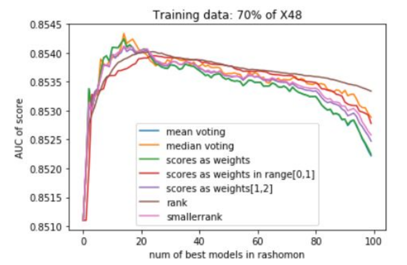
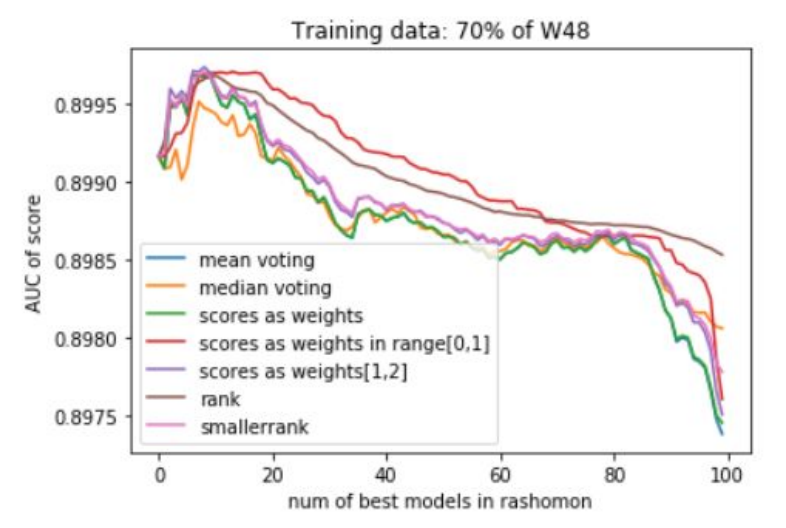
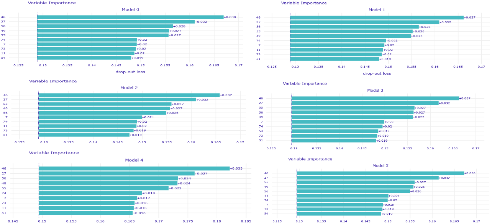
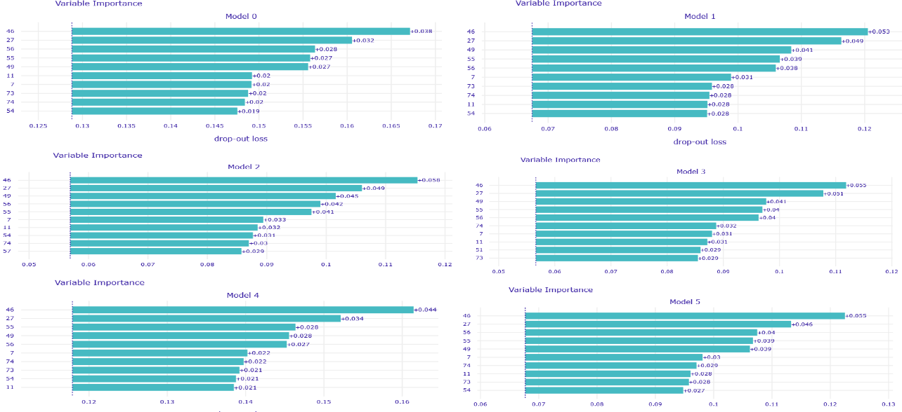
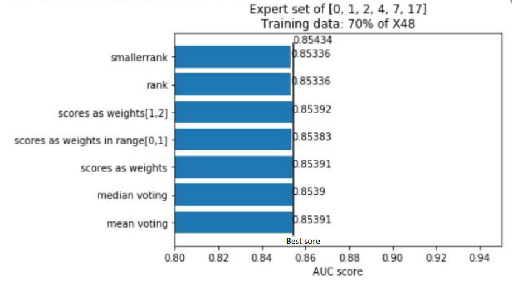

## Rashomon sets of in-hospital mortality prediction random forest models
*Authors: Jeugeniusz Winiczenko, Mikolaj Malec, Patryk Wrona (Warsaw University of Techcnology)*

### Abstract
The concept of the Rashomon set is gaining more and more popularity in the machine learning world. However, the most efficient ways of building and analyzing such sets are yet to be discovered. The main aim of this study was to develop several approaches to creating Rashomon sets, examining their characteristics, and using them for further predictions. In this article, the results of Rashomon sets obtained from the group of random forest classifiers trained for in-hospital mortality prediction task on physiological time-series and medical histories from the Medical Information Mart for Intensive Care (MIMIC-III) are presented.

### Introduction

The main goals of this study were to check if
* Rashomon sets can be better at predictions than single best models,
* the way of obtaining predictions from Rashomon set has any impact on their performance,* Rashomon sets that consist of different models performs better than those with high performance but similar models.

In this study, Rashomon set concept with top performance or the top most different random forest classifiers was used. These classifiers were trained for the in-hospital mortality prediction tasks on two datasets: the first one containing only physiological time-series and the second one containing both physiological time-series and medical histories. Both datasets were created from preprocessed data from the MIMIC-III database.

To apply the created Rashomon sets for predicting, several techniques such as mean, median, weighted mean, etc. of votes of classifiers in each set were used. For sets' prediction assessment area under the receiver operating characteristic curve(AUC) was used.
One of the main goals of this study was also to check if Rashomon sets that are formed from different models perform better than those where models were similar. Different models were defined as those which have quite different sets of important variables. Different models which pay attention to different features were thought to be better at predicting just as the team of experts where each knows a different field would be. To verify this aspect, analysis of feature importance plots for each model from each Rashomon set were conducted, and models with different important features were united into sets.

Furthermore, for better accommodation with the article, its structure is provided:

1. Abstract

2. Introduction

3. Related Work

4. MIMIC-III dataset - contains a description of both training datasets and their origin

5. Rashomon sets - contains a description of performance results of best models, voting Rashomon sets and methods of voting

6. Results - contains a summary of the most interesting results of this study

7. Conclusion.

### Related work

Until recently, the Rashomon sets have been rarely a subject of scientific research. In 2019 [@6-0-rashomon-intro] approached the issue of creating mathematical and statistical definitions and notations regarding such sets of models. They described Rashomon sets as subspaces of the hypothesis space, that is subsets of models having comparable performance as the best model concerning a loss function. Rashomon sets are sets of models performing extraordinarily well on a given task, and in machine learning, this term was used for the very first time in [@6-0-breiman2001statistical]. Just as the task could be any, like predicting patient mortality in [@6-0-tang2018predictive], the use of given features to explain vary among many highly accurate models. Moreover, studying the linear regression model, Leo Breiman described this situation as the Rashomon Effect.


Another emphasis on analyzing Rashomon sets and the importance of their features were made in [@6-0-rashomon-variable-importance]. The authors suggested the Model Class Reliance - new variable importance (VI) tool to study the range of VI values across all highly accurate models - models included in Rashomon sets. Later, [@6-0-rudin-challenges] provided basic rules for interpretable machine learning and identified 10 technical challenge areas in interpretable machine learning. They emphasized the troubleshooting and easiness of using glass-box models today as well as their advantage over black-box models due to their inscrutable nature. In this article, Challenge number 9 involves understanding, exploring, and measuring the Rashomon set. The authors address questions about how to characterize and visualize Rashomon sets, and finally, how to pick the best model out of the Rashomon set.

In our work, we use variable importance plots from DALEX R Package to interpret the impact of each variable on the medical model output. We also use several voting systems to determine if the mutual voting of some subspace of models could outperform the best models. Furthermore, we address the problem of searching the most crucial predictive variables among those Rashomon sets and investigate the impact of choosing subsets of input features on the whole process of determining Rashomon sets and their characteristics.

### MIMIC-III Dataset

MIMIC III Clinical Database is a large database comprising de-identified health-related data associated with tens of patients who stayed in critical care units of the Beth Israel Deaconess Medical Center between 2001 and 2012. This database consists of 26 tables issued from different measurements during patients' stays in the hospital. The preprocessing of these tables was conducted just like in [@6-0-tang2018predictive].

#### X48 Variable Set

This set consisted of 27616 observations having 76 predictive variables in total. It was created from the icu_stay.csv file and is in fact a preprocessed raw MIMIC table according to the reproduced article. It contains averaged statistics of 48-hour patients' measurements (heart rate etc.). For each measurement maximal value, averaged value, minimum value, and standard deviation are denoted as separate variables.

#### W48 Variable Set

This set consisted of 27616 observations having 276 predictive variables in total and was created from icu_stay.csv and d_icd_diagnoses.csv files and was in fact a preprocessed raw MIMIC tables according to the reproduced article. Just like X48, it contains averaged statistics of 48-hour patients' measurements (heart rate, etc.) but is also combined with diagnosis histories. It is the combination of the X48 variable set and w2v embedding of medical events of all ICD-9 group codes.

### Rashomon Sets

Rashomon sets are sets of machine learning models performing especially well in the task of predicting in-hospital mortality. They can be chosen using a given criterion or metric. In this work, Rashomon sets were created using the Area Under ROC Curve metric, but also by finding the most different treating of predicting variables. The first Rashomon set was named 'best AUC models' and the second Rashomon set was called 'experts' because of their expertise on different predictors.

To find such best models, 100 models were trained for each dataset using 3-fold cross-validation. Each time the validation set consisted of 20% of full data and the testing set was made of 10% of full data. We tried to verify how AUC changes depending on the amount of training data and the number of models included in a Rashomon set to find the most optimal number of models in such a set. The training was performed on 1%, 5%, 10%, 30%, and 70% of observations in the dataset. Furthermore, from the mentioned 100 models, 6 models with the highest AUC value were the best AUC models and 6 models with the most different variable importance were chosen for the 'experts' set. With these pairs of 6 models for 2 datasets(4 model sets in total) variable importance plots were checked to compare how it changes across different variable sets(X48 and W48) and different approaches of choosing the Rashomon set(best AUC or most different variable importance). We give the hyperparameters of these models in the next paragraphs.

#### Sets of best AUC models

6 models in rashomon sets built according to the AUC value. Hiperparameters of these models were found among best 20 models from 3-fold cross-validation and are given:
For X48 Variable Set:

```{r echo=FALSE, results='asis'}
library(knitr)
df <- data.frame(param_n_estimators = c(1400,2000,1200,600,1200,800),
                 param_min_samples_split = c(2,5,2,2,10,5),
                 param_min_samples_leaf = c(4,4,4,4,4,4),
                 param_max_features = c("sqrt","sqrt","sqrt","sqrt","sqrt","sqrt"),
                 param_max_depth = c(80,NaN,70,30,20,30),
                 param_bootstrap = c(F,F,F,F,F,F))
kable(df, caption = "Hiperparameters for best AUC models of X48 dataset")

```


For W48 Variable Set:

```{r echo=FALSE, results='asis'}
library(knitr)
df <- data.frame(param_n_estimators = c(1800,1600,1600,600,1200,800),
                 param_min_samples_split = c(2,2,10,10,10,2),
                 param_min_samples_leaf = c(2,4,4,4,2,1),
                 param_max_features = c("sqrt","sqrt","sqrt","sqrt","sqrt","sqrt"),
                 param_max_depth = c(60,110,40,90,70,20),
                 param_bootstrap = c(F,F,F,F,F,F))
kable(df, caption = "Hiperparameters for best AUC models of W48 dataset")

```

#### Sets of experts

6 rashomon sets built according to the most different important variables so that each of them treasure other sets of predictors. Hiperparameters of these models were found among best 20 models from 3-fold cross-validation and are given:

For X48 Variable Set:

```{r echo=FALSE, results='asis'}
library(knitr)
df <- data.frame(param_n_estimators = c(1400,1400,600,800,800,1000),
                 param_min_samples_split = c(2,5,2,2,10,5),
                 param_min_samples_leaf = c(4,2,2,2,2,2),
                 param_max_features = c("sqrt","sqrt","sqrt","sqrt","sqrt","sqrt"),
                 param_max_depth = c(80,NaN,110,50,30,100),
                 param_bootstrap = c(F,F,F,F,F,F))
kable(df, caption = "Hiperparameters for expert models of X48 dataset")

```

For W48 Variable Set:

```{r echo=FALSE, results='asis'}
library(knitr)
df <- data.frame(param_n_estimators = c(1800,1600,400,200,2000,200),
                 param_min_samples_split = c(2,2,10,10,5,5),
                 param_min_samples_leaf = c(2,4,1,2,2,2),
                 param_max_features = c("sqrt","sqrt","sqrt","sqrt","sqrt","sqrt"),
                 param_max_depth = c(60,110,60,50,10,10),
                 param_bootstrap = c(F,F,F,T,T,T))
kable(df, caption = "Hiperparameters for expert models of W48 dataset")

```

#### Methods of voting

As an experiment, we used 7 methods of voting in each Rashomon set. We wanted to find out if there is any significant difference between them.
Methods of voting were as follows:

1. mean predictions of models

2. median predictions of models

3. mean predictions of models with weights equal to the score of the model

4. mean predictions of models with weights equal to the score of the model transformed into the interval [0,1]

5. mean predictions of models with weights equal to the score of the model transformed into the interval [1,2]

6. mean predictions of models with weights equal to the rank of the model transformed into the interval [0,1], with 1 being the weight of the best model

7. mean predictions of models with weights equal to the rank of the model transformed into the interval [1,2], with 2 being the weight of the best model

Our results showed that all voting mechanisms behaved more or less likewise, with simple mean and median being in our best method to create a prediction for the group. It is also worth noticing that transforming score or rank to the interval [0,1] doesn't take into account the worst models, so they are not the best way for efficient voting.

### Results

#### Number of models in Rashomon set - influence on AUC

Below are presented the results of the top performance model sets for different cardinalities of those sets.





As one may notice there are no significant differences in AUC values between different cardinalities of the Rashomon sets and datasets on which models were trained. The best number of models that one can deduce from this figure is in the range from 5 to 10 models in a Rashomon set. As we mentioned earlier all voting strategies performed more or less the same.

#### Variable Importance PlotsIn this section, the analysis of feature importance plots is performed.

##### Best AUC Rashomon Sets

Below feature importance plots for 6 models with the highest AUC are presented.

For X48 dataset:



There is no noticeable difference between important features for the X48 dataset.

For W48 dataset:


Of course, there is a noticeable difference between the most important variables across models trained on different datasets, even among variables comprised solely in the X48 dataset( having numbers up to 76). Interestingly, variable 46(mean_inr) has lost its' dominance in the W48 dataset.

##### Experts Rashomon Sets

Below are presented feature importance plots for models with possibly most different important features.




The top 2 or 3 important features usually remain the same across models trained on the same dataset. All expert models emphasize the influence of X48 variables. Moreover, in 3 cases (out of 6 models) variables being less important than the 46(mean_inr) variable now gained importance. These variables are 27(model 2) and 56(model 4 & model 5).

#### Voting in mortality prediction

Below results of Rashomon experts sets for different voting strategies are presented.




Sets that were created from models trained on the W48 dataset demonstrate significantly better AUC values than those trained on the X48 dataset. Unfortunately, expert sets did not show any better results than sets of top AUC models (denoted as a vertical line in these plots).

### Conclusion

In this article 2 different ways of creating Rashomon sets were discussed:

* choose first n of top performance models
* choose first n of most different models.

In addition to that, several voting strategies of creating Rashomon sets for further predictions were tried out. During this whole work, the set of most important features of MIMIC-III for the mortality prediction task was discovered, which also may be useful for further researches or could give rise to new medical conclusions.

Summing the results of all experiments up, one can conclude that Rashomon expert sets are worth the attention of researchers even though in this study they have slightly underperformed top performance model sets. Because of this result, we suggest there also be no bigger difference in the performance of voting strategies that were presented, and this may be the point to inventing and testing new strategies by further researchers. Furthermore, adding new variables to a model, just like adding new variables to the X48 variable set, may cause the old variables to lower their importance on the output of models among the Rashomon sets.